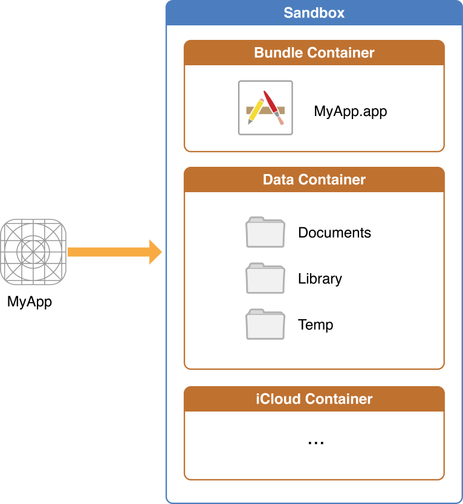

# 8-iOS

- [8-iOS](#8-ios)
  - [基础](#基础)
    - [沙盒](#沙盒)
    - [load 和 initialize](#load-和-initialize)
    - [UIView 和 CALayer 的区别](#uiview-和-calayer-的区别)
    - [寻找两个 UIView 的最近的公共 View](#寻找两个-uiview-的最近的公共-view)
  - [事件的传递和响应](#事件的传递和响应)
    - [iOS 系统响应触摸事件的机制](#ios-系统响应触摸事件的机制)
    - [在 UITabBar 中添加凸出的按钮](#在-uitabbar-中添加凸出的按钮)
    - [扩大 UIButton 的点击范围](#扩大-uibutton-的点击范围)
    - [扩大 UIButton 的点击范围（使用分类）](#扩大-uibutton-的点击范围使用分类)
    - [扩大 UIButton 的点击范围（使用自定义的 Button ）](#扩大-uibutton-的点击范围使用自定义的-button-)
  - [Runtime](#runtime)
    - [「从历年 weak 看 iOS 面试】」](#从历年-weak-看-ios-面试)
    - [消息转发流程](#消息转发流程)
    - [dealloc 的流程](#dealloc-的流程)
    - [添加 weak 变量](#添加-weak-变量)
    - [weak 指针置为 nil 的过程](#weak-指针置为-nil-的过程)
    - [Objective-C 方法调用的本质](#objective-c-方法调用的本质)
  - [RunLoop](#runloop)
    - [source0 和 source1 有什么区别](#source0-和-source1-有什么区别)
  - [App 启动优化](#app-启动优化)
    - [删除未使用的类和方法](#删除未使用的类和方法)
    - [统计启动时间](#统计启动时间)
  - [开源库](#开源库)
    - [fishhook 的原理 & 位置无关代码](#fishhook-的原理--位置无关代码)

## 基础

### 沙盒

> 参考：[iOS 沙盒及各个目录详解](https://blog.51cto.com/u_4955660/2842858)  
> 原文：[Demystifying iOS/iPadOS SandBox with Swift Code (Medium)](https://medium.com/techiepedia/demystifying-ios-ipados-sandbox-with-swift-code-8c9222d19380)



- `AppName.app` ：是 App 的 bundle 。包含了 App 以及其所有的资源。这个目录你不能去进行写操作。为了防止篡改，在 App 安装的时候就进行了签名处理。一旦你进行了写操作，签名就会修改，App 就无法启动。这个目录的内容**不会**被 iTunes 或者 iCloud 备份。
- `Documents/` ： 使用该目录主要是保存用户相关的数据。 这个目录下的文件可以通过*文件共享 (file sharing)* 提供给用户。因此这个目录下最好只存储 App 希望公开给用户的数据信息。这个目录的内容会被 iTunes 或者 iCloud 备份。
- `Library/` 主要存与用户数据无关的数据（一般是不想共享给用户的数据）。下面有 `Caches/` 和 `Preferences/` 等子目录。App 也可以在这个目录下创建自己的目录。一般图片缓存，数据缓存都会可以放在这个 `Caches/` 子目录下。系统提供的数据存储 NSUserDefault 生成的 plist 文件，是放在 `Preferences/` 目录下的。需要注意的是 iTunes 和 iCloud 会备份除了 `Caches/` 文件夹外的其他内容。
- `tmp/` 存放一些临时文件。这个文件目录下的数据在 App 不运行的时候都可能会被清除。因此对于可能还需要用到的数据，需要及早备份，如果不需要可以直接清除掉。这个目录的内容不会被 iTunes 或者 iCloud 进行备份。
- 运行的时候 App 可以额外的申请容器目录，比如 iCloud Container 。

因为有些文件夹会默认被备份。隐藏对于那些*大文件或者不需要备份的文件*，可以通过 `[URL setResourceValue:forKey:error:]` 方法进行设置不需要备份。
比如 SDWebImage 里面就用到了：

```objective-c
[fileURL setResourceValue:@YES forKey:NSURLIsExcludedFromBackupKey error:nil];
```

### load 和 initialize

> 参考：[掘金《 iOS 分类、+load、+initialize 方法》](https://juejin.cn/post/6894170694587056141#heading-10) ，有改动。

使用 `load` 和 `initialize` 方法时，不要显式调用 `super` 。

**`load` 方法的调用顺序**：

`load` 是类或分类是在类加载（ runtime 初始化）时被调用的，在 `main()` 函数前，每个类的 `load` 方法只会自动调用一次。

`load` 方法调用的特点：

1. 若子类未实现 `load` 方法，则在加载该子类时，**不会**调用其父类 `load` 方法。
2. 当父类和子类都实现 `load` 方法时，二者的 `load` 方法**都会**被调用，父类的 `load` 方法执行顺序要优先于子类。
3. 类的 `load` 方法执行顺序要优先于分类，分类的 `load` 方法**不会**覆盖本类的 `load` 方法。
4. 多个分类都实现了 `load` 方法， `load` 方法**都会**执行，执行顺序与编译顺序一致。
5. 当有多个不同的类的时候（不是子类或分类的关系），则每个类的 `load` 方法的执行顺序与编译顺序一致。

**`initialize` 方法的调用顺序**：

`initialize` 是在类或其子类收到第一条消息时调用的，并且只调用一次。这里的消息包括实例方法或类方法的调用。也就是说 `initialize` 方法是以**懒加载**的方式被调用的，如果程序一直没有给某个类或它的子类发送消息，那么这个类的 `initialize` 方法是永远不会被调用的。

- 父类的 `initialize` 方法会比子类先执行。
- 子类的 `initialize` 方法调用分两种情况：
  - 子类**未实现** `initialize` 方法，则在子类收到第一条消息时，调用父类 `initialize` 方法，因此父类的 `initialize` 方法可能会被调用多次；
  - 子类**实现了** `initialize` 方法，如果父类也实现了 `initialize` 方法，则会先调用父类的 ，然后再调用子类的。
- 如果分类实现了 `initialize` 方法，则不会调用本类的 `initialize` 方法。
- 当有多个*分类*都实现了 `initialize` 方法，会执行最后被被编译的*分类*的 `initialize` 方法。

### UIView 和 CALayer 的区别

`UIView` 和 `CALayer` 的关系：

- `view` 持有 `layer` 用于显示，`view` 中大部分显示属性实际是从 `layer` 映射而来；
- `layer` 的 `delegate` 在这里是 `view` ，当其属性改变、动画产生时，`view` 能够得到通知。

`UIView` 和 `CALayer` 不是线程安全的，并且只能在主线程创建、访问和销毁。

补充：

- `UIView` 属于 `UIKit` 框架，用于 iOS 系统，它可以响应交互事件；而 `CALayer` 属于 `Core Animation` 框架，是 iOS 和 macOS 通用的，它只负责页面的绘制，无法响应交互事件。
- 这样的设计遵守了单一职责的原则，使得 `CALayer` 在不同平台上可以被复用。
  - 在不同类型的设备上，交互逻辑是不一样的：
    - 在 iOS 系统上是**触摸操作**，负责交互的是 `UIKit` 中的 `UIView` ；
    - 在 macOS 系统上是**键鼠操作**，负责交互的是 `AppKit` 中的 `NSView` 。
  - 但它们的图形绘制的方式是一样的，`UIView` 和 `NSView` 的底层都是使用 `CALayer` 进行绘制的。
- 每个 `UIView` 都有一个相应的 `layer` 属性，在 `layer` 中有一个 `delegate` 属性，而 `UIView` 通常就是 `CALayer` 的 `delegate` 。

### 寻找两个 UIView 的最近的公共 View

来源：[唐巧的公众号](https://mp.weixin.qq.com/s?__biz=MjM5NTIyNTUyMQ==&mid=562061601&idx=1&sn=a409387dbbbd77282237b7d91dc18884&scene=19#wechat_redirect)，有改动。

一个 `UIViewController` 中的所有 `view` 之间的关系其实可以看成一颗树，`UIViewController` 的 `view` 变量是这颗树的根节点，其它的 `view` 都是根节点的直接或间接子节点。

所以我们可以通过 `view` 的 `superview` 属性一直找到根节点。（需要注意的是，在代码中，我们还需要考虑各种非法输入，如果输入了 `nil` ，则也需要处理，避免异常。）

以下是找到指定 `view` 到根 `view` 的路径代码：

```objectivec
+ (NSArray *)superViews:(UIView *)view {
    if (view == nil) {
        return @[];
    }
    NSMutableArray *result = [NSMutableArray array];
    while (view != nil) {
        [result addObject:view];
        view = view.superview;
    }
    return [result copy];
}
```

然后对于两个 view A 和 view B，我们可以得到两个路径。将一个路径中的所有点先放进 `NSSet` 中，然后遍历另一个数组，检查当前的 `view` 是否在 `NSSet` 中：

```objectivec
+ (UIView *)commonView_2:(UIView *)viewA andView:(UIView *)viewB {
    NSArray *arr1 = [self superViews:viewA];
    NSArray *arr2 = [self superViews:viewB];
    NSSet *set = [NSSet setWithArray:arr2];
    for (NSUInteger i = 0; i < arr1.count; ++i) {
        UIView *targetView = arr1[i];
        if ([set containsObject:targetView]) {
            return targetView;
        }
    }
    return nil;
}
```

## 事件的传递和响应

### iOS 系统响应触摸事件的机制

1）手指触碰屏幕，屏幕感应到触碰后，将事件交由 `IOKit` 处理。

2）`IOKit` 将触摸事件封装成一个 `IOHIDEvent` 对象，并通过 `mach port` 传递给 `SpringBoad` 进程。

- `mach port` ：进程端口，各进程之间通过它进行通信。
- `SpringBoad` ：是一个系统进程，可以理解为桌面系统，可以**统一管理和分发系统接收到的触摸事件**。

3）`SpringBoard` 进程因接收到触摸事件，触发了主线程 `RunLoop` 的 `source1` 事件源的回调。此时 `SpringBoard` 会根据当前桌面的状态，判断应该由谁处理此次触摸事件。因为事件发生时，你可能正在桌面上左右滑动，也可能是在使用某个 App 。

- 若是前者（即前台无 APP 运行），则触发 `SpringBoard` 本身主线程 `RunLoop` 的 `source0` 事件源的回调，将事件交由桌面系统去消耗；
- 若是后者（即有 APP 正在前台运行），则将触摸事件通过 `IPC`（进程间通信）传递给前台 APP 进程。

### 在 UITabBar 中添加凸出的按钮

自定义的 `MYTabBar` 继承自 `UITabBar` ，重写 `MYTabBar` 的 `-hitTest:withEvent:` 方法：

```objectivec
- (UIView *)hitTest:(CGPoint)point withEvent:(UIEvent *)event {
    if (self.hidden || _anomalousImageView.hidden) {
        // anomalousImageView 隐藏时, 走默认的 hitTest 逻辑
        return [super hitTest:point withEvent:event];
    } else {
        // 转换坐标( point 是以 tabBar 为坐标系, tempPoint 是以 anomalousImageView 为坐标系)
        CGPoint tempPoint = [_anomalousImageView convertPoint:point fromView:self];
        // 判断 tempPoint 是否在 anomalousImageView 内部
        if (CGRectContainsPoint(_anomalousImageView.bounds, tempPoint)) {
            // 如果在 anomalousImageView 内部, 就返回 anomalousImageView, 让 anomalousImageView 来响应 event
            return _anomalousImageView;
        } else {
            return [super hitTest:point withEvent:event];
        }
    }
}
```

### 扩大 UIButton 的点击范围

比如在自定义的 `view` 中有一个 `UIButton` 类型的 `btn` 属性：

```objectivec
@property (nonatomic, strong) UIButton *btn;
```

想扩大其点击范围，"上/下/左/右"的范围均增加 `10` ，可重写自定义 `view` 的 `hitTest:withEvent:` 方法：

```objectivec
- (UIView *)hitTest:(CGPoint)point withEvent:(UIEvent *)event {
    // 调用 `-convertPoint:fromView:` 方法进行坐标转换:
    //   1. point 是以 self (即当前的自定义 view ) 为坐标系的
    //   2. tempPoint 是以 _btn 为坐标系的
    CGPoint tempPoint = [_btn convertPoint:point fromView:self];
    // extendedRect 基于 _btn 是扩大后的 rect , "上/下/左/右"的范围均增加 10
    // 1. 此时以 _btn 为坐标系, 因此第一个参数 rect 取值是 _btn.bounds
    // 2. 后两个参数 dx 和 dy 取正数时代表缩小范围, 取负数时代表扩大范围.
    CGRect extendedRect = CGRectInset(_btn.bounds, -10, -10);
    if (CGRectContainsPoint(extendedRect, tempPoint)) {
        return _btn;
    } else {
        return [super hitTest:point withEvent:event];
    }
}
```

`CGRectInset()` 是 `CoreGraphics` 中的函数，它接受 `3` 个参数：

- 第一个参数代表原始的 `rect` ；
- 第二、三个参数 `dx` 和 `dy` 取正数时代表缩小范围, 取负数时代表扩大范围 。

函数的声明是：

```objectivec
/* 
Inset `rect' by `(dx, dy)'
i.e., offset its origin by `(dx, dy)', and decrease its size by `(2*dx, 2*dy)'. 
*/

CG_EXTERN CGRect CGRectInset(CGRect rect, CGFloat dx, CGFloat dy) __attribute__ ((warn_unused_result))
    CG_AVAILABLE_STARTING(10.0, 2.0);
```

### 扩大 UIButton 的点击范围（使用分类）

> 参考：[《UIButton 扩大点击范围以及关于响应者链条的思考》](https://www.anyanfeng.com/uibutton-hit-ambit/)

通过关联对象给 `UIButton` 的实例添加 `hitEdgeInsets` 属性，因此每个 `UIButton` 实例都可以设置自己的 `hitEdgeInsets` ，若未设置则执行默认的逻辑。

`UIButton+MYExpandRect.h` ：

```objectivec
#import <UIKit/UIKit.h>

@interface UIButton (MYExpandRect)

@property(nonatomic, assign) UIEdgeInsets hitEdgeInsets;

@end
```

`UIButton+MYExpandRect.m` ：

```objectivec
#import "UIButton+MYExpandRect.h"
#import <objc/runtime.h>

static void * kHitEdgeInsets;

@implementation UIButton (MYExpandRect)

#pragma mark - set Method

- (void)setHitEdgeInsets:(UIEdgeInsets)hitEdgeInsets {
    NSValue *value = [NSValue value:&hitEdgeInsets withObjCType:@encode(UIEdgeInsets)];
    objc_setAssociatedObject(self, kHitEdgeInsets, value, OBJC_ASSOCIATION_RETAIN_NONATOMIC);
}

#pragma mark - get Method

- (UIEdgeInsets)hitEdgeInsets {
    NSValue *value = objc_getAssociatedObject(self, kHitEdgeInsets);
    UIEdgeInsets edgeInsets;
    [value getValue:&edgeInsets];
    return value ? edgeInsets: UIEdgeInsetsZero;
}

#pragma mark - override super method

- (BOOL)pointInside:(CGPoint)point withEvent:(UIEvent *)event {
    //如果 button 的边界值无变化/失效/隐藏/透明, 则直接调用父类的方法
    if (UIEdgeInsetsEqualToEdgeInsets(self.hitEdgeInsets, UIEdgeInsetsZero) || !self.enabled || self.hidden || self.alpha == 0 ) {
        return [super pointInside:point withEvent:event];
    } else {
        CGRect hitFrame = UIEdgeInsetsInsetRect(self.bounds, self.hitEdgeInsets);
        return CGRectContainsPoint(hitFrame, point);
    }
}

@end
```

### 扩大 UIButton 的点击范围（使用自定义的 Button ）

定义了一个继承自 `UIButton` 的子类 `MYButton`：

**方法一**，重写 `MYButton` 的 `pointInside:withEvent:` 方法：

```objectivec
- (BOOL)pointInside:(CGPoint)point withEvent:(UIEvent *)event {
    CGRect extendedRect = CGRectInset(self.bounds, -10, -10);
    if (CGRectContainsPoint(extendedRect, point)) {
        return YES;
    } else {
        return [super pointInside:point withEvent:event];
    }
}
```

**方法二**，重写`hitTest:withEvent:` 方法：

```objectivec
- (UIView *)hitTest:(CGPoint)point withEvent:(UIEvent *)event {
    CGRect extendedRect = CGRectInset(self.bounds, -10, -10);
    if (CGRectContainsPoint(extendedRect, point)) {
        return self;
    } else {
        return [super hitTest:point withEvent:event];
    }
}
```

## Runtime

### 「从历年 weak 看 iOS 面试】」

> 来源：孙源老铁的微博[我就叫Sunny怎么了](https://weibo.com/u/1364395395)，有改动。

**2013年**

面试官：代理用 `weak` 还是 `strong` ?

我 ：`weak` 。

面试官：明天来上班吧

**2014年**

面试官：代理为什么用 `weak` 不用 `strong` ?

我 ： 用 `strong` 会造成循环引用。

面试官：明天来上班吧

**2015年**

面试官：`weak` 是怎么实现的？

我 ：`weak` 是系统通过一个 `hash` 表来实现对象的弱引用。

面试官：明天来上班吧

**⭐️ 2016年**

面试官：`weak` 是怎么实现的？

我 ：runtime 维护了一个 `weak` 表，用于存储指向某个对象的所有 `weak` 指针。`weak` 表其实是一个 `hash`（哈希）表，`key` 是所指对象的地址，`value` 是 `weak` 指针的**地址数组**（地址数组中的元素是**对象指针的地址**）。

面试官：明天来上班吧

**⭐️ 2017年**

面试官：`weak` 是怎么实现的？

我 ：

1. **初始化时**：runtime 会调用 `objc_initWeak()` 函数，初始化一个新的 `weak` 指针指向对象的地址；
2. **添加引用时**：`objc_initWeak()` 函数会调用 `storeWeak()` 函数，它的作用是更新指针指向，创建对应的弱引用表。
3. **释放时**，调用 `clearDeallocating()` 函数，它首先根据*对象地址*获取所有 `weak` 指针地址的数组，然后遍历这个数组把其中的数据设为 `nil` ，最后把这个 `entry` 从 `weak` 表中删除，清理对象的记录。

面试官：明天来上班吧

**2018年**

面试官：`weak` 是怎么实现的？

我 ：跟2017年说的一样，还详细补充了 `objc_initWeak()` ，`storeWeak()` ，`clearDeallocating()` 的实现细节。

面试官：小伙子基础不错。13k ，996干不干？干就明天来上班。。下一个

**2019年**

面试官：`weak` 是怎么实现的？

我 ： 别说了，拿纸来，我动手实现一个。

面试官：等写完后，面试官慢悠悠的说，小伙子不错，我考虑考虑，你先回去吧

### 消息转发流程


### dealloc 的流程

> 参考：[iOS - 老生常谈内存管理（四）：内存管理方法源码分析](https://juejin.cn/post/6844904131719593998#heading-63)

- 判断销毁对象前有没有需要处理的东西（如弱引用、关联对象、C++ 的析构函数、`SideTable` 的引用计数表等等）；
  - 如果没有就直接调用 `free` 函数销毁对象；
  - 如果有就先调用 `object_dispose` 做一些释放对象前的处理（把弱引用指针置为 `nil` 、移除关联对象、调用 `object_cxxDestruct` 、在 `SideTable` 的引用计数表中查出引用计数等等），最后用 `free` 函数销毁对象。

### 添加 weak 变量

经过一系列的函数调用栈，最终在 `weak_register_no_lock()` 函数当中，进行弱引用变量的添加，具体添加的位置是通过哈希算法来查找的。

- 如果不存在的话，就创建一个弱引用表，然后将弱引用变量添加进去。
- 如果对应位置已经存在当前对象的弱引用表（数组），那就把弱引用变量添加进去；

### weak 指针置为 nil 的过程

当一个对象被销毁时，在 `dealloc` 方法内部经过一系列的函数调用栈，通过两次哈希查找，第一次根据对象的地址找到它所在的 `SideTable` ，第二次根据对象的地址在 `SideTable` 的 `weak_table` 中找到它的弱引用表。

最后遍历弱引用数组，将指向对象的 `weak` 变量全都置为 `nil` 。

### Objective-C 方法调用的本质

Objective-C 的方法调用在编译时会被转换成 `objc_msgSend` 函数调用，比如：

```objectivec
NSObject *obj = [[NSObject alloc] init];
```

在终端中使用 clang 转成对应的 cpp 代码：

```console
xcrun -sdk iphoneos clang -arch arm64 -rewrite-objc main.m
```

cpp 代码：

```cpp
NSObject *obj = ((NSObject *(*)(id, SEL))(void *)objc_msgSend)((id)((NSObject *(*)(id, SEL))(void *)objc_msgSend)((id)objc_getClass("NSObject"), sel_registerName("alloc")), sel_registerName("init"));
```

将类型转换去掉，可以看到基本结构是：

```cpp
NSObject *obj = objc_msgSend(objc_msgSend(objc_getClass("NSObject"), sel_registerName("alloc")), sel_registerName("init"));
```

实际上是调用了两次 `objc_msgSend` ，相当于：

```cpp
id obj1 = objc_msgSend(objc_getClass("NSObject"), sel_registerName("alloc"));
id obj2 = objc_msgSend(obj1, sel_registerName("init"));
```

两个 Runtime 函数的功能：

- `objc_getClass` ：通过给定的 `C 字符串`查找相应名称的`类`。
- `sel_registerName` ：向 Objective-C 运行时系统注册一个方法，将方法名映射到一个 `SEL` ，并返回 `SEL` 的值。在将方法添加到类定义之前，必须向 Objective-C 运行时系统注册方法名以获取方法的 `SEL` 。如果方法名已经注册，该函数将简单地返回 `SEL` 。

可以看出 `objc_getClass` 和 `sel_registerName` 的参数都是 C 字符串，因此，它们都是在**运行时**通过给定的字符串去查找对应的类和 `SEL` 。

因此，在编译时只是将 Objective-C 的方法调用转成了 `objc_msgSend` ，在运行时再通过 `objc_getClass` 和 `sel_registerName` 来查找对应的`类`和`方法`。

## RunLoop

### source0 和 source1 有什么区别

> 参考：[iOS 从源码解析 RunLoop (九)](https://juejin.cn/post/6913094534037504014#heading-0)

先说结论：

进入休眠的 RunLoop 仅能通过 `mach port` 和 `mach_msg` 来唤醒。

- `source1` ：是基于 `mach port` 的，可接收来自系统内核或者其他进程或线程的事件，可以**主动唤醒**休眠中的 RunLoop 。（ `mach port` 是进程间通信的一种方式。）
- `source0` ：不是基于 port 的，无法主动唤醒 RunLoop 。

再看源码：

`__CFRunLoopSource` 的定义：

```c
struct __CFRunLoopSource {
    CFRuntimeBase _base;
    uint32_t _bits;
    pthread_mutex_t _lock;
    CFIndex _order;			/* immutable */
    CFMutableBagRef _runLoops;
    union {
        CFRunLoopSourceContext version0;	/* immutable, except invalidation */
        CFRunLoopSourceContext1 version1;	/* immutable, except invalidation */
    } _context;
};
```

其中的 `version0` 、`version1` 分别对应 `source0` 和 `source1` 。

上述 `CFRunLoopSourceContext` 的定义：

```c
typedef struct {
    CFIndex	version;
    void *	info;
    const void *(*retain)(const void *info);
    void	(*release)(const void *info);
    CFStringRef	(*copyDescription)(const void *info);
    Boolean	(*equal)(const void *info1, const void *info2);
    CFHashCode	(*hash)(const void *info);
    void	(*schedule)(void *info, CFRunLoopRef rl, CFStringRef mode);
    void	(*cancel)(void *info, CFRunLoopRef rl, CFStringRef mode);
    void	(*perform)(void *info);
} CFRunLoopSourceContext;
```

参数：

- `info` ：作为 `perform` 函数的参数；
- `schedule` ：当 `source0` 加入到 RunLoop 时触发的回调函数（在 `CFRunLoopAddSource` 函数中可看到其被调用）；
- `cancel` ：当 `source0` 从 RunLoop 中移除时触发的回调函数；
- `perform` ：`source0` 要执行的任务块，当 `source0` 事件被触发时的回调, 调用 `__CFRUNLOOP_IS_CALLING_OUT_TO_A_SOURCE0_PERFORM_FUNCTION__` 函数来执行 `perform(info)` 。

上述 `CFRunLoopSourceContext1` 的定义为：

```c
typedef struct {
    CFIndex	version;
    void *	info;
    const void *(*retain)(const void *info);
    void	(*release)(const void *info);
    CFStringRef	(*copyDescription)(const void *info);
    Boolean	(*equal)(const void *info1, const void *info2);
    CFHashCode	(*hash)(const void *info);
#if (TARGET_OS_MAC && !(TARGET_OS_EMBEDDED || TARGET_OS_IPHONE)) || (TARGET_OS_EMBEDDED || TARGET_OS_IPHONE)
    mach_port_t	(*getPort)(void *info);
    void *	(*perform)(void *msg, CFIndex size, CFAllocatorRef allocator, void *info);
#else
    void *	(*getPort)(void *info);
    void	(*perform)(void *info);
#endif
} CFRunLoopSourceContext1;
```

参数：

- `info` ：作为 `perform` 函数的参数；
- `getPort` ：函数指针，用于当 `source1` 被添加到 RunLoop 中的时候，从该函数中获取具体的 `mach_port_t` 对象，用来唤醒 RunLoop 。
- `perform` ：函数指针，即指向 RunLoop 被唤醒后 `source1` 要执行的回调函数，调用 `__CFRUNLOOP_IS_CALLING_OUT_TO_A_SOURCE1_PERFORM_FUNCTION__` 函数来执行。

解读：

`source0` 仅包含一个 `perform` 函数指针，它并不能主动唤醒 RunLoop（**进入休眠的 RunLoop 仅能通过 mach port 和 mach_msg 来唤醒**）。

使用 `source0` 时，需要先调用 `CFRunLoopSourceSignal(rls)` 将这个 `source0` 标记为待处理，然后手动调用 `CFRunLoopWakeUp(rl)` 来唤醒 RunLoop ( `CFRunLoopWakeUp` 函数内部是通过 RunLoop 实例的 `_wakeUpPort` 成员变量来唤醒 RunLoop 的），唤醒后的 RunLoop 继续执行 `__CFRunLoopRun` 函数内部的外层 `do...while` 循环来执行 timer 、 source 以及 observer 。

通过调用 `__CFRunLoopDoSources0` 函数来执行 `source0` 事件，执行过后的 `source0` 会被 `__CFRunLoopSourceUnsetSignaled(rls)` 标记为已处理，后续 RunLoop 循环中不会再执行标记为已处理的 `source0` 。

`source0` 不同于不重复执行的 timer 和 RunLoop 的 block 链表中的 block 节点，`source0` 执行过后不会自己主动移除，不重复执行的 timer 和 block 执行过后会自己主动移除，执行过后的 `source0` 可手动调用 `CFRunLoopRemoveSource(CFRunLoopGetCurrent(), rls, kCFRunLoopDefaultMode)` 来移除。

`source0` 具体执行时的函数如下，`info` 做参数执行 `perform` 函数：

```c
// perform(info)
__CFRUNLOOP_IS_CALLING_OUT_TO_A_SOURCE0_PERFORM_FUNCTION__(rls->_context.version0.perform, rls->_context.version0.info); 
```

## App 启动优化

> 参考：[美团外卖 iOS App 冷启动治理](https://tech.meituan.com/2018/12/06/waimai-ios-optimizing-startup.html)

### 删除未使用的类和方法

> 疑问 ❓ ：如果有些方法是通过 Runtime 在运行时调用的呢？

随着业务的迭代，不断有新的代码加入，同时也会废弃掉无用的代码和资源文件，但是工程中经常有无用的代码和文件被遗弃在角落里，没有及时被清理掉。这些无用的部分一方面增大了 App 的包体积，另一方便也拖慢了 App 的冷启动速度，所以及时清理掉这些无用的代码和资源十分有必要。

通过对 Mach-O 文件的了解，可以知道：

- `__TEXT` 段的 `__objc_methname` 节中包含了代码中的所有方法，
- `__DATA` 段的 `__objc_selrefs` 节中则包含了所有被使用的方法的引用。

通过取两个集合的**差集**就可以得到所有未被使用的代码。核心方法如下（参考：[objc_cover](https://github.com/nst/objc_cover) ）：

```python
def referenced_selectors(path):
    re_sel = re.compile("__TEXT:__objc_methname:(.+)") //获取所有方法
    refs = set()
    lines = os.popen("/usr/bin/otool -v -s __DATA __objc_selrefs %s" % path).readlines() ## ios & mac //真正被使用的方法
    for line in lines:
        results = re_sel.findall(line)
        if results:
            refs.add(results[0])
    return refs
}
```

### 统计启动时间

启动时间需要包含 `pre-main` 所花费的时间，因此开始时间点要尽可能早。

- **开始时间点**：以进程创建的时间戳（即 `exec()` 系统调用的执行时间）作为冷启动的起始时间。系统允许我们通过 `sysctl()` 函数获得进程的有关信息，其中就包括进程创建的时间戳。
- **结束时间点**：结束时间比较好确定，我们可以将首页某些视图元素的展示作为首页加载完成的标志。

```objectivec
#import <sys/sysctl.h>
#import <mach/mach.h>

+ (BOOL)processInfoForPID:(int)pid procInfo:(struct kinfo_proc*)procInfo {
    int cmd[4] = {CTL_KERN, KERN_PROC, KERN_PROC_PID, pid};
    size_t size = sizeof(*procInfo);
    return sysctl(cmd, sizeof(cmd)/sizeof(*cmd), procInfo, &size, NULL, 0) == 0;
}

+ (NSTimeInterval)processStartTime {
    struct kinfo_proc kProcInfo;
    if ([self processInfoForPID:[[NSProcessInfo processInfo] processIdentifier] procInfo:&kProcInfo]) {
        return kProcInfo.kp_proc.p_un.__p_starttime.tv_sec * 1000.0 + kProcInfo.kp_proc.p_un.__p_starttime.tv_usec / 1000.0;
    } else {
        NSAssert(NO, @"无法取得进程的信息");
        return 0;
    }
}
```

## 开源库

### fishhook 的原理 & 位置无关代码

> 参考：[fishhook & PIC](../iOS/fishhook.md)

fishhook 的功能：对**外部符号**进行*符号重绑定 (symbol rebind)* 。它本质上是利用了*位置无关代码 (Position Independent Code， PIC)* 相关的特性。

**位置无关代码**：

*自己源码中实现的 C 函数*和*静态库中的 C 函数*对应的符号属于**内部符号**，它们的**地址偏移量**在编译时就确定了，存储在 Mach-O 文件的 `__TEXT` 段。由于 `__TEXT` 段是只读的，且会进行代码签名验证，因此是不能修改的。

如果代码中有**外部符号**，比如系统动态库的 C 函数，由于编译器在生成 Mach-O 文件时无法知道该函数的实际地址，因此会插入一个 **stub（符号桩）**。

外部符号的地址值存储在 Mach-O 文件的 `(__DATA，__la_symbol_ptr)` 或 `(__DATA_CONST，__got)` 中。其中， `__la_symbol_ptr` 中的符号是惰性绑定的，它的初始值是指向 Mach-O 的 `(__TEXT，__stub_helper)` 区域，经过调用一系列汇编指令之后，最终指向了 `dyld_stub_binder()` 方法。

在第一次调用惰性绑定的符号时，会通过 `dyld_stub_binder()` 方法去查找符号的真实地址、填入到 `__la_symbol_ptr` 对应的符号的 **Data** 中，这样就完成了*符号绑定 (symbol bind)*。之后再调用这个符号时，就能直接调用它的实现了。

**fishhook 的适用范围**：

据此我们我们可以得知， fishhook 的适用范围是

- 可以 hook 外部符号
- 但无法 hook 内部符号

**fishhook 的原理**：

修改 `__la_symbol_ptr` 中外部符号存储的地址值，将它改为我们自己实现的函数的地址值。同时用一个函数指针存储外部符号的原始实现，这样就还能调用到该符号的原始实现。
