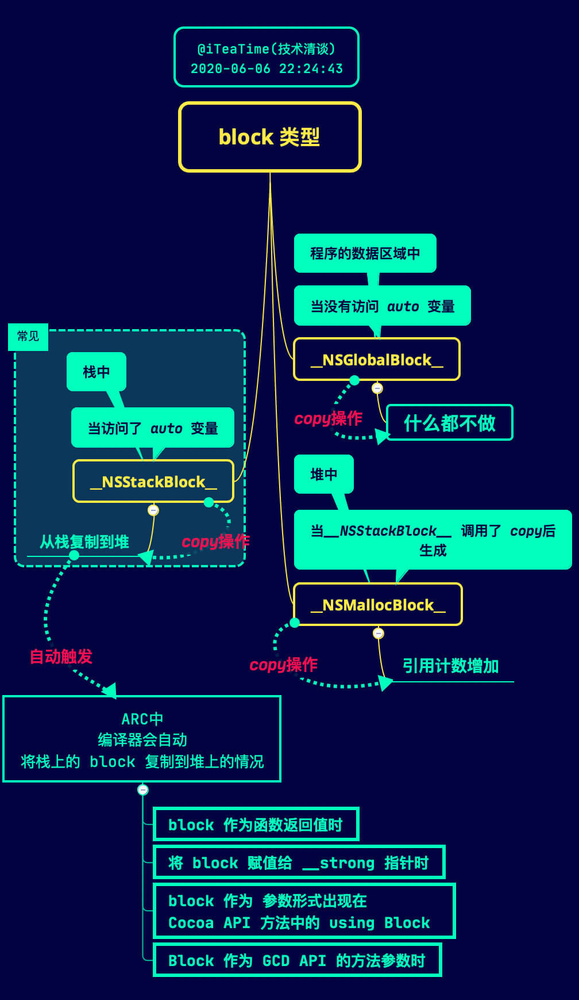

# 《招聘一个靠谱的 iOS 》参考答案

## 前言

### 原 GitHub 地址

- [《招聘一个靠谱的iOS》面试题参考答案（上）](https://github.com/ChenYilong/iOSInterviewQuestions/blob/master/01《招聘一个靠谱的iOS》面试题参考答案/《招聘一个靠谱的iOS》面试题参考答案（上）.md)
- [《招聘一个靠谱的iOS》面试题参考答案（下）](https://github.com/ChenYilong/iOSInterviewQuestions/blob/master//01《招聘一个靠谱的iOS》面试题参考答案/《招聘一个靠谱的iOS》面试题参考答案（下）.md)

### 原文说明

- 面试题来源是[微博@我就叫Sunny怎么了](http://weibo.com/u/1364395395)（孙源）的这篇博文：[《招聘一个靠谱的 iOS 》](http://blog.sunnyxx.com/2015/07/04/ios-interview/)（原文中使用的的微博图链已失效，可在 [Internet Archive](https://web.archive.org/web/20160307181530/http://blog.sunnyxx.com/2015/07/04/ios-interview/) 中查看）。其中共 55 题，除第一题为纠错题外，其他 54 道均为简答题。
- 答案为[微博@iOS程序犭袁](http://weibo.com/luohanchenyilong/)（陈艺龙）整理，未经出题者校对，如有纰漏，请向[微博@iOS程序犭袁](http://weibo.com/luohanchenyilong/)指正。

### 改版说明

原文有些内容过于臃肿，条理不够清晰。而对于题解而言，需要完整且相对精简，因此对原文做了两方面的调整：

1. 删除重复和关联性不强的内容，去粗取精；
2. 对于需要拓展的内容，尝试摘出来，用单独的一篇文章来讲解，在本文中只给出相关链接。

<h2>目录</h2>

- [《招聘一个靠谱的 iOS 》参考答案](#招聘一个靠谱的-ios-参考答案)
  - [前言](#前言)
    - [原 GitHub 地址](#原-github-地址)
    - [原文说明](#原文说明)
    - [改版说明](#改版说明)
  - [1. 风格纠错题](#1-风格纠错题)
    - [优化部分](#优化部分)
    - [硬伤部分](#硬伤部分)
  - [2. 什么情况使用 weak 关键字，相比 assign 有什么不同？](#2-什么情况使用-weak-关键字相比-assign-有什么不同)
  - [3. 怎么用 copy 关键字？](#3-怎么用-copy-关键字)
  - [4. 这个写法会出什么问题：`@property (copy) NSMutableArray *array;`](#4-这个写法会出什么问题property-copy-nsmutablearray-array)
  - [5. 如何让自己的类用 copy 修饰符？如何重写带 copy 关键字的 setter？](#5-如何让自己的类用-copy-修饰符如何重写带-copy-关键字的-setter)
  - [6. @property 的本质是什么？ivar 、getter 、setter 是如何生成并添加到这个类中的](#6-property-的本质是什么ivar-getter-setter-是如何生成并添加到这个类中的)
  - [7. 在 @protocol 和 category 中如何使用 @property](#7-在-protocol-和-category-中如何使用-property)
  - [8. Runtime 如何实现 weak 属性](#8-runtime-如何实现-weak-属性)
  - [9. @property 中有哪些属性关键字？/ @property 后面可以有哪些修饰符？](#9-property-中有哪些属性关键字-property-后面可以有哪些修饰符)
  - [10. weak 属性需要在 dealloc 中置 nil 么？](#10-weak-属性需要在-dealloc-中置-nil-么)
  - [11. @synthesize 和 @dynamic 分别有什么作用？](#11-synthesize-和-dynamic-分别有什么作用)
  - [12. ARC下，不显式指定任何属性关键字时，默认的关键字都有哪些？](#12-arc下不显式指定任何属性关键字时默认的关键字都有哪些)
  - [13. 用 @property 声明的 NSString（或 NSArray ，NSDictionary ）经常使用 copy 关键字，为什么？如果改用 strong 关键字，可能造成什么问题？](#13-用-property-声明的-nsstring或-nsarray-nsdictionary-经常使用-copy-关键字为什么如果改用-strong-关键字可能造成什么问题)
    - [1. 对非集合类对象的 copy 操作](#1-对非集合类对象的-copy-操作)
    - [2、集合类对象的 copy 与 mutableCopy](#2集合类对象的-copy-与-mutablecopy)
  - [14. @synthesize 合成实例变量的规则是什么？假如 property 名为 foo ，存在一个名为 _foo 的实例变量，那么还会自动合成新变量么？](#14-synthesize-合成实例变量的规则是什么假如-property-名为-foo-存在一个名为-_foo-的实例变量那么还会自动合成新变量么)
  - [15. 在有了自动合成属性实例变量之后，@synthesize 还有哪些使用场景？](#15-在有了自动合成属性实例变量之后synthesize-还有哪些使用场景)
  - [16. Objc 中向一个 nil 对象发送消息将会发生什么？](#16-objc-中向一个-nil-对象发送消息将会发生什么)
  - [17. Objc 中向一个对象发送消息 [obj foo] 和 objc_msgSend() 函数之间有什么关系？](#17-objc-中向一个对象发送消息-obj-foo-和-objc_msgsend-函数之间有什么关系)
  - [18. 什么时候会报 unrecognized selector 的异常？](#18-什么时候会报-unrecognized-selector-的异常)
  - [19. 一个 Objc 对象如何进行内存布局？（考虑有父类的情况）](#19-一个-objc-对象如何进行内存布局考虑有父类的情况)
  - [20. 一个objc对象的isa的指针指向什么？有什么作用？](#20-一个objc对象的isa的指针指向什么有什么作用)
  - [21. 下面的代码输出什么？](#21-下面的代码输出什么)
  - [22. Runtime 如何通过 selector 找到对应的 IMP 地址？（分别考虑类方法和实例方法）](#22-runtime-如何通过-selector-找到对应的-imp-地址分别考虑类方法和实例方法)
  - [23. 使用 Runtime Associate 方法关联的对象，需要在主对象 dealloc 的时候释放么？](#23-使用-runtime-associate-方法关联的对象需要在主对象-dealloc-的时候释放么)
  - [24. objc 中的实例方法和类方法有什么本质的区别和联系？](#24-objc-中的实例方法和类方法有什么本质的区别和联系)
  - [25. _objc_msgForward 函数是做什么的，直接调用它将会发生什么？](#25-_objc_msgforward-函数是做什么的直接调用它将会发生什么)
  - [26. Runtime 如何实现 weak 变量的自动置 nil ？](#26-runtime-如何实现-weak-变量的自动置-nil-)
  - [27. 能否向编译后得到的类中增加实例变量？能否向运行时创建的类中添加实例变量？为什么？](#27-能否向编译后得到的类中增加实例变量能否向运行时创建的类中添加实例变量为什么)
  - [28. RunLoop 和线程有什么关系？](#28-runloop-和线程有什么关系)
  - [29. RunLoop 的mode 作用是什么？](#29-runloop-的mode-作用是什么)
  - [30. 以 + scheduledTimerWithTimeInterval...的方式触发的timer ，在滑动页面上的列表时，timer 会暂定回调，为什么？如何解决？](#30-以--scheduledtimerwithtimeinterval的方式触发的timer-在滑动页面上的列表时timer-会暂定回调为什么如何解决)
  - [31. 猜想 RunLoop 内部是如何实现的？](#31-猜想-runloop-内部是如何实现的)
  - [32. Objc 使用什么机制管理对象内存？](#32-objc-使用什么机制管理对象内存)
  - [33. ARC 通过什么方式帮助开发者管理内存？](#33-arc-通过什么方式帮助开发者管理内存)
  - [34. 不手动指定 autoreleasepool 的前提下，一个 autorealese 对象在什么时刻释放？（比如在一个 vc 的 viewDidLoad 中创建）](#34-不手动指定-autoreleasepool-的前提下一个-autorealese-对象在什么时刻释放比如在一个-vc-的-viewdidload-中创建)
  - [35. BAD_ACCESS 在什么情况下出现？](#35-bad_access-在什么情况下出现)
  - [36. 苹果是如何实现 autoreleasepool 的？](#36-苹果是如何实现-autoreleasepool-的)
  - [37. 使用 block 时什么情况会发生引用循环，如何解决？](#37-使用-block-时什么情况会发生引用循环如何解决)
  - [参考](#参考)

## 1. 风格纠错题

问题：下面代码的风格有什么问题？


**修改方法一**：

```objectivec
typedef NS_ENUM(NSInteger, CYLGender) {
    CYLGenderUndefined,
    CYLGenderMale,
    CYLGenderFemale
};

@interface CYLUser : NSObject<NSCopying>

@property (nonatomic, readonly, copy) NSString *name;
@property (nonatomic, readonly, assign) NSUInteger age;
@property (nonatomic, readonly, assign) CYLGender gender;

- (instancetype)initWithName:(NSString *)name age:(NSUInteger)age gender:(CYLGender)gender;
+ (instancetype)userWithName:(NSString *)name age:(NSUInteger)age gender:(CYLGender)gender;

@end
```

下面对具体修改的地方，分两部分做下介绍：**硬伤部分** 和 **优化部分**
。因为**硬伤部分**没什么技术含量，为了节省大家时间，放在后面讲，大神请直接看**优化部分**。

### 优化部分

**1）** enum 建议使用 `NS_ENUM` 和 `NS_OPTIONS` 宏来定义枚举类型，参见官方的 [Adopting Modern Objective-C](https://developer.apple.com/library/ios/releasenotes/ObjectiveC/ModernizationObjC/AdoptingModernObjective-C/AdoptingModernObjective-C.html) 一文：

```objectivec
//定义一个枚举
typedef NS_ENUM(NSInteger, CYLGender) {
    CYLGenderUndefined,
    CYLGenderMale,
    CYLGenderFemale
};
```

（仅仅让性别包含男和女可能并不严谨，最严谨的做法可以参考 [这里](https://github.com/ChenYilong/iOSInterviewQuestions/issues/9) 。）

**2）** `age` 属性的类型：应避免使用基本类型，建议使用 `Foundation` 数据类型，对应关系如下：

```objectivec
int -> NSInteger
unsigned -> NSUInteger
float -> CGFloat
动画时间 -> NSTimeInterval
```

同时考虑到 `age` 的特点，应使用 `NSUInteger` ，而非 `int` 。
这样做的是基于 64-bit 适配考虑，详情可参考出题者的博文[《64-bit Tips》](http://blog.sunnyxx.com/2014/12/20/64-bit-tips/)。

**3）** 如果工程项目非常庞大，需要拆分成不同的模块，可以在类、`typedef` 宏命名的时候使用**前缀**。

**4）** `doLogIn` 方法不应写在该类中：

~~虽然`LogIn`的命名不太清晰，但笔者猜测是 login 的意思，（勘误：Login 是名词，LogIn 是动词，都表示登陆的意思。见： [***Log in vs. login***](http://grammarist.com/spelling/log-in-login/)）~~

登录操作属于业务逻辑，观察类名 `UserModel` ，以及属性的命名方式，该类应该是一个 Model 而不是一个 “MVVM 模式下的 ViewModel” ：

> 无论是 MVC 模式还是 MVVM 模式，业务逻辑都不应当写在 Model 里：MVC 应在 C ，MVVM 应在 VM 。

（如果抛开命名规范，假设该类真的是 MVVM 模式里的 ViewModel ，那么 `UserModel` 这个类可能对应的是用户注册页面，如果有特殊的业务需求，比如： `-logIn` 对应的应当是注册并登录的一个 Button ，出现 `-logIn` 方法也可能是合理的。）

**5）** `doLogIn` 方法命名不规范：添加了多余的动词前缀。

请牢记：

> 如果方法表示让对象执行一个动作，使用动词打头来命名，注意不要使用 `do` ，`does` 这种多余的关键字，动词本身的暗示就足够了。

应该使用 `-logIn`（注意：`Login` 是名词， `LogIn`  是动词，都表示登陆。见 [Log in vs. login](http://grammarist.com/spelling/log-in-login/)）

**6）** `-(id)initUserModelWithUserName:(NSString*)name withAge:(int)age;` 方法中不要用 `with` 来连接两个参数: `withAge:` 应当换为`age:`，`age:` 已经足以清晰说明参数的作用，也不建议用 `andAge:` ：通常情况下，即使有类似 `withA:withB:` 的命名需求，也通常是使用`withA:andB:` 这种命名，用来表示方法**执行两个相对独立的操作**（*从设计上来说，这时候也可以拆分成两个独立的方法*），它不应该用作阐明有多个参数，比如下面的：

```objectivec
// ❌ 错误，不要使用 "and" 来连接参数
- (int)runModalForDirectory:(NSString *)path andFile:(NSString *)name andTypes:(NSArray *)fileTypes;
// ❌ 错误，不要使用 "and" 来阐明有多个参数
- (instancetype)initWithName:(CGFloat)width andAge:(CGFloat)height;
// ✅ 正确，使用 "and" 来表示两个相对独立的操作
- (BOOL)openFile:(NSString *)fullPath withApplication:(NSString *)appName andDeactivate:(BOOL)flag;
```

**7）** 由于字符串值可能会改变，所以要把相关属性的“内存管理语义”声明为 `copy` 。(原因在下文有详细论述：用 `@property` 声明的 `NSString`（或 `NSArray` ，`NSDictionary` ）经常使用 `copy` 关键字，为什么？)

**8）** 初始化方法中没有包含“性别” (`gender`) 属性的设置：该类中只给出了一种“初始化方法” (`initializer`) 用于设置“姓名” (`name`) 和“年龄” (`age`) 的初始值，那如何对“性别”(`gender`）初始化？

Objective-C 有 **Designated** 和 **Secondary** 初始化方法的观念：

- Designated 初始化方法是包含所有初始化需要的参数；
- Secondary 初始化方法可以有一个或多个，并且提供一个或者更多的默认参数来调用 Designated 初始化方法。

举例说明：

```objectivec
@implementation CYLUser

- (instancetype)initWithName:(NSString *)name
                         age:(NSUInteger)age
                      gender:(CYLGender)gender {
    if (self = [super init]) {
        _name = [name copy];
        _age = age;
        _gender = gender;
    }
    return self;
}

- (instancetype)initWithName:(NSString *)name
                         age:(NSUInteger)age {
    return [self initWithName:name age:age gender:nil];
}

@end
```

上面的代码中 `initWithName:age:gender:` 就是 Designated 初始化方法，另外的是 Secondary 初始化方法。因为仅仅是调用类实现的 Designated 初始化方法。

因为出题者没有给出 `.m` 文件，所以有两种猜测：

1. 本来打算只设计一个 Designated 初始化方法，但漏掉了“性别”(gender）属性。那么最终的修改代码就是上文给出的第一种修改方法。
2. 不打算初始时初始化“性别” (gender) 属性，打算后期再修改，如果是这种情况，那么应该把“性别” (gender) 属性设为 `readwrite` 属性，最终给出的修改代码应该是：

**第二种修改方法**:

> 这是对第一种修改方法进行的完善。

```objectivec
typedef NS_ENUM(NSInteger, CYLGender) {
    CYLGenderUndefined,
    CYLGenderMale,
    CYLGenderFemale
};

@interface CYLUser : NSObject<NSCopying>

@property (nonatomic, readonly, copy) NSString *name;
@property (nonatomic, readonly, assign) NSUInteger age;
@property (nonatomic, readwrite, assign) CYLGender gender;

- (instancetype)initWithName:(NSString *)name age:(NSUInteger)age gender:(CYLGender)gender;
- (instancetype)initWithName:(NSString *)name age:(NSUInteger)age;
+ (instancetype)userWithName:(NSString *)name age:(NSUInteger)age gender:(CYLGender)gender;

@end
```

`.h` 中暴露 Designated 初始化方法，是为了方便子类化 （想了解更多，请戳--> [《禅与 Objective-C 编程艺术（Zen and the Art of the Objective-C Craftsmanship 中文翻译）》](http://is.gd/OQ49zk)。）

按照接口设计的惯例，如果设计了“初始化方法” (initializer) ，也应当搭配一个快捷构造方法。而快捷构造方法的返回值，建议为 `instancetype` ，为保持一致性，`init` 方法和快捷构造方法的返回类型最好都用 `instancetype` 。

如果基于第一种修改方法：既然该类中已经有一个“初始化方法” (initializer) ，用于设置“姓名” (`name`) 、“年龄” (`age`) 和“性别” (`gender`) 的初始值，那么在设计对应 `@property` 时就应该尽量使用不可变的对象：其三个属性都应该设为“只读”。用初始化方法设置好属性值之后，就不能再改变了。在本例中，仍需声明属性的“内存管理语义”。于是可以把属性的定义改成这样：

```objectivec
@property (nonatomic, readonly, copy) NSString *name;
@property (nonatomic, readonly, assign) NSUInteger age;
@property (nonatomic, readonly, assign) CYLGender gender;
```

**由于是只读属性，所以编译器不会为其创建对应的 setter 方法**，即便如此，我们还是要写上这些属性的内存管理语义，以此表明初始化方法在设置这些属性值时所用的方式。要是不写明语义的话，该类的调用者就不知道初始化方法里会拷贝这些属性，他们有可能会在调用初始化方法之前自行拷贝属性值。这种操作多余而且低效。

**9）** `initUserModelWithUserName` 如果改为 `initWithName` 或者 `initWithUsername` 会更加简洁，而且足够清晰。

**10）**  `UserModel` 如果改为 `User` 会更加简洁，而且足够清晰。

**11）** `UserSex`如果改为`Gender` 会更加简洁，而且足够清晰。

**12）** 第二个 `@property` 中 `assign` 和 `nonatomic` 调换位置。

推荐按照下面的格式来定义属性

```objectivec
@property (nonatomic, readwrite, copy) NSString *name;
```

属性的参数应该按照下面的顺序排列：*原子性*，*读写权限*和*内存管理*。 这样做你的属性更容易修改正确，并且更好阅读。这在[《禅与Objective-C编程艺术 >》](https://github.com/oa414/objc-zen-book-cn#属性定义)里有介绍。

而且习惯上修改某个属性的修饰符时，一般从属性名从右向左搜索需要修动的修饰符。最可能从最右边开始修改这些属性的修饰符，根据经验这些修饰符被修改的可能性从高到底应为：内存管理 > 读写权限 > 原子性。

讨论区：[《个人认为，UserModel 还是比起 User 的命名方式好些 #21 》](https://github.com/ChenYilong/iOSInterviewQuestions/issues/21)

issue 的摘要：

理由：`User` 这个命名过于简略，用在没有命名空间的的 OC 语言上容易发生命名冲突。

可以想见，一个叫做 `CYLUser` 的类，如果将其实例化的话，其对象名称必然叫做 `user` 。对于如此简略的名称，我们一般更加习惯是在诸如 `NSString` 字符串这样类型的实例上使用。倘若此时同时有一个字符串对象的名称也叫做 `user` ，两者就会发生很不舒服的命名冲突，而且也不好将其中一个改为另外的名称。

个人认为类名 `CYLUserModel` ，实例名称 `userModel` 才是更加适合，不易引起其它冲突尴尬的命名方案。

同理，对于CYLSex，个人认为：

```objectivec
typedef NS_ENUM(NSInteger, CYLSexType) {
    CYLSexTypeMan,
    CYLSexTypeWoman,
};
```

才能更容易避免项目之后的尴尬和冲突，并且容易说明这是一个枚举类型。**Type** 和 **Status** 理应作为绝大多数枚举类型的通行关键词

### 硬伤部分

 1. 在 `-` 和 `(void)` 之间应该有一个空格。
 2. enum 中*驼峰命名法*和*下划线命名法*混用错误：枚举类型的命名规则和函数的命名规则相同，应该使用驼峰命名法，勿使用下划线命名法。
 3. enum 左括号前加一个空格，或者将左括号换到下一行
 4. enum 右括号后加一个空格
 5. `UserModel :NSObject` 应为`UserModel : NSObject`，也就是`:`右侧少了一个空格。
 6. `@interface` 与 `@property` 属性声明中间应当间隔一行。
 7. 两个方法定义之间不需要换行，有时为了区分方法的功能也可间隔一行，但示例代码中间隔了两行。
 8. `-(id)initUserModelWithUserName: (NSString*)name withAge:(int)age;` 方法中方法名与参数之间多了空格。而且 `-` 与 `(id)` 之间少了空格。
 9. `-(id)initUserModelWithUserName: (NSString*)name withAge:(int)age;` 方法中方法名与参数之间多了空格：`(NSString*)name` 前多了空格。
 10. `-(id)initUserModelWithUserName: (NSString*)name withAge:(int)age;` 方法中 `(NSString*)name`,应为 `(NSString *)name`，少了空格。

**关于 `age` 是否需要设置为 `NSUInteger` 的问题**：

因为需要考虑到「Objective-C 的有符号的 `-1` 隐式转换到无符号整数」的情况，

这里提供两种方案供选择：

**1）** `age` 设计为 `NSInteger` 类型，**在方法中检测外部传入是否为负数**。

| 设置为 `NSInteger` 的好处 |设置为 `NSInteger` 的坏处 |
:-------------:|:-------------: |
| 可以规避该问题「Objective-C 的有符号的 -1 隐式转换到无符号整数」的情况 | 内存占用大（❓存疑） |
| - | 不能起到提示作用：提示调用方传参数格式 |

**2）** `age` 设计为 `NSUInteger` 类型，外部只读，提供初始化接口，初始化接口内部，判断是否溢出。（其实这个方案不太好。）

| 设置为 `NSUInteger` 的好处 | 设置为 `NSUInteger` 的坏处 |
:-------------:|:-------------: |
| 内存占用小 | Objective-C 的有符号的 `-1` 隐式转换到无符号整数
| 能起到提示作用：提示调用方传参数格式 | - |

考虑到目前 iPhone 设备的内存与 `NSInteger` 的内存开销，建议采用 “将 `age` 设计为 `NSInteger` 类型”的方案。

Objective-C 中诸如 `NSArray` 中的 `count` 返回的是 `NSUInteger` 是一个非常**不**优雅的设计， Swift 中的 `Array` 的 `count` 就选择使用 `Int` 。强制要用 `NSUInteger` 的地方就是 `bitmask` ， Objective-C 中叫 `NS_OPTION` ，因为要消除不同的编译器的 `right shift` 到底是 `arithmetic right shift` 还是 `logical right shift` 的歧义。

如果对硬伤部分有疑问，欢迎参与讨论： [《硬伤部分 #49》](https://github.com/ChenYilong/iOSInterviewQuestions/issues/49)

## 2. 什么情况使用 weak 关键字，相比 assign 有什么不同？

**什么情况使用 `weak` 关键字**：

- 在 ARC 中，在有可能出现循环引用的时候，往往要通过让其中一端使用 `weak` 来解决，比如: `delegate` 代理属性。
- 自身已经对它进行一次强引用，没有必要再强引用一次，此时也会使用 `weak` ，自定义 `IBOutlet` 控件属性一般也使用 `weak` ；当然，也可以使用 `strong` 。在下文也有论述：*《IBOutlet连出来的视图属性为什么可以被设置成weak?》*

**`assign` 和 `weak` 的不同点**：

1. `weak` 修饰符表明该属性定义了一种“非拥有关系” (nonowning relationship) 。在为这种属性设置新值时，设置方法既不保留新值，也不释放旧值。此行为与 `assign` 类似，不同之处在于，在 `weak` 属性所指的对象遭到销毁、释放时，该属性值也会*清空 (nil out)* 。而 `assign` 的“设置方法”只会执行针对“纯量类型/基本数据类型” (scalar type，例如 `CGFloat` 或 `NSInteger` 等) 的简单赋值操作。
2. `assign` 可以用非 OC 对象，而 `weak` 必须用于 OC 对象。

其他讨论见： [《第2题 #89》]( https://github.com/ChenYilong/iOSInterviewQuestions/issues/89 )

## 3. 怎么用 copy 关键字？

用途：

 1. `NSString` 、`NSArray` 、`NSDictionary` 等等经常使用 `copy` 关键字，是因为他们有对应的可变类型：`NSMutableString` 、`NSMutableArray` 、`NSMutableDictionary` ；
 2. block 也经常使用 `copy` 关键字，具体原因见[官方文档：***Objects Use Properties to Keep Track of Blocks***](https://developer.apple.com/library/ios/documentation/Cocoa/Conceptual/ProgrammingWithObjectiveC/WorkingwithBlocks/WorkingwithBlocks.html#//apple_ref/doc/uid/TP40011210-CH8-SW12)：

block 使用 `copy` 是从 MRC 遗留下来的“传统”，在 MRC 中，方法内部的 block 是在栈区的，使用 `copy` 可以把它放到堆区.
  
在 ARC 中写不写都行，在 ARC 环境下，编译器会根据情況自动将栈上的 block 复制到堆上，比如以下情况：

- block 作为函数返回值时
- 将 block 赋值给 `__strong` 指针时（ property 的 `copy` 属性对应的是这一条）
- block 作为 Cocoa API 中方法名含有 using Block 的方法参数时
- block 作为 GCD API 的方法参数时


  
其中， block 的 property 设置为 `copy` ，对应的是这一条：将 block 赋值给 `__strong` 指针时。

换句话说：

对于 block 使用 copy 还是 strong 效果是一样的，但写上 copy 也无伤大雅，还能时刻提醒我们：编译器自动对 block 进行了 copy 操作。如果不写 `copy` ，该类的调用者有可能会忘记或者根本不知道“编译器会自动对 block 进行了 copy 操作”，他们有可能会在调用之前自行拷贝属性值。这种操作多余而低效。你也许会感觉我这种做法有些怪异，不需要写还依然写。如果你这样想，其实是你“日用而不知”，你平时开发中是经常在用我说的这种做法的，比如下面的属性不写 `copy` 也行，但是你会选择写还是不写呢？

```objectivec
 @property (nonatomic, copy) NSString *userId;

 - (instancetype)initWithUserId:(NSString *)userId {
    self = [super init];
    if (!self) {
        return nil;
    }
    _userId = [userId copy];
    return self;
 }

```


下面做下解释：

`copy` 此特质所表达的所属关系与 `strong` 类似。然而设置方法并不保留新值，而是将其“拷贝” (`copy`) 。

当属性类型为 `NSString` 时，经常用此特质来保护其**封装性**，因为传递给设置方法的新值有可能指向一个 `NSMutableString` 类的实例。这个类是 `NSString` 的子类，表示一种可修改其值的字符串，此时若是不拷贝字符串，那么设置完属性之后，字符串的值就可能会在对象不知情的情况下遭人更改。所以，这时就要拷贝一份“不可变” (immutable) 的字符串，确保对象中的字符串值不会无意间变动。只要实现属性所用的对象是“可变的” (mutable) ，就应该在设置新属性值时拷贝一份。

用 `@property` 声明 `NSString` 、`NSArray` 、`NSDictionary` 经常使用 `copy` 关键字，是因为他们有对应的可变类型：`NSMutableString` 、`NSMutableArray` 、`NSMutableDictionary` ，他们之间可能进行赋值操作，为确保对象中的字符串值不会无意间变动，应该在设置新属性值时拷贝一份。

该问题在下文中也有论述：*用 `@property` 声明的 `NSString`（`或NSArray` ，`NSDictionary` ）经常使用 `copy` 关键字，为什么？如果改用 `strong` 关键字，可能造成什么问题？*

## 4. 这个写法会出什么问题：`@property (copy) NSMutableArray *array;`

两个问题：

1. 添加、删除、修改数组内的元素的时候，程序会因为**找不到对应的方法**而崩溃。因为 `copy` 就是复制一个不可变 `NSArray` 的对象；
2. 使用了 `atomic` 属性会严重影响性能 。

比如下面的代码就会发生崩溃：

```objectivec
@property (nonatomic, copy) NSMutableArray *mutableArray;
```

```objectivec
NSMutableArray *array = [NSMutableArray arrayWithObjects:@1, @2, nil];
self.mutableArray = array;
[self.mutableArray removeObjectAtIndex:0];
```

接下来就会崩溃：

```objectivec
 -[__NSArrayI removeObjectAtIndex:]: unrecognized selector sent to instance 0x7fcd1bc30460
```

第 2 条原因，如下：

该属性使用了互斥锁（ `atomic` 的底层实现，老版本是自旋锁，*iOS 10* 开始是互斥锁，也就是 `spinlock` 底层实现改变了。），会在创建时生成一些额外的代码用于帮助编写多线程程序，这会带来性能问题，通过声明 `nonatomic` 可以节省这些虽然很小但是不必要额外开销。

在 iOS 开发中，你会发现，几乎所有属性都声明为 `nonatomic` 。

一般情况下并不要求属性必须是“原子的”，因为这**并不能保证线程安全**，若要实现“线程安全”的操作，还需采用更为深层的加锁机制才行。~~例如，一个线程在连续多次读取某属性值的过程中有别的线程在同时改写该值，那么即便将属性声明为 `atomic` ，也还是会读到不同的属性值。~~

因此，开发 iOS 程序时一般都会使用 `nonatomic` 属性。但是在开发 Mac OS X 程序时，使用 `atomic` 属性通常都不会有性能瓶颈。

如果对题有疑问，可参考讨论区： [《第四题 #62》](https://github.com/ChenYilong/iOSInterviewQuestions/issues/62)

## 5. 如何让自己的类用 copy 修饰符？如何重写带 copy 关键字的 setter？

若想令自己所写的对象具有拷贝功能，则需实现 `NSCopying` 协议。如果自定义的对象分为可变版本与不可变版本，那么就要同时实现 `NSCopying` 与 `NSMutableCopying` 协议。

具体步骤：

 1. 需声明该类遵从 `NSCopying` 协议
 2. 实现 `NSCopying` 协议。

该协议只有一个方法:

```objectivec
- (id)copyWithZone:(NSZone *)zone;
```

注意：一提到让自己的类用 `copy` 修饰符，我们总是想覆写 `copy` 方法，其实真正需要实现的却是 `copyWithZone` 方法。

以第一题的代码为例：

```objectivec
typedef NS_ENUM(NSInteger, CYLGender) {
    CYLGenderUndefined,
    CYLGenderMale,
    CYLGenderFemale
};

@interface CYLUser : NSObject<NSCopying>

@property (nonatomic, readonly, copy) NSString *name;
@property (nonatomic, readonly, assign) NSUInteger age;
@property (nonatomic, readonly, assign) CYLGender gender;

- (instancetype)initWithName:(NSString *)name age:(NSUInteger)age gender:(CYLGender)gender;
+ (instancetype)userWithName:(NSString *)name age:(NSUInteger)age gender:(CYLGender)gender;

@end
```

然后实现协议中规定的方法：

```objectivec
- (id)copyWithZone:(NSZone *)zone {
    CYLUser *copy = [[[self class] allocWithZone:zone] initWithName:_name age:_age gender:_gender];
    return copy;
}
```

但在实际的项目中，不可能这么简单，遇到更复杂一点，比如类对象中的数据结构可能并未在初始化方法中设置好，需要另行设置。

举个例子，假如 `CYLUser` 中含有一个数组，与其他 `CYLUser` 对象建立或解除朋友关系的那些方法都需要操作这个数组。那么在这种情况下，你得把这个包含朋友对象的数组也一并拷贝过来。下面列出了实现此功能所需的全部代码：

`.h` 文件：

```objectivec
typedef NS_ENUM(NSInteger, CYLGender) {
    CYLGenderUndefined,
    CYLGenderMale,
    CYLGenderFemale
};

@interface CYLUser : NSObject<NSCopying>

@property (nonatomic, readonly, copy) NSString *name;
@property (nonatomic, readonly, assign) NSUInteger age;
@property (nonatomic, readonly, assign) CYLGender gender;

- (instancetype)initWithName:(NSString *)name age:(NSUInteger)age gender:(CYLGender)gender;
+ (instancetype)userWithName:(NSString *)name age:(NSUInteger)age gender:(CYLGender)gender;
- (void)addFriend:(CYLUser *)user;
- (void)removeFriend:(CYLUser *)user;

@end
```

`.m` 文件：

```objectivec
@implementation CYLUser {
    NSMutableSet *_friends;
}

- (instancetype)initWithName:(NSString *)name
                         age:(NSUInteger)age
                      gender:(CYLGender)gender {
    if (self = [super init]) {
        _name = [name copy];
        _age = age;
        _gender = gender;
        _friends = [[NSMutableSet alloc] init];
    }
    return self;
}

+ (instancetype)userWithName:(NSString *)name age:(NSUInteger)age gender:(CYLGender)gender {
    CYLUser *user = [[CYLUser alloc] initWithName:name age:age gender:gender];
    user->_friends = [[NSMutableSet alloc] init];
    return user;
}

- (void)addFriend:(CYLUser *)user {
    [_friends addObject:user];
}

- (void)removeFriend:(CYLUser *)user {
    [_friends removeObject:user];
}

- (id)copyWithZone:(NSZone *)zone {
    CYLUser *copy = [[[self class] allocWithZone:zone] initWithName:_name age:_age gender:_gender];
    copy->_friends = [_friends mutableCopy];
    return copy;
}

@end

```

以上做法能满足基本的需求，但是也有缺陷：

> 如果你所写的对象需要深拷贝，那么可考虑新增一个专门执行深拷贝的方法。

在例子中，存放朋友对象的 set 是用 `copyWithZone:` 方法来拷贝的，这种浅拷贝方式不会逐个复制 set 中的元素。若需要深拷贝的话，则可像下面这样，编写一个专供深拷贝所用的 `initWithSet:copyItems:` 方法:

```objectivec
- (id)deepCopy {
    CYLUser *copy = [[[self class] alloc] initWithName:_name age:_age gender:_gender];
    copy->_friends = [[NSMutableSet alloc] initWithSet:_friends copyItems:YES];
    return copy;
}

```

注意：由于上文中 `CYLUser` 的 `-copyWithZone:` 方法里，`_friends` 成员的的赋值使用的 `- mutableCopy` 是浅拷贝，只是创建了`NSMutableSet` 对象； 导致 `-deepCopy` 方法中， `_friends` 的每一个对象的 `_friends` 列表并未创建实例。如需继续优化，还需要改造。参见[这里](https://github.com/ChenYilong/iOSInterviewQuestions/pull/24)的讨论。

至于*如何重写带 `copy` 关键字的 setter* 这个问题，如果抛开本例来回答的话，如下：

```objectivec
- (void)setName:(NSString *)name {
    //[_name release];
    _name = [name copy];
}
```

不过也有争议，有人说“苹果如果像下面这样干，是不是效率会高一些？”

```objectivec
- (void)setName:(NSString *)name {
    if (_name != name) {
        //[_name release];//MRC
        _name = [name copy];
    }
}
```

这样真得高效吗？不见得！

你可能会说：

之所以在这里做 `if` 判断这个操作：是因为一个 `if` 可能避免一个耗时的 `copy` ，还是很划算的。
(在刚刚讲的：《如何让自己的类用 copy 修饰符？》里的那种复杂的 copy ，我们可以称之为 “耗时的 copy” ，但是对 `NSString` 的 `copy` 还称不上。)

但是你有没有考虑过代价：

> 你每次调用 `setX:` 都会做 if 判断，这会让 `setX:` 变慢，如果你在 `setX:`写了一串复杂的 `if+elseif+elseif+...` 判断，将会更慢。

要回答“哪个效率会高一些？”这个问题，不能脱离实际开发，就算 `copy` 操作十分耗时，`if` 判断也不见得一定会更快，除非你把一个 “`@property` 他当前的值”赋给了他自己，代码看起来就像：

```objectivec
[a setX:x1];
[a setX:x1]; //你确定你要这么干？与其在 setter 中判断，为什么不把代码写好？
```

或者

```objectivec
[a setX:[a x]];   //队友咆哮道：你在干嘛？！！
```

> ARC时代下，不要在 setter 里进行像 `if (_obj != newObj)` 这样的判断。（该观点参考链接：[How To Write Cocoa Object Setters： Principle 3: Only Optimize After You Measure](http://vgable.com/blog/tag/autorelease/)
）

ARC 时代下，什么情况会在 `copy` setter 里做 `if` 判断？

例如，车速可能就有最高速的限制，车速也不可能出现负值，如果车子的最高速为 300 ，则 setter 的方法就要改写成这样：

```objectivec
-(void)setSpeed:(int)speed {
    if (speed < 0) speed = 0;
    if (speed > 300) speed = 300;
   _speed = speed;
}
```

回到这个题目，如果单单就上文的代码而言，我们不需要也不能重写 `name` 的 setter ：由于 `name` 是只读属性，所以编译器不会为其创建对应的“设置方法”，用初始化方法设置好属性值之后，就不能再改变了。（ 在本例中，之所以还要声明属性的“内存管理语义” `copy` ，是因为：如果不写 `copy` ，该类的调用者就不知道初始化方法里会拷贝这些属性，他们有可能会在调用初始化方法之前自行拷贝属性值。这种操作多余而低效）。

那如何确保 `name` 被 `copy` ？在初始化方法中做：

```objectivec
- (instancetype)initWithName:(NSString *)name age:(NSUInteger)age gender:(CYLGender)gender {
    if ((self = [super init]) {
    _name = [name copy];
    _age = age;
    _gender = gender;
    _friends = [[NSMutableSet alloc] init];
    }
    return self;
}
```

讨论区：

- [《 set 中，对 if (_name != name) 的描述 #10》]( https://github.com/ChenYilong/iOSInterviewQuestions/issues/10 )
- [《更新问题“如何让自己的类用 copy 修饰符？如何重写带 copy 关键字的 setter ？” 的答案 #24》]( https://github.com/ChenYilong/iOSInterviewQuestions/pull/24 )

## 6. @property 的本质是什么？ivar 、getter 、setter 是如何生成并添加到这个类中的

**@property 的本质**：

> @property = ivar + getter + setter;

下面解释下：

> “属性” (property) 有两大概念：ivar（实例变量）、存取方法（access method ＝ getter + setter）。

“属性” (property) 作为 Objective-C 的一项特性，主要的作用就在于封装对象中的数据。 Objective-C 对象通常会把其所需要的数据保存为各种实例变量。实例变量一般通过“存取方法” (access method) 来访问。其中，“获取方法” (getter) 用于读取变量值，而“设置方法” (setter) 用于写入变量值。这个概念已经定型，并且经由“属性”这一特性而成为 `Objective-C 2.0` 的一部分。

在正规的 Objective-C 编码风格中，存取方法有着严格的命名规范。正因为有了这种严格的命名规范，所以 Objective-C 这门语言才能根据名称自动创建出存取方法。其实也可以把属性当做一种关键字，表示编译器会自动写出一套存取方法，用以访问给定类型中具有给定名称的变量。

所以你也可以这么说：

> @property = getter + setter;

例如下面这个类：

```objectivec
@interface Person : NSObject

@property NSString *firstName;
@property NSString *lastName;

@end
```

上述代码写出来的类与下面这种写法等效：

```objectivec
@interface Person : NSObject

- (NSString *)firstName;
- (void)setFirstName:(NSString *)firstName;
- (NSString *)lastName;
- (void)setLastName:(NSString *)lastName;

@end
```

对上面这一句有疑问，可参考讨论区： [《第6题 上述代码写出来的类与下面这种写法等效： #86》](https://github.com/ChenYilong/iOSInterviewQuestions/issues/86 )

**更新**：

property 在 Runtime 中是 `objc_property_t` ，定义如下:

```objectivec
typedef struct objc_property *objc_property_t;
```

而 `objc_property` 是一个结构体，包括 `name` `和attributes` ，定义如下：

```objectivec
struct property_t {
    const char *name;
    const char *attributes;
};
```

而 `attributes` 本质是 `objc_property_attribute_t` ，定义了 property 的一些属性，定义如下：

```objectivec
/// Defines a property attribute
typedef struct {
    const char *name;           /**< The name of the attribute */
    const char *value;          /**< The value of the attribute (usually empty) */
} objc_property_attribute_t;
```

而 `attributes` 的具体内容是：类型，原子性，内存语义和对应的实例变量。

例如：我们定义一个 string 的 property ：

```objectivec
@property (nonatomic, copy) NSString *string;
```

通过 `property_getAttributes(property)`获取到 attributes 并打印出来之后的结果为 `T@"NSString",C,N,V_string` 。

- `T` 就代表类型 `NSString`
- `C` 就代表 `copy`
- `N` 代表 `nonatomic`
- `V` 就代表对应的`实例变量`

> 参考 ：[Type Encodings](https://developer.apple.com/library/content/documentation/Cocoa/Conceptual/ObjCRuntimeGuide/Articles/ocrtTypeEncodings.html#//apple_ref/doc/uid/TP40008048-CH100-SW1)

**ivar、getter、setter 是如何生成并添加到这个类中的?**

> “自动合成” (auto synthesis)

完成属性定义后，编译器会自动编写访问这些属性所需的方法，此过程叫做“自动合成” (autosynthesis) 。需要强调的是，这个过程由编译器在**编译期**执行，所以编辑器里看不到这些“合成方法” (synthesized method) 的源代码。除了生成方法代码 getter 、setter 之外，编译器还要自动向类中添加适当类型的实例变量，并且在属性名前面加下划线，以此作为实例变量的名字。在前例中，会生成两个实例变量，其名称分别为 `_firstName` 与 `_lastName`。也可以在类的实现代码里通过 `@synthesize` 语法来指定实例变量的名字.

```objectivec
@implementation Person

@synthesize firstName = _myFirstName;
@synthesize lastName = _myLastName;

@end
```

我为了搞清属性是怎么实现的，曾经反编译过相关的代码，他大致生成了五个东西：

1. `OBJC_IVAR_$类名$属性名称` ：该属性的“偏移量” (offset) ，这个偏移量是“硬编码” (hardcode) ，表示该变量距离存放对象的内存区域的起始地址有多远。
2. setter 与 getter 方法对应的实现函数
3. `ivar_list` ：成员变量列表
4. `method_list` ：方法列表
5. `prop_list` ：属性列表

也就是说我们每次在增加一个属性，系统都会在 `ivar_list` 中添加一个成员变量的描述，在 `method_list` 中增加 setter 与 getter 方法的描述，在属性列表中增加一个属性的描述，然后计算该属性在对象中的偏移量，然后给出 setter 与 getter 方法对应的实现，在 setter 方法中从偏移量的位置开始赋值，在 getter 方法中从偏移量开始取值，为了能够读取正确字节数，系统对象偏移量的指针类型进行了类型强转。

注意：其中 `prop_list` 存在哪里？

```c
// objc-runtime-new.h 中
struct objc_class : objc_object {
//...
    class_data_bits_t bits;//在 bits.data() 里面
//...
}
```

注意在 *iOS 10* ， Xcode 8 推出的 class 关键字中， 与本题中关于 `@property` 的讨论，有一些差异， 比如 `class` 关键字表示永远不会自动合成，所以类变量、类存取方法，都要自己手动实现；

下文中的第9题会涉及这个关键字的用法，可以参考下文。

 讨论见：[《第六题 prop_list 存在哪里？ #108》](https://github.com/ChenYilong/iOSInterviewQuestions/issues/108)

## 7. 在 @protocol 和 category 中如何使用 @property

- 在 `@protocol` 中使用 `@property` 只会生成 setter 和 getter 方法声明，我们使用属性的目的，是希望遵守我协议的对象能实现该属性
- category 使用 `@property` 也是只会生成 setter 和 getter 方法的声明，如果我们真的需要给 category 增加属性的实现，需要借助于运行时的两个函数：
  - `objc_setAssociatedObject`
  - `objc_getAssociatedObject`

对该回答有疑问，可参考讨论区 [《第7题，在代理里定义属性，好像没有使用场景吧 #83》](https://github.com/ChenYilong/iOSInterviewQuestions/issues/83)

## 8. Runtime 如何实现 weak 属性

要实现 `weak` 属性，首先要搞清楚 `weak` 属性的特点：

`weak` 此特质表明该属性定义了一种“非拥有关系” (nonowning relationship) 。为这种属性设置新值时，设置方法既不保留新值，也不释放旧值。此特质同 `assign` 类似，然而在属性所指的对象遭到摧毁时，属性值也会清空 (nil out) 。

那么 Runtime 如何实现 `weak` 变量的自动置 `nil` ？

举例说明：

```objectivec
id obj0 = [NSObject new];
__weak id obj1 = obj0;
__weak id obj2 = obj0;
```

Runtime 对注册的类，会进行布局，`weak` 对象指针会被放入一个 hash 表中。 用 `weak` 指针 (`obj1` 、`obj2`) 指向的对象 (`obj0`) 的内存地址作为 key ，value 是 `weak` 指针数组。

当此对象的引用计数为 `0` 、执行 `dealloc` 的时候会反向找到 `weak` 指针 (`obj1` 、`obj2`) 并将它们指向 `nil` 。

举例：假如 `weak` 指针 (`obj1` 、`obj2`) 指向的对象 (`obj0`) 内存地址是 `a` ，那么就会以 `a` 为键， 在这个 `weak` 表中搜索，找到所有以 `a` 为键的 `weak` **对象指针** (`obj1` 、`obj2`) ，将它们设置为 `nil` 。

注：在下文的 *《使用 Runtime Associate 方法关联的对象，需要在主对象 dealloc 的时候释放么？》* 里给出的“对象的内存销毁时间表”也提到 `__weak` 引用的解除时间。

先看下 Runtime 里源码的实现：

`weak_table_t` ：The **global weak references table**.（全局弱引用表）

```cpp
struct weak_table_t {
    weak_entry_t *weak_entries;
    size_t    num_entries;
    uintptr_t mask;
    uintptr_t max_hash_displacement;
};
```

`weak_entry_t` ：

```objectivec
#define WEAK_INLINE_COUNT 4

struct weak_entry_t {
    DisguisedPtr<objc_object> referent;
    union {
        struct {
            weak_referrer_t *referrers;
            uintptr_t        out_of_line_ness : 2;
            uintptr_t        num_refs : PTR_MINUS_2;
            uintptr_t        mask;
            uintptr_t        max_hash_displacement;
        };
        struct {
            // out_of_line_ness field is low bits of inline_referrers[1]
            weak_referrer_t  inline_referrers[WEAK_INLINE_COUNT];
        };
    };

    bool out_of_line() {
        return (out_of_line_ness == REFERRERS_OUT_OF_LINE);
    }

    weak_entry_t& operator=(const weak_entry_t& other) {
        memcpy(this, &other, sizeof(other));
        return *this;
    }

    weak_entry_t(objc_object *newReferent, objc_object **newReferrer)
        : referent(newReferent)
    {
        inline_referrers[0] = newReferrer;
        for (int i = 1; i < WEAK_INLINE_COUNT; i++) {
            inline_referrers[i] = nil;
        }
    }
};
```

`weak_entry_t` 结构体中：

- `referent` 成员，其类型是 `DisguisedPtr<objc_object>` ，表示被弱引用的对象的地址。
- 存储弱引用指针的地址的数组有两个：
  - 当弱引用指针的数量小于等于 4 时，使用定长数组 `inline_referrers` ；
  - 当弱引用指针的数量大于 4 时，会申请内存创建一个名为 `referrers` 的数组，其类型为 `weak_referrer_t *` 。
- `weak_entry_t` 的初始化方法中传入的 `objc_object **newReferrer` 是二级指针，就是弱引用指针的地址。

具体完整实现参照 [objc/objc-weak.h](https://opensource.apple.com/source/objc4/objc4-646/runtime/objc-weak.h) 。

---

我们可以设计一个函数（伪代码）来表示上述机制：

`objc_storeWeak(&a, b)` 函数：

> `objc_storeWeak(id *location, id newObj)`

`objc_storeWeak` 函数把第二个参数--赋值对象（`b`）的内存地址作为键值 `key` ，将第一个参数-- `weak` 修饰的属性变量（`a`）的内存地址（`&a`）作为 `value` ，注册到 `weak` 表中。如果第二个参数（`b`）为 `0`（`nil`），那么把变量（`a`）的内存地址（`&a`）从 `weak` 表中删除，

你可以把 `objc_storeWeak(&a, b)` 理解为：`objc_storeWeak(value, key)` ，并且当 `key` 变 `nil` ，将 `value` 置 `nil` 。(如对这句话有疑问，可以参考讨论 [《第8题 感觉objc_storeWeak(&a, b) 理解有点问题 #98》](https://github.com/ChenYilong/iOSInterviewQuestions/issues/98) )

在 `b` 非 `nil` 时，`a` 和 `b` 指向同一个内存地址，在 `b` 变 `nil` 时，`a` 变 `nil` 。此时向 `a` 发送消息不会崩溃：在 Objective-C 中向 `nil` 发送消息是安全的。

而如果 `a` 是由 `assign` 修饰的，则：在 `b` 非 `nil` 时，`a` 和 `b` 指向同一个内存地址，在 `b` 变 `nil` 时，`a` 还是指向该内存地址，变野指针。此时向 `a` 发送消息会产生崩溃。

下面我们将基于`objc_storeWeak(&a, b)`函数，使用伪代码模拟“runtime如何实现weak属性”：

```objectivec
id obj1;
objc_initWeak(&obj1, obj);
/*obj引用计数变为0，变量作用域结束*/
objc_destroyWeak(&obj1);
```

下面对用到的两个方法 `objc_initWeak` 和 `objc_destroyWeak` 做下解释。总体说来，作用是：

通过 `objc_initWeak` 函数初始化“附有 `weak` 修饰符的变量（`obj1`）”，在变量作用域结束时通过 `objc_destoryWeak` 函数释放该变量（`obj1`）。

下面分别介绍下方法的内部实现：

`objc_initWeak` 函数的实现是这样的：在将“附有 `weak` 修饰符的变量（`obj1`）”初始化为 `0`（`nil`）后，会将“赋值对象”（`obj`）作为参数，调用 `objc_storeWeak` 函数。

```objectivec
obj1 = 0；
obj_storeWeak(&obj1, obj);
```

也就是说：

> `weak` 修饰的指针默认值是 `nil` （在 Objective-C 中向 `nil` 发送消息是安全的）

(同时， `weak` 修饰的指针可能随时变为 `nil` )

然后 `obj_destroyWeak` 函数将 `0`（`nil`）作为参数，调用 `objc_storeWeak` 函数。

`objc_storeWeak(&obj1, 0);`

前面的源代码与下列源代码相同。

```objectivec
id obj1;
obj1 = 0;
objc_storeWeak(&obj1, obj);
/* ... obj的引用计数变为0，被置nil ... */
objc_storeWeak(&obj1, 0);
```

`objc_storeWeak` 函数把第二个参数--赋值对象（`obj`）的内存地址作为 `key` ，将第一个参数-- `weak` 修饰的属性变量（`obj1`）的内存地址注册到 `weak` 表中。如果第二个参数（`obj`）为0（`nil`），那么把变量（`obj1`）的地址从 `weak` 表中删除，在后面的相关一题会详解。

使用伪代码是为了方便理解，下面我们“真枪实弹”地实现下：

> 如何让不使用 `weak` 修饰的 `@property` ，拥有 `weak` 的效果。

我们从 setter 方法入手：

（注意以下的 `cyl_runAtDealloc` 方法实现仅仅用于模拟原理，如果想用于项目中，还需要考虑更复杂的场景，想在实际项目使用的话，可以使用我写的一个小库，可以使用 CocoaPods 在项目中使用： [CYLDeallocBlockExecutor](https://github.com/ChenYilong/CYLDeallocBlockExecutor)

```objectivec
- (void)setObject:(NSObject *)object
{
    objc_setAssociatedObject(self, "object", object, OBJC_ASSOCIATION_ASSIGN);
    [object cyl_runAtDealloc:^{
        _object = nil;
    }];
}
```

也就是有两个步骤：

1）在 setter 方法中做如下设置：

```objectivec
objc_setAssociatedObject(self, "object", object, OBJC_ASSOCIATION_ASSIGN);
```

2）在属性所指的对象遭到摧毁时，属性值也会清空 (nil out) 。做到这点，同样要借助 Runtime ：

```objectivec
//要销毁的目标对象
id objectToBeDeallocated;
//可以理解为一个“事件”：当上面的目标对象销毁时，同时要发生的“事件”。
id objectWeWantToBeReleasedWhenThatHappens;
objc_setAssociatedObject(objectToBeDeallocted,
                         someUniqueKey,
                         objectWeWantToBeReleasedWhenThatHappens,
                         OBJC_ASSOCIATION_RETAIN);
```

知道了思路，我们就开始实现 `cyl_runAtDealloc` 方法，实现过程分两部分：

第一部分：创建一个类，可以理解为一个“事件”：当目标对象销毁时，同时要发生的“事件”。借助 block 执行“事件”。

`.h` ：

```objectivec
// 这个类，可以理解为一个“事件”：当目标对象销毁时，同时要发生的“事件”。借助block执行“事件”。

typedef void (^voidBlock)(void);

@interface CYLBlockExecutor : NSObject

- (id)initWithBlock:(voidBlock)block;

@end
```

`.m`

```objectivec
// 这个类，可以理解为一个“事件”：当目标对象销毁时，同时要发生的“事件”。借助block执行“事件”。

#import "CYLBlockExecutor.h"

@interface CYLBlockExecutor() {
    voidBlock _block;
}
@implementation CYLBlockExecutor

- (id)initWithBlock:(voidBlock)aBlock
{
    self = [super init];
    
    if (self) {
        _block = [aBlock copy];
    }
    
    return self;
}

- (void)dealloc
{
    _block ? _block() : nil;
}

@end
```

第二部分：核心代码：利用 Runtime 实现 `cyl_runAtDealloc` 方法

```objectivec
// 利用 Runtime 实现 cyl_runAtDealloc 方法

#import "CYLBlockExecutor.h"

const void *runAtDeallocBlockKey = &runAtDeallocBlockKey;

@interface NSObject (CYLRunAtDealloc)

- (void)cyl_runAtDealloc:(voidBlock)block;

@end


#import "CYLNSObject+RunAtDealloc.h"
#import "CYLBlockExecutor.h"

@implementation NSObject (CYLRunAtDealloc)

- (void)cyl_runAtDealloc:(voidBlock)block
{
    if (block) {
        CYLBlockExecutor *executor = [[CYLBlockExecutor alloc] initWithBlock:block];
        
        objc_setAssociatedObject(self,
                                 runAtDeallocBlockKey,
                                 executor,
                                 OBJC_ASSOCIATION_RETAIN);
    }
}

@end
```

使用方法，导入头文件：

```objectivec
#import "CYLNSObject+RunAtDealloc.h"
```

然后就可以使用了：

```objectivec
NSObject *foo = [[NSObject alloc] init];

[foo cyl_runAtDealloc:^{
    NSLog(@"正在释放foo!");
}];
```

如果对 `cyl_runAtDealloc` 的实现原理有兴趣，可以看下我写的一个小库，可以使用 CocoaPods 在项目中使用： [CYLDeallocBlockExecutor](https://github.com/ChenYilong/CYLDeallocBlockExecutor)

参考博文：[Fun With the Objective-C Runtime: Run Code at Deallocation of Any Object](http://stackoverflow.com/a/31560217/3395008)

更多疑问, 可以参与 issue 讨论：

- [《第8题 感觉objc_storeWeak(&a， b)哪里理解有点问题 #98》]( https://github.com/ChenYilong/iOSInterviewQuestions/issues/98 )
- [《第8题 有一点说的很容易误导人 #6》]( https://github.com/ChenYilong/iOSInterviewQuestions/issues/6 )

## 9. @property 中有哪些属性关键字？/ @property 后面可以有哪些修饰符？

属性可以拥有的特质分为四类:

**1）原子性**，`atomic` 、`nonatomic`

在默认情况下，由编译器合成的方法会通过锁定机制确保其*原子性 (atomicity)* 。如果属性具备 `nonatomic` 特质，则不使用互斥锁（ `atomic` 的底层实现，老版本是自旋锁，*iOS 10* 开始是互斥锁，即 `spinlock` 底层实现改变了）。若是自己定义存取方法，那么就应该遵从与属性特质相符的原子性。

**2）读/写权限**，`readwrite` 、`readonly`

**3）内存管理语义**，`assign` 、`strong` 、 `weak` 、`unsafe_unretained` 、`copy` 、`class`

**4）方法名**，`getter=<name>` 、`setter=<name>`

例如：

```objectivec
@property (nonatomic, getter=isOn) BOOL on;
```

~~（ `setter=<name>`这种不常用，也不推荐使用。故不在这里给出写法。）~~

`setter=<name>` 一般用在特殊的情境下，比如：

在数据反序列化、转模型的过程中，服务器返回的字段如果以 `init` 开头，所以你需要定义一个 `init` 开头的属性，但默认生成的 `setter` 与 `getter` 方法也会以 `init` 开头，而编译器会把所有以 `init` 开头的方法当成初始化方法，而初始化方法只能返回 `self` 类型，因此编译器会报错。

这时你就可以使用下面的方式来避免编译器报错：

```objectivec
@property(nonatomic, strong, getter=p_initBy, setter=setP_initBy:) NSString *initBy;
```

另外也可以用关键字进行特殊说明，来避免编译器报错：

```objectivec
@property(nonatomic, readwrite, copy, null_resettable) NSString *initBy;
- (NSString *)initBy __attribute__((objc_method_family(none)));
```

**5）其他**，`nonnull` 、`nullable` 、`null_resettable`

注意：很多人会认为如果属性具备 `nonatomic` 特质，则不使用
“同步锁”。其实在属性 setter 方法中使用的是互斥锁（ `atomic` 的底层实现，老版本是自旋锁，*iOS 10* 开始是互斥锁，即 `spinlock` 底层实现改变了。），相关代码如下：

```objectivec
static inline void reallySetProperty(id self, SEL _cmd, id newValue, ptrdiff_t offset, bool atomic, bool copy, bool mutableCopy)
{
    if (offset == 0) {
        object_setClass(self, newValue);
        return;
    }

    id oldValue;
    id *slot = (id*) ((char*)self + offset);

    if (copy) {
        newValue = [newValue copyWithZone:nil];
    } else if (mutableCopy) {
        newValue = [newValue mutableCopyWithZone:nil];
    } else {
        if (*slot == newValue) return;
        newValue = objc_retain(newValue);
    }

    if (!atomic) {
        oldValue = *slot;
     -slot = newValue;
    } else {
        spinlock_t& slotlock = PropertyLocks[slot];
        slotlock.lock();
        oldValue = *slot;
     -slot = newValue;        
        slotlock.unlock();
    }

    objc_release(oldValue);
}

void objc_setProperty(id self, SEL _cmd, ptrdiff_t offset, id newValue, BOOL atomic, signed char shouldCopy) 
{
    bool copy = (shouldCopy && shouldCopy != MUTABLE_COPY);
    bool mutableCopy = (shouldCopy == MUTABLE_COPY);
    reallySetProperty(self, _cmd, newValue, offset, atomic, copy, mutableCopy);
}
```

补充说明:

其中内存管理语义中的 `class` 关键字， 是在 *iOS 10* ， *Xcode 8* 后推出的， 可以与 Swift 里的 `static` 和 `class` 关键字进行桥接，`class` 关键字表示永远不会自动合成，所以类变量、类存取方法，都要自己手动实现；常常与 `@dynamic` 搭配使用。

主要用法可以参考如下：

好处就是单例的 get 方法( `sharedInstance` 方法)可以有智能提示：

```objectivec
@interface Foo : NSObject
@property (nonatomic, class, readonly) Foo *sharedFoo;
@end

@implementation Foo
/**
 * 作用与下面的写法一致: 
 * + (instancetype)sharedInstance 
 */
+ (Foo *)sharedInstance {
    static Foo *_sharedFoo = nil;
    static dispatch_once_t onceToken;
    dispatch_once(&onceToken, ^{
        _sharedFoo = [[self alloc] init];
    });
    return _sharedFoo;
}

```

## 10. weak 属性需要在 dealloc 中置 nil 么？

不需要。

> 在ARC环境无论是强指针还是弱指针都无需在 dealloc 设置为 `nil` ， ARC 会自动帮我们处理。

即便是编译器不帮我们做这些，`weak` 也不需要在 `dealloc` 中置 `nil` ：

当对象引用计数为 0 ，调用 `dealloc` 析构，最后调用 `objc_clear_deallocating` 函数，通过**对象地址**在 `weak` 表中获取 `value` 值，也就是所有的 `weak` 指针，赋值为 `nil` 。

## 11. @synthesize 和 @dynamic 分别有什么作用？

 1. `@property` 有两个对应的词，一个是 `@synthesize` ，一个是 `@dynamic`。如果 `@synthesize` 和 `@dynamic` 都没写，那么默认的就是 `@syntheszie var = _var;`
 2. `@synthesize` 的语义是如果没有手动实现 setter 方法和 getter 方法，那么编译器会自动加上这两个方法。
 3. `@dynamic` 告诉编译器：属性的 setter 与 getter 方法由用户自己实现，不自动生成。（当然对于 `readonly` 的属性只需提供 getter 即可）。假如一个属性被声明为 `@dynamic var` ，然后你没有提供 setter 方法和 getter 方法，编译的时候没问题，但是当程序运行到 `instance.var = someVar`，由于缺 setter 方法会导致程序崩溃；或者当运行到 `someVar = var` 时，由于缺 getter 方法同样会导致崩溃。编译时没问题，运行时才执行相应的方法，这就是所谓的动态绑定。

讨论区： [《上篇第11题，@dynamic那里说明有点问题 #26》]( https://github.com/ChenYilong/iOSInterviewQuestions/issues/26 )

## 12. ARC下，不显式指定任何属性关键字时，默认的关键字都有哪些？

**1）** 对应基本数据类型默认关键字是

- `atomic`
- `readwrite`
- `assign`

**2）** 对于普通的 Objective-C 对象
  
- `atomic`
- `readwrite`
- `strong`

Objective-C 对象默认是 `strong` ，因为你 `class_copyPropertyList` 后再`property_getAttributes` 得到的是`T@"NSString",&,V_name`，其中 `&` 表示strong（ `c` 表示 `copy` 等）；

普通对象是 `assign` ，这个获取不到文档说明，但是我们可以从 Runtime 源码中找到相关的逻辑，你看看 `objc_AssociationPolicy` 枚举的定义以及内部处理的逻辑就知道了，还有一点就是属性加不加 `assign` 用 `property_getAttributes` 得到的都是一样的值，可以返推回去结论成立。

参考链接：

- [Objective-C ARC: strong vs retain and weak vs assign](http://stackoverflow.com/a/15541801/3395008)
- [Variable property attributes or Modifiers in iOS](http://rdcworld-iphone.blogspot.in/2012/12/variable-property-attributes-or.html)

## 13. 用 @property 声明的 NSString（或 NSArray ，NSDictionary ）经常使用 copy 关键字，为什么？如果改用 strong 关键字，可能造成什么问题？

1. 因为父类指针可以指向子类对象，使用 `copy` 的目的是为了让本对象的属性不受外界影响，使用 `copy` 无论给我传入是一个可变对象还是不可对象，我本身持有的就是一个不可变的副本.
2. 如果我们使用是 `strong` ，那么这个属性就有可能指向一个可变对象，如果这个可变对象在外部被修改了，那么会影响该属性.

当属性类型为 `NSString` 时，经常用此特质来保护其**封装性**，因为传递给设置方法的新值有可能指向一个 `NSMutableString` 类的实例。这个类是 `NSString` 的子类，表示一种可修改其值的字符串，此时若是不拷贝字符串，那么设置完属性之后，字符串的值就可能会在对象不知情的情况下遭人更改。所以，这时就要拷贝一份*“不可变” (immutable)* 的字符串，确保对象中的字符串值不会无意间变动。只要实现属性所用的对象是*“可变的” (mutable)* ，就应该在设置新属性值时拷贝一份。

举例说明：

定义一个以 `strong` 修饰的 `NSArray` ：

```objectivec
@property (nonatomic, readwrite, strong) NSArray *array;
```

然后进行下面的操作：

```objectivec
NSArray *array = @[ @1, @2, @3, @4 ];
NSMutableArray *mutableArray = [NSMutableArray arrayWithArray:array];

self.array = mutableArray;
[mutableArray removeAllObjects];;
NSLog(@"%@",self.array);

[mutableArray addObjectsFromArray:array];
self.array = [mutableArray copy];
[mutableArray removeAllObjects];;
NSLog(@"%@",self.array);
```

打印结果如下所示：

```objectivec
2015-09-27 19:10:32.523 CYLArrayCopyDmo[10681:713670] (
)
2015-09-27 19:10:32.524 CYLArrayCopyDmo[10681:713670] (
    1,
    2,
    3,
    4
)
```

（详见仓库内附录的 Demo。）

为了理解这种做法，首先要知道，两种情况：

1. 对非集合类对象的 `copy` 与 `mutableCopy` 操作；
2. 对集合类对象的 `copy` 与 `mutableCopy` 操作。

讨论区：

- [《第 13 题 疑问 对非集合类对象的 copy 操作 #19》]( https://github.com/ChenYilong/iOSInterviewQuestions/issues/19 )

### 1. 对非集合类对象的 copy 操作

在非集合类对象中：

- 对 immutable 对象进行 `copy` 操作，是**指针复制**，mutableCopy 操作时内容复制；
- 对 mutable 对象进行 `copy` 和 `mutableCopy` 都是**内容复制**。

用代码简单表示如下：

```objectivec
[immutableObject copy] // 浅复制
[immutableObject mutableCopy] //深复制
[mutableObject copy] //深复制
[mutableObject mutableCopy] //深复制
```

根据上面的结论，我们也可以总结出规律：

- 对于非集合类对象而言，从不可变转换到另一个不可变，因为没必要创建一个新对象出来，所以是浅拷贝。
- 而不可变与可变对象的互相转换过程中、从一个可变到另一个可变， 为了不影响可变对象的可变特性，必须要创建一个新对象出来，所以是深拷贝。

比如以下代码：

```objectivec
NSMutableString *string = [NSMutableString stringWithString:@"origin"]; //copy
NSString *stringCopy = [string copy];
```

查看内存，会发现 `string` 、`stringCopy` 内存地址都不一样，说明此时都是做内容拷贝、深拷贝。即使你进行如下操作：

```objectivec
[string appendString:@"origion!"]
```

`stringCopy` 的值也不会因此改变，但是如果不使用 `copy` ，`stringCopy` 的值就会被改变。

集合类对象以此类推。所以：

用 `@property` 声明 `NSString` 、`NSArray` 、`NSDictionary` 经常使用 `copy` 关键字，是因为他们有对应的可变类型：`NSMutableString` 、`NSMutableArray` 、`NSMutableDictionary` ，他们之间可能进行赋值操作，为确保对象中的字符串值不会无意间变动，应该在设置新属性值时拷贝一份。

### 2、集合类对象的 copy 与 mutableCopy

**从集合内的元素的角度**而言, 对任何集合对象（可变和不可变集合）进行的 `copy` 与 `mutableCopy` 操作都可以称之为浅拷贝。

```objectivec
[immutableCollectionObject copy] // 浅拷贝
[immutableCollectionObject mutableCopy] //浅拷贝
[mutableCollectionObject copy] //浅拷贝
[mutableCollectionObject mutableCopy] //浅拷贝
```

因为无论是进行 `copy` 还是进行 `mutableCopy` ，**集合内部的元素仍然是指针拷贝**。

考虑到集合对象我们更关注内部元素，而非集合本身，我更倾向于认为这个就是浅拷贝。

当然如果从集合本身的角度，这里就会有一些争议，我们可以详细讲下：

集合类对象是指 `NSArray` 、`NSDictionary` 、`NSSet` 之类的对象。

下面先看集合类 immutable 对象使用 `copy` 和 `mutableCopy` 的一个例子：

```objectivec
NSArray *array = @[@[@"a", @"b"], @[@"c", @"d"]];
NSArray *copyArray = [array copy];
NSMutableArray *mCopyArray = [array mutableCopy];
```

查看内容，可以看到 `copyArray` 和 `array` 的地址是一样的，而 `mCopyArray` 和 `array` 的地址是不同的。说明 `copy` 操作进行了指针拷贝，`mutableCopy` 进行了内容拷贝。

但需要强调的是：此处的内容拷贝，仅仅是拷贝 `array` 这个对象，`array` 集合**内部的元素仍然是指针拷贝**。这和上面的非集合 immutable 对象的拷贝还是挺相似的，那么 mutable 对象的拷贝会不会类似呢？

我们继续往下，看 mutable 对象拷贝的例子：

```objectivec
NSMutableArray *array = [NSMutableArray arrayWithObjects:[NSMutableString stringWithString:@"a"],@"b",@"c",nil];
NSArray *copyArray = [array copy];
NSMutableArray *mCopyArray = [array mutableCopy];
```

查看内存，如我们所料，`copyArray` 、`mCopyArray` 和 `array` 的内存地址都不一样，说明 `copyArray` 、`mCopyArray` 都对 `array` 进行了内容拷贝。

同样，我们可以得出结论，在集合类对象中：

- 对 immutable 对象进行 `copy` ，是指针复制，mutableCopy 是内容复制；
- 对 mutable 对象进行 `copy` 和 `mutableCopy` 都是内容复制。但是，集合对象的内容复制仅限于对象本身，对象元素仍然是指针复制。（单层深拷贝）

用代码简单表示如下：

```objectivec
[immutableCollectionObject copy]        // 浅拷贝
[immutableCollectionObject mutableCopy] // 浅拷贝，也可以称之为“单层深拷贝”。
[mutableCollectionObject copy]          // 浅拷贝，也可以称之为“单层深拷贝”。
[mutableCollectionObject mutableCopy]   // 浅拷贝，也可以称之为“单层深拷贝”。
```

这个代码结论和非集合类的结论有区别，注意分辨。

注意：“深拷贝”前面为什么要加一个“单层”?

原因如下：对于集合对象的 `copy` 操作是否属于深拷贝这里有争议，因为 `copy` 操作后，集合对象内部的元素实际并没有变更指针地址，所以严格意义上来说，集合对象的 `copy` 操作也可以称之为浅拷贝。

上文中，所谓的深拷贝，没有考虑集合内部元素层面，仅仅考虑了该集合对象的指针。所以仅仅是“单层深拷贝”，也可以称之为浅拷贝。但考虑到集合对象我们更关注元素，而非集合本身，我们更倾向于认为这个就是浅拷贝。

参考链接：[iOS 集合的深复制与浅复制](https://www.zybuluo.com/MicroCai/note/50592)

## 14. @synthesize 合成实例变量的规则是什么？假如 property 名为 foo ，存在一个名为 _foo 的实例变量，那么还会自动合成新变量么？

在回答之前先说明下一个概念：

> 实例变量 = 成员变量 ＝ ivar

这些说法，笔者下文中，可能都会用到，指的是一个东西。

正如 [Apple 官方文档 - You Can Customize Synthesized Instance Variable Names](https://developer.apple.com/library/mac/documentation/Cocoa/Conceptual/ProgrammingWithObjectiveC/EncapsulatingData/EncapsulatingData.html#//apple_ref/doc/uid/TP40011210-CH5-SW6) 所说：


如果使用了属性的话，那么编译器就会自动编写访问属性所需的方法，此过程叫做*自动合成 (auto synthesis)* 。需要强调的是，这个过程由编译器在编译期执行，所以编辑器里看不到这些*合成方法 (synthesized method)* 的源代码。除了生成方法代码之外，编译器还要自动向类中添加适当类型的实例变量，并且在属性名前面加下划线，以此作为实例变量的名字。

```objectivec
@interface CYLPerson : NSObject 
@property NSString *firstName; 
@property NSString *lastName; 
@end
```

在上例中，会生成两个实例变量，其名称分别为 `_firstName` 与 `_lastName`。也可以在类的实现代码里通过 `@synthesize` 语法来指定实例变量的名字:

```objectivec
@implementation CYLPerson 
@synthesize firstName = _myFirstName; 
@synthesize lastName = _myLastName; 
@end 
```

上述语法会将生成的实例变量命名为 `_myFirstName` 与 `_myLastName` ，而不再使用默认的名字。一般情况下无须修改默认的实例变量名，但是如果你不喜欢以“下划线”来命名实例变量，那么可以用这个办法将其改为自己想要的名字。笔者还是推荐使用默认的命名方案，因为如果所有人都坚持这套方案，那么写出来的代码大家都能看得懂。

总结下 `@synthesize` 合成实例变量的规则，有以下几点：

- 如果指定了成员变量的名称,会生成一个指定的名称的成员变量；
- 如果这个成员已经存在了就不再生成了；
- 如果是 `@synthesize foo;` 还会生成一个名称为 foo 的成员变量，也就是说，如果没有指定成员变量的名称会自动生成一个属性同名的成员变量；
- 如果是 `@synthesize foo = _foo;` 就不会生成成员变量了。

假如 property 名为 `foo` ，存在一个名为 `_foo` 的实例变量，那么还会自动合成新变量么？

~~不会。如下图：~~

修改：与编译环境有关, 低版本不会, 高版本会。

低版本:


而在 *Xcode 12.5* ，如果存在一个名为 `_object` 实例变量，有个 property 名为`_object`，会合成新变量 `__object` 。

同时如果没有显示定义 `_objcect` 实例变量，定义属性 `_object` 也会生成 `__object` 实例变量


## 15. 在有了自动合成属性实例变量之后，@synthesize 还有哪些使用场景？

回答这个问题前，我们要搞清楚一个问题，什么情况下不会 autosynthesis（自动合成）？

1. 同时重写了 setter 和 getter 时
2. 重写了只读属性的 getter 时
3. 使用了 `@dynamic` 时
4. 在 `@protocol` 中定义的所有属性
5. 在 category 中定义的所有属性
6. 重写（overridden）的属性

当你在子类中重写（overridden）了父类中的属性，你必须 使用 `@synthesize` 来手动合成 ivar 。

除了后三条，对其他几个我们可以总结出一个规律：当你想手动管理 `@property` 的所有内容时，你就会尝试通过实现 `@property` 的所有“存取方法”（the accessor methods）或者使用 `@dynamic` 来达到这个目的，这时编译器就会认为你打算手动管理 `@property` ，于是编译器就禁用了 autosynthesis（自动合成）。

因为有了 autosynthesis（自动合成），大部分开发者已经习惯不去手动定义ivar ，而是依赖于 autosynthesis（自动合成），但是一旦你需要使用ivar ，而 autosynthesis（自动合成）又失效了，如果不去手动定义 ivar ，那么你就得借助 `@synthesize` 来手动合成 ivar 。

应用场景：

```objectivec
@import Foundation;

@interface CYLObject : NSObject
@property (nonatomic, copy) NSString *title;
@end

@implementation CYLObject {
    //    NSString *_title;
}

//@synthesize title = _title;

- (instancetype)init
{
    self = [super init];
    if (self) {
        _title = @"微博@iOS程序犭袁";
    }
    return self;
}

- (NSString *)title {
    return _title;
}

- (void)setTitle:(NSString *)title {
    _title = [title copy];
}

@end
```

结果编译器报错：


当你同时重写了 setter 和 getter 时，系统就不会生成 ivar（实例变量/成员变量）。这时候有两种选择：

1. 要么如第 14 行：手动创建 ivar
2. 要么如第 17 行：使用`@synthesize foo = _foo;` ，关联 `@property` 与 ivar 。

更多信息，请戳- 》[When should I use @synthesize explicitly?](http://stackoverflow.com/a/19821816/3395008)

## 16. Objc 中向一个 nil 对象发送消息将会发生什么？

在 Objective-C 中向 `nil` 发送消息是完全有效的，只是在运行时不会有任何作用:

1、如果一个方法返回值是一个对象，那么发送给 `nil` 的消息将返回 `0` (`nil`)。例如：  

```objectivec
Person *motherInlaw = [[aPerson spouse] mother];
```

如果 `spouse` 方法的返回值为 `nil` ，那么发送给 `nil` 的消息 mother 也将返回 `nil` 。

2、如果方法返回值为指针类型，其指针大小为小于或者等于 `sizeof(void*)` ，`float` ，`double` ，`long double` 或者 `long long` 的整型标量，发送给 `nil` 的消息将返回 `0` 。

3、如果方法返回值为结构体,发送给 `nil` 的消息将返回 `0` 。结构体中各个字段的值将都是 `0` 。

4、如果方法的返回值不是上述提到的几种情况，那么发送给 `nil` 的消息的返回值将是未定义的。

具体原因如下：

Objc 是动态语言，每个方法在运行时会被动态转为消息发送，即：`objc_msgSend(receiver, selector)` 。

## 17. Objc 中向一个对象发送消息 [obj foo] 和 objc_msgSend() 函数之间有什么关系？

具体原因同上题：该方法编译之后就是 `objc_msgSend()` 函数调用。

我们用 clang 分析下，clang 提供一个命令，可以将 Objective-C 的源码改写成 C++ 语言，借此可以研究下 [obj foo] 和 `objc_msgSend()` 函数之间有什么关系。

以下面的代码为例，由于 clang 后的代码达到了 10 万多行，为了便于区分，添加了一个叫 iOSinit 方法，

```objectivec
#import "CYLTest.h"

int main(int argc, char * argv[]) {
    @autoreleasepool {
        CYLTest *test = [[CYLTest alloc] init];
        [test performSelector:(@selector(iOSinit))];
        return 0;
    }
}
```

在终端中输入：

```objectivec
clang -rewrite-objc main.m
```

就可以生成一个 `main.cpp` 的文件，在最底端（10 万 4 千行左右）


我们可以看到大概是这样的：

```objectivec
((void ()(id, SEL))(void )objc_msgSend)((id)obj, sel_registerName("foo"));
```

也就是说：

`[obj foo]` 在objc编译时，会被转意为：`objc_msgSend(obj, @selector(foo))`。

## 18. 什么时候会报 unrecognized selector 的异常？

当调用该对象上某个方法,而该对象上没有实现这个方法的时候，
可以通过“消息转发”进行解决。

Objc 在向一个对象发送消息时，Runtime 会根据对象的 `isa` 指针找到该对象实际所属的类，然后在该类中的方法列表以及其父类方法列表中寻找方法运行，如果，在最顶层的父类中依然找不到相应的方法时，程序在运行时会挂掉并抛出异常 unrecognized selector sent to XXX 。但是在这之前，Objc 的运行时会给出三次拯救程序崩溃的机会：

**1） Method resolution**（动态方法解析）：

```objectivec
+ (BOOL)resolveInstanceMethod:(SEL)sel;
+ (BOOL)resolveClassMethod:(SEL)sel;
```

 Objc 运行时会调用 `+resolveInstanceMethod:` 或者 `+resolveClassMethod:` 来提供一个函数实现。如果在其中添加了函数，那运行时系统就会重新启动一次消息发送的过程，否则 ，运行时就会移到下一步，消息转发（Message Forwarding）。

**2） Fast forwarding** ：

```objectivec
- (id)forwardingTargetForSelector:(SEL)aSelector;
```

如果目标对象实现了 `-forwardingTargetForSelector:`，Runtime 这时就会调用这个方法，给你把这个消息转发给其他对象的机会。

只要这个方法返回的不是 `nil` 和 `self` ，整个消息发送的过程就会被重启，当然发送的对象会变成你返回的那个对象。否则，就会继续 Normal Fowarding 。

这里叫Fast，只是为了区别下一步的转发机制。因为**这一步不会创建任何新的对象**，但下一步转发会创建一个 `NSInvocation` 对象，所以这一步的执行相对更快点。

**3） Normal forwarding** ：

```objectivec
- (void)forwardInvocation:(NSInvocation *)anInvocation;
```

这一步是 Runtime 最后一次给你挽救的机会。首先它会发送 `-methodSignatureForSelector:` 消息获得函数的参数和返回值类型。如果 `-methodSignatureForSelector:` 返回 `nil` ，Runtime 则会发出 `-doesNotRecognizeSelector:` 消息，程序这时也就挂掉了。

如果返回了一个**函数签名**，Runtime 就会创建一个 `NSInvocation` 对象并调用 `-forwardInvocation:` 方法。

为了能更清晰地理解这些方法的作用，git 仓库里也给出了一个 Demo ，名称叫“`_objc_msgForward_demo`”，可运行起来看看。

## 19. 一个 Objc 对象如何进行内存布局？（考虑有父类的情况）

- 所有父类的成员变量和自己的成员变量都会存放在该`实例对象`所对应的存储空间中；
- 每一个`实例对象`内部都有一个 `isa` 指针,指向他的`类对象`，`类对象`中存放有：
  - **实例方法列表**（对象能够接收的消息列表，保存在它所对应的类对象中）
  - 成员变量的列表
  - 属性列表
- `类对象`内部也有一个 `isa` 指针指向*元类对象 (meta class)* ，`元类对象`内部存放的是**类方法列表**，类对象内部还有一个 `superclass` 的指针,指向他的父类对象。

每个 Objective-C 对象都有相同的结构，如下图所示：

 

翻译过来就是

|  Objective-C 对象的结构图 |
| ------------- |
| ISA指针 |
| 根类的实例变量 |
| 倒数第二层父类的实例变量 |
| ... |
| 父类的实例变量 |
| 类的实例变量 |

- 根对象就是 `NSObject` ，它的 `superclass` 指针指向 `nil`
- 类对象既然称为对象，那它也是一个实例。类对象中也有一个 `isa` 指针指向它的元类 (meta class) ，即类对象是元类的实例。元类内部存放的是类方法列表，根元类的 `isa` 指针指向自己，`superclass` 指针指向 `NSObject` 类。
- 类对象是放在数据段（数据区）上的, 和全局变量放在一个地方. 这也就是为什么同一个类对象的不同实例对象的 isa 指针是一样的。
- 实例对象存放在**堆**中。


## 20. 一个objc对象的isa的指针指向什么？有什么作用？

`isa` 顾名思义 `is a` 表示对象所属的类。

`isa` 指向他的类对象，从而可以找到对象上的方法。

同一个类的不同对象，他们的 `isa` 指针是一样的。

## 21. 下面的代码输出什么？

```objectivec
@implementation Son : Father

- (id)init
{
    self = [super init];
    if (self) {
        NSLog(@"%@", NSStringFromClass([self class]));
        NSLog(@"%@", NSStringFromClass([super class]));
    }
    return self;
}

@end
```

**答案：**

都输出 Son

```objectivec
NSStringFromClass([self class]) = Son
NSStringFromClass([super class]) = Son
```

这个题目主要是考察关于 Objective-C 中对 `self` 和 `super` 的理解。

`super` 关键字，有以下几点需要注意：

- receiver 还是当前类对象，而不是父类对象；
- `super` 这里的含义就是优先**去父类的方法列表中去查实现**，很多问题都是父类中其实也没有实现，还是去根类里去找实现，这种情况下时，其实跟直接调用 `self` 的效果是一致的。

我们都知道：`self` 是类的隐藏参数，指向当前调用方法的这个类的实例。那 `super` 呢？

很多人会想当然的认为 `super` 和 `self` 类似，应该是指向父类的指针。这是很普遍的一个误区。其实 `super` 是一个 Magic Keyword ，它本质是一个**编译器标示符**，和 `self` 是指向的同一个消息接受者！

他们两个的**不同点在于：`super` 会告诉编译器，调用 `class` 这个方法时，要去父类的方法，而不是本类里的。**

上面的例子不管调用 `[self class]` 还是 `[super class]` ，接受消息的对象都是当前 `Son ＊xxx` 这个对象。

当使用 `self` 调用方法时，会从当前类的方法列表中开始找，如果没有，就从父类中再找；而当使用 `super` 时，则从父类的方法列表中开始找。然后调用父类的这个方法。

这也就是为什么说“不推荐在 `init` 方法中使用点语法”，如果想访问实例变量 iVar 应该使用下划线（ `_iVar` ），而非点语法（ `self.iVar` ）。

**点语法（ `self.iVar` ）的坏处就是子类有可能覆写 setter 。**

假设 `Person` 有一个子类叫 `ChenPerson` ，这个子类专门表示那些姓“陈”的人。该子类可能会覆写 lastName 属性所对应的设置方法：

```objectivec
#import "ChenPerson.h"

@implementation ChenPerson

@synthesize lastName = _lastName;

- (instancetype)init
{
    self = [super init];
    if (self) {
        NSLog(@"🔴类名与方法名：%s（在第%d行），描述：%@", __PRETTY_FUNCTION__, __LINE__, NSStringFromClass([self class]));
        NSLog(@"🔴类名与方法名：%s（在第%d行），描述：%@", __PRETTY_FUNCTION__, __LINE__, NSStringFromClass([super class]));
    }
    return self;
}

- (void)setLastName:(NSString*)lastName
{
    //设置方法一：如果setter采用是这种方式，就可能引起崩溃
//    if (![lastName isEqualToString:@"陈"])
//    {
//        [NSException raise:NSInvalidArgumentException format:@"姓不是陈"];
//    }
//    _lastName = lastName;
    
    //设置方法二：如果setter采用是这种方式，就可能引起崩溃
    _lastName = @"陈";
    NSLog(@"🔴类名与方法名：%s（在第%d行），描述：%@", __PRETTY_FUNCTION__, __LINE__, @"会调用这个方法,想一下为什么？");
}

@end
```

在基类 `Person` 的默认初始化方法中，可能会将姓氏设为空字符串。此时若使用点语法（ `self.lastName` ）也即 setter 设置方法，那么调用将会是子类的设置方法，如果在刚刚的 setter 代码中采用设置方法一，那么就会抛出异常，

为了方便采用打印的方式展示，究竟发生了什么，我们使用设置方法二。

如果基类的代码是这样的：

```objectivec
#import "Person.h"

@implementation Person

- (instancetype)init
{
    self = [super init];
    if (self) {
        self.lastName = @"";
        //NSLog(@"🔴类名与方法名：%s（在第%d行），描述：%@", __PRETTY_FUNCTION__, __LINE__, NSStringFromClass([self class]));
        //NSLog(@"🔴类名与方法名：%s（在第%d行），描述：%@", __PRETTY_FUNCTION__, __LINE__, self.lastName);
    }
    return self;
}

- (void)setLastName:(NSString*)lastName
{
    NSLog(@"🔴类名与方法名：%s（在第%d行），描述：%@", __PRETTY_FUNCTION__, __LINE__, @"根本不会调用这个方法");
    _lastName = @"炎黄";
}

@end
```

那么打印结果将会是这样的：

```objectivec
 🔴类名与方法名：-[ChenPerson setLastName:]（在第36行），描述：会调用这个方法,想一下为什么？
 🔴类名与方法名：-[ChenPerson init]（在第19行），描述：ChenPerson
 🔴类名与方法名：-[ChenPerson init]（在第20行），描述：ChenPerson
```

我在仓库里也给出了一个相应的 Demo（名字叫：Demo_21题_下面的代码输出什么）。有兴趣可以跑起来看一下，主要看下他是怎么打印的，思考下为什么这么打印。

如果对这个例子有疑问：可以参与讨论区讨论 [《21题“不推荐在 init 方法中使用点语法” #75》](https://github.com/ChenYilong/iOSInterviewQuestions/issues/75)

接下来让我们利用 Runtime 的相关知识来验证一下 `super` 关键字的本质，使用 clang 重写命令:

```console
clang -rewrite-objc test.m
```

将这道题目中给出的代码被转化为:

```objectivec
NSLog((NSString *)&__NSConstantStringImpl__var_folders_gm_0jk35cwn1d3326x0061qym280000gn_T_main_a5cecc_mi_0, NSStringFromClass(((Class (*)(id, SEL))(void *)objc_msgSend)((id)self, sel_registerName("class"))));

NSLog((NSString *)&__NSConstantStringImpl__var_folders_gm_0jk35cwn1d3326x0061qym280000gn_T_main_a5cecc_mi_1, NSStringFromClass(((Class (*)(__rw_objc_super *, SEL))(void *)objc_msgSendSuper)((__rw_objc_super){ (id)self, (id)class_getSuperclass(objc_getClass("Son")) }, sel_registerName("class"))));
```

从上面的代码中，我们可以发现在调用 [self class] 时，会转化成 `objc_msgSend`函数。看下函数定义：

```objectivec
id objc_msgSend(id self, SEL op, ...)
```

我们把 `self` 做为第一个参数传递进去。

而在调用 `[super class]` 时，会转化成 `objc_msgSendSuper`函数。看下函数定义:

```objectivec
id objc_msgSendSuper(struct objc_super *super, SEL op, ...)
```

第一个参数是 `objc_super` 这样一个结构体，其定义如下:

```objectivec
struct objc_super {
    __unsafe_unretained id receiver;
    __unsafe_unretained Class super_class;
};
```

结构体有两个成员：

- 第一个成员是 `receiver` ，类似于上面的 `objc_msgSend` 函数第一个参数 `self` ；
- 第二个成员是记录当前类的父类是什么。

所以，当调用 `[self class]` 时，实际先调用的是 `objc_msgSend` 函数，第一个参数是 Son 当前的这个实例，然后在 Son 这个类里面去找 `- (Class)class` 这个方法，没有，去父类 Father 里找，也没有，最后在 `NSObject` 类中发现这个方法。而 `- (Class)class` 的实现就是返回 `self` 的类别，故上述输出结果为 Son 。

Objc Runtime 开源代码对 `- (Class)class` 方法的实现：

```objectivec
- (Class)class {
    return object_getClass(self);
}
```

而当调用 `[super class]` 时，会转换成 `objc_msgSendSuper` 函数：

- 第一步先构造 `objc_super` 结构体，
  - 结构体第一个成员就是 `self` ；
  - 第二个成员是 `(id)class_getSuperclass(objc_getClass(“Son”))` , 实际该函数输出结果为 Father 。
- 第二步是去 `Father` 这个类里去找 `- (Class)class` ，没有，然后去 `NSObject` 类去找，找到了。最后内部是使用 `objc_msgSend(objc_super->receiver, @selector(class))` 去调用，

此时已经和 `[self class]` 调用相同了，故上述输出结果仍然返回 Son 。

参考链接：[刨根问底Objective－C Runtime（1）－ Self & Super](http://chun.tips/blog/2014/11/05/bao-gen-wen-di-objective%5Bnil%5Dc-runtime(1)%5Bnil%5D-self-and-super/)【死链】

## 22. Runtime 如何通过 selector 找到对应的 IMP 地址？（分别考虑类方法和实例方法）

每一个类对象中都一个方法列表，方法列表中记录着**方法的名称、方法实现、以及参数类型**，其实 **selector 本质就是方法名称**，通过这个方法名称就可以在方法列表中找到对应的方法实现。

参考 `NSObject` 上面的方法：

```objectivec
- (IMP)methodForSelector:(SEL)aSelector;
+ (IMP)instanceMethodForSelector:(SEL)aSelector;
```

参考： [Apple Documentation-Objective-C Runtime-NSObject-methodForSelector:]( https://developer.apple.com/documentation/objectivec/nsobject/1418863-methodforselector?language=objc "Apple Documentation-Objective-C Runtime-NSObject-methodForSelector:")

## 23. 使用 Runtime Associate 方法关联的对象，需要在主对象 dealloc 的时候释放么？

无论在 MRC 下还是 ARC 下均不需要。

[2011 年版本的 Apple API 官方文档 - Associative References](https://web.archive.org/web/20120818164935/http://developer.apple.com/library/ios/#/web/20120820002100/http://developer.apple.com/library/ios/documentation/cocoa/conceptual/objectivec/Chapters/ocAssociativeReferences.html) 一节中有一个 MRC 环境下的例子：

```objectivec
static char overviewKey;
 
NSArray *array =
    [[NSArray alloc] initWithObjects:@"One", @"Two", @"Three", nil];
// For the purposes of illustration, use initWithFormat: to ensure
// the string can be deallocated
NSString *overview =
    [[NSString alloc] initWithFormat:@"%@", @"First three numbers"];
 
objc_setAssociatedObject (
    array,
    &overviewKey,
    overview,
    OBJC_ASSOCIATION_RETAIN
);
 
[overview release];
// (1) overview valid
[array release];
// (2) overview invalid
```

文档指出：

- At point 1, the string `overview` is still valid because the `OBJC_ASSOCIATION_RETAIN` policy specifies that the array retains the associated object.
- When the `array` is deallocated, however (at point 2), `overview` is released and so in this case also deallocated.

我们可以看到，在 `[array release]` 之后，`overview` 就会被 `release` 释放掉了。

既然会被销毁，那么具体在什么时间点？

> 根据 [WWDC 2011, Session 322 (第36分22秒)](https://developer.apple.com/videos/wwdc/2011/#322-video) 中发布的内存销毁时间表，它们会在 `NSObject` 的 `-dealloc` 方法调用 `object_dispose()` 时释放。

**对象销毁的步骤**：

- 调用 `-release`（引用计数变为零）
  - 此时对象正在被销毁，其生命周期即将结束
  - 不能再有新的 `__weak` 弱引用， 否则将指向 `nil`
- 调用 `-dealloc`
  - 调用当前类的 `-dealloc` 方法（如果是 MRC 代码，则需要在此方法里手动释放实例变量 `iVars` ）
  - 调用父类的 `-dealloc`（在当前类的 `-dealloc` 方法的最后面调用）
  - 并沿着继承链一直这样调用，直到 `NSObject` 根类。 `NSObject` 的 `-dealloc` 方法会调用 Runtime 中的 `object_dispose()` 方法
- 调用 `object_dispose()`
  - 为 C++ 的实例变量们（`iVars`）调用 `destructors`
  - 为 ARC 状态下的实例变量们（`iVars`） 调用 `-release`
  - 移除所有使用 Runtime Associate 关联对象
  - 将所有 `__weak` 修饰的对象指针置为 `nil`
  - 调用 `free()`

对象的内存销毁时间表：[参考链接](http://stackoverflow.com/a/10843510/3395008)。

## 24. objc 中的实例方法和类方法有什么本质的区别和联系？

**实例方法**：

1. 实例方法是属于实例对象的
2. 实例方法只能通过实例对象调用
3. 实例方法中的 `self` 是实例对象
4. 实例方法中可以访问成员变量
5. 实例方法中直接调用实例方法
6. 实例方法中也可以调用类方法（通过类名）

**类方法**：

1. 类方法是属于类对象的
2. 类方法只能通过类对象调用
3. 类方法中的 `self` 是类对象
4. 类方法可以调用其他的类方法
5. 类方法中不能访问成员变量
6. 类方法中不能直接调用对象方法

## 25. _objc_msgForward 函数是做什么的，直接调用它将会发生什么？

`_objc_msgForward` 是 `IMP` 类型，**用于消息转发的：当向一个对象发送一条消息，但它并没有实现的时候，`_objc_msgForward` 会尝试做消息转发。**

我们可以这样创建一个 `_objc_msgForward` 对象：

```objectivec
IMP msgForwardIMP = _objc_msgForward;
```

在《 objc 中向一个对象发送消息 `[obj foo]` 和 `objc_msgSend()` 函数之间有什么关系？》曾提到 `objc_msgSend` 在“消息传递”中的作用。在“消息传递”过程中，`objc_msgSend` 的动作比较清晰：

- 首先在 `Class` 中的**缓存**查找 `IMP`（没缓存则初始化缓存）；
- 如果没找到，则向父类的 Class 查找；
- 如果一直查找到根类仍旧没有实现，则用 `_objc_msgForward` 函数指针代替 `IMP` 。最后，执行这个 `IMP` 。

Objective-C运行时是开源的，所以我们可以看到它的实现。打开 [Apple Open Source - ojbc4](http://www.opensource.apple.com/tarballs/objc4/) 下载一个最新版本，找到 `objc-runtime-new.mm` ，进入之后搜索 `_objc_msgForward` 。

里面有对`_objc_msgForward`的功能解释：


```objectivec
/***********************************************************************
* lookUpImpOrForward.
* The standard IMP lookup. 
* initialize==NO tries to avoid +initialize (but sometimes fails)
* cache==NO skips optimistic unlocked lookup (but uses cache elsewhere)
* Most callers should use initialize==YES and cache==YES.
* inst is an instance of cls or a subclass thereof, or nil if none is known. 
*   If cls is an un-initialized metaclass then a non-nil inst is faster.
* May return _objc_msgForward_impcache. IMPs destined for external use 
*   must be converted to _objc_msgForward or _objc_msgForward_stret.
*   If you don't want forwarding at all, use lookUpImpOrNil() instead.
**********************************************************************/
```

对 `objc-runtime-new.mm` 文件里与 `_objc_msgForward` 有关的三个函数使用伪代码展示下：

```objectivec
id objc_msgSend(id self, SEL op, ...) {
    if (!self) return nil;
	IMP imp = class_getMethodImplementation(self->isa, SEL op);
	imp(self, op, ...); //调用这个函数，伪代码...
}
 
//查找 IMP
IMP class_getMethodImplementation(Class cls, SEL sel) {
    if (!cls || !sel) return nil;
    IMP imp = lookUpImpOrNil(cls, sel);
    if (!imp) return _objc_msgForward; //_objc_msgForward 用于消息转发
    return imp;
}
 
IMP lookUpImpOrNil(Class cls, SEL sel) {
    if (!cls->initialize()) {
        _class_initialize(cls);
    }
 
    Class curClass = cls;
    IMP imp = nil;
    do { // 先查缓存,缓存没有时重建,仍旧没有则向父类查询
        if (!curClass) break;
        if (!curClass->cache) fill_cache(cls, curClass);
        imp = cache_getImp(curClass, sel);
        if (imp) break;
    } while (curClass = curClass->superclass);
 
    return imp;
}
```

虽然 Apple 没有公开 `_objc_msgForward` 的实现源码，但是我们还是能得出结论：

`_objc_msgForward` 是一个函数指针（和 `IMP` 的类型一样），是用于消息转发的：当向一个对象发送一条消息，但它并没有实现的时候，`_objc_msgForward` 会尝试做消息转发。

为了展示消息转发的具体动作，这里尝试向一个对象发送一条错误的消息，并查看一下 `_objc_msgForward` 是如何进行转发的。

首先开启调试模式、打印出所有运行时发送的消息，可以在代码里执行下面的方法：

```objectivec
(void)instrumentObjcMessageSends(YES);
```

因为该函数处于 `objc-internal.h` 内，而该文件并不开放，所以调用的时候先声明，目的是告诉编译器程序目标文件包含该方法存在，让编译通过

```objectivec
OBJC_EXPORT void
instrumentObjcMessageSends(BOOL flag)
OBJC_AVAILABLE(10.0, 2.0, 9.0, 1.0, 2.0);
```

或者断点暂停程序运行，并在 `lldb` 中输入下面的命令：

```objectivec
call (void)instrumentObjcMessageSends(YES)
```

以第二种为例，操作如下所示：


之后，运行时发送的所有消息都会打印到 `/tmp/msgSend-xxxx` 文件里了。

终端中输入命令前往：

```objectivec
open /private/tmp
```


可能看到有多条，找到最新生成的，双击打开

在模拟器上执行执行以下语句（这一套调试方案仅适用于模拟器，真机不可用，关于该调试方案的拓展链接：[Can the messages sent to an object in Objective-C be monitored or printed out?](http://stackoverflow.com/a/10750398/3395008)），向一个对象发送一条错误的消息：

```objectivec 
#import <UIKit/UIKit.h>
#import "AppDelegate.h"
#import "CYLTest.h"

int main(int argc, char * argv[]) {
    @autoreleasepool {
        CYLTest *test = [[CYLTest alloc] init];
        [test performSelector:(@selector(iOS程序犭袁))];
        return UIApplicationMain(argc, argv, nil, NSStringFromClass([AppDelegate class]));
    }
}
```


你可以在 `/tmp/msgSend-xxxx`（我这一次是`/tmp/msgSend-9805`）文件里，看到打印出来：


```objectivec
+ CYLTest NSObject initialize
+ CYLTest NSObject alloc
- CYLTest NSObject init
- CYLTest NSObject performSelector:
+ CYLTest NSObject resolveInstanceMethod:
+ CYLTest NSObject resolveInstanceMethod:
- CYLTest NSObject forwardingTargetForSelector:
- CYLTest NSObject forwardingTargetForSelector:
- CYLTest NSObject methodSignatureForSelector:
- CYLTest NSObject methodSignatureForSelector:
- CYLTest NSObject class
- CYLTest NSObject doesNotRecognizeSelector:
- CYLTest NSObject doesNotRecognizeSelector:
- CYLTest NSObject class
```

结合[《 NSObject 官方文档》](https://developer.apple.com/library/prerelease/watchos/documentation/Cocoa/Reference/Foundation/Classes/NSObject_Class/#//apple_ref/doc/uid/20000050-SW11)，排除掉 `NSObject` 做的事，剩下的就是 `_objc_msgForward` 消息转发做的几件事：

1. 调用 `resolveInstanceMethod:` 方法 (或 `resolveClassMethod:` )。允许用户在此时为该 `Class` 动态添加实现。如果有实现了，则调用并返回 `YES` ，那么重新开始 `objc_msgSend` 流程。这一次对象会响应这个选择器，一般是因为它已经调用过 `class_addMethod` 。如果仍没实现，继续下面的动作。
2. 调用 `forwardingTargetForSelector:` 方法，尝试找到一个能响应该消息的对象。如果获取到，则直接把消息转发给它，返回非 `nil` 对象。否则返回 `nil` ，继续下面的动作。注意，这里不要返回 `self` ，否则会形成死循环。
3. 调用 `methodSignatureForSelector:` 方法，尝试获得一个方法签名。如果获取不到，则直接调用 `doesNotRecognizeSelector` 抛出异常。如果能获取，则返回非 `nil` ，则创建一个 `NSInvocation` 并调用`forwardInvocation:` 。
4. 调用 `forwardInvocation:` 方法，将第 3 步获取到的`方法签名`包装成 `Invocation` 传入，如何处理就在这里面了。
5. 调用 `doesNotRecognizeSelector:` ，默认的实现是抛出异常。如果第 3 步没能获得一个方法签名，执行该步骤。

上面前 4 个方法均是**模板方法**，开发者可以*重写 (override)* ，由 Runtime 来调用。

最常见的实现消息转发：就是重写方法 3 和 4 ，吞掉一个消息或者代理给其他对象都是没问题的，也就是说 `_objc_msgForward` 在进行消息转发的过程中会涉及以下这几个方法：

1. `resolveInstanceMethod:`方法 (或 `resolveClassMethod:`)。
2. `forwardingTargetForSelector:`方法
3. `methodSignatureForSelector:`方法
4. `forwardInvocation:`方法
5. `doesNotRecognizeSelector:` 方法

为了能更清晰地理解这些方法的作用，git 仓库里也给出了一个 Demo ，名称叫“ `_objc_msgForward_demo` ”,可运行起来看看。

**下面回答下第二个问题“直接 `_objc_msgForward` 调用它将会发生什么？”**

直接调用 `_objc_msgForward` 是非常危险的事，如果用不好会直接导致程序 Crash ，但是如果用得好，能做很多非常酷的事。

正如前文所说：

> `_objc_msgForward`是 `IMP` 类型，用于消息转发的：当向一个对象发送一条消息，但它并没有实现的时候，`_objc_msgForward` 会尝试做消息转发。

如何调用`_objc_msgForward`？

`_objc_msgForward` 隶属 C 语言，有三个参数 ：

|| `_objc_msgForward`参数| 类型 |
|---|----------|---------|
| 1 | 所属对象 | `id` 类型 |
| 2 | 方法名 | `SEL` 类型 |
| 3 | 可变参数 | 可变参数类型 |

首先了解下如何调用 `IMP` 类型的方法，IMP类型是如下格式：

为了直观，我们可以通过如下方式定义一个 `IMP` 类型 ：

```objectivec
typedef void (*voidIMP)(id, SEL, ...)
```

一旦调用 `_objc_msgForward` ，将跳过查找 `IMP` 的过程，直接触发“消息转发”，如果调用了`_objc_msgForward`，即使这个对象确实已经实现了这个方法，你也会告诉`objc_msgSend`：

> “我没有在这个对象里找到这个方法的实现”

有哪些场景需要直接调用 `_objc_msgForward` ？最常见的场景是：你想获取某方法所对应的 `NSInvocation` 对象。举例说明：

- [JSPatch（Github 链接）](https://github.com/bang590/JSPatch)就是直接调用 `_objc_msgForward` 来实现其核心功能的：
  - JSPatch 以小巧的体积做到了让 JS 调用/替换任意 OC 方法，让 iOS App 具备热更新的能力。
  - 作者的博文[《JSPatch 实现原理详解》](https://github.com/bang590/JSPatch/wiki/JSPatch-%E5%AE%9E%E7%8E%B0%E5%8E%9F%E7%90%86%E8%AF%A6%E8%A7%A3)详细记录了实现原理，有兴趣可以看下。
- 同时 [RAC (ReactiveCocoa)](https://github.com/ReactiveCocoa/ReactiveCocoa) 源码中也用到了该方法。

## 26. Runtime 如何实现 weak 变量的自动置 nil ？

runtime 维护了一个 `weak` 表，用于存储指向某个对象的所有 `weak` 指针。`weak` 表其实是一个 `hash`（哈希）表，`key` 是所指对象的地址，`value` 是 `weak` 指针的**地址数组**（地址数组中的元素是**对象指针的地址**）。

## 27. 能否向编译后得到的类中增加实例变量？能否向运行时创建的类中添加实例变量？为什么？

**结论**：

- 不能向编译后得到的类中增加实例变量；
- 能向运行时创建的类中添加实例变量；

**原因**：

- 因为编译后的类已经注册在 Runtime 中，~~类结构体中的 `objc_ivar_list` 实例变量的链表和 `instance_size` 实例变量的内存大小已经确定~~（这里提到的两个 API 都是旧版 Runtime 的 ❓ ），同时 Runtime 会调用 `class_setIvarLayout` 或 `class_setWeakIvarLayout` 来分别处理 `strong` 、 `weak` 引用。所以不能向存在的类中添加实例变量；
- 运行时创建的类是可以添加实例变量，调用 `class_addIvar` 函数。但是得在调用 `objc_allocateClassPair` 之后，`objc_registerClassPair` 之前，原因同上。

## 28. RunLoop 和线程有什么关系？

RunLoop ，正如其名，loop 表示某种循环，和 run 放在一起就表示一直在运行着的循环。实际上，RunLoop 和线程是紧密相连的，可以这样说 RunLoop 是为了线程而生，没有线程，它就没有存在的必要。

RunLoop 是线程的基础架构部分，`Cocoa` 和 `CoreFundation` 都提供了 RunLoop 对象方便配置和管理线程的 RunLoop （以下都以 `Cocoa` 为例）。每个线程，包括程序的主线程（main thread）都有与之相应的 RunLoop 对象。

RunLoop 和线程的关系：

**1）** 主线程的 RunLoop 默认是启动的。

iOS 的应用程序里面，程序启动后会有一个如下的 `main()` 函数

 ```objectivec
int main(int argc, char * argv[]) {
    @autoreleasepool {
        return UIApplicationMain(argc, argv, nil, NSStringFromClass([AppDelegate class]));
    }
}
```

重点是 `UIApplicationMain()` 函数，这个方法会为 main thread 设置一个 NSRunLoop 对象，这就解释了：为什么我们的应用可以在无人操作的时候休息，需要让它干活的时候又能立马响应。

**2）** 对其它线程来说，RunLoop 默认是没有启动的，如果你需要更多的线程交互则可以手动配置和启动，如果线程只是去执行一个长时间的已确定的任务则不需要。

**3）** 在任何一个 `Cocoa` 程序的线程中，都可以通过以下代码来获取到当前线程的 RunLoop 。

```objectivec
NSRunLoop *runloop = [NSRunLoop currentRunLoop];
```

参考链接：[《Objective-C 之run loop详解》](http://blog.csdn.net/wzzvictory/article/details/9237973)。

## 29. RunLoop 的mode 作用是什么？

model 主要是用来指定事件在运行循环中的优先级的，分为：

- `NSDefaultRunLoopMode`（`kCFRunLoopDefaultMode`）：默认，空闲状态
- `UITrackingRunLoopMode` ：ScrollView 滑动时
- `UIInitializationRunLoopMode` ：启动时
- `NSRunLoopCommonModes`（`kCFRunLoopCommonModes`）：Mode 集合

苹果公开提供的 Mode 有两个：

1. `NSDefaultRunLoopMode`（`kCFRunLoopDefaultMode`）
2. `NSRunLoopCommonModes`（`kCFRunLoopCommonModes`）

## 30. 以 + scheduledTimerWithTimeInterval...的方式触发的timer ，在滑动页面上的列表时，timer 会暂定回调，为什么？如何解决？

RunLoop 只能运行在一种 mode 下，如果要换 mode ，当前的 RunLoop 也需要停下重启成新的。利用这个机制，`ScrollView` `滚动过程中NSDefaultRunLoopMode`（`kCFRunLoopDefaultMode`）的 mode 会切换到 `UITrackingRunLoopMode` 来保证 `ScrollView` 的流畅滑动。

如果我们把一个 `NSTimer` 对象以 `NSDefaultRunLoopMode` （`kCFRunLoopDefaultMode`）添加到主运行循环中的时候，
`ScrollView` 滚动过程中会因为 mode 的切换，而导致 `NSTimer` 将不再被调度。

同时因为 mode 还是可定制的，所以：

`Timer` 计时会被 `ScrollView` 的滑动影响的问题可以通过将 timer 添加到 `NSRunLoopCommonModes`（`kCFRunLoopCommonModes`）来解决。代码如下：

```objectivec
// 将 timer 添加到 NSDefaultRunLoopMode 中
[NSTimer scheduledTimerWithTimeInterval:1.0
     target:self
     selector:@selector(timerTick:)
     userInfo:nil
     repeats:YES];

// 然后再添加到 NSRunLoopCommonModes 里
NSTimer *timer = [NSTimer timerWithTimeInterval:1.0
     target:self
     selector:@selector(timerTick:)
     userInfo:nil
     repeats:YES];
[[NSRunLoop currentRunLoop] addTimer:timer forMode:NSRunLoopCommonModes];
```

## 31. 猜想 RunLoop 内部是如何实现的？

一般来讲，一个线程一次只能执行一个任务，执行完成后线程就会退出。如果我们需要一个机制，让线程能随时处理事件但并不退出，通常的代码逻辑
是这样的：

```c
function loop() {
    initialize();
    do {
        var message = get_next_message();
        process_message(message);
    } while (message != quit);
}
```

或使用伪代码来展示下:

```c
int main(int argc, char * argv[]) {
    //程序一直运行状态
    while (AppIsRunning) {
        //睡眠状态，等待唤醒事件
        id whoWakesMe = SleepForWakingUp();
        //得到唤醒事件
        id event = GetEvent(whoWakesMe);
        //开始处理事件
        HandleEvent(event);
    }
    return 0;
}
```

参考链接：

- [《深入理解 RunLoop 》](http://blog.ibireme.com/2015/05/18/runloop/#base)
- 戴铭的博文 [CFRunLoop](https://github.com/ming1016/study/wiki/CFRunLoop)

## 32. Objc 使用什么机制管理对象内存？

- 通过 `retainCount` 的机制来决定对象是否需要释放。
- ~~每次 `runloop` 的时候，都会检查对象的 `retainCount`，如果 `retainCount` 为 0，说明该对象没有地方需要继续使用了，可以释放掉了。(正解：retainCount 不可能依赖 runloop 检查。runloop 只是自动管理了一个 autoreleasepool ，autoreleasepool pop 时可能会导致 retainCount 为 0 从而导致对象释放)~~
- 每次 `release` 时检查 `retainCount` 减 `1` ，当为 `0` 时候释放对象。

`release` 对象的各种情况如下：

一、对象成员变量

这个对象 `dealloc` 时候，成员变量 `objc_storeStrong(&ivar,nil)` `release`

二、局部变量变量的释放

分情况：

**1、** `strong obj` 变量，出了作用域 `{}` ，就 `objc_storeStrong(obj,nil)` 来 `release` 对象；

 ```C
void
objc_storeStrong(id *location, id obj)
{
    id prev = *location;
    if (obj == prev) {
        return;
    }
    objc_retain(obj);
    *location = obj;
    objc_release(prev);
}
 ```

**2、** `weak obj` 变量，出了作用域，`objc_destroyWeak` 将变量（`obj`）的地址从 `weak` 表中删除；

**3、** `autorelease obj` 变量，交给 `autoreleasePool` 对象管理，

- 主动使用 `@autoreleasepool{}`，出了 `{}` 对象 `release`
- 不使用 `@autoreleasepool{}`，交给线程管理

① ~~线程开启 `RunLoop` ，在每次 `kCFRunLoopBeforeWaiting` 休眠时候，执行 `pop()`，再执行 `push()` ；~~（疑问❓：NSThread 常驻线程也是这样吗？待验证。）
② 线程没有开启 `RunLoop` ，在线程结束时候执行 `pop()` 。

## 33. ARC 通过什么方式帮助开发者管理内存？

ARC 相对于 MRC ，不是在编译时添加 `retain` / `release` / `autorelease` 这么简单。应该是**编译时**和**运行时**两部分共同帮助开发者管理内存。

- 在编译期，ARC 用的是更底层的 C 接口实现的 `retain` / `release` / `autorelease` ，这样做性能更好，也是为什么不能在 ARC 环境下手动 `retain` / `release` / `autorelease` 。
- 同时对同一上下文的同一对象的成对 `retain` / `release` 操作进行优化（即忽略掉不必要的操作）。（再就是 `autorelease` 的优化，借助了 TLS（线程局部存储）。）

## 34. 不手动指定 autoreleasepool 的前提下，一个 autorealese 对象在什么时刻释放？（比如在一个 vc 的 viewDidLoad 中创建）

分两种情况：手动干预释放时机、系统自动去释放。

1. 手动干预释放时机，指定 `autoreleasepool` ，在当前作用域大括号结束时释放；
2. 系统自动去释放，不手动指定 `autoreleasepool` ：

`__autoreleasing` 修饰的 `autorelease` 对象，是在创建好之后调用 `objc_autorelease` 会被添加到最近一次创建的自动释放池中，并且 `autorelease` 对象什么时候调用 `release` ，是由 RunLoop 来控制的：会在当前的 RunLoop 休眠之前，执行 `pop()` 函数、调用 `release` 时释放。

~~但是如果每次都放进应用程序的 `main.m` 中的 autoreleasepool 中，迟早有被撑满的一刻。这个过程中必定有一个释放的动作。~~（ ⚠️ 纠正：主线程的 `autoreleasepool` 不是在 `main.m` 中创建的。。。）

~~“子线程的 RunLoop 默认是不工作，无法主动创建，必须手动创建。”（表述不准确， 见 [issue#82](https://github.com/ChenYilong/iOSInterviewQuestions/issues/82)~~

从 `RunLoop` 源代码中可知，子线程默认是没有 `RunLoop` 的，如果需要在子线程开启 `RunLoop` ，则需要调用 `[NSRunLoop CurrentRunLoop]` 方法，它内部实现是先检查线程，如果发现是子线程，以懒加载的形式创建一个子线程的 `RunLoop`。并存储在一个全局的可变字典里。开发者在调用 `[NSRunLoop CurrentRunLoop]` 时，是系统自动创建 `RunLoop` 的，而没法手动创建。

自定义的 `NSOperation` 和 `NSThread` 需要手动创建自动释放池。比如： 自定义的 `NSOperation` 类中的 `main` 方法里就必须添加自动释放池。否则出了作用域后，自动释放对象会因为没有自动释放池去处理它，而造成内存泄露。

但对于 `blockOperation` 和 `invocationOperation` 这种默认的 Operation ，系统已经帮我们封装好了，不需要手动创建自动释放池。

`@autoreleasepool` 当自动释放池执行 `pop()` 时，会向自动释放池中的所有对象发送 `release` 消息，释放自动释放池中的所有对象。

举一个例子: 如果在一个 `vc` 的 `viewDidLoad` 中创建一个 `autorelease` 对象，那么该对象会在 `viewDidAppear` 方法执行前就被销毁了。

注意: 本次论述, 并不适用于 `TaggedPointer` 类型.

参考链接：[《黑幕背后的 Autorelease 》](http://blog.sunnyxx.com/2014/10/15/behind-autorelease/)

拓展问题：

下面的对象 ，分别在什么地方被释放 ?

 ```objectivec
- (void)weakLifeCycleTest {
    id obj0 = @"iTeaTime(技术清谈)";
    __weak id obj1 = obj0;
    id obj2 = [NSObject new];
    __weak id obj3 = [NSObject new];
    {
        id obj4 = [NSObject new];
    }
    __autoreleasing id obj5 = [NSObject new];
    __unsafe_unretained id obj6 = self;
    NSLog(@"obj0=%@, obj1=%@, obj2=%@, obj3=%@, obj5=%@, obj6=%@", obj0, obj1, obj2, obj3, obj5, obj6);
    // Lots of code ...
}
 ```

- `obj0` 字符串属于常量区，不会释放 (类似的例子可以参考 [《第34题，autorelease对象的释放时机，对iOS9、10系统不适用 #90》]( https://github.com/ChenYilong/iOSInterviewQuestions/issues/90 ) )
- `obj1` 指向的对象在常量区，不会释放
- `obj2` 没有修复符，默认为 `__strong` ，会在对象被使用结束时释放。如果下方没有使用该对象，根据编译器是否优化，可能在下一行直接销毁，最晚可以在方法结束时销毁。
- `obj3` 警告 *Assigning retained object to weak variable; object will be released after assignment* ，`new` 结束后，等号右侧对象立马被释放，左侧指针也立即销毁，下方打印也是 `null`
- `obj4` 出了最近的括号销毁
- `obj5` 出了最近的一个 autoreleasePool 时被释放
- `obj6` 类似于基本数据结构的修饰符号 `assign` ，不会对修饰对象的生命周期产生影响，随着 `self` 的释放，`obj6` 也会随之释放。比如 `self` 被其它线程释放，那么 `obj6` 也会随之释放。

讨论区：

- [《关于第 34 题关于 NSOperation 中需要手动添加 Autorelease Pool 的部分的疑问 #25》]( https://github.com/ChenYilong/iOSInterviewQuestions/issues/25 )
- [《34题-36题-题目中很多对 AutoreleasePool 的理解都是有问题的 #112》]( https://github.com/ChenYilong/iOSInterviewQuestions/issues/112 )

## 35. BAD_ACCESS 在什么情况下出现？

访问了悬垂指针，比如对一个已经释放的对象执行了 `release` 、访问已经释放对象的成员变量或者发消息。

## 36. 苹果是如何实现 autoreleasepool 的？

AutoreleasePool 是以 `AutoreleasePoolPage` 为结点的**双向链表**来实现的，主要通过下列三个函数完成：

1. `objc_autoreleasepoolPush`
2. `objc_autoreleasepoolPop`
3. `objc_autorelease`

看函数名就可以知道，对 `autorelease` 分别执行 `push` ，和 `pop` 操作。销毁对象时执行 release 操作。

## 37. 使用 block 时什么情况会发生引用循环，如何解决？

一个对象中强引用了 block ，在 block 中又强引用了该对象，就会发生循环引用。

ARC 下的解决方法是：

- 将该对象使用 `__weak` 修饰符修饰之后再在 block 中使用。
- 使用 `unsafe_unretained` 关键字，用法与 `__weak` 一致。`unsafe_unretained` 不会产生强引用，不安全，指向的对象销毁时，指针存储的地址值不变。

检测代码中是否存在循环引用问题，可参考下文中 39 题中提到的工具。

MRC 下可使用 `unsafe_unretained` 和 `__block` 进行解决，`__weak` 不能在 MRC 中使用。在 MRC 下 `__block` 的用法简单化了，可以照搬 `__weak` 的使用方法，两者用法一致。

用 `unsafe_unretained` 解决：

```objectivec
unsafe_unretained id weakSelf = self;
self.block = ^{
    NSLog(@"%@", @[weakSelf]);
};
```

用 `__block`  解决：

```objectivec
__block id weakSelf = self;
self.block = ^{
    NSLog(@"%@", @[weakself]);
};
```

其中最佳实践为 `weak`-`strong` dance 解法：

```objectivec
__weak typeof(self) weakSelf = self;
self.block = ^{
    __strong typeof(weakSelf) strongSelf = weakSelf;
    if (!strongSelf) {
         return;
    }
    NSLog(@"%@", @[strongSelf]);
};
self.block();
```

- `weakSelf` 是保证 block 内部（作用域内）不会产生循环引用
- `strongSelf` 是保证 block 内部（作用域内） `self` 不会被 block 释放
- `if (!strongSelf) { return;}` 该代码作用：因为 `weak` 指针指向的对象，是可能被随时释放的。为了防止 `self` 在 block 外部被释放，比如其它线程内被释放。

讨论区 ：

- 如果对MRC下的循环引用解决方案感兴趣，可参见讨论  [《issue#50 -- 37 题 block 循环引用问题》]( https://github.com/ChenYilong/iOSInterviewQuestions/issues/50 )
- [《建议增加一个问题：__block和__weak的区别 #7》](https://github.com/ChenYilong/iOSInterviewQuestions/issues/7)

## 参考

- `@property` 部分主要参考 [Apple官方文档：Properties Encapsulate an Object’s Values](https://developer.apple.com/library/mac/documentation/Cocoa/Conceptual/ProgrammingWithObjectiveC/EncapsulatingData/EncapsulatingData.html#//apple_ref/doc/uid/TP40011210-CH5-SW2)
- Runtime 部分主要参考 [Apple官方文档：Declared Properties](https://developer.apple.com/library/mac/documentation/Cocoa/Conceptual/ObjCRuntimeGuide/Articles/ocrtPropertyIntrospection.html)
