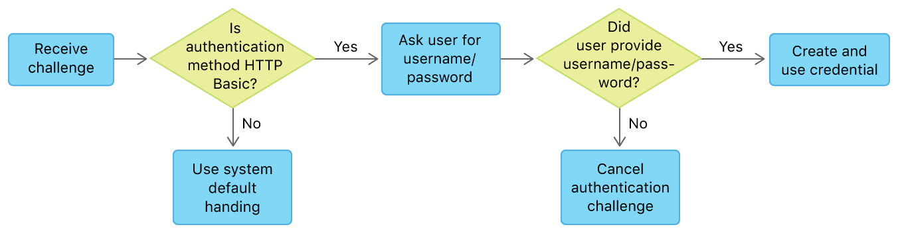

# Authentication and Credentials <!-- omit in toc -->

- [1. Diagram](#1-diagram)
- [2. Article: Handling an Authentication Challenge](#2-article-handling-an-authentication-challenge)
  - [2.1. Overview](#21-overview)
  - [2.2. Determine the Appropriate Delegate Method](#22-determine-the-appropriate-delegate-method)
  - [2.3. Determine the Type of Authentication Challenge](#23-determine-the-type-of-authentication-challenge)
  - [2.4. Create a Credential Instance](#24-create-a-credential-instance)
  - [2.5. Call the Completion Handler](#25-call-the-completion-handler)
  - [2.6. Handle Failures Gracefully](#26-handle-failures-gracefully)
- [3. URLSession.AuthChallengeDisposition](#3-urlsessionauthchallengedisposition)
  - [3.1. useCredential](#31-usecredential)
  - [3.2. performDefaultHandling](#32-performdefaulthandling)
  - [3.3. cancelAuthenticationChallenge](#33-cancelauthenticationchallenge)
  - [3.4. rejectProtectionSpace](#34-rejectprotectionspace)
- [4. URLAuthenticationChallenge](#4-urlauthenticationchallenge)
- [5. URLCredential](#5-urlcredential)
- [6. URLCredentialStorage](#6-urlcredentialstorage)
- [7. NSURLProtectionSpace](#7-nsurlprotectionspace)
  - [7.1. `authenticationMethod`: Authentication Method Constants](#71-authenticationmethod-authentication-method-constants)
    - [7.1.1. Session-Wide Authentication Challenges](#711-session-wide-authentication-challenges)
      - [7.1.1.1. NSURLAuthenticationMethodClientCertificate](#7111-nsurlauthenticationmethodclientcertificate)
      - [7.1.1.2. NSURLAuthenticationMethodServerTrust](#7112-nsurlauthenticationmethodservertrust)
      - [7.1.1.3. NSURLAuthenticationMethodNegotiate](#7113-nsurlauthenticationmethodnegotiate)
      - [7.1.1.4. NSURLAuthenticationMethodNTLM](#7114-nsurlauthenticationmethodntlm)
    - [7.1.2. Task-Specific Authentication Challenges](#712-task-specific-authentication-challenges)
      - [7.1.2.1. NSURLAuthenticationMethodDefault](#7121-nsurlauthenticationmethoddefault)
      - [7.1.2.2. NSURLAuthenticationMethodHTTPBasic](#7122-nsurlauthenticationmethodhttpbasic)
      - [7.1.2.3. NSURLAuthenticationMethodHTTPDigest](#7123-nsurlauthenticationmethodhttpdigest)
      - [7.1.2.4. NSURLAuthenticationMethodHTMLForm](#7124-nsurlauthenticationmethodhtmlform)
  - [7.2. NSURLProtectionSpace Protocol Types](#72-nsurlprotectionspace-protocol-types)
    - [7.2.1. NSURLProtectionSpaceHTTP](#721-nsurlprotectionspacehttp)
    - [7.2.2. NSURLProtectionSpaceHTTPS](#722-nsurlprotectionspacehttps)
    - [7.2.3. NSURLProtectionSpaceFTP](#723-nsurlprotectionspaceftp)
  - [7.3. NSURLProtectionSpace Proxy Types](#73-nsurlprotectionspace-proxy-types)
    - [7.3.1. NSURLProtectionSpaceHTTPProxy](#731-nsurlprotectionspacehttpproxy)
    - [7.3.2. NSURLProtectionSpaceHTTPSProxy](#732-nsurlprotectionspacehttpsproxy)
    - [7.3.3. NSURLProtectionSpaceFTPProxy](#733-nsurlprotectionspaceftpproxy)
    - [7.3.4. NSURLProtectionSpaceSOCKSProxy](#734-nsurlprotectionspacesocksproxy)
- [8. FAQ](#8-faq)
  - [8.1. What's `realm` in Authentication?](#81-whats-realm-in-authentication)
  - [8.2. What's `distinguishedNames` ?](#82-whats-distinguishednames-)
  - [8.3. How to use `proposedCredential` of `URLAuthenticationChallenge`](#83-how-to-use-proposedcredential-of-urlauthenticationchallenge)
- [9. Reference](#9-reference)

## 1. Diagram


## 2. Article: Handling an Authentication Challenge

> Respond appropriately when a server demands authentication for a URL request.

### 2.1. Overview

When your app makes a request with a `URLSessionTask`, the server may respond with one or more demands for credentials before continuing. *The session task attempts to handle this for you. If it can’t, it calls your session’s `delegate` to handle the challenges.*

Implement the delegate methods described in this article to answer challenges issued by a server that your app connects to. If you don’t implement a delegate, your request may be denied by the server, and you receive a response with HTTP status code **401 (Forbidden)** instead of the data you expect.

### 2.2. Determine the Appropriate Delegate Method

Implement one or both delegate authentication methods, depending on the nature of the challenge(s) you receive.

- Implement the `urlSession(_:didReceive:completionHandler:)` method of `URLSessionDelegate` to handle **session-wide** challenges. These are challenges like **Transport Layer Security (TLS)** validation. Once you’ve successfully handled this kind of challenge, your action remains in effect for all tasks created from that `URLSession`.
- Implement the `urlSession(_:task:didReceive:completionHandler:)` method of `URLSessionTaskDelegate` to handle **task-specific** challenges. These are challenges like demands for **username/password** authentication. *Each task created from a given session may issue its own challenges.*

**Note**: See [NSURLProtectionSpace Authentication Method Constants](https://developer.apple.com/documentation/foundation/urlprotectionspace/nsurlprotectionspace_authentication_method_constants) for a guide to which authentication methods are session-wide or task-specific.

Strategy for responding to the HTTP Basic challenge:



The following sections implement this strategy.

### 2.3. Determine the Type of Authentication Challenge

When you receive an authentication challenge, use your delegate method to determine the type of challenge. The delegate method receives a `URLAuthenticationChallenge` instance that describes the challenge being issued. This instance contains a `protectionSpace` property whose `authenticationMethod` property indicates the kind of challenge being issued (such as a request for a **username and password**, or a **client certificate**). You use this value to determine whether you can handle the challenge.

You respond to the challenge by directly invoking the *completion handler* passed in to the challenge, passing an `URLSession.AuthChallengeDisposition` indicating your response to the challenge. You use the `disposition` argument to provide a credential, cancel the request, or allow the default handling to proceed, whichever is appropriate.

**Listing 1** tests the authentication method to see if it is the expected type, HTTP Basic. If the authenticationMethod property indicates some other kind of challenge, it calls the completion handler with the `URLSession.AuthChallengeDisposition.performDefaultHandling` disposition. Telling the task to use its default handling may satisfy the challenge; otherwise, the task will move on to the next challenge in the response and call this delegate again. This process continues until the task reaches the HTTP Basic challenge that you expect to handle.

**Listing 1** Checking the authentication method of an authentication challenge:

```swift
let authMethod = challenge.protectionSpace.authenticationMethod
guard authMethod == NSURLAuthenticationMethodHTTPBasic else {
    completionHandler(.performDefaultHandling, nil)
    return
}
```

### 2.4. Create a Credential Instance

To successfully answer the challenge, you need to submit a credential appropriate to type of challenge you have received. For *HTTP Basic* and *HTTP Digest* challenges, you provide a username and password.

**Listing 2** shows a helper method that attempts to create a `URLCredential` instance from user-interface fields, if they are filled in.

**Listing 2** Creating a URLCredential from user interface values:

```swift
func credentialsFromUI() -> URLCredential? {
    guard let username = usernameField.text, !username.isEmpty,
        let password = passwordField.text, !password.isEmpty else {
            return nil
    }
    return URLCredential(user: username, password: password,
                         persistence: .forSession)
}

```

### 2.5. Call the Completion Handler

Once you’ve tried to create a credential instance, you must call the completion handler to answer the challenge.

- If you can’t create a credential, or if the user explicitly canceled, call the completion handler and pass the `URLSession.AuthChallengeDisposition.cancelAuthenticationChallenge` disposition.
- If you can create a credential instance, use the `URLSession.AuthChallengeDisposition.useCredential` disposition to pass it to the completion handler.

**Listing 3** Invoking the authentication challenge completion Handler:

```swift
guard let credential = credentialOrNil else {
    completionHandler(.cancelAuthenticationChallenge, nil)
    return
}
completionHandler(.useCredential, credential)
```

**Important**: You can pass the completion handler to other methods or temporarily store it in a property, for situations like waiting for the user to complete a username/password dialog. But eventually you must call the completion handler to complete the challenge and allow the task to proceed, even if you’re choosing to cancel, as seen in the failure case of **Listing 3**.

### 2.6. Handle Failures Gracefully

If the credential is refused, the system calls your delegate method again. When this happens, the callback provides your rejected credential as the `proposedCredential` property of the `URLAuthenticationChallenge` parameter. The challenge instance also includes a `previousFailureCount` property, which indicates how many times the credential has been rejected. You can use these properties to determine what to do next. For example, if the `previousFailureCount` is greater than zero, you could use the user string of the `proposedCredential` to populate a user/password reentry UI.

## 3. URLSession.AuthChallengeDisposition

Constants passed by session or task delegates to the provided continuation block in response to an authentication challenge.

### 3.1. useCredential

Use the specified credential, which may be `nil`.

### 3.2. performDefaultHandling

Use the default handling for the challenge as though this delegate method were not implemented. *The provided `credential` parameter is ignored.*

(**Note**: `credential` means the parameter of the `completionHandler` in the delegate method)

### 3.3. cancelAuthenticationChallenge

Cancel the entire request. *The provided `credential` parameter is ignored.*

### 3.4. rejectProtectionSpace

Reject this challenge, and call the authentication delegate method again with the next authentication protection space. *The provided `credential` parameter is ignored.*

> **Note**: The `rejectProtectionSpace` disposition is only appropriate in fairly *unusual* situations.

## 4. URLAuthenticationChallenge

A challenge from a server requiring authentication from the client.

Your app receives authentication challenges in `URLSession` delegate methods, such as `urlSession(_:task:didReceive:completionHandler:)`. These objects provide the information you’ll need when deciding how to handle a server’s request for authentication.

At the core of that authentication challenge is a **protection space** that defines the type of authentication being requested, the host and port number, the networking protocol, and (where applicable) the authentication **realm** (*a group of related URLs on the same server that share a single set of credentials*).

## 5. URLCredential

An authentication credential consisting of information specific to the type of credential and the type of persistent storage to use, if any.

The *URL Loading System* supports:

- password-based user credentials
- certificate-based user credentials
- certificate-based server credentials

When you create a credential,

- you can specify it for a single request, persist it *temporarily* (until your app quits),
- or persist it *permanently*.
  - Permanent persistence can be local persistence in the keychain,
  - or synchronized persistence across the user's devices, based on their Apple ID.

**Note**:

- Permanent storage of credentials is only available for *password-based credentials*.
- TLS credentials are **never** stored permanently by `URLCredentialStorage`. In general, use *for-session persistence* for TLS credentials.

## 6. URLCredentialStorage

The shared cache stores and retrieves instances of `URLCredential`.

- You can store *password-based* credentials permanently, based on the `URLCredential.Persistence` they were created with.
- *Certificate-based* credentials are **never** stored permanently.

## 7. NSURLProtectionSpace

A server or an area on a server, commonly referred to as a **realm**, that requires authentication.

A protection space defines a series of matching constraints that determine which credential should be provided. For example, if a request provides your delegate with a `URLAuthenticationChallenge` object that requests a client *username and password*, your app should provide the correct *username and password* for the particular host, port, protocol, and realm, as specified in the challenge’s protection space.

### 7.1. `authenticationMethod`: Authentication Method Constants

Constants describing known values of the `authenticationMethod` property of a `URLProtectionSpace`.

#### 7.1.1. Session-Wide Authentication Challenges

> These constants indicate *session-wide challenges*. Delegates handle these challenges in the `URLSessionDelegate` method `urlSession(_:didReceive:completionHandler:)`.

##### 7.1.1.1. NSURLAuthenticationMethodClientCertificate

Use *client certificate authentication* for this protection space.

##### 7.1.1.2. NSURLAuthenticationMethodServerTrust

Perform *server trust authentication (certificate validation)* for this protection space.

This authentication method can apply to any protocol, and is most commonly used for overriding *SSL and TLS chain validation*.

To learn more, read [Overriding TLS Chain Validation Correctly](https://developer.apple.com/library/archive/documentation/NetworkingInternet/Conceptual/NetworkingTopics/Articles/OverridingSSLChainValidationCorrectly.html#//apple_ref/doc/uid/TP40012544).

##### 7.1.1.3. NSURLAuthenticationMethodNegotiate

Negotiate whether to use `Kerberos` or `NTLM` authentication for this protection space.

##### 7.1.1.4. NSURLAuthenticationMethodNTLM

Use NTLM authentication for this protection space.

#### 7.1.2. Task-Specific Authentication Challenges

> These constants indicate *task-specific challenges*. Delegates handle these challenges in the `URLSessionTaskDelegate` method `urlSession(_:task:didReceive:completionHandler:)`.

##### 7.1.2.1. NSURLAuthenticationMethodDefault

Use the default authentication method for a protocol.

##### 7.1.2.2. NSURLAuthenticationMethodHTTPBasic

Use HTTP basic authentication for this protection space.

##### 7.1.2.3. NSURLAuthenticationMethodHTTPDigest

Use HTTP digest authentication for this protection space.

##### 7.1.2.4. NSURLAuthenticationMethodHTMLForm

Use HTML form authentication for this protection space.

**Note**: The *URL loading system* **never** issues authentication challenges based on this authentication method. However, if your app authenticates by submitting a web form (or in some other protocol-neutral way), you can specify this protection space when you persist or look up credentials using the `URLCredentialStorage` class.

### 7.2. NSURLProtectionSpace Protocol Types

#### 7.2.1. NSURLProtectionSpaceHTTP

The protocol type for HTTP.

#### 7.2.2. NSURLProtectionSpaceHTTPS

The protocol type for HTTPS.

#### 7.2.3. NSURLProtectionSpaceFTP

The protocol type for FTP.

### 7.3. NSURLProtectionSpace Proxy Types

#### 7.3.1. NSURLProtectionSpaceHTTPProxy

The proxy type for HTTP proxies.

#### 7.3.2. NSURLProtectionSpaceHTTPSProxy

The proxy type for HTTPS proxies.

#### 7.3.3. NSURLProtectionSpaceFTPProxy

The proxy type for FTP proxies.

#### 7.3.4. NSURLProtectionSpaceSOCKSProxy

The proxy type for SOCKS proxies.

## 8. FAQ

### 8.1. What's `realm` in Authentication?

The realm is used to describe the protected area or to indicate the scope of protection.

Pages in the same realm should share credentials. If your credentials work for a page with the realm "My Realm", it should be assumed that the same *username and password* combination should work for another page with the same realm.

- [What is the "realm" in basic authentication](https://stackoverflow.com/a/12701105)
- [HTTP Headers: WWW-Authenticate](https://developer.mozilla.org/en-US/docs/Web/HTTP/Headers/WWW-Authenticate)
- [HTTP Authentication: WWW-Authenticate and Proxy-Authenticate headers](https://developer.mozilla.org/en-US/docs/Web/HTTP/Authentication#www-authenticate_and_proxy-authenticate_headers)

### 8.2. What's `distinguishedNames` ?

The acceptable **certificate-issuing authorities** for *client certificate authentication*.

This value is `nil` if the authentication method of the protection space is not *client certificate*. The returned issuing authorities are encoded with *Distinguished Encoding Rules (DER)*.

### 8.3. How to use `proposedCredential` of `URLAuthenticationChallenge`

This method returns `nil` if there is no default credential for this challenge.

- If you have previously attempted to authenticate and failed, this method returns the most recent failed credential.
- If the proposed credential is not `nil` and returns `true` when you call its `hasPassword` method, then the credential is ready to use as-is.
- If the proposed credential’s `hasPassword` method returns false, then the credential provides a default user name, and the client must prompt the user for a corresponding password.

## 9. Reference

- [Apple Doc: Handling an Authentication Challenge](https://developer.apple.com/documentation/foundation/url_loading_system/handling_an_authentication_challenge)
- [Mozilla Doc: HTTP authentication](https://developer.mozilla.org/en-US/docs/Web/HTTP/Authentication)
- [RFC 7235: HTTP/1.1 Authentication](https://datatracker.ietf.org/doc/html/rfc7235)
