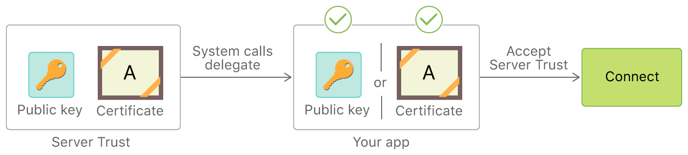
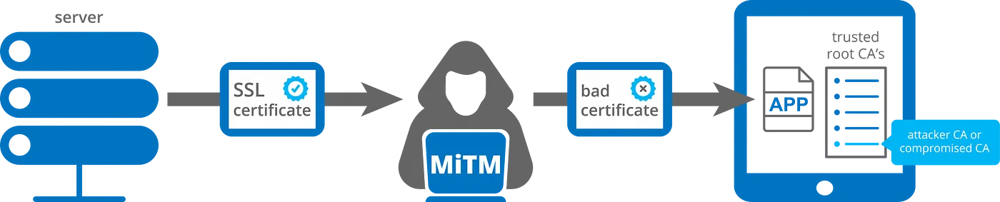

# Authentication and Credentials <!-- omit in toc -->

- [1. Diagram](#1-diagram)
- [2. Article: Handling an Authentication Challenge](#2-article-handling-an-authentication-challenge)
  - [2.1. Overview](#21-overview)
  - [2.2. Determine the Appropriate Delegate Method](#22-determine-the-appropriate-delegate-method)
  - [2.3. Determine the Type of Authentication Challenge](#23-determine-the-type-of-authentication-challenge)
  - [2.4. Create a Credential Instance](#24-create-a-credential-instance)
  - [2.5. Call the Completion Handler](#25-call-the-completion-handler)
  - [2.6. Handle Failures Gracefully](#26-handle-failures-gracefully)
- [3. Article: Performing Manual Server Trust Authentication](#3-article-performing-manual-server-trust-authentication)
  - [3.1. Determine When Manual Server Trust Evaluation Is Appropriate](#31-determine-when-manual-server-trust-evaluation-is-appropriate)
  - [3.2. Handle Server Trust Authentication Challenges](#32-handle-server-trust-authentication-challenges)
  - [3.3. Evaluate the Credential in the Challenge](#33-evaluate-the-credential-in-the-challenge)
  - [3.4. Create a Long-Term Server Authentication Strategy](#34-create-a-long-term-server-authentication-strategy)
- [4. URLSession.AuthChallengeDisposition](#4-urlsessionauthchallengedisposition)
  - [4.1. useCredential](#41-usecredential)
  - [4.2. performDefaultHandling](#42-performdefaulthandling)
  - [4.3. cancelAuthenticationChallenge](#43-cancelauthenticationchallenge)
  - [4.4. rejectProtectionSpace](#44-rejectprotectionspace)
- [5. URLAuthenticationChallenge](#5-urlauthenticationchallenge)
- [6. URLCredential](#6-urlcredential)
- [7. URLCredentialStorage](#7-urlcredentialstorage)
- [8. NSURLProtectionSpace](#8-nsurlprotectionspace)
  - [8.1. `authenticationMethod`: Authentication Method Constants](#81-authenticationmethod-authentication-method-constants)
    - [8.1.1. Session-Wide Authentication Challenges](#811-session-wide-authentication-challenges)
      - [8.1.1.1. NSURLAuthenticationMethodClientCertificate](#8111-nsurlauthenticationmethodclientcertificate)
      - [8.1.1.2. NSURLAuthenticationMethodServerTrust](#8112-nsurlauthenticationmethodservertrust)
      - [8.1.1.3. NSURLAuthenticationMethodNegotiate](#8113-nsurlauthenticationmethodnegotiate)
      - [8.1.1.4. NSURLAuthenticationMethodNTLM](#8114-nsurlauthenticationmethodntlm)
    - [8.1.2. Task-Specific Authentication Challenges](#812-task-specific-authentication-challenges)
      - [8.1.2.1. NSURLAuthenticationMethodDefault](#8121-nsurlauthenticationmethoddefault)
      - [8.1.2.2. NSURLAuthenticationMethodHTTPBasic](#8122-nsurlauthenticationmethodhttpbasic)
      - [8.1.2.3. NSURLAuthenticationMethodHTTPDigest](#8123-nsurlauthenticationmethodhttpdigest)
      - [8.1.2.4. NSURLAuthenticationMethodHTMLForm](#8124-nsurlauthenticationmethodhtmlform)
  - [8.2. NSURLProtectionSpace Protocol Types](#82-nsurlprotectionspace-protocol-types)
    - [8.2.1. NSURLProtectionSpaceHTTP](#821-nsurlprotectionspacehttp)
    - [8.2.2. NSURLProtectionSpaceHTTPS](#822-nsurlprotectionspacehttps)
    - [8.2.3. NSURLProtectionSpaceFTP](#823-nsurlprotectionspaceftp)
  - [8.3. NSURLProtectionSpace Proxy Types](#83-nsurlprotectionspace-proxy-types)
    - [8.3.1. NSURLProtectionSpaceHTTPProxy](#831-nsurlprotectionspacehttpproxy)
    - [8.3.2. NSURLProtectionSpaceHTTPSProxy](#832-nsurlprotectionspacehttpsproxy)
    - [8.3.3. NSURLProtectionSpaceFTPProxy](#833-nsurlprotectionspaceftpproxy)
    - [8.3.4. NSURLProtectionSpaceSOCKSProxy](#834-nsurlprotectionspacesocksproxy)
- [9. FAQ](#9-faq)
  - [9.1. What's `realm` in Authentication?](#91-whats-realm-in-authentication)
  - [9.2. What's `distinguishedNames` ?](#92-whats-distinguishednames-)
  - [9.3. How to use `proposedCredential` of `URLAuthenticationChallenge`](#93-how-to-use-proposedcredential-of-urlauthenticationchallenge)
  - [9.4. What does `.performDefaultHandling` means?](#94-what-does-performdefaulthandling-means)
  - [9.5. SSL Pinning](#95-ssl-pinning)
    - [9.5.1. What is SSL Pinning?](#951-what-is-ssl-pinning)
    - [9.5.2. Why Should I Use SSL Pinning?](#952-why-should-i-use-ssl-pinning)
    - [9.5.3. What types of SSL pinning methods are there?](#953-what-types-of-ssl-pinning-methods-are-there)
    - [9.5.4. What’s Difference Using The Root, Leaf and Intermediate Certificates In Pinning?](#954-whats-difference-using-the-root-leaf-and-intermediate-certificates-in-pinning)
    - [9.5.5. How should you embed the Certificate into App Bundle?](#955-how-should-you-embed-the-certificate-into-app-bundle)
    - [9.5.6. Is it possible to pin the certificate without embedding into the App Bundle?](#956-is-it-possible-to-pin-the-certificate-without-embedding-into-the-app-bundle)
    - [9.5.7. How to implement the SSL Pinning on iOS?](#957-how-to-implement-the-ssl-pinning-on-ios)
      - [9.5.7.1. Alamofire](#9571-alamofire)
      - [9.5.7.2. URLSession](#9572-urlsession)
- [10. Reference](#10-reference)

## 1. Diagram


## 2. Article: Handling an Authentication Challenge

> Respond appropriately when a server demands authentication for a URL request.

### 2.1. Overview

When your app makes a request with a `URLSessionTask`, the server may respond with one or more demands for credentials before continuing. *The session task attempts to handle this for you. If it can’t, it calls your session’s `delegate` to handle the challenges.*

Implement the delegate methods described in this article to answer challenges issued by a server that your app connects to. If you don’t implement a delegate, your request may be denied by the server, and you receive a response with HTTP status code **401 (Forbidden)** instead of the data you expect.

### 2.2. Determine the Appropriate Delegate Method

Implement one or both delegate authentication methods, depending on the nature of the challenge(s) you receive.

- Implement the `urlSession(_:didReceive:completionHandler:)` method of `URLSessionDelegate` to handle **session-wide** challenges. These are challenges like **Transport Layer Security (TLS)** validation. Once you’ve successfully handled this kind of challenge, your action remains in effect for all tasks created from that `URLSession`.
- Implement the `urlSession(_:task:didReceive:completionHandler:)` method of `URLSessionTaskDelegate` to handle **task-specific** challenges. These are challenges like demands for **username/password** authentication. *Each task created from a given session may issue its own challenges.*

**Note**: See [NSURLProtectionSpace Authentication Method Constants](https://developer.apple.com/documentation/foundation/urlprotectionspace/nsurlprotectionspace_authentication_method_constants) for a guide to which authentication methods are session-wide or task-specific.

Strategy for responding to the HTTP Basic challenge:


The following sections implement this strategy.

### 2.3. Determine the Type of Authentication Challenge

When you receive an authentication challenge, use your delegate method to determine the type of challenge. The delegate method receives a `URLAuthenticationChallenge` instance that describes the challenge being issued. This instance contains a `protectionSpace` property whose `authenticationMethod` property indicates the kind of challenge being issued (such as a request for a **username and password**, or a **client certificate**). You use this value to determine whether you can handle the challenge.

You respond to the challenge by directly invoking the *completion handler* passed in to the challenge, passing an `URLSession.AuthChallengeDisposition` indicating your response to the challenge. You use the `disposition` argument to provide a credential, cancel the request, or allow the default handling to proceed, whichever is appropriate.

**Listing 1** tests the authentication method to see if it is the expected type, HTTP Basic. If the authenticationMethod property indicates some other kind of challenge, it calls the completion handler with the `URLSession.AuthChallengeDisposition.performDefaultHandling` disposition. Telling the task to use its default handling may satisfy the challenge; otherwise, the task will move on to the next challenge in the response and call this delegate again. This process continues until the task reaches the HTTP Basic challenge that you expect to handle.

**Listing 1** Checking the authentication method of an authentication challenge:

```swift
let authMethod = challenge.protectionSpace.authenticationMethod
guard authMethod == NSURLAuthenticationMethodHTTPBasic else {
    completionHandler(.performDefaultHandling, nil)
    return
}
```

### 2.4. Create a Credential Instance

To successfully answer the challenge, you need to submit a credential appropriate to type of challenge you have received. For *HTTP Basic* and *HTTP Digest* challenges, you provide a username and password.

**Listing 2** shows a helper method that attempts to create a `URLCredential` instance from user-interface fields, if they are filled in.

**Listing 2** Creating a URLCredential from user interface values:

```swift
func credentialsFromUI() -> URLCredential? {
    guard let username = usernameField.text, !username.isEmpty,
        let password = passwordField.text, !password.isEmpty else {
            return nil
    }
    return URLCredential(user: username, password: password,
                         persistence: .forSession)
}

```

### 2.5. Call the Completion Handler

Once you’ve tried to create a credential instance, you must call the completion handler to answer the challenge.

- If you can’t create a credential, or if the user explicitly canceled, call the completion handler and pass the `URLSession.AuthChallengeDisposition.cancelAuthenticationChallenge` disposition.
- If you can create a credential instance, use the `URLSession.AuthChallengeDisposition.useCredential` disposition to pass it to the completion handler.

**Listing 3** Invoking the authentication challenge completion Handler:

```swift
guard let credential = credentialOrNil else {
    completionHandler(.cancelAuthenticationChallenge, nil)
    return
}
completionHandler(.useCredential, credential)
```

**Important**: You can pass the completion handler to other methods or temporarily store it in a property, for situations like waiting for the user to complete a username/password dialog. But eventually you must call the completion handler to complete the challenge and allow the task to proceed, even if you’re choosing to cancel, as seen in the failure case of **Listing 3**.

### 2.6. Handle Failures Gracefully

If the credential is refused, the system calls your delegate method again. When this happens, the callback provides your rejected credential as the `proposedCredential` property of the `URLAuthenticationChallenge` parameter. The challenge instance also includes a `previousFailureCount` property, which indicates how many times the credential has been rejected. You can use these properties to determine what to do next. For example, if the `previousFailureCount` is greater than zero, you could use the user string of the `proposedCredential` to populate a user/password reentry UI.

## 3. Article: Performing Manual Server Trust Authentication

> Evaluate the server’s security credentials in your app.

When you use a secure connection (such as https) with a URL request, your `URLSessionDelegate` receives an authentication challenge with an authentication type of `NSURLAuthenticationMethodServerTrust`. Unlike other challenges where the server is asking your app to authenticate itself, **this is an opportunity for you to authenticate the server’s credentials**.

### 3.1. Determine When Manual Server Trust Evaluation Is Appropriate

In most cases, you should let the *URL Loading System*’s default handling evaluate the server trust. You get this behavior when you either don’t have a delegate or don’t handle authentication challenges. However, performing your own evaluation may be useful for scenarios like the following:

- You want to accept server credentials that would otherwise be rejected by the system. For example, your app makes a secure connection to a development server that uses a **self-signed certificate**, which would ordinarily not match anything in the system’s trust store.
- You want to reject credentials that would otherwise be accepted by the system. For example, you want to “pin” your app to a set of specific keys or certificates under your control, rather than accept any valid credential.

Figure 1 illustrates how an app performs manual credential evaluation by providing a delegate method to handle the authentication challenge. This bypasses the default handling. Instead, **the delegate directly compares the server certificate or its public key against a copy of the certificate or key (or a hash of either of these) stored in the app bundle itself**. If the delegate decides the server credential is valid, it accepts the server trust and allows the connection to continue.

**Figure 1**: **Manually evaluating server trust against credentials stored in the app bundle**



### 3.2. Handle Server Trust Authentication Challenges

To perform manual server trust authentication, implement the `URLSessionDelegate` method `urlSession(_:didReceive:completionHandler:)`. When this method is called, the first things your implementation needs to do are to check that:

- The challenge type is *server trust*, and not some other kind of challenge.
- The challenge’s *host name* matches the host that you want to perform manual credential evaluation for.

**Listing 1** shows how to test these conditions, given the `challenge` parameter passed to the `urlSession(_:didReceive:completionHandler:)` callback. It gets the challenge's `protectionSpace` and uses it to perform the two checks listed above.

- First, it gets the `authenticationMethod` from the *protection space* and checks that the type of authentication is `NSURLAuthenticationMethodServerTrust`.
- Then it makes sure the protection space’s host matches the expected name `example.com`.

If either of these conditions are not met, it calls the `completionHandler` with the `URLSession.AuthChallengeDisposition.performDefaultHandling` disposition to allow the system to handle the challenge.

**Listing 1** Testing the challenge type and host name of a server trust authentication challenge.

```swift
let protectionSpace = challenge.protectionSpace
guard protectionSpace.authenticationMethod ==
    NSURLAuthenticationMethodServerTrust,
    protectionSpace.host.contains("example.com") else {
        completionHandler(.performDefaultHandling, nil)
        return
}
```

### 3.3. Evaluate the Credential in the Challenge

To access the server’s credential, get the `serverTrust` property (an instance of the `SecTrust` class) from the *protection space*.

**Listing 2** shows how to access the server trust and accept or reject it. The listing starts by attempting to get the `serverTrust` property from the *protection space*, and falls back to default handling if the property is `nil`. Next, it passes the server trust to a `private` helper method `checkValidity(of:)` that compares the *certificate* or *public key* in the server trust to known-good values stored in the **app bundle**.

**Listing 2** Evaluating credentials in a server trust instance.

```swift
guard let serverTrust = protectionSpace.serverTrust else {
    completionHandler(.performDefaultHandling, nil)
    return
}
if checkValidity(of: serverTrust) {
    let credential = URLCredential(trust: serverTrust)
    completionHandler(.useCredential, credential)
} else {
    // Show a UI here warning the user the server credentials are
    // invalid, and cancel the load.
    completionHandler(.cancelAuthenticationChallenge, nil)
}
```

Once the code determines the validity of the server trust, it takes one of two actions:

- If the server trust’s credential is *valid*, create a new `URLCredential` instance from the server trust. Then call the `completionHandler` with the `URLSession.AuthChallengeDisposition.useCredential` disposition, passing in the newly-created credential. This tells the system to accept the server’s credentials.
- If the challenge’s credential is *invalid*, call the `completionHandler` with the `URLSession.AuthChallengeDisposition.cancelAuthenticationChallenge` disposition. This tells the system to reject the server’s credentials.

**Tip**: See [Certificate, Key, and Trust Services](https://developer.apple.com/documentation/security/certificate_key_and_trust_services) to learn more about how to evaluate a SecTrust instance or access certificates or public keys from it.

### 3.4. Create a Long-Term Server Authentication Strategy

If you determine that you need to evaluate server trust manually in some or all cases, plan for what your app will do if you need to change your server credentials. Keep the following guidelines in mind:

- **Compare the server’s credentials against a public key, instead of storing a single certificate in your app bundle. This will allow you to reissue a certificate for the same key and update the server, rather than needing to update the app.**
- Compare the issuing certificate authority’s (CA’s) keys, rather than using the leaf key. This way, you can deploy certificates containing new keys signed by the same CA.
- Use a set of keys or CAs, so you can rotate(轮换) server credentials more gracefully.

## 4. URLSession.AuthChallengeDisposition

Constants passed by session or task delegates to the provided continuation block in response to an authentication challenge.

### 4.1. useCredential

Use the specified credential, which may be `nil`.

### 4.2. performDefaultHandling

Use the default handling for the challenge as though this delegate method were not implemented. *The provided `credential` parameter is ignored.*

(**Note**: `credential` means the parameter of the `completionHandler` in the delegate method)

### 4.3. cancelAuthenticationChallenge

Cancel the entire request. *The provided `credential` parameter is ignored.*

### 4.4. rejectProtectionSpace

Reject this challenge, and call the authentication delegate method again with the next authentication protection space. *The provided `credential` parameter is ignored.*

> **Note**: The `rejectProtectionSpace` disposition is only appropriate in fairly *unusual* situations.

## 5. URLAuthenticationChallenge

A challenge from a server requiring authentication from the client.

Your app receives authentication challenges in `URLSession` delegate methods, such as `urlSession(_:task:didReceive:completionHandler:)`. These objects provide the information you’ll need when deciding how to handle a server’s request for authentication.

At the core of that authentication challenge is a **protection space** that defines the type of authentication being requested, the host and port number, the networking protocol, and (where applicable) the authentication **realm** (*a group of related URLs on the same server that share a single set of credentials*).

## 6. URLCredential

An authentication credential consisting of information specific to the type of credential and the type of persistent storage to use, if any.

The *URL Loading System* supports:

- password-based user credentials
- certificate-based user credentials
- certificate-based server credentials

When you create a credential,

- you can specify it for a single request, persist it *temporarily* (until your app quits),
- or persist it *permanently*.
  - Permanent persistence can be local persistence in the keychain,
  - or synchronized persistence across the user's devices, based on their Apple ID.

**Note**:

- Permanent storage of credentials is only available for *password-based credentials*.
- TLS credentials are **never** stored permanently by `URLCredentialStorage`. In general, use *for-session persistence* for TLS credentials.

## 7. URLCredentialStorage

The shared cache stores and retrieves instances of `URLCredential`.

- You can store *password-based* credentials permanently, based on the `URLCredential.Persistence` they were created with.
- *Certificate-based* credentials are **never** stored permanently.

## 8. NSURLProtectionSpace

A server or an area on a server, commonly referred to as a **realm**, that requires authentication.

A protection space defines a series of matching constraints that determine which credential should be provided. For example, if a request provides your delegate with a `URLAuthenticationChallenge` object that requests a client *username and password*, your app should provide the correct *username and password* for the particular host, port, protocol, and realm, as specified in the challenge’s protection space.

### 8.1. `authenticationMethod`: Authentication Method Constants

Constants describing known values of the `authenticationMethod` property of a `URLProtectionSpace`.

#### 8.1.1. Session-Wide Authentication Challenges

> These constants indicate *session-wide challenges*. Delegates handle these challenges in the `URLSessionDelegate` method `urlSession(_:didReceive:completionHandler:)`.

##### 8.1.1.1. NSURLAuthenticationMethodClientCertificate

Use *client certificate authentication* for this protection space.

##### 8.1.1.2. NSURLAuthenticationMethodServerTrust

Perform *server trust authentication (certificate validation)* for this protection space.

This authentication method can apply to any protocol, and is most commonly used for overriding *SSL and TLS chain validation*.

To learn more, read [Overriding TLS Chain Validation Correctly](https://developer.apple.com/library/archive/documentation/NetworkingInternet/Conceptual/NetworkingTopics/Articles/OverridingSSLChainValidationCorrectly.html#//apple_ref/doc/uid/TP40012544).

##### 8.1.1.3. NSURLAuthenticationMethodNegotiate

Negotiate whether to use `Kerberos` or `NTLM` authentication for this protection space.

##### 8.1.1.4. NSURLAuthenticationMethodNTLM

Use NTLM authentication for this protection space.

#### 8.1.2. Task-Specific Authentication Challenges

> These constants indicate *task-specific challenges*. Delegates handle these challenges in the `URLSessionTaskDelegate` method `urlSession(_:task:didReceive:completionHandler:)`.

##### 8.1.2.1. NSURLAuthenticationMethodDefault

Use the default authentication method for a protocol.

##### 8.1.2.2. NSURLAuthenticationMethodHTTPBasic

Use HTTP basic authentication for this protection space.

##### 8.1.2.3. NSURLAuthenticationMethodHTTPDigest

Use HTTP digest authentication for this protection space.

##### 8.1.2.4. NSURLAuthenticationMethodHTMLForm

Use HTML form authentication for this protection space.

**Note**: The *URL loading system* **never** issues authentication challenges based on this authentication method. However, if your app authenticates by submitting a web form (or in some other protocol-neutral way), you can specify this protection space when you persist or look up credentials using the `URLCredentialStorage` class.

### 8.2. NSURLProtectionSpace Protocol Types

#### 8.2.1. NSURLProtectionSpaceHTTP

The protocol type for HTTP.

#### 8.2.2. NSURLProtectionSpaceHTTPS

The protocol type for HTTPS.

#### 8.2.3. NSURLProtectionSpaceFTP

The protocol type for FTP.

### 8.3. NSURLProtectionSpace Proxy Types

#### 8.3.1. NSURLProtectionSpaceHTTPProxy

The proxy type for HTTP proxies.

#### 8.3.2. NSURLProtectionSpaceHTTPSProxy

The proxy type for HTTPS proxies.

#### 8.3.3. NSURLProtectionSpaceFTPProxy

The proxy type for FTP proxies.

#### 8.3.4. NSURLProtectionSpaceSOCKSProxy

The proxy type for SOCKS proxies.

## 9. FAQ

### 9.1. What's `realm` in Authentication?

The realm is used to describe the protected area or to indicate the scope of protection.

Pages in the same realm should share credentials. If your credentials work for a page with the realm "My Realm", it should be assumed that the same *username and password* combination should work for another page with the same realm.

- [What is the "realm" in basic authentication](https://stackoverflow.com/a/12701105)
- [HTTP Headers: WWW-Authenticate](https://developer.mozilla.org/en-US/docs/Web/HTTP/Headers/WWW-Authenticate)
- [HTTP Authentication: WWW-Authenticate and Proxy-Authenticate headers](https://developer.mozilla.org/en-US/docs/Web/HTTP/Authentication#www-authenticate_and_proxy-authenticate_headers)

### 9.2. What's `distinguishedNames` ?

The acceptable **certificate-issuing authorities** for *client certificate authentication*.

This value is `nil` if the authentication method of the protection space is not *client certificate*. The returned issuing authorities are encoded with *Distinguished Encoding Rules (DER)*.

### 9.3. How to use `proposedCredential` of `URLAuthenticationChallenge`

This method returns `nil` if there is no default credential for this challenge.

- If you have previously attempted to authenticate and failed, this method returns the most recent failed credential.
- If the proposed credential is not `nil` and returns `true` when you call its `hasPassword` method, then the credential is ready to use as-is.
- If the proposed credential’s `hasPassword` method returns false, then the credential provides a default user name, and the client must prompt the user for a corresponding password.

### 9.4. What does `.performDefaultHandling` means?

???

### 9.5. SSL Pinning

> Reference: [medium: Securing iOS Applications with SSL Pinning](https://medium.com/trendyol-tech/securing-ios-applications-with-ssl-pinning-38d551945306)

#### 9.5.1. What is SSL Pinning?

`SSL Pinning`(Secure Socket Layer Pinning) is the process of associating a *host* with its **certificate** or **public key**.

#### 9.5.2. Why Should I Use SSL Pinning?

Using Secure Socket Layer (SSL) Pinning allows you to protect your apps against the many types of Man-in-the-middle (MITM) attacks and interception of its network traffic.



#### 9.5.3. What types of SSL pinning methods are there?

1. **Embedding the Certificate**: You can extract the server’s *certificate* and embed into your *app bundle*. The network layer compares the server’s certificate with embedded certificate.
2. **Embedding the Public Key**: You can extract the *certificate’s public key* and *define into your code or place into the app bundle*. The network layer compares the servers certificates’ public key with embedded one.

#### 9.5.4. What’s Difference Using The Root, Leaf and Intermediate Certificates In Pinning?

- **Leaf Certificate**: If the certificate becomes invalid because of expiration or a compromising, the application will be broken until you update SSL certificate.
- **Intermediate Certificate**: As long as your certificate provider is the same, any changes to the leaf certificate will not require an update in your application.
- **Root Certificate**: The root certificate comes from the trusted certificate authority. Pinning the root certificate puts trust in the root cert authority, as well as all intermediaries that the root cert authority trusts.

**Note**: The all mentioned types can be pinned on your application. But, only pinning the root certificate puts your application in the risk because of its scope.

#### 9.5.5. How should you embed the Certificate into App Bundle?

First, the certificate file must be encoded before the embed into the app bundle. You can ensure whether the file is encoded by opening your certificate file with a text editor. *If you see similar content like Base64 output, it means the content of the certificate must be encoded.*

You can encode the certificate with proper format by importing the existing certificate file into the keychain and extracting back. The given output will be encoded as default.
If you do not have any certificate file to the embed into app bundle. You can retrieve the certificate with ready to use format by running the command below.

```base
openssl s_client -connect <hostname>:443 </dev/null \
 | openssl x509 -outform DER -out <certificatename>.der
```

#### 9.5.6. Is it possible to pin the certificate without embedding into the App Bundle?

The extracting the bundle files from the IPA is quite easy. If you have concerns to put the certificate into there, you may avoid this.

You can place the Base64 format of the certificate into your codebase and convert into the `SecCertificate` during the runtime. The Base64 format of the certificate can be obtained by running the following command below.

```base
base64 <certificatename>.der
```

#### 9.5.7. How to implement the SSL Pinning on iOS?

There are two common approach in that matter:

##### 9.5.7.1. Alamofire

If you use Alamofire which is the most popular network library in iOS, that allows you to pin the *certificate* or *public keys* by using the provided default trust evaluators with ease. (`PinnedCertificatesTrustEvaluator` & `PublicKeysTrustEvaluator`)

`PinnedCertificatesTrustEvaluator` expects `certificates` as parameter to initialize the evaluator. It is provided by Alamofire as default. If you want to specify by yourself, you may override the provided default value with your own `SecCertificate` array.

All you need is to set up the `Session` instance by using a `ServerTrustManager` with provided trust evaluators.

```swift
import Alamofire

final class SampleNetworkManager {
    private let session: Session
    
    init() {
        let evaluators: [String: ServerTrustEvaluating] = [
            "api.trendy.com": PinnedCertificatesTrustEvaluator(validateHost: true)
        ]
        
        let serverTrustManager = ServerTrustManager(evaluators: evaluators)
        self.session = Session(serverTrustManager: serverTrustManager)
    }
}
```

##### 9.5.7.2. URLSession

You can use the Apple API’s to pin the certificate or public keys through the `URLSession`.

As you know, Apple is providing the `URLSession` which enables us to perform network tasks. To achieve the same outcome via Apple API’s, you should initiate an `URLSession` instance with proper `configuration` and manage the SSL handshake process through the `URLSessionDelegate`.

```swift
import Foundation

final class SampleNetworkManager: NSObject {
    private lazy var certificates: [Data] = {
        let url = Bundle.main.url(forResource: "ty", withExtension: "der")!
        let data = try! Data(contentsOf: url)
        return [data]
    }()
    
    private var session: URLSession!
    
    override init() {
        super.init()
        session = URLSession(configuration: .default, delegate: self, delegateQueue: nil)
    }
}

// MARK: - URLSessionDelegate
extension SampleNetworkManager: URLSessionDelegate {
    func urlSession(_ session: URLSession, didReceive challenge: URLAuthenticationChallenge, completionHandler: @escaping (URLSession.AuthChallengeDisposition, URLCredential?) -> Void) {
        if let trust = challenge.protectionSpace.serverTrust, SecTrustGetCertificateCount(trust) > 0 {
            if let certificate = SecTrustGetCertificateAtIndex(trust, 0) {
                let data = SecCertificateCopyData(certificate) as Data
                if certificates.contains(data) {
                    completionHandler(.useCredential, URLCredential(trust: trust))
                    return
                }
            }
        }
        completionHandler(.cancelAuthenticationChallenge, nil)
    }
}
```

Furthermore, the host validation mechanism can be added by accessing through the `challenge.protectionSpace.host` in the same block to enhance the security too. You may pin the several certificates and map these certificates with any host.

## 10. Reference

- [Apple Docs: Handling an Authentication Challenge](https://developer.apple.com/documentation/foundation/url_loading_system/handling_an_authentication_challenge)
- [Apple News: Identity Pinning: How to configure server certificates for your app](https://developer.apple.com/news/?id=g9ejcf8y)
- [Mozilla Doc: HTTP authentication](https://developer.mozilla.org/en-US/docs/Web/HTTP/Authentication)
- [RFC 7235: HTTP/1.1 Authentication](https://datatracker.ietf.org/doc/html/rfc7235)
