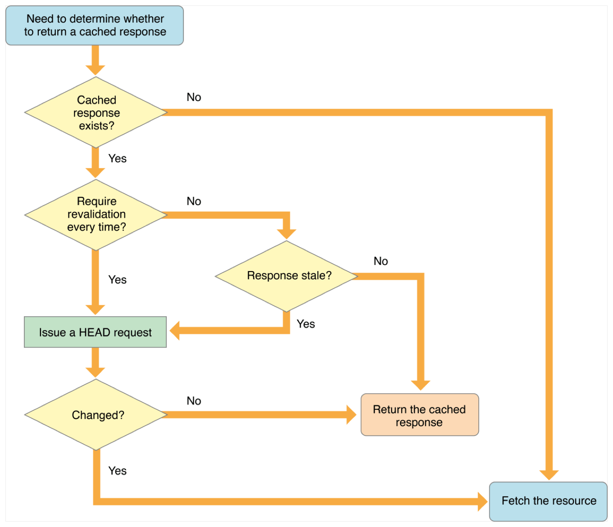

# URLSession

## Introduction

`NSURLSession` instances are **thread-safe**.

The default `NSURLSession` uses a system provided `delegate`.

An `NSURLSession` creates `NSURLSessionTask` objects which represent the
action of a resource being loaded.

`NSURLSessionTask` objects are always created in a **suspended** state and must be sent the `resume()` message before they will execute.

Subclasses of `NSURLSessionTask` are used to syntactically differentiate between *data* and *file downloads*.

- An `NSURLSessionDataTask` receives the resource as a series of calls to the `URLSession:dataTask:didReceiveData:` delegate method. This is type of task most commonly associated with retrieving objects for immediate parsing by the consumer.
- An `NSURLSessionUploadTask` differs from an `NSURLSessionDataTask` in how its instance is constructed. Upload tasks are explicitly created by **referencing** a *file* or *data object* to upload, or by utilizing the `URLSession:task:needNewBodyStream:` delegate message to supply an upload body.
- An `NSURLSessionDownloadTask` will directly write the response data to a **temporary** file. When completed, the `delegate` is sent `URLSession:downloadTask:didFinishDownloadingToURL:` and given an opportunity to move this file to a **permanent** location in its sandboxed container, or to otherwise read the file. If canceled, an `NSURLSessionDownloadTask` can produce a data blob that can be used to `resume` a download at a later time.

Beginning with *iOS 9* and *Mac OS X 10.11*, `NSURLSessionStream` is available as a task type.  This allows for **direct TCP/IP connection** to a given host and port with optional secure handshaking and navigation of proxies. *Data tasks* may also be **upgraded** to a `NSURLSessionStream` task via the HTTP `Upgrade:` header and appropriate use of the pipelining option of `NSURLSessionConfiguration`.  See *RFC 2817* and *RFC 6455* for information about the `Upgrade:` header, and comments below on turning data tasks into stream tasks.

An `NSURLSessionWebSocketTask` is a task that allows clients to connect to servers supporting *WebSocket*. The task will perform the HTTP handshake to **upgrade** the connection and once the WebSocket handshake is successful, the client can read and write messages that will be framed using the WebSocket protocol by the framework.

- *DataTask objects* receive the payload through **zero** or **more** delegate messages;
- *UploadTask objects* receive **periodic** progress updates but do *not* return a body;
- *DownloadTask objects* represent an active download to disk. They can provide *resume data* when canceled;
- *StreamTask objects* may be used to create `NSInput` and `NSOutputStreams`, or used directly in reading and writing;
- *WebSocket objects* perform a WebSocket handshake with the server and can be used to send and receive WebSocket messages.

## NSURLRequest.CachePolicy

Use the caching logic defined in the **protocol implementation**, if any, for a particular URL load request.

### useProtocolCachePolicy

This is the *default* policy for URL load requests.

For the HTTP and HTTPS protocols, `NSURLRequest.CachePolicy.useProtocolCachePolicy` performs the following behavior:

1. If a cached response does *not* exist for the request, the *URL loading system* fetches the data from the originating source.
2. Otherwise, if the cached response does not indicate that it must be revalidated every time, and if the cached response is not stale (past its expiration date), the *URL loading system* returns the cached response.
3. If the cached response is stale or requires revalidation, the *URL loading system* makes a `HEAD` request to the originating source to see if the resource has changed. If so, the *URL loading system* fetches the data from the originating source. Otherwise, it returns the cached response.

