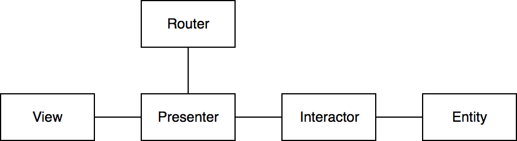
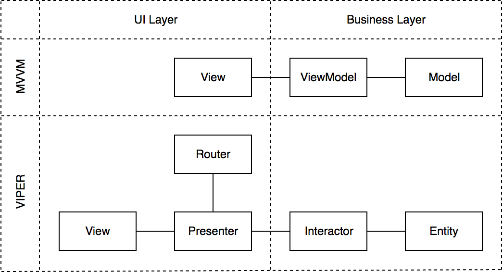

# Blurring the Lines Between MVVM and VIPER

> Digest from [Blurring the Lines Between MVVM and VIPER](https://medium.com/developermind/blurring-the-lines-between-mvvm-and-viper-dcb3dc9815ac)
> Author: [Göksel Köksal](https://medium.com/@gokselkoksal)

- [Blurring the Lines Between MVVM and VIPER](#blurring-the-lines-between-mvvm-and-viper)
  - [What is MVVM?](#what-is-mvvm)
  - [What is VIPER?](#what-is-viper)
  - [What’s our main goal?](#whats-our-main-goal)
  - [An Imaginary App: Top Movies](#an-imaginary-app-top-movies)
  - [An Imaginary Case: Implementing macOS Version](#an-imaginary-case-implementing-macos-version)
  - [An Imaginary Case: iOS Redesign](#an-imaginary-case-ios-redesign)
  - [Moral of the Story](#moral-of-the-story)

If you have been developing mobile apps for a while, you’ve probably heard of MVVM and VIPER. While some people say MVVM does not scale well, some others say VIPER is an overkill. I am here to explain why I think they are very similar and we don’t even need to separate the two.

Let’s first quickly go over MVVM and VIPER.

## What is MVVM?


- **View** delivers user actions to **view model**.
- **View model** handles these actions and updates its state.
- **View model** then notifies the **view**, either with data binding or manually using delegation or blocks.

## What is VIPER?



- **View** delivers user actions to **presenter**.
- **Presenter** then delivers these actions to either **interactor** or **router**.
- If the action requires computation, **interactor** handles it and returns the state to the **presenter**.
- **Presenter** then transforms this state to presentation data and updates the **view**.
- Navigation logic is encapsulated in **router** and **presenter** is responsible from triggering it.

> For more information on these architectures, reference this great post by *Bohdan Orlov*: [iOS Architecture Patterns](https://medium.com/ios-os-x-development/ios-architecture-patterns-ecba4c38de52)

## What’s our main goal?

Our first goal is to separate UI and business logic. Therefore, we can easily update UI without breaking any business rules and also test business logic in isolation. Both MVVM and VIPER assures this, but in different ways. If we look from this point of view, they are structured as follows.



While MVVM has only a view component in UI layer, VIPER separates UI responsibilities into *3* components, which are **View**, **Presenter** and **Router**. It’s also obvious that business layer looks pretty much the same.

Let’s see how they actually differ in UI layer in practise.

## An Imaginary App: Top Movies

Imagine that we’re building a simple app using MVVM which fetches top 25 movies from IMDB and shows them on a list. The components would probably look like the following:

```swift
protocol MovieListViewModelDelegate: AnyObject {
  func viewModelDidUpdate(_ model: MovieListViewModel)
}

protocol MovieListViewModel {
  weak var delegate: MovieListViewModelDelegate? { get set }
  var movies: [Movie] { get }
  func fetchMovies()
}

protocol MovieListView: MovieListViewModelDelegate {
  private var viewModel: MovieListViewModel
  func updateWithMovies(_ movies: [Movie])
  func didTapOnReload()
  func didTapOnMovie(at index: Int)
  func showDetailView(for movie: Movie)
}
```

**Information Flow:**

- (**View** sets itself as **viewModel**’s `delegate`.)
- User taps on reload.
- **View** calls `fetchMovies` on **viewModel**.
- When the `movies` are fetched, **viewModel** notifies the `delegate` (**view**).
- `updateWithMovies` method gets called internally and transforms `movies` into presentation data and shows them on the list.

This is pretty straightforward. Let’s build the exact same app for macOS now and try to reuse code as much as possible.

## An Imaginary Case: Implementing macOS Version

One thing is certain, view classes will be completely different. In that case, we can’t reuse the presentation logic that sits in our iOS app. iOS view currently transforms Movie objects into presentation data in `updateWithMovies` method. The only way to reuse that piece is to take it out.

Let’s move presentation model generation to a mediator class between the view and the view model, so that we can reuse it in both iOS and macOS views.

I will call this mediator class **Presenter**, just by chance.

```swift
protocol MovieListViewModelDelegate: AnyObject {
  func viewModelDidUpdate(_ model: MovieListViewModel)
}

protocol MovieListViewModel {
  weak var delegate: MovieListViewModelDelegate? { get set }
  var movies: [Movie] { get }
  func fetchMovies()
}

protocol MovieListPresenterDelegate {
  func updateWithMoviePresentations(_ movies: [MoviePresentation])
}

protocol MovieListPresenter: MovieListViewModelDelegate {
  private var viewModel: MovieListViewModel
  func reload()
  func presentation(from movie: Movie) -> MoviePresentation
}

protocol MovieListView: MovieListPresenterDelegate {
  private var presenter: MovieListPresenter
  func didTapOnReload()
  func didTapOnMovie(at index: Int)
  func showDetailView(for movie: Movie)
}
```

**Information Flow:**

- (**View** sets itself as **presenter**’s `delegate`.)
- (**Presenter** sets itself as **viewModel**’s `delegate`)
- User taps on reload.
- **View** calls `reload` on **presenter**.
- **Presenter** calls `fetchMovies` on **viewModel**.
- When the `movies` are fetched, **viewModel** notifies the `delegate` (**presenter**).
- **Presenter** transforms `movies` into presentation data and notifies the `delegate` (**view**).
- **View** updates itself.

This means that we can hook up any **view** that conforms to `MovieListView` protocol and expect it to work properly, platform independently.

We now delivered our brand-new macOS app by reusing most of the code we have for iOS.

But there’s an Apple Event coming up…

## An Imaginary Case: iOS Redesign

In a few weeks, Apple announces *iOS 26* and *Jony Ive* pulls a new trick by introducing a completely new design system. Our designers get excited and quickly come up with a new UI for iOS. Now our job will be to implement this new design and prove its usability with A/B testing, which means we’ll only show the new UI to some percentage of our users.

We’re actually in very good standing! We only need to create a new view for iOS that conforms to `MovieListView` protocol and hook it up with the **presenter**. Easy peasy.

While implementing this new class, we’ll realize that `showDetailView` implementations should be the same in both old and the new view. We’ll maybe copy-paste this piece from the old class at first, but then it’ll probably kill us inside because we all know copy-paste is bad.

OK — let’s move it out too. We’ll call this component **Router**, again, just by chance.

```swift
protocol MovieListRouter {
  func showDetailView(for movie: Movie)
}
```

This **router** will reference the current view weakly, and be responsible from pushing the detail view whenever it’s needed. But where do we keep this component? Should we compose it in the both old and new view classes? We could… But, talking from experience, views better be very dumb since they tend to change a lot.

Let’s push this responsibility to the **presenter** as well and let it compose the **router**. This way **view** will only be responsible from delivering user actions to the **presenter**. **Presenter** will then decide when to call the **viewModel** for a computation or the **router** for navigation needs.

Now that we reused the navigation logic as well, we can release in peace.

Let’s look at the final structure.

```swift
protocol MovieListViewModelDelegate: AnyObject {
  func viewModelDidUpdate(_ model: MovieListViewModel)
}

protocol MovieListViewModel {
  weak var delegate: MovieListViewModelDelegate? { get set }
  var movies: [Movie] { get }
  func fetchMovies()
}

protocol MovieListPresenterDelegate {
  func updateWithMoviePresentations(_ movies: [MoviePresentation])
}

protocol MovieListPresenter: MovieListViewModelDelegate {
  private var router: MovieListRouter
  private var viewModel: MovieListViewModel
  func reload()
  func presentation(from movie: Movie) -> MoviePresentation
}

protocol MovieListRouter {
  func showDetailView(for movie: Movie)
}

protocol MovieListView: MovieListPresenterDelegate {
  private var presenter: MovieListPresenter
  func didTapOnReload()
  func didTapOnMovie(at index: Int)
}
```

I think you got the point by now. If we rename `MovieListViewModel` to `MovieListInteractor`, we are 100% **VIPER** and we didn’t violate any rule that is enforced by **MVVM**.

## Moral of the Story

Software architectures are just a set of rules. Some has less, some has more rules. Using one doesn’t necessarily mean abandoning the other one. This is true, especially when we are talking about MVC, MVVM and VIPER.

```plaintext
MVC 📗 → MVVM 📘 → VIPER 📙
```

Going from left to right, I only see an evolution process that enables scalability, not contradictions. VIPER is just the most detailed version of them all and that’s why some people consider it as an overkill. Listen to these people, they might be right!

VIPER in full has 5 components, and you might not need all of them in all cases. I think we should just use our best judgement while developing a feature instead of blindly accepting some made-up rules.

My current development recipe is as follows:

- Start with VIPER-lite, which is exactly the same as MVVM. Only use **view**, **interactor** and **entities** for starters.
- If you expect UI changes soon, append a **presenter** to your implementation.
- If you have complex/reusable routing logic, append a **router**.
- For each feature, have a separate file to layout class interfaces and design the communication between them before the actual implementation. This is generally considered as an overhead but it definitely helps you design better interfaces which would eventually save time.

**Notes:**

- You cannot define private variables in a protocol, they are only used to give hints about the expected implementation.
- Some methods like didTapOnMovie(at:) or presentation(from:) would also be private methods in the actual implementation. They are shown as a part of the protocol for demonstration purposes.
