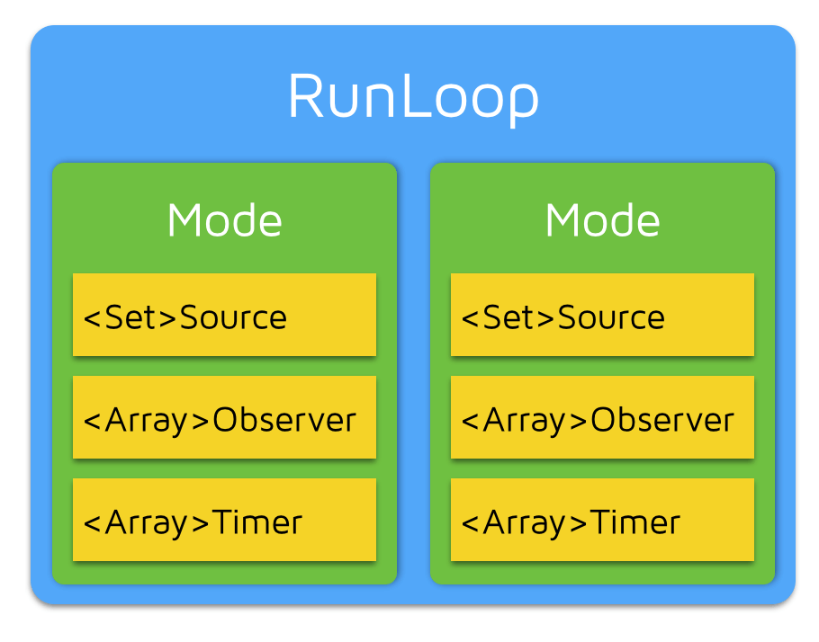

# ibireme :《深入理解 RunLoop》

> 文摘来源：[ibireme 的博客：《深入理解 RunLoop 》](https://blog.ibireme.com/2015/05/18/runloop/)，有增删。

<h2>目录</h2>

- [ibireme :《深入理解 RunLoop》](#ibireme-深入理解-runloop)
  - [RunLoop 的源码](#runloop-的源码)
  - [RunLoop 的概念](#runloop-的概念)
  - [RunLoop 与线程的关系](#runloop-与线程的关系)
  - [RunLoop 对外的接口](#runloop-对外的接口)
    - [CFRunLoopModeRef](#cfrunloopmoderef)
    - [CFRunLoopSourceRef](#cfrunloopsourceref)
    - [CFRunLoopTimerRef](#cfrunlooptimerref)
    - [CFRunLoopObserverRef](#cfrunloopobserverref)
  - [RunLoop 的 Mode](#runloop-的-mode)

## RunLoop 的源码

`CFRunLoopRef` 的代码 `CFRunLoop.c` 是开源的，可以在这里 <http://opensource.apple.com/tarballs/CF/> 下载到整个 `CoreFoundation` 的源码。

Swift 开源后，苹果又维护了一个跨平台的 `CoreFoundation` 版本：<https://github.com/apple/swift-corelibs-foundation/> ，这个版本的源码可能和现有 iOS 系统中的实现略不一样，但更容易编译，而且已经适配了 Linux / Windows 。

## RunLoop 的概念

一般来讲，一个**线程**一次只能执行一个任务，执行完成后线程就会退出。如果我们需要一个机制，**让线程能随时处理事件但并不退出**，这种模型通常被称作 Event Loop ， 在 macOS / iOS 里被称作 RunLoop ，它的主要功能是管理事件/消息，让**线程**在没有处理消息时休眠以避免资源占用、在有消息到来时立刻被唤醒。

RunLoop 提供了一个入口函数来执行事件循环的逻辑。线程执行了这个函数后，就会一直处于这个函数内部 “接受消息->等待->处理” 的循环中，直到这个循环结束（比如传入 quit 的消息），函数返回。

macOS/iOS 系统中，提供了两个这样的对象：`NSRunLoop` 和 `CFRunLoopRef` 。

- `CFRunLoopRef` 是在 `CoreFoundation` 框架内的，它提供了纯 C 函数的 API ，所有这些 API 都是**线程安全**的。
- `NSRunLoop` 是基于 `CFRunLoopRef` 的封装，提供了面向对象的 API ，但是这些 API **不是线程安全**的。

## RunLoop 与线程的关系

**线程和 RunLoop 之间是一一对应的**，其关系是保存在一个全局的 Dictionary 里。线程刚创建时并没有 RunLoop，如果不主动获取，那它一直都不会有。RunLoop 的创建是发生在第一次获取时，RunLoop 的销毁是发生在线程结束时。你只能在一个线程的内部获取其 RunLoop（主线程除外）。

苹果不允许直接创建 RunLoop，它只提供了两个自动获取的函数：`CFRunLoopGetMain()` 和 `CFRunLoopGetCurrent()` ，这两个函数内部的逻辑大概是下面这样:

【代码说明：或许需要更新一下？ 施工中 🚧】

```c
/// 全局的 Dictionary ，key 是 pthread_t ， value 是 CFRunLoopRef
static CFMutableDictionaryRef loopsDic;
/// 访问 loopsDic 时的锁
static CFSpinLock_t loopsLock;
 
/// 获取一个 pthread 对应的 RunLoop 。
CFRunLoopRef _CFRunLoopGet(pthread_t thread) {
    OSSpinLockLock(&loopsLock);
    
    if (!loopsDic) {
        // 第一次进入时，初始化全局 Dic ，并先为主线程创建一个 RunLoop 。
        loopsDic = CFDictionaryCreateMutable();
        CFRunLoopRef mainLoop = _CFRunLoopCreate();
        CFDictionarySetValue(loopsDic, pthread_main_thread_np(), mainLoop);
    }
    
    /// 直接从 Dictionary 里获取。
    CFRunLoopRef loop = CFDictionaryGetValue(loopsDic, thread));
    
    if (!loop) {
        /// 取不到时，创建一个
        loop = _CFRunLoopCreate();
        CFDictionarySetValue(loopsDic, thread, loop);
        /// 注册一个回调，当线程销毁时，顺便也销毁其对应的 RunLoop 。
        _CFSetTSD(..., thread, loop, __CFFinalizeRunLoop);
    }
    
    OSSpinLockUnLock(&loopsLock);
    return loop;
}
 
CFRunLoopRef CFRunLoopGetMain() {
    return _CFRunLoopGet(pthread_main_thread_np());
}
 
CFRunLoopRef CFRunLoopGetCurrent() {
    return _CFRunLoopGet(pthread_self());
}
```

**关于 iOS 中的线程**：

iOS 开发中能遇到两个线程对象: `pthread_t` 和 `NSThread` 。过去苹果有份文档标明了 `NSThread` 只是 `pthread_t` 的封装，但那份文档已经失效了，现在它们也有可能都是直接包装自最底层的 `mach thread`。苹果并没有提供这两个类型相互转换的接口，但不管怎么样，可以肯定的是 `pthread_t` 和 `NSThread` 是一一对应的。比如：

- 可以通过 `pthread_main_thread_np()` 或 `[NSThread mainThread]` 来获取主线程；
- 也可以通过 `pthread_self()` 或 `[NSThread currentThread]` 来获取当前线程。

`CFRunLoop` 是基于 `pthread` 来管理的。

## RunLoop 对外的接口

在 `CoreFoundation` 里面关于 RunLoop 有5个类:

- `CFRunLoopRef`
- `CFRunLoopModeRef`
- `CFRunLoopSourceRef`
- `CFRunLoopTimerRef`
- `CFRunLoopObserverRef`

### CFRunLoopModeRef

其中 `CFRunLoopModeRef` 类并没有对外暴露，只是通过 `CFRunLoopRef` 的接口进行了封装。他们的关系如下:



一个 RunLoop 包含若干个 Mode，每个 Mode 又包含若干个 Source / Timer / Observer 。每次调用 RunLoop 的主函数时，只能指定其中一个 Mode ，这个Mode 被称作 `CurrentMode` 。如果需要切换 Mode ，只能退出 Loop ，再重新指定一个 Mode 进入。这样做主要是为了分隔开不同组的 Source / Timer / Observer ，让其互不影响。

### CFRunLoopSourceRef

`CFRunLoopSourceRef` 是事件产生的地方。Source 有两个版本：`Source0` 和 `Source1` ：

- `Source0` 只包含了一个回调（名为 `perform` 的函数指针），**它不能主动触发事件**。使用时，需要先调用 `CFRunLoopSourceSignal(source)` ，将这个 Source 标记为待处理，然后手动调用 `CFRunLoopWakeUp(runloop)` 来唤醒 RunLoop，让其处理这个事件。
- `Source1` 除了包含了一个回调（名为 `perform` 的函数指针），还包含一个名为 `getPort` 的函数指针，其返回值是 `mach_port_t` 类型的。因此 **source1 可被用于通过内核和其他进程相互发送消息，这种 Source 能主动唤醒 RunLoop 的线程**，其原理在下面会讲到。

### CFRunLoopTimerRef

`CFRunLoopTimerRef` 是基于时间的触发器，它和 `NSTimer` 是 *toll-free bridged* 的，可以混用。其包含一个时间长度和一个回调（函数指针）。当其加入到 RunLoop 时，RunLoop 会注册对应的时间点，当时间点到时，RunLoop 会被唤醒以执行那个回调。

### CFRunLoopObserverRef

`CFRunLoopObserverRef` 是观察者，每个 Observer 都包含了一个回调（函数指针），当 RunLoop 的状态发生变化时，观察者就能通过回调接受到这个变化。可以观测的时间点有以下几个：

```c
typedef CF_OPTIONS(CFOptionFlags, CFRunLoopActivity) {
    kCFRunLoopEntry         = (1UL << 0), // 即将进入Loop
    kCFRunLoopBeforeTimers  = (1UL << 1), // 即将处理 Timer
    kCFRunLoopBeforeSources = (1UL << 2), // 即将处理 Source
    kCFRunLoopBeforeWaiting = (1UL << 5), // 即将进入休眠
    kCFRunLoopAfterWaiting  = (1UL << 6), // 刚从休眠中唤醒
    kCFRunLoopExit          = (1UL << 7), // 即将退出Loop
};
```

上面的 Source / Timer / Observer 被统称为 mode item ，一个 item 可以被同时加入多个 mode 。但一个 item 被重复加入同一个 mode 时是不会有效果的。**如果一个 mode 中一个 item 都没有，则 RunLoop 会直接退出**，不进入循环。

## RunLoop 的 Mode

`CFRunLoopMode` 和 `CFRunLoop` 的结构大致如下：

```c
struct __CFRunLoopMode {
    CFStringRef _name;            // Mode Name, 例如 @"kCFRunLoopDefaultMode"
    CFMutableSetRef _sources0;    // Set
    CFMutableSetRef _sources1;    // Set
    CFMutableArrayRef _observers; // Array
    CFMutableArrayRef _timers;    // Array
    ...
};
 
struct __CFRunLoop {
    CFMutableSetRef _commonModes;     // Set
    CFMutableSetRef _commonModeItems; // Set<Source/Observer/Timer>
    CFRunLoopModeRef _currentMode;    // Current Runloop Mode
    CFMutableSetRef _modes;           // Set
    ...
};
```

这里有个概念叫 “commonModes” ：一个 Mode 可以将自己标记为 ”common” 属性（通过将其 ModeName 添加到 RunLoop 的 “commonModes” 中）。每当 RunLoop 的内容发生变化时，RunLoop 都会自动将 `_commonModeItems` 里的 Source / Observer / Timer 同步到具有 “common” 标记的所有 Mode 里。

应用场景举例：主线程的 RunLoop 里有两个预置的 Mode：`kCFRunLoopDefaultMode` 和 `UITrackingRunLoopMode` 。这两个 Mode 都已经被标记为 ”Common” 属性。DefaultMode 是 App 平时所处的状态，TrackingRunLoopMode 是追踪 ScrollView 滑动时的状态。当你创建一个 Timer 并加到 DefaultMode 时，Timer 会得到重复回调，但此时滑动一个TableView时，RunLoop 会将 mode 切换为 TrackingRunLoopMode，这时 Timer 就不会被回调，并且也不会影响到滑动操作。

有时你需要一个 Timer，在两个 Mode 中都能得到回调，一种办法就是将这个 Timer 分别加入这两个 Mode 。还有一种方式，就是将 Timer 加入到顶层的 RunLoop 的 “commonModeItems” 中。”commonModeItems” 被 RunLoop 自动更新到所有具有 ”common” 属性的 Mode 里去。

CFRunLoop对外暴露的管理 Mode 接口只有下面2个:

```c
CFRunLoopAddCommonMode(CFRunLoopRef runloop, CFStringRef modeName);
CFRunLoopRunInMode(CFStringRef modeName, ...);
```

Mode 暴露的管理 mode item 的接口有下面几个：

```c
CFRunLoopAddSource(CFRunLoopRef rl, CFRunLoopSourceRef source, CFStringRef modeName);
CFRunLoopAddObserver(CFRunLoopRef rl, CFRunLoopObserverRef observer, CFStringRef modeName);
CFRunLoopAddTimer(CFRunLoopRef rl, CFRunLoopTimerRef timer, CFStringRef mode);

CFRunLoopRemoveSource(CFRunLoopRef rl, CFRunLoopSourceRef source, CFStringRef modeName);
CFRunLoopRemoveObserver(CFRunLoopRef rl, CFRunLoopObserverRef observer, CFStringRef modeName);
CFRunLoopRemoveTimer(CFRunLoopRef rl, CFRunLoopTimerRef timer, CFStringRef mode);
```

你只能通过 mode name 来操作内部的 mode，当你传入一个新的 mode name 但 RunLoop 内部没有对应 mode 时，RunLoop 会自动帮你创建对应的 `CFRunLoopModeRef` 。对于一个 RunLoop 来说，其内部的 mode 只能增加不能删除。

苹果公开提供的 Mode 有两个：`kCFRunLoopDefaultMode` (`NSDefaultRunLoopMode`) 和 `UITrackingRunLoopMode`，你可以用这两个 Mode Name 来操作其对应的 Mode。

同时苹果还提供了一个操作 common 标记的字符串：`kCFRunLoopCommonModes` (`NSRunLoopCommonModes`)，你可以用这个字符串来操作 Common Items，或标记一个 Mode 为 “Common” 。使用时注意区分这个字符串和其他 mode name。
