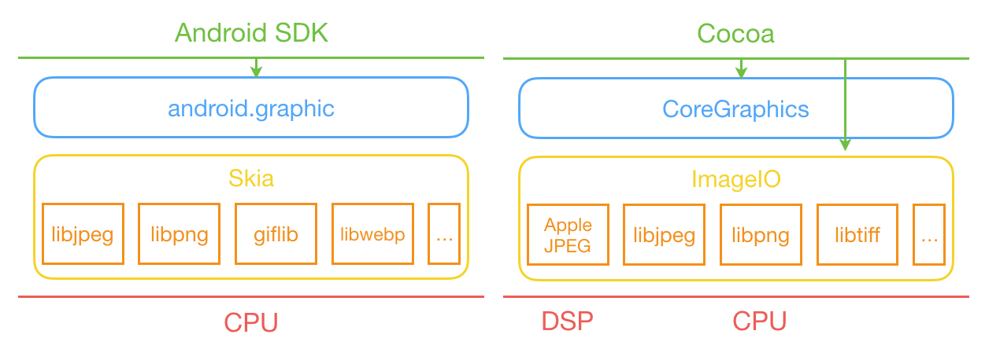
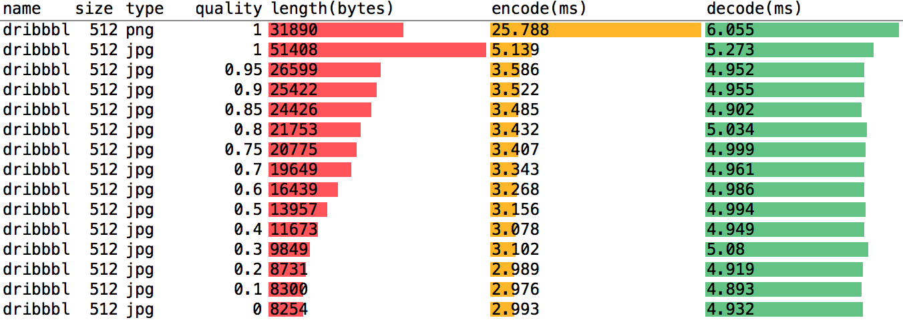
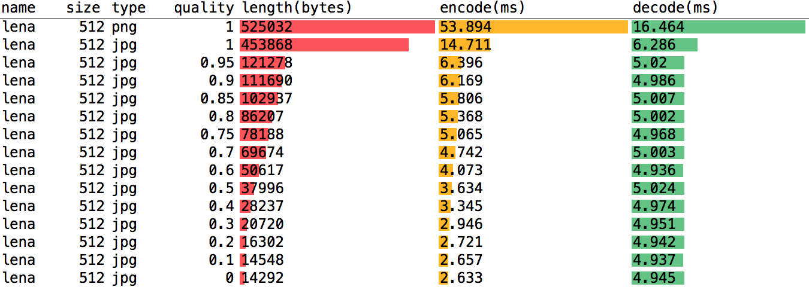
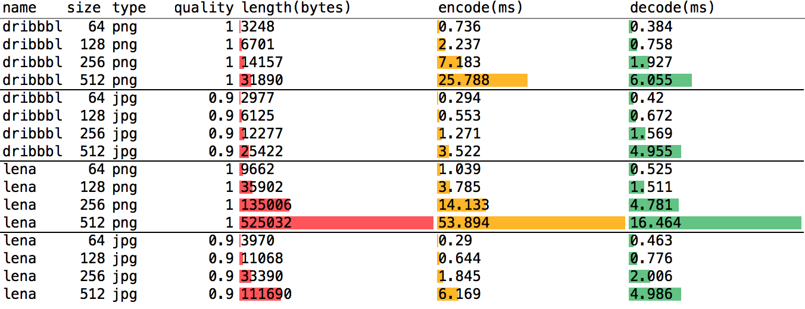
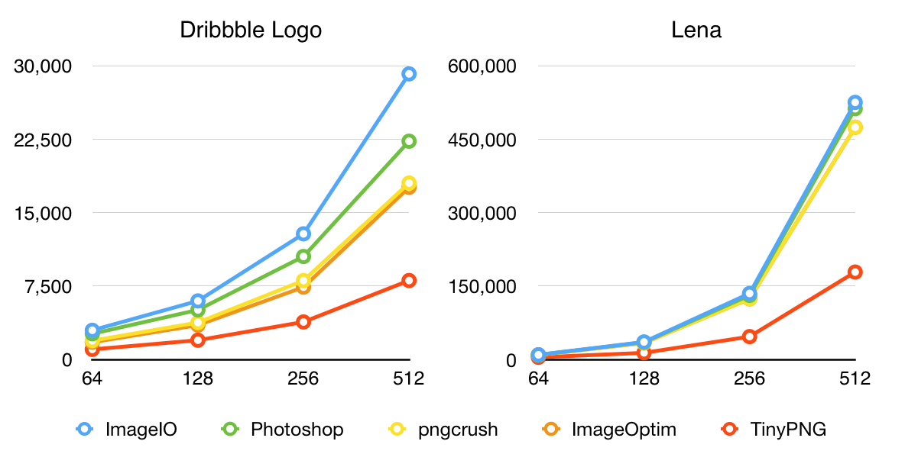
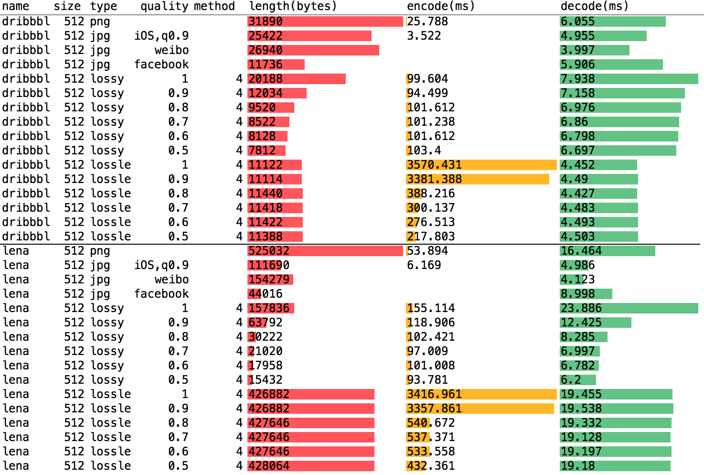
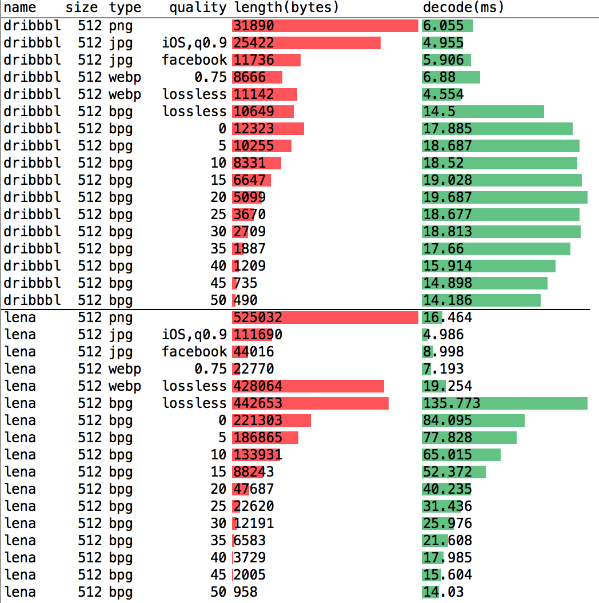

# 移动端图片格式调研

> 文摘来源：[ibireme 的博客：《移动端图片格式调研》](https://blog.ibireme.com/2015/11/02/mobile_image_benchmark/)，有增删。

图片通常是移动端流量耗费最多的部分，并且占据着重要的视觉空间。合理的图片格式选用和优化可以为你节省带宽、提升视觉效果。在这篇文章里我会分析一下目前主流和新兴的几种图片格式的特点、性能分析、参数调优，以及相关开源库的选择。

<h2>目录</h2>

- [移动端图片格式调研](#移动端图片格式调研)
  - [老牌的图片格式](#老牌的图片格式)
    - [GIF](#gif)
    - [JPEG](#jpeg)
    - [PNG](#png)
  - [新兴的图片格式](#新兴的图片格式)
    - [APNG](#apng)
    - [WebP](#webp)
    - [BPG](#bpg)
  - [移动端图片类型的支持情况](#移动端图片类型的支持情况)
  - [静态图片的编码与解码](#静态图片的编码与解码)
    - [JPEG](#jpeg-1)
    - [PNG](#png-1)
    - [WebP](#webp-1)
    - [BPG](#bpg-1)

## 老牌的图片格式

首先谈一下大家耳熟能详的几种老牌的图片格式吧：

### GIF

GIF 诞生于 **1987** 年，随着初代互联网流行开来。它有很多缺点，比如通常情况下**只支持 256 种颜色、透明通道只有 1 bit、文件压缩比不高**。它**唯一的优势就是支持多帧动画**，凭借这个特性，它得以从 Windows 1.0 时代流行至今，而且仍然大受欢迎。

### JPEG

JPEG 是目前最常见的图片格式，它诞生于 **1992** 年，是一个很古老的格式。它**只支持有损压缩，其压缩算法可以精确控制压缩比，以图像质量换得存储空间**。由于它太过常见，以至于许多移动设备的 CPU 都支持针对它的**硬编码与硬解码**。

### PNG

PNG 诞生在 **1995** 年，比 JPEG 晚几年。它本身的设计目的是替代 GIF 格式，所以它与 GIF 有更多相似的地方。**PNG 只支持无损压缩，所以它的压缩比是有上限的**。相对于 JPEG 和 GIF 来说，它**最大的优势在于支持完整的透明通道**。

## 新兴的图片格式

在上面这些图片格式诞生后，也有不少公司或团体尝试对他们进行改进，或者创造其他更加优秀的图片格式，比如：

- *JPEG 小组*的 `JPEG 2000` ；
- Microsoft 的 `JPEG-XR` ；
- Google 的 `WebP` ；
- 个人开发者发布的 `BPG` 、`FLIF` 等。

它们相对于老牌的那几个图片格式来说有了很大的进步，但出于各种各样的原因，只有少数几个格式能够流行开来。

下面三种就是目前实力比较强的新兴格式了。

### APNG

APNG 是 Mozilla 在 **2008** 年发布的一种图片格式，**旨在替换掉画质低劣的 GIF 动画**。它**实际上只是相当于 PNG 格式的一个扩展**，所以 Mozilla 一直想把它合并到 PNG 标准里面去。

然而 **PNG 开发组并没有接受 APNG 这个扩展**，而是一直在推进它自己的 MNG 动图格式。MNG 格式过于复杂以至于并没有什么系统或浏览器支持，而 APNG 格式由于简单容易实现，目前已经渐渐流行开来。

Mozilla 自己的 Firefox 首先支持了 APNG ，随后苹果的 Safari 也开始有了支持， Chrome 目前也已经尝试开始支持 ，可以说未来前景很好。

### WebP

WebP 是 Google 在 **2010** 年发布的图片格式，**希望以更高的压缩比替代 JPEG** 。它用 *VP8 视频帧内编码*作为其算法基础，取得了不错的压缩效果。

**它支持有损和无损压缩、支持完整的透明通道、也支持多帧动画**，并且没有版权问题，是一种非常理想的图片格式。

借由 Google 在网络世界的影响力，WebP 在几年的时间内已经得到了广泛的应用。看看你手机里的 App ：微博、微信、QQ、淘宝、网易新闻等等，每个 App 里都有 WebP 的身影。Facebook 则更进一步，用 WebP 来显示聊天界面的贴纸动画。

### BPG

BPG 是著名程序员 Fabrice Bellard 在去年 ( **2014** 年) 发布的一款超高压缩比的图片格式。这个程序员有些人可能感觉面生，但说起他的作品 FFmpeg 、QEMU 大家想必是都知道的。BPG 使用 `HEVC` (即 `H.265` ) 帧内编码作为其算法基础，就这点而言，它毋庸置疑是当下最为先进的图片压缩格式。相对于 JP2、JPEG-XR、WebP 来说，同等体积下 BPG 能提供更高的图像质量。

另外，得益于它本身基于视频编码算法的特性，它能以非常小的文件体积保存多帧动画。 Fabrice Bellard 聪明的地方在于，他知道自己一个人无法得到各大浏览器厂商的支持，所以他还特地开发了 Javascript 版的解码器，任何浏览器只要加载了这个 76KB 大小的 JS 文件，就可以直接显示 BPG 格式的图片了。

目前阻碍它流行的原因就是 HEVC 的版权问题和它较长的编码解码时间。尽管这个图片格式才刚刚发布一年，但已经有不少厂子开始试用了，比如阿里和腾讯。

## 移动端图片类型的支持情况

目前主流的移动端对图片格式的支持情况如何呢？我们分别来看一下 Android 和 iOS 目前的图片编解码架构吧：

Android 的图片编码解码是由 Skia 图形库负责的，Skia 通过挂接第三方开源库实现了常见的图片格式的编解码支持。目前来说，Android 原生支持的格式只有 JPEG 、PNG 、GIF 、BMP 和 WebP（ *Android 4.0* 加入），在上层能直接调用的编码方式也只有 JPEG 、PNG 、WebP 这三种。目前来说 Android 还不支持直接的动图编解码。

iOS 底层是用 `ImageIO.framework` 实现的图片编解码。目前 iOS 原生支持的格式有：JPEG 、JPEG2000 、PNG 、GIF 、BMP 、ICO 、TIFF 、PICT，自 *iOS 8.0* 起，`ImageIO` 又加入了 APNG 、SVG 、RAW 格式的支持。在上层，开发者可以直接调用 `ImageIO` 对上面这些图片格式进行编码和解码。对于动图来说，开发者可以解码动画 GIF 和 APNG、可以编码动画 GIF。

两个平台在导入第三方编解码库时，都多少对他们进行了一些修改，比如 Android 对 libjpeg 等进行的调整以更好的控制内存，iOS 对 libpng 进行了修改以支持 APNG，并增加了多线程编解码的特性。除此之外，iOS 专门针对 JPEG 的编解码开发了 `AppleJPEG.framework` ，实现了性能更高的硬编码和硬解码，只有当硬编码解码失败时，libjpeg 才会被用到。

## 静态图片的编码与解码

由于我目前主要是做 iOS 开发，所以下面的性能评测都是基于 iPhone 的，主要测试代码可以在[这里](https://github.com/ibireme/YYWebImage/blob/master/Demo/YYWebImageDemo/YYImageBenchmark.m)看到。测试素材很少，只有两个：

- 第一张是 Dribbble 的 Logo，包含 Alpha 通道，用于测试简单的、图形类的图像；
- 第二张经典的 Lena 图，用于测试照片类的、具有丰富细节的图像。

每个图像都有 64×64 、128×128 、256×256 、512×512 四种分辨率。
测试素材过少可能导致某些测试不够准确，但作为参考大致是没问题的。

### JPEG

目前比较知名的 JPEG 库有以下三个：

- [libjpeg](http://libjpeg.sourceforge.net/) ：开发时间最早，使用最广泛的 JPEG 库。由于 JPEG 标准过于复杂和模糊，并没有其他人去实现，所以这个库是 JPEG 的事实标准。
- [libjpeg-turbo](http://libjpeg-turbo.virtualgl.org/) ：一个致力于提升编解码速度的 JPEG 库。它基于 `libjpeg` 进行了改造，用 SIMD 指令集 ( MMX 、SSE2 、NEON ) 重写了部分代码，官网称相对于 `libjpeg` 有 2 ~ 4 倍的性能提升。
- [MozJPEG](http://mozjpeg.codelove.de/) ：一个致力于提升压缩比的 JPEG 库。它是 Mozilla 在 2014 年发布的基于 `libjpeg-turbo` 进行改造的库，相对于 `libjpeg` 有 5% ~ 15%  的压缩比提升，但相应的其编码速度也慢了很多。

除了上面这三个库，苹果自己也开发了一个 `AppleJPEG` ，但并没有开源。其调用了芯片提供的 DSP 硬编码和硬解码的功能。虽然它不如上面这三个库功能完善，但其性能非常高。在我的测试中，其编解码速度通常是 `libjpeg-turbo` 的 1 ~ 2 倍。可惜的是，**目前开发者并不能直接访问这个库**。

下面是 `ImageIO` ( AppleJPEG / libpng ) 在 *iPhone 6* 上的编解码性能：

dribbble ：

lena ：

可以看到，JPEG 编码中 `quality` 越小，图片体积就越小，质量越也差，编码时间也越短。解码时间并没有很大的差距，可能是其大部分时间消耗在了函数调用、硬件调用上。**苹果在自己的相册 Demo 中提供的 `quality` 的默认值是 0.9 ，在这个值附近，图像质量和体积、编码解码时间之间都能取得不错的平衡**。

### PNG

相对于 JPEG 来说，PNG 标准更为清晰和简单，因此有很多公司或个人都有自己的 PNG 编码解码实现。但目前使用最广的还是 PNG 官方发布的 `libpng` 库。iOS 和 Android 底层都是调用这个库实现的 PNG 编解码。

下面是 PNG 在 `iPhone 6` 上的编解码性能：

可以看到，在编解码图形类型（颜色少、细节少）的图片时，PNG 和 JPEG 差距并不大；但是对于照片类型（颜色和细节丰富）的图片来说，PNG 在文件体积、编解码速度上都差 JPEG 不少了。

**和 JPEG 不同，PNG 是无损压缩，其压缩比是有上限的**。目前网上有很多针对 PNG 进行优化的工具和服务，旨在提升 PNG 的压缩比。下面是常见的几个 PNG 压缩工具的性能对比：

- [pngcrush](http://pmt.sourceforge.net/pngcrush/) 是 Xcode 自带的 PNG 压缩工具，相对于设计师用 Photoshop 生成的图片来说，它能取得不错的压缩效果。
- [ImageOptim](https://imageoptim.com/) 则更进一步，对每张图用多种缩算法进行比对，选择压缩比更高的结果，进一步缩小了文件体积。
- [TinyPNG](https://tinypng.com/) 相对于其他工具来说，压缩比高得不像话。**它启用了类似 GIF 那样的颜色索引表对 PNG 进行压缩，所以会导致颜色丰富的图片丢失掉一部分细节**。如果使用 TinyPNG 的话，最好在压缩完成后让设计师看一下颜色效果是否可以接受。

### WebP

WebP 标准是 Google 定制的，迄今为止也只有 Google 发布的 [libwebp](https://developers.google.com/speed/webp/) 实现了该的编解码。所以这个库也是该格式的事实标准。

**WebP 编码主要有几个参数**：

- `lossless` : **是否为无损编码**。
  - `YES` 代表无损编码，
  - `NO` 代表有损编码。
  - **WebP 主要优势在于有损编码**，其无损编码的性能和压缩比表现一般。
- `quality` : **图像质量**，值的范围是 `0 ~ 100` 。
  - `0` 表示最差质量，文件体积最小，细节损失严重，
  - `100` 表示最高图像质量，文件体积较大。
  - **此参数只针对有损压缩有明显效果**。
  - Google 官方的建议是 **75** ，腾讯在对 WebP 评测时给出的建议也是 75 。在这个值附近，WebP 能在压缩比、图像质量上取得较好的平衡。
- `method` : **压缩比**，值的范围是 `0 ~ 6` 。
  - `0` 表示快速压缩，耗时短，压缩质量一般，
  - `6` 表示极限压缩，耗时长，压缩质量好。
  - **此参数也只针对有损压缩有明显效果**。调节此参数最高能带来 `20%～40%` 的更高压缩比，但相应的编码时间会增加 `5 ～ 20` 倍。
  - Google 推荐的值是 **4** 。

编码参数的选择：

- 编码**无损图片**，`quality = 0` ，`method = 0 ~ 3` 是相对来说比较合适的参数，能够节省编码时间，同时也有不错的压缩比。
- 编码**有损图片**，`quality = 75` ，`method = 2 ~ 4` 是比较合适的参数，能在编码时间、图片质量、文件体积之间有着不错的平衡。

**WebP 解码有三个参数**：

- `use_threads` : 是否启用 `pthread` 多线程解码。此参数只对宽度大于 `512` 的有损图片起作用。开启后内部会用多线程解码，CPU 占用会更高，解码时间平均能缩短 `10%～20%` 。
- `bypass_filtering` : **是否禁用滤波**。此参数**只对有损图片起作用**，开启后大约能缩短 `5%～10%` 的解码时间，但会造成一些颜色过渡平滑的区域产生*色带（banding*）。
- `no_fancy_upsampling` : **是否禁用上采样**。此参数**只对有损图片起作用**。在我的测试中，开启此参数后，解码时间反而会增加 `5～25%` ，同时会造成一些图像细节的丢失，线条边缘会增加杂色，显得不自然。

通常情况下，这三个参数都设为 `NO` 即可，如果要追求更高的解码速度，则可以尝试开启 `use_threads` 和 `bypass_filtering` 这两个参数。而 `no_fancy_upsampling` 在任何情况下都没必要开启。

由于 WebP 测试数据较多，这里只贴一下 `512 x 512` 大小的一部分测试结果，感兴趣的可以看文章结尾处的 Excel 附件。

对于简单的图形类型的图像（比如 App 内的各种 UI 素材），WebP 无损压缩的文件体积和解码速度某些情况下已经比 PNG 还要理想了，如果你想要对 App 安装包体积进行优化，可以尝试一下 WebP 。

对于复杂的图像（比如照片）来说，WebP 无损编码表现并不好，但有损编码表现却非常棒。相近质量的图片解码速度 WebP 相距 JPEG 也已经相差不大了，而文件压缩比却能提升不少。

### BPG

BPG 是目前已知最优秀的有损压缩格式了，它能在相同质量下比 JPEG 减少 50% 的体积。下面是经典的 Lena 图的对比，你也可以在[这里](http://xooyoozoo.github.io/yolo-octo-bugfixes/#cologne-cathedral&webp=s&bpg=s)看到大量其他图片的 BPG 、JPEG 、JPEG2000 、JPEG-XR 、WebP 压缩效果的在线对比，效果非常明显。

BPG 目前只有作者发布的 [libbpg](http://bellard.org/bpg/) 可用。但作者基于 `libbpg` 编译出了一个 Javascript 解码器，很大的扩展了可用范围。bpg 可以以无损和有损压缩两种方式进行编码，有损压缩时可以用 `quality` 参数控制压缩比，可选范围为 `0 ～ 51` ，数值越大压缩比越高。通常来说，`25` 附近是一个不错的选择，BPG 官方工具默认值是 `28` 。

`libbpg` 目前并没有针对 *ARM NEON* 做优化，所以其在移动端的性能表现一般。下面是 *iPhone 6* 上的性能测试：

由于 bpg 编码时间太长，我并没有将数据放到表格里。可以看到相同质量下，BPG 的解码速度还是差 JPEG 太多，大约慢了 `3 ～ 5` 倍。目前来说，BPG 适用于那些对流量非常敏感，但对解码时间不敏感的地方。从网上的新闻来看，手机淘宝和手机 QQ 都已经有所尝试，但不清楚他们是否对 BPG 解码进行了优化。
