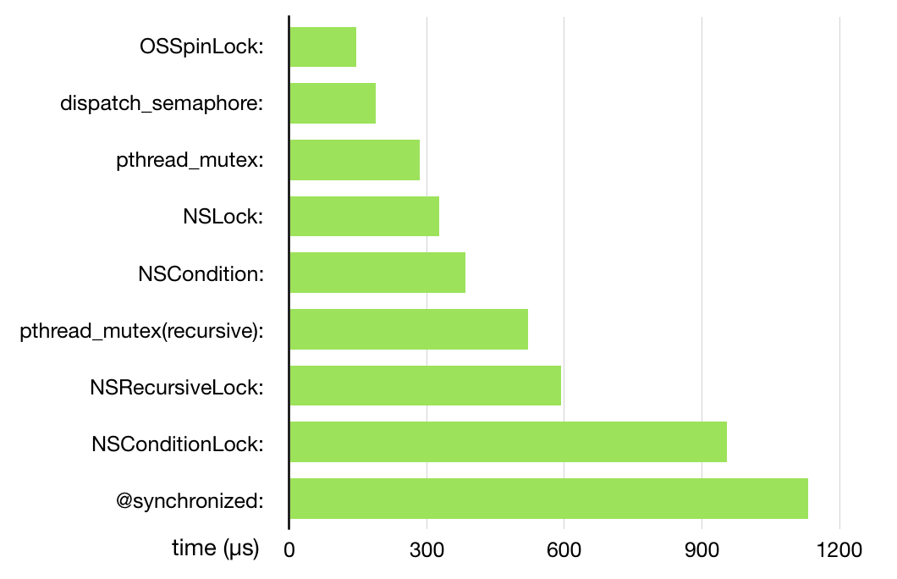

# 不再安全的 OSSpinLock

> 文摘来源：[ibireme 的博客：《不再安全的 OSSpinLock 》](https://blog.ibireme.com/2016/01/16/spinlock_is_unsafe_in_ios/)，有增删。

`YYModel` 的[相关 issue](https://github.com/ibireme/YYModel/issues/43)。

<h2>目录</h2>

- [不再安全的 OSSpinLock](#不再安全的-osspinlock)
  - [OSSpinLock 的问题](#osspinlock-的问题)
  - [OSSpinLock 的替代方案](#osspinlock-的替代方案)
  - [社区反应](#社区反应)
    - [苹果](#苹果)
    - [Google](#google)

## OSSpinLock 的问题

2015-12-14 那天，[swift-dev 邮件列表](https://lists.swift.org/pipermail/swift-dev/Week-of-Mon-20151214/000372.html)里有人在讨论 `weak` 属性的线程安全问题，其中有几位苹果工程师透露了**自旋锁的 bug** ，对话内容大致如下：

新版 iOS 中，系统维护了 5 个不同的**线程优先级 / QoS** ：

- background
- utility
- default
- user-initiated
- user-interactive

高优先级线程始终会在低优先级线程前执行，一个线程不会受到比它更低优先级线程的干扰。这种线程调度算法会产生潜在的**优先级反转**问题，从而破坏了 spin lock 。

具体来说，**如果一个低优先级的线程获得锁并访问共享资源，这时一个高优先级的线程也尝试获得这个锁，它会处于 spin lock 的忙等状态从而占用大量 CPU 。此时低优先级线程无法与高优先级线程争夺 CPU 时间，从而导致任务迟迟完不成、无法释放 lock 。** 这并不只是理论上的问题，`libobjc` 已经遇到了很多次这个问题了，于是苹果的工程师停用了 `OSSpinLock` 。

苹果工程师 Greg Parker 提到，对于这个问题，

- 一种解决方案是用 *truly unbounded backoff* 算法，这能避免 livelock 问题，但如果系统负载高时，它仍有可能将高优先级的线程阻塞数十秒之久；
- 另一种方案是使用 *handoff lock* 算法，这也是 `libobjc` 目前正在使用的。**锁的持有者会把线程 ID 保存到锁内部，锁的等待者会临时贡献出它的优先级来避免优先级反转的问题**。理论上这种模式会在比较复杂的多锁条件下产生问题，但实践上目前还一切都好。

`libobjc` 里用的是 Mach 内核的 `thread_switch()` 然后传递了一个 *mach thread port* 来避免优先级反转，另外 **`libobjc` 还用了一个私有的参数选项，所以开发者无法自己实现这个锁**。另一方面，由于二进制兼容问题，`OSSpinLock` 也不能有改动。

**最终的结论就是，除非开发者能保证访问锁的线程全部都处于同一优先级，否则 iOS 系统中所有类型的自旋锁都不能再使用了。**

## OSSpinLock 的替代方案

为了找到一个替代方案，我做了一个简单的性能测试，对比了一下几种能够替代 `OSSpinLock` 锁的性能。测试是在 iPhone6 、iOS9 上跑的，代码在[这里](https://github.com/ibireme/tmp/blob/master/iOSLockBenckmark/iOSLockBenckmark/ViewController.m)。这里只是测试了单线程的情况，不能反映多线程下的实际性能，所以这个结果只能当作一个定性分析。

可以看到除了 `OSSpinLock` 外，`dispatch_semaphore` 和 `pthread_mutex` 性能是最高的。有[消息](http://mjtsai.com/blog/2015/12/16/osspinlock-is-unsafe/)称，苹果在新系统中已经优化了 `pthread_mutex` 的性能，所以它看上去和 `OSSpinLock` 差距并没有那么大了。

## 社区反应

### 苹果

查看 `CoreFoundation` 的源码能够发现，苹果至少在 **2014** 年就发现了这个问题，并把 `CoreFoundation` 中的 `spinlock` 替换成了 `pthread_mutex`，具体变化可以查看这两个文件：`CFInternal.h (855.17)` 、`CFInternal.h (1151.16)` 。苹果自己发现问题后，并没有及时更新 `OSSpinLock` 的文档，也没有告知开发者，这有些让人失望。

在 *iOS 10* / *macOS 10.12* 发布时，苹果提供了新的 `os_unfair_lock` 作为 `OSSpinLock` 的替代，并且将 `OSSpinLock` 标记为了 **Deprecated** 。

### Google

[google/protobuf](https://github.com/google/protobuf) 内部的 `spinlock` 被全部替换为 `dispatch_semaphore` ，详情可以看这个提交：<https://github.com/google/protobuf/pull/1060> 。用 `dispatch_semaphore` 而不用 `pthread_mutex` 应该是出于性能考虑。
