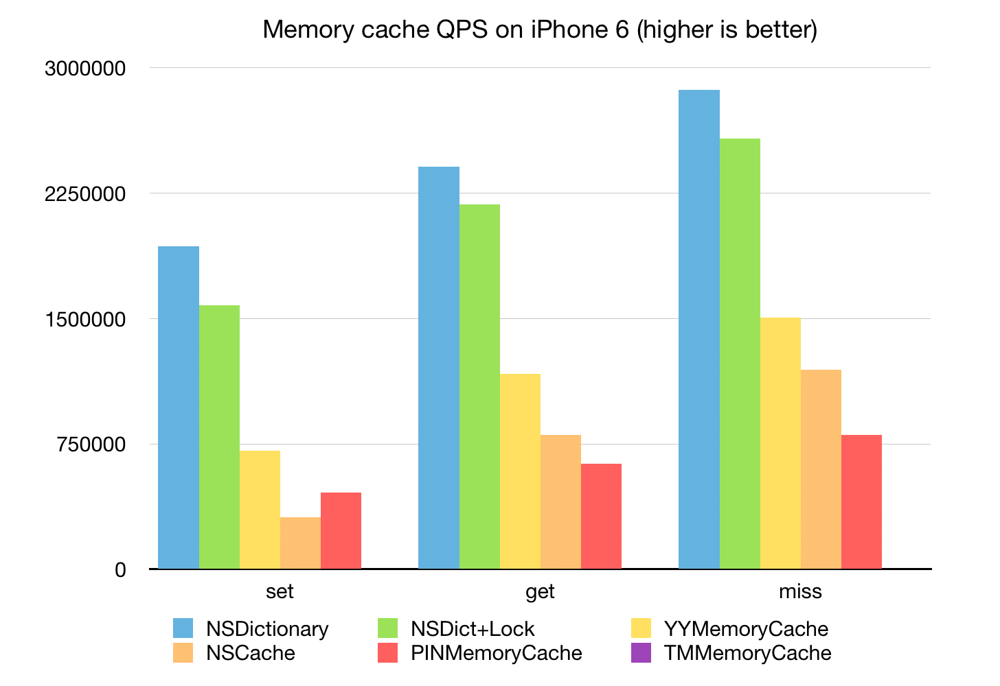
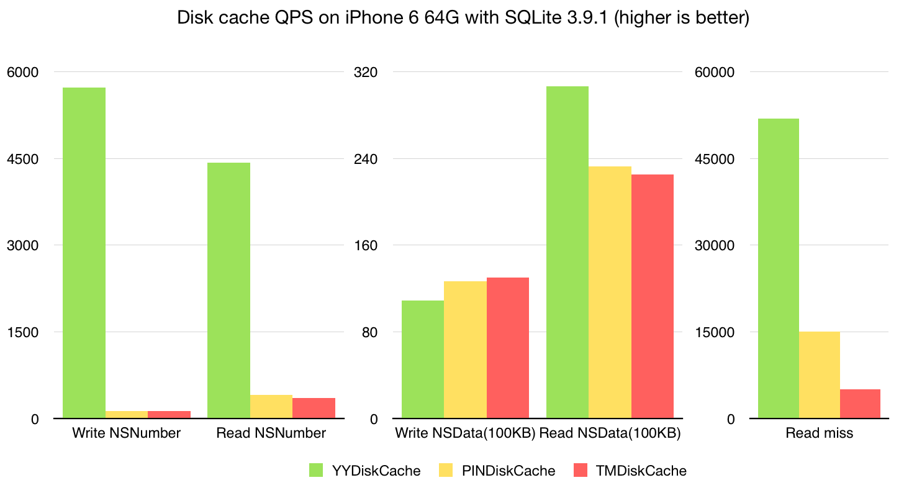

# YYCache 的设计思路

> 文摘来源：[ibireme 的博客：《YYCache 的设计思路》](https://blog.ibireme.com/2015/10/26/yycache/)，有增删。

iOS 开发中总会用到各种缓存，最初我是用的一些开源的缓存库，但到总觉得缺少某些功能，或某些 API 设计的不够好用。[YYCache](https://github.com/ibireme/YYCache) 是我新造的一个轮子，下面说一下这个轮子的设计思路。

<h2>目录</h2>

- [YYCache 的设计思路](#yycache-的设计思路)
  - [内存缓存](#内存缓存)
  - [磁盘缓存](#磁盘缓存)
  - [备注](#备注)
    - [关于锁](#关于锁)
    - [关于 Realm](#关于-realm)

## 内存缓存

通常一个缓存是由*内存缓存*和*磁盘缓存*组成，

- 内存缓存提供容量小但高速的存取功能；
- 磁盘缓存提供大容量但低速的持久化存储。

相对于磁盘缓存来说，内存缓存的设计要更简单些，下面是我调查的一些常见的内存缓存。

`NSCache` 是苹果提供的一个简单的内存缓存，它有着和 `NSDictionary` 类似的 API ，不同点是它是**线程安全**的，并且不会 retain key 。我在测试时发现了它的几个特点：`NSCache` 底层并没有用 `NSDictionary` 等已有的类，而是直接调用了 `libcache.dylib` ，其中线程安全是由 `pthread_mutex` 完成的。另外，它的性能和 `key` 的相似度有关，如果有大量相似的 `key` (比如 “1”, “2”, “3”, …)，`NSCache` 的存取性能会下降得非常厉害，大量的时间被消耗在 `CFStringEqual()` 上，不知这是不是 `NSCache` 本身设计的缺陷。

[TMMemoryCache](https://github.com/tumblr/TMCache) 是 `TMCache` 的内存缓存实现，最初由 Tumblr 开发，但现在已经不再维护了。`TMMemoryCache` 实现有很多 `NSCache` 并没有提供的功能，比如数量限制、总容量限制、存活时间限制、内存警告或应用退到后台时清空缓存等。`TMMemoryCache` 在设计时，主要目标是线程安全，它把所有读写操作都放到了同一个 Concurrent Queue 中，然后用 `dispatch_barrier_async` 来保证任务能顺序执行。它错误的用了大量异步 block 回调来实现存取功能，以至于产生了很大的性能和死锁问题。

[PINMemoryCache](https://github.com/pinterest/PINCache) 是 Tumblr 宣布不在维护 `TMCache` 后，由 Pinterest 维护和改进的一个内存缓存。它的功能和接口基本和 `TMMemoryCache` 一样，但修复了性能和死锁的问题。它同样也用 `dispatch_semaphore` 来保证线程安全，但去掉了 `dispatch_barrier_async` ，避免了线程切换带来的巨大开销，也避免了可能的死锁。

[YYMemoryCache](https://github.com/ibireme/YYCache) 是我开发的一个内存缓存，相对于 `PINMemoryCache` 来说，我去掉了异步访问的接口，尽量优化了同步访问的性能，用 `OSSpinLock` 来保证线程安全。另外，缓存内部用双向链表和 `NSDictionary` 实现了 **LRU** 淘汰算法，相对于上面几个算是一点进步吧。

下面的单线程的 Memory Cache 性能基准测试：

- 可以看到 `YYMemoryCache` 的性能不错，仅次于 `NSDictionary` + `OSSpinLock` ；
- `NSCache` 的写入性能稍差，读取性能不错；
- `PINMemoryCache` 的读写性能也还可以，但读取速度差于 `NSCache` ；
- `TMMemoryCache` 性能太差以至于图上都看不出来了。

## 磁盘缓存

为了设计一个比较好的磁盘缓存，我调查了大量的开源库，包括 `TMDiskCache` 、`PINDiskCache` 、`SDWebImage` 、`FastImageCache` 等，也调查了一些闭源的实现，包括 `NSURLCache` 、Facebook 的 `FBDiskCache` 等。他们的实现技术大致分为三类：

- 基于文件读写、
- 基于 mmap 文件内存映射、
- 基于数据库。

`TMDiskCache` , `PINDiskCache` , `SDWebImage` 等缓存，都是基于文件系统的，即一个 Value 对应一个文件，通过文件读写来缓存数据。他们的实现都比较简单，性能也都相近，缺点也是同样的：不方便扩展、没有元数据、难以实现较好的淘汰算法、数据统计缓慢。

`FastImageCache` 采用的是 `mmap` 将文件映射到内存。用过 MongoDB 的人应该很熟悉 mmap 的缺陷：

- 热数据的文件不要超过物理内存大小，不然 mmap 会导致内存交换严重降低性能；
- 另外内存中的数据是定时 `flush` 到文件的，如果数据还未同步时程序挂掉，就会导致数据错误。抛开这些缺陷来说，`mmap` 性能非常高。

`NSURLCache` 、`FBDiskCache` 都是基于 SQLite 数据库的。基于数据库的缓存可以很好的支持元数据、扩展方便、数据统计速度快，也很容易实现 **LRU** 或其他淘汰算法，唯一不确定的就是数据库读写的性能，为此我评测了一下 SQLite 在真机上的表现。在 *iPhone 6 (64GB)* 下，

- SQLite 写入性能比直接写文件要高，
- 但读取性能取决于数据大小：
  - 当单条数据小于 `20K` 时，数据越小 SQLite 读取性能越高；
  - 单条数据大于 `20K` 时，直接写为文件速度会更快一些。

这和 SQLite 官网的描述基本一致。另外，直接从官网下载最新的 SQLite 源码编译，会比 iOS 系统自带的 sqlite3.dylib 性能要高很多。

基于 SQLite 的这种表现，**磁盘缓存最好是把 SQLite 和文件存储结合起来**：`key-value` 元数据保存在 SQLite 中，而 `value` 数据则根据大小不同选择 SQLite 或文件存储。`NSURLCache` 选定的数据大小的阈值是 `16K` ；`FBDiskCache` 则把所有 `value` 数据都保存成了文件。

我的 `YYDiskCache` 也是采用的 SQLite 配合文件的存储方式，在 *iPhone 6 (64GB)* 上的性能基准测试结果见下图：

在存取小数据 (`NSNumber`) 时，`YYDiskCache` 的性能远远高出基于文件存储的库；而较大数据的存取性能则比较接近了。但得益于 SQLite 存储的元数据，`YYDiskCache` 实现了 LRU 淘汰算法、更快的数据统计，更多的容量控制选项。

## 备注

### 关于锁

`OSSpinLock` 自旋锁，性能最高的锁。原理很简单，就是一直 `do...while` 忙等。它的缺点是当等待时会消耗大量 CPU 资源，所以它不适用于较长时间的任务。对于内存缓存的存取来说，它非常合适。

`dispatch_semaphore` 是信号量，但当信号总量设为 `1` 时也可以当作锁来。在没有等待情况出现时，它的性能比 `pthread_mutex` 还要高，但一旦有等待情况出现时，性能就会下降许多。相对于 `OSSpinLock` 来说，它的优势在于等待时不会消耗 CPU 资源。对磁盘缓存来说，它比较合适。

### 关于 Realm

Realm 是一个比较新的数据库，针对移动应用所设计。它的 API 对于开发者来说非常友好，比 SQLite 、CoreData 要易用很多，但相对的坑也有不少。我在测试 SQLite 性能时，也尝试对它做了些简单的评测。我从 Realm 官网下载了它提供的 benchmark 项目，更新 SQLite 到官网最新的版本，并启用了 SQLite 的 `sqlite3_stmt` 缓存。我的评测结果显示 Realm 在写入性能上差于 SQLite ，读取小数据时也差 SQLite 不少，读取较大数据时 Realm 有很大的优势。当然这只是我个人的评测，可能并不能反映真实项目中具体的使用情况。

我想看看它的实现原理，但发现 Realm 的核心 `realm-core` 是闭源的（评论里 Realm 员工提到目前有在 Apache 2.0 授权下的开源计划），能知道的是 Realm 应该用了 `mmap` 把文件映射到内存，所以才在较大数据读取时获得很高的性能。

另外我注意到添加了 Realm 的 App 会在启动时向某几个 IP 发送数据，评论中有 Realm 员工反馈这是发送匿名统计数据，并且只针对模拟器和 Debug 模式。这部分代码目前是开源的，并且可以通过环境变量 `REALM_DISABLE_ANALYTICS` 来关闭，如果有使用 Realm 的可以注意一下。
