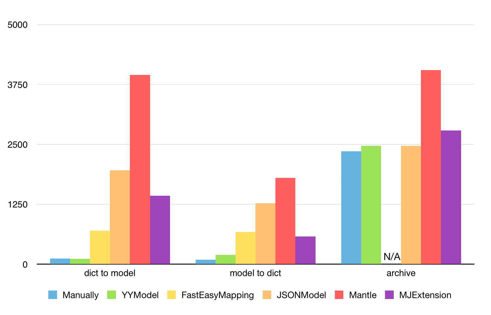
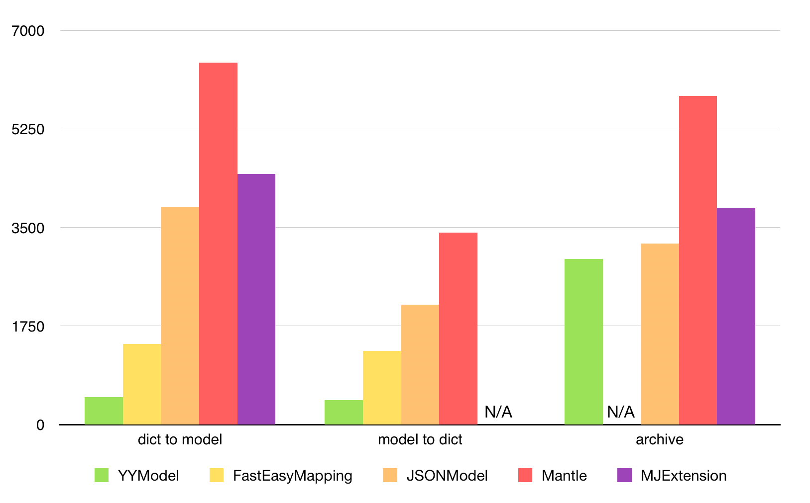

# iOS JSON 模型转换库评测

> 文摘来源：[ibireme 的博客：《iOS JSON 模型转换库评测》](https://blog.ibireme.com/2015/10/23/ios_model_framework_benchmark/)，有增删。

iOS 开发中总会用到各种 JSON 模型转换库，这篇文章将会对常见的几个开源库进行一下评测。评测的内容主要集中在性能、功能、容错性这几个方面。

<h2>目录</h2>

- [iOS JSON 模型转换库评测](#ios-json-模型转换库评测)
  - [评测的对象](#评测的对象)
    - [Manually](#manually)
    - [YYModel](#yymodel)
    - [FastEasyMapping](#fasteasymapping)
    - [JSONModel](#jsonmodel)
    - [Mantle（活跃中）](#mantle活跃中)
    - [MJExtension（活跃中）](#mjextension活跃中)
  - [性能评测](#性能评测)
    - [用例1：GithubUser](#用例1githubuser)
    - [用例2: WeiboStatus](#用例2-weibostatus)
    - [测试结果分析](#测试结果分析)

## 评测的对象

### Manually

手动进行 JSON / Model 转换，不用任何开源库，可以进行高效、自由的转换，但手写代码非常繁琐，而且容易出错。

### [YYModel](https://github.com/ibireme/YYModel)

> Aug 7, 2017 停更。

我造的一个新轮子，比较轻量（算上 `.h` 只有 5 个文件），支持自动的 JSON / Model 转换，支持定义映射过程。API 简洁，功能也比较简单。

### [FastEasyMapping](https://github.com/Yalantis/FastEasyMapping)

> Dec 8, 2019 停更。

Yalantis 开发的一个 JSON 模型转换库，可以自定义详细的 Model 映射过程，支持 CoreData 。使用者较少。

### [JSONModel](https://github.com/jsonmodel/jsonmodel)

> Sep 19, 2018 停更。

一个 JSON 模型转换库，有着比较简洁的接口。Model 需要继承自 `JSONModel` 。

### [Mantle](https://github.com/Mantle/Mantle)（活跃中）

Github 官方团队开发的 JSON 模型转换库，Model 需要继承自 `MTLModel` 。功能丰富，文档完善，使用广泛。

### [MJExtension](https://github.com/CoderMJLee/MJExtension)（活跃中）

国内开发者”小码哥”开发的 JSON 模型库，号称性能超过 `JSONModel` 和 `Mantle` ，使用简单无侵入。国内有大量使用者。

## 性能评测

所有开源库代码更新至 **2015-09-18** ，以 Release 方式编译，运行在 *iPhone 6* 上，代码见 <https://github.com/ibireme/YYModel/tree/master/Benchmark> 。

### 用例1：GithubUser

从 <https://api.github.com/users/facebook> 获取的一条 [User](https://github.com/ibireme/YYModel/blob/master/Benchmark/ModelBenchmark/GithubUserModel/user.json) 数据，去除 `NSDate` 属性。

该 JSON 有 30 行，大部分属性是 `string` ，少量是 `number` 。这个用例主要是测试最基础的 Model 相关操作。

每次测试执行 `10000` 次，统计耗时毫秒数：

### 用例2: WeiboStatus

从官方微博 App 抓取一条内容完整的微博数据，JSON 总共有 580 行（是的，一条微博需要这么大数据量），包含大量嵌套对象、容器对象、类型转换、日期解析等。这个用例主要是测试在复杂的情况下不同库的性能。
每次测试执行 `1000` 次，统计耗时毫秒数。

### 测试结果分析

- `Mantle` 在各个测试中，性能都是最差的；
- `JSONModel` 和 `MJExtension` 性能相差不多，但都比 `Mantle` 性能高；
- `FastEasyMapping` 相对来说性能确实比较快；
- `YYModel` 性能高出其他几个库一个数量级，接近手写代码的效率。
- `FastEasyMapping` 不支持 `NSCoding` 协议，所以不能进行 `Archive` 的性能测试。
- `MJExtension` 在处理复杂对象转为 JSON 时，存在错误。

(此处我也测试了一些 Swift 的项目，例如 ObjectMapper 、JSONHelper 、ModelRocket ，性能比 Mantle 还差很多，这里就不进行对比了。)
