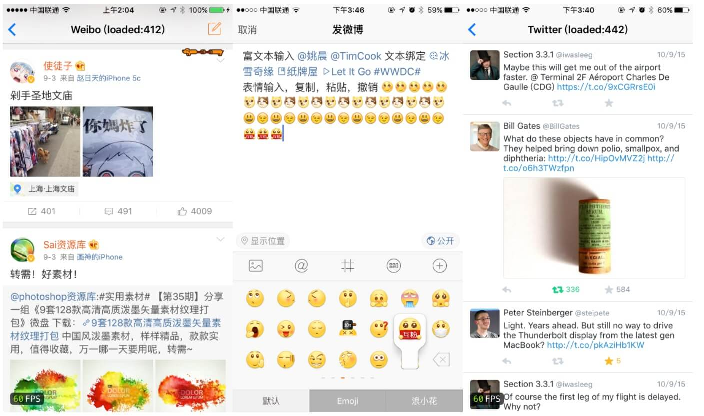

# iOS 保持界面流畅的技巧

> 文摘来源：[ibireme 的博客：《iOS 保持界面流畅的技巧》](https://blog.ibireme.com/2015/11/12/smooth_user_interfaces_for_ios/)，有增删。

这篇文章会非常详细的分析 iOS 界面构建中的各种性能问题以及对应的解决思路，同时给出一个开源的微博列表实现，通过实际的代码展示如何构建流畅的交互。

- [iOS 保持界面流畅的技巧](#ios-保持界面流畅的技巧)
  - [演示项目](#演示项目)
  - [屏幕显示图像的原理](#屏幕显示图像的原理)

## 演示项目

在开始技术讨论前，你可以先下载我写的 Demo 跑到真机上体验一下：<https://github.com/ibireme/YYKit> 。 Demo 里包含一个微博的 Feed 列表、发布视图，还包含一个 Twitter 的 Feed 列表。为了公平起见，所有界面和交互我都从官方应用原封不动的抄了过来，数据也都是从官方应用抓取的。你也可以自己抓取数据替换掉 Demo 中的数据，方便进行对比。尽管官方应用背后的功能更多更为复杂，但不至于会带来太大的交互性能差异。

这个 Demo 最低可以运行在 iOS 6 上，所以你可以把它跑到老设备上体验一下。在我的测试中，即使在 iPhone 4S 或者 iPad 3 上，Demo 列表在快速滑动时仍然能保持 50~60 FPS 的流畅交互，而其他诸如微博、朋友圈等 App 的列表视图在滑动时已经有很严重的卡顿了。

微博的 Demo 有大约四千行代码，Twitter 的只有两千行左右代码，第三方库只用到了 YYKit ，文件数量比较少，方便查看。好了，下面是正文。

## 屏幕显示图像的原理

> CRT 显示器是一种使用阴极射线管 (Cathode Ray Tube) 的显示器

首先从过去的 CRT 显示器原理说起。CRT 的电子枪按照上面方式，从上到下一行行扫描，扫描完成后显示器就呈现一帧画面，随后电子枪回到初始位置继续下一次扫描。为了把显示器的显示过程和系统的`视频控制器`进行同步，显示器（或者其他硬件）会用硬件时钟产生一系列的定时信号。

- 当电子枪换到新的一行，准备进行扫描时，显示器会发出一个**水平同步信号（horizonal synchronization），简称 HSync**；
- 而当一帧画面绘制完成后，电子枪回复到原位，准备画下一帧前，显示器会发出一个**垂直同步信号（vertical synchronization），简称 VSync** 。

**显示器通常以固定频率进行刷新，这个刷新率就是 VSync 信号产生的频率**。尽管现在的设备大都是液晶显示屏了，但原理仍然没有变。

通常来说，计算机系统中 CPU 、GPU 、显示器是以上面这种方式协同工作的。CPU 计算好显示内容提交到 GPU ，GPU 渲染完成后将渲染结果放入 **FrameBuffer（帧缓冲区）**，随后`视频控制器`会按照 `VSync` 信号逐行读取 `FrameBuffer` 的数据，经过可能的*数模转换*传递给显示器显示。

在最简单的情况下， `FrameBuffer` 只有一个，这时 `FrameBuffer` 的读取和刷新都都会有比较大的效率问题。为了解决效率问题，显示系统通常会引入两个缓冲区，即**双缓冲机制**。在这种情况下，GPU 会预先渲染好一帧放入一个缓冲区内，让`视频控制器`读取，当下一帧渲染好后，GPU 会直接把`视频控制器`的指针指向第二个缓冲器。如此一来效率会有很大的提升。

双缓冲虽然能解决效率问题，但会引入一个新的问题。当`视频控制器`还未读取完成时，即屏幕内容刚显示一半时，GPU 将新的一帧内容提交到 `FrameBuffer` 并把两个缓冲区进行交换后，`视频控制器`就会把新的一帧数据的下半段显示到屏幕上，造成画面撕裂现象，如下图：

为了解决这个问题，**GPU 通常有一个机制叫做垂直同步（简写也是 V-Sync）**，当开启垂直同步后，GPU 会等待显示器的 VSync 信号发出后，才进行新的一帧的渲染和缓冲区更新。这样能解决画面撕裂的现象，也增加了画面的流畅度，但需要消耗更多的计算资源，也会带来部分延迟。

那么目前主流的移动设备是什么情况呢？从网上查到的资料可以知道，

- **iOS 设备会始终使用双缓冲，并开启垂直同步**；
- 而安卓设备直到 4.1 版本，Google 才开始引入这种机制，目前安卓系统是三缓冲+垂直同步。
