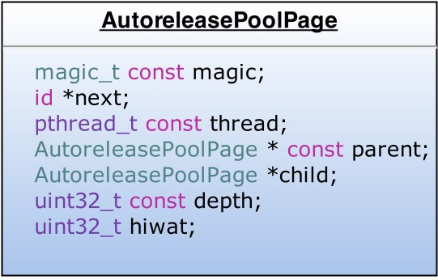
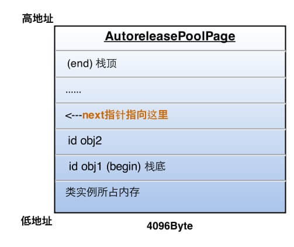
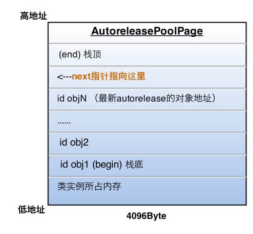

# 黑幕背后的 Autorelease

> 文摘来源：[sunnyxx 的博客：《黑幕背后的 Autorelease》](http://blog.sunnyxx.com/2014/10/15/behind-autorelease/)，有增删。
>  
> 说明：该博客的图片外链已失效（用的微博图床，第三方图床果然靠不住。。），不过可在 [Internet Archive](https://web.archive.org/web/20180727060528/http://blog.sunnyxx.com/2014/10/15/behind-autorelease/) 中找到原图。

Autorelease 机制是 iOS 开发者管理对象内存的好伙伴，

- 在 MRC 中，调用 `[obj autorelease]` 来延迟内存的释放是一件简单自然的事；
- 在 ARC 中，我们甚至可以完全不知道 Autorelease 就能管理好内存。

而在这背后，objc 和编译器都帮我们做了哪些事呢，它们是如何协作来正确管理内存的呢？刨根问底，一起来探究下黑幕背后的 Autorelease 机制。

<h2>目录</h2>

- [黑幕背后的 Autorelease](#黑幕背后的-autorelease)
  - [Autorelease 对象什么时候释放？](#autorelease-对象什么时候释放)
    - [小实验](#小实验)
  - [Autorelease 原理](#autorelease-原理)
    - [AutoreleasePoolPage](#autoreleasepoolpage)
    - [objc_autoreleasePoolPush](#objc_autoreleasepoolpush)
    - [objc_autoreleasePoolPop](#objc_autoreleasepoolpop)
    - [嵌套的 Autorelease Pool](#嵌套的-autorelease-pool)
    - [其他 Autorelease 相关知识点](#其他-autorelease-相关知识点)
  - [Autorelease 返回值的快速释放机制](#autorelease-返回值的快速释放机制)
    - [黑魔法之 Thread Local Storage](#黑魔法之-thread-local-storage)
    - [黑魔法之 `__builtin_return_address`](#黑魔法之-__builtin_return_address)
    - [黑魔法之反查汇编指令](#黑魔法之反查汇编指令)

## Autorelease 对象什么时候释放？

这个问题拿来做面试题，问过很多人，没有几个能答对的。很多答案都是“~~当前作用域大括号结束时释放~~”，显然没有正确理解 Autorelease 的机制。

**在没有手动添加 Autorelease Pool 的情况下，Autorelease 对象是在当前 RunLoop 迭代结束时释放的**。原理请看 [ibireme 的博客：《深入理解 RunLoop 》](https://huanglibo.gitbook.io/notebook/digest/ibireme-runloop#1.-autoreleasepool) 。

### 小实验

```objectivec
__weak id reference = nil;

- (void)viewDidLoad {
    [super viewDidLoad];
    NSString *str = [NSString stringWithFormat:@"避免 tagged Pointer"];
    // str 是一个 autorelease 对象，设置一个 weak 的引用来观察它
    reference = str;
}

- (void)viewWillAppear:(BOOL)animated {
    [super viewWillAppear:animated];
    NSLog(@"%@", reference); // Console: 避免 tagged Pointer
}

- (void)viewDidAppear:(BOOL)animated {
    [super viewDidAppear:animated];
    NSLog(@"%@", reference); // Console: (null)
}
```

~~这个实验同时也证明了 `viewDidLoad` 和 `viewWillAppear` 是在同一个 RunLoop 调用的，`而 viewDidAppear 是在之后的某个` RunLoop 调用的。~~ （由于这个 vc 在 `loadView` 之后便 add 到了 `window` 层级上，所以 `viewDidLoad` 和 `viewWillAppear` 是在同一个 RunLoop 调用的，因此在 `viewWillAppear` 中，这个 autorelease 的变量依然有值。）

当然，我们也可以手动干预 Autorelease 对象的释放时机：

```objectivec
- (void)viewDidLoad {
    [super viewDidLoad];
    @autoreleasepool {
        NSString *str = [NSString stringWithFormat:@"避免 tagged Pointer"];
    }
    NSLog(@"%@", str); // Console: (null)
}
```

## Autorelease 原理

### AutoreleasePoolPage

在 ARC 中，我们使用 `@autoreleasepool{}` 来使用一个 Autorelease Pool ，随后编译器将其改写成下面的样子：

```objectivec
void *context = objc_autoreleasePoolPush();
/* 👇 */
// {}中的代码
/* 👆 */
objc_autoreleasePoolPop(context);
```

而这两个函数都是对 `AutoreleasePoolPage` 的简单封装，所以自动释放机制的核心就在于这个类。

`AutoreleasePoolPage` 是一个 C++ 实现的类，它有这些属性（这些属性继承自 Runtime 中私有的 `AutoreleasePoolPageData` 结构体）：



`AutoreleasePoolPage` 的特性：

- Autorelease Pool 并没有单独的结构，而是由若干个 `AutoreleasePoolPage` 以**双向链表**的形式组合而成，其中 `parent` 指针指向上一个 page ，`child` 指针指向下一个 page ）；
- **Autorelease Pool 与线程是一一对应的**（结构中的 `thread` 指针指向其对应的线程）
- `AutoreleasePoolPage` 每个对象会开辟 4096 字节内存（也就是**虚拟内存一页的大小**）【编者疑问：ARM64 架构上是 16KB ，其他架构上是 4KB ？】，除了自身实例变量所占的空间，剩下的空间全部用来储存 autorelease 对象的地址；
- 上面的 `next` 指针作为**游标**指向栈顶最后 push 进来的 autorelease 对象的下一个位置；
- 一个 `AutoreleasePoolPage` 的空间被占满时，会新建一个 `AutoreleasePoolPage` 对象，通过 `parent` 和 `child` 指针连接链表，之后的 autorelease 对象在新的 page 加入。

所以，若当前线程中只有一个 `AutoreleasePoolPage` 对象，并记录了很多 autorelease 对象地址时，内存如下图：



图中的情况，这一页再加入一个 autorelease 对象就要满了（也就是 `next` 指针马上指向栈顶），这时就要执行上面说的操作，建立下一页 page 对象，与这一页链表连接完成后，新 page 的 `next` 指针被初始化在栈底（ `begin` 的位置），然后继续向栈顶添加新对象。

所以，向一个对象发送 `-autorelease` 消息，就是将这个对象加入到当前 `AutoreleasePoolPage` 的 `next` 指针指向的位置。

### objc_autoreleasePoolPush

每当进行一次 `objc_autoreleasePoolPush` 调用时，Runtime 向当前的 `AutoreleasePoolPage` 中添加一个**哨兵对象**（值为 `nil` ），那么这一个 page 就变成了下面的样子：


### objc_autoreleasePoolPop

`objc_autoreleasePoolPush` 方法的返回值正是这个哨兵对象的地址，被 `objc_autoreleasePoolPop(哨兵对象)` 作为入参，于是，在执行 `pop` 时：

- 根据传入的哨兵对象的地址找到哨兵对象所处的 page ；
- 在当前的 page 中，向所有的晚于哨兵对象插入的 autorelease 对象发送 `-release` 消息，并向回移动 `next` 指针到正确的位置；从最新加入的对象一直向前清理，这个过程可能会向前跨越若干个 page ，直到哨兵对象所在的 page 。

刚才的 `objc_autoreleasePoolPop` 执行后，最终变成了下面的样子：



### 嵌套的 Autorelease Pool

知道了上面的原理，嵌套的 Autorelease Pool 就非常简单了，`pop` 的时候总会释放到上次 `push` 的位置为止，多层的 Pool 就是多个哨兵对象而已，就像剥洋葱一样，每次一层，互不影响。

### 其他 Autorelease 相关知识点

使用容器的 block 版本的枚举器时，内部会自动添加一个 Autorelease Pool ：

```objectivec
[array enumerateObjectsUsingBlock:^(id obj, NSUInteger idx, BOOL *stop) {
    // 这里被一个局部 @autoreleasepool 包围着
}];
```

而普通 `for` 循环和 `for in` 循环中没有这个特性，所以，还是新版的 block 版本枚举器更加方便。当 `for` 循环中遍历产生大量 autorelease 变量时，就需要手加局部 Autorelease Pool 。

## Autorelease 返回值的快速释放机制

值得一提的是，ARC 下，Runtime 有一套对 autorelease 返回值的优化策略。
比如一个工厂方法：

```objectivec
+ (instancetype)createSark {
    return [self new];
}
// caller
Sark *sark = [Sark createSark];
```

秉着谁创建谁释放的原则，返回值需要是一个 autorelease 对象才能配合调用方正确管理内存，于是乎编译器改写成了形如下面的代码：

```objectivec
+ (instancetype)createSark {
    id tmp = [self new];
    return objc_autoreleaseReturnValue(tmp); // 代替我们调用 autorelease
}
// caller
id tmp = objc_retainAutoreleasedReturnValue([Sark createSark]) // 代替我们调用 retain
Sark *sark = tmp;
objc_storeStrong(&sark, nil); // 相当于代替我们调用了 release
```

一切看上去都很好，不过既然编译器知道了这么多信息，干嘛还要劳烦 autorelease 这个开销不小的机制呢？

于是乎，Runtime 使用了一些黑魔法将这个问题解决了。

### 黑魔法之 Thread Local Storage

**Thread Local Storage（TLS）线程局部存储**，目的很简单，将一块内存作为某个线程专有的存储，以 key-value 的形式进行读写，比如在非 ARM 架构下，使用 `pthread` 提供的方法实现：

```objectivec
int pthread_setspecific(pthread_key_t , const void *);
void* pthread_getspecific(pthread_key_t);
```

说它是黑魔法可能被懂 pthread 的笑话- -

- 在返回值身上调用 `objc_autoreleaseReturnValue()` 方法时，Runtime 将这个返回值 object 储存在 `TLS` 中，然后直接返回这个 object（不调用 `-autorelease` ）；
- 同时，在外部接收这个返回值的 `objc_retainAutoreleasedReturnValue()` 里，发现 `TLS` 中正好存了这个对象，那么直接返回这个 object（不调用 `-retain` ）。

于是乎，调用方和被调方利用 `TLS` 做中转，很有默契的免去了对返回值的内存管理。

于是问题又来了，假如被调方和主调方只有一边是 ARC 环境编译的该咋办？（比如我们在 ARC 环境下用了非 ARC 编译的第三方库，或者反之）

只能动用更高级的黑魔法。

### 黑魔法之 `__builtin_return_address`

这个内建函数原型是 `char *__builtin_return_address(int level)` ，作用是得到函数的返回地址，参数表示层数，如 `__builtin_return_address(0)` 表示当前函数体返回地址，传 `1` 是调用这个函数的外层函数的返回值地址，以此类推。

示例：

```objectivec
- (int)foo {
    NSLog(@"%p", __builtin_return_address(0)); // 根据这个地址能找到下面ret的地址
    return 1;
}
// caller
int ret = [sark foo];
```

看上去也没啥厉害的，不过要知道，函数的返回值地址，也就对应着调用者结束这次调用的地址（或者相差某个固定的偏移量，根据编译器决定）
也就是说，被调用的函数也有翻身做地主的机会了，可以反过来对主调方干点坏事。
回到上面的问题，**如果一个函数返回前知道调用方是 ARC 还是非 ARC ，就有机会对于不同情况做不同的处理**。

### 黑魔法之反查汇编指令

通过上面的 `__builtin_return_address` 加某些偏移量，被调方可以定位到主调方在返回值后面的汇编指令：

```objectivec
// caller
int ret = [sark foo];
// 内存中接下来的汇编指令
...
```

而这些汇编指令在内存中的值是固定的，比如 `movq` 对应着 `0x48` 。
于是乎，就有了下面的这个函数，入参是调用方 `__builtin_return_address` 传入值。

> 说明：原文中附的 `callerAcceptsFastAutorelease()` 方法已在新版 Runtime 中被改名为 `callerAcceptsOptimizedReturn()` ，且不同架构的实现不一样。

`callerAcceptsOptimizedReturn()` 检验了主调方在返回值之后是否紧接着调用了 `objc_retainAutoreleasedReturnValue()` ，如果是，就知道了外部是 ARC 环境，反之就走没被优化的老逻辑。

1、`callerAcceptsOptimizedReturn()` 在 `__arm64__` 架构的实现：

```objectivec
static ALWAYS_INLINE bool 
callerAcceptsOptimizedReturn(const void *ra)
{
    // fd 03 1d aa    mov fp, fp
    // arm64 instructions are well-aligned
    if (*(uint32_t *)ra == 0xaa1d03fd) {
        return true;
    }
    return false;
}
```

2、`callerAcceptsOptimizedReturn()` 在 `__x86_64__` 的实现：

```objectivec
static ALWAYS_INLINE bool 
callerAcceptsOptimizedReturn(const void * const ra0)
{
    const uint8_t *ra1 = (const uint8_t *)ra0;
    const unaligned_uint16_t *ra2;
    const unaligned_uint32_t *ra4 = (const unaligned_uint32_t *)ra1;
    const void **sym;
    
    // 48 89 c7    movq  %rax,%rdi
    // e8          callq symbol
    if (*ra4 != 0xe8c78948) {
        return false;
    }
    ra1 += (long)*(const unaligned_int32_t *)(ra1 + 4) + 8l;
    ra2 = (const unaligned_uint16_t *)ra1;
    // ff 25       jmpq *symbol@DYLDMAGIC(%rip)
    if (*ra2 != 0x25ff) {
        return false;
    }

    ra1 += 6l + (long)*(const unaligned_int32_t *)(ra1 + 2);
    sym = (const void **)ra1;
    if (*sym != objc_retainAutoreleasedReturnValue  &&  
        *sym != objc_unsafeClaimAutoreleasedReturnValue) 
    {
        return false;
    }

    return true;
}
```
