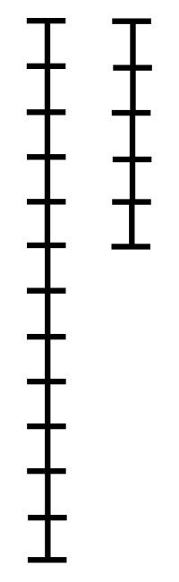
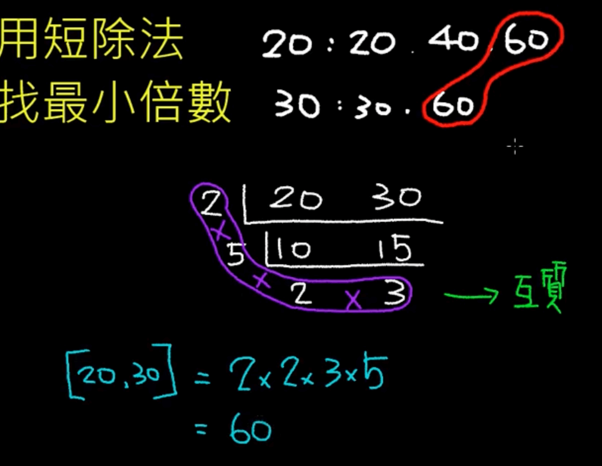

# 数论基础<!-- omit in toc -->

- [1. 约数（因数）](#1-约数因数)
  - [1.1. 约数的性质](#11-约数的性质)
  - [1.2. 约数与其他概念的关系](#12-约数与其他概念的关系)
- [2. 互质](#2-互质)
  - [2.1. 互质的性质](#21-互质的性质)
- [3. 最大公约数](#3-最大公约数)
  - [3.1. 最大公约数的性质](#31-最大公约数的性质)
- [4. 欧几里德算法（辗转相除法）](#4-欧几里德算法辗转相除法)
  - [4.1. 算法原理](#41-算法原理)
  - [4.2. 算法步骤](#42-算法步骤)
  - [4.3. 代码实现（Python）](#43-代码实现python)
  - [4.4. 动画演示](#44-动画演示)
- [5. 最小公倍数](#5-最小公倍数)
  - [5.1. 最小公倍数的计算方法](#51-最小公倍数的计算方法)
  - [5.2. 编程实现（Python）](#52-编程实现python)
  - [5.3. 手算最小公倍数](#53-手算最小公倍数)
- [6. 丢番图方程](#6-丢番图方程)
- [7. 线性丢番图方程](#7-线性丢番图方程)
- [8. 裴蜀定理（贝祖定理）](#8-裴蜀定理贝祖定理)
  - [8.1. 裴蜀定理的定义方式之一](#81-裴蜀定理的定义方式之一)
  - [8.2. 裴蜀定理定义的方式之二](#82-裴蜀定理定义的方式之二)
  - [8.3. 裴蜀定理的推论](#83-裴蜀定理的推论)
  - [8.4. 裴蜀定理的意义](#84-裴蜀定理的意义)
  - [8.5. 示例: 判断 3x + 5y = 1 有整数解吗？](#85-示例-判断-3x--5y--1-有整数解吗)
- [9. 扩展欧几里德算法](#9-扩展欧几里德算法)
  - [9.1. 扩展欧几里德算法的应用](#91-扩展欧几里德算法的应用)

## 1. 约数（因数）

约数，也称为因数，是指能够整除一个整数的整数。也就是说，如果整数a能被整数b整除（没有余数），那么我们就说b是a的约数，或者a是b的倍数。

### 1.1. 约数的性质

任何非零整数的约数至少有1和它本身。
质数只有两个约数：1和它本身。
合数至少有三个约数。

### 1.2. 约数与其他概念的关系

公约数： 两个或多个整数共有的约数称为公约数。
最大公约数： 几个整数的公约数中最大的一个。
倍数： 如果一个数能被另一个数整除，那么这个数就是另一个数的倍数。
最小公倍数： 几个整数的公倍数中最小的一个。

## 2. 互质

互质，在数学中，是指两个或多个整数的最大公约数是 $1$。换句话说，除了 $1$ 之外，它们没有其他的共同因数。

### 2.1. 互质的性质

- 任何一个质数与任何一个比它小的自然数互质。
- $1$ 与任何一个自然数互质。
- 如果 $a$ 和 $b$ 互质，那么 $a$ 和 $b$ 的任意整数倍也互质。

## 3. 最大公约数

最大公约数（Greatest Common Divisor，GCD），是指能够同时整除这两个整数的最大正整数。

### 3.1. 最大公约数的性质

- $0$ 和任何非零整数的最大公约数都是该非零整数本身。 这是因为任何非零整数都能整除 $0$。
- $0$ 和 $0$ 的最大公约数是未定义的或者说是不存在的。

## 4. 欧几里德算法（辗转相除法）

欧几里德算法，又称辗转相除法，是一种高效求两个非负整数最大公约数的算法。

### 4.1. 算法原理

两个整数的最大公约数等于其中较小的数和两数相除余数的最大公约数。也就是说：

$$
gcd(a, b) = gcd(b, a\ mod\ b)
$$

其中，$gcd(a, b)$ 表示 $a$ 和 $b$ 的最大公约数，$a\ mod\ b$ 表示 $a$ 除以 $b$ 的余数。

### 4.2. 算法步骤

1. 输入：两个非负整数 `a` 和 `b`。
2. 判断：如果 `b` 等于 `0` ，则返回 `a` 作为最大公约数。
3. 计算余数：计算 `a` 除以 `b` 的余数 `r`。
4. 递归：将问题转化为求 `b` 和 `r` 的最大公约数，即递归调用函数求 `gcd(b, r)`。
5. 返回：返回递归调用得到的最大公约数。

### 4.3. 代码实现（Python）

```python
def gcd(a, b):
    if b == 0:
        return a
    else:
        return gcd(b, a % b)
```

### 4.4. 动画演示



## 5. 最小公倍数

最小公倍数（Least Common Multiple，简称LCM）是指两个或多个整数的公倍数中，最小的正整数。通俗来说，就是能同时被这些整数整除的最小正整数。

### 5.1. 最小公倍数的计算方法

利用最大公约数： 两个数的乘积等于这两个数的最大公约数和最小公倍数的乘积。因此，如果我们已经求出了两个数的最大公约数（通常用欧几里德算法），就可以很容易地求出最小公倍数。

$$
lcm(a, b) = (a * b) / gcd(a, b)
$$

其中：

- $lcm(a, b)$ 表示 $a$ 和 $b$ 的最小公倍数
- $gcd(a, b)$ 表示 $a$ 和 $b$ 的最大公约数

### 5.2. 编程实现（Python）

```python
def gcd(a, b):
    if b == 0:
        return a
    else:
        return gcd(b, a % b)

def lcm(a, b):
    return (a * b) // gcd(a, b)

# 示例
print(lcm(12, 18))  # 输出：36
```

### 5.3. 手算最小公倍数



## 6. 丢番图方程

丢番图方程（Diophantine equation） 是指一个或多个未知数的整系数多项式不定方程。

$$
a_nx^n + a_{n-1}x^{n-1} + ... + a_1x + a_0 = 0
$$

其中：

- $x$ 是未知数
- $a_n, a_{n-1}, ..., a_1, a_0$ 是整数系数
- $n$ 是一个非负整数，表示方程的次数

## 7. 线性丢番图方程

线性丢番图方程是指形如：

$$
ax + by = c
$$

的方程，其中：

- $a, b, c$ 是已知的整数
- $x, y$ 是未知数

## 8. 裴蜀定理（贝祖定理）

裴蜀定理，又称贝祖定理，是一个关于最大公约数的定理。它告诉我们：

### 8.1. 裴蜀定理的定义方式之一

对任意两个整数 $a$ 和 $b$， 设 $d$ 是它们的最大公约数。那么关于未知数 $x$ 和 $y$ 的线性丢番图方程（称为裴蜀等式）：

$$
ax + by = m
$$

有整数解 $(x, y)$ 当且仅当 $m$ 是 $d$ 的倍数。裴蜀等式有解时必然有无穷多个解。

例如，假设 a = 12，b = 18，那么 gcd(12, 18) = 6。根据裴蜀定理，存在整数 x 和 y，使得 12x + 18y = 6。通过扩展欧几里得算法，我们可以求得一组解，例如 x = -1，y = 1。

### 8.2. 裴蜀定理定义的方式之二

**对于任意不全为零的整数 $a$ 和 $b$，存在整数 $x$ 和 $y$，满足 $gcd(a, b)|ax + by$， 且存在整数 $x$ 和 $y$，使得：**

$$
ax + by = gcd(a, b)
$$

其中，$gcd(a, b)$ 表示 $a$ 和 $b$ 的最大公约数。

特别来说，方程 $ax + by = 1$ 有整数解当且仅当整数 $a$ 和 $b$ 互素（$a$ 和 $b$ 互素时，$gcd(a, b) 的值为 1$）。

### 8.3. 裴蜀定理的推论

**$a$ 和 $b$ 互质的充分必要条件是存在整数 $x$ 和 $y$ 使 $ax+by=1$.**

### 8.4. 裴蜀定理的意义

- **线性丢番图方程的解的存在性**： 裴蜀定理为判断线性丢番图方程是否有整数解提供了依据。如果一个线性丢番图方程 ax + by = c 有整数解，那么 c 一定是 gcd(a, b) 的倍数。
- **扩展欧几里得算法**： 扩展欧几里得算法就是用来求解裴蜀等式中 x 和 y 的值的一种高效算法。
- **模运算的基础**： 裴蜀定理在模运算、同余式等数论问题中有着广泛的应用。

### 8.5. 示例: 判断 3x + 5y = 1 有整数解吗？

答案是：有整数解。

- 计算最大公约数： gcd(3, 5) = 1。
- 判断条件： 如果一个线性丢番图方程 ax + by = c 有整数解，那么 c 一定是 a 和 b 的最大公约数的倍数。
- 结论： 由于 1 能整除 1，所以方程 3x + 5y = 1 一定有整数解。

## 9. 扩展欧几里德算法

扩展欧几里德算法是欧几里德算法的扩展，它不仅能求出两个非负整数 $a$ 和 $b$ 的最大公约数 $gcd(a, b)$，还能找到整数 $x$ 和 $y$，使得：

$$
ax + by = gcd(a, b)
$$

这个等式被称为贝祖等式（或“裴蜀等式”）。

### 9.1. 扩展欧几里德算法的应用

- 求解线性同余方程： 在数论和密码学中，经常会遇到形如 $ax \equiv b (mod n)$ 的线性同余方程，而扩展欧几里德算法是求解这类方程的重要工具。
- 求模逆元： 如果 $gcd(a, n) = 1$，那么 $a$ 在模 $n$ 意义下有**乘法逆元**。扩展欧几里德算法可以用来求这个乘法逆元。
