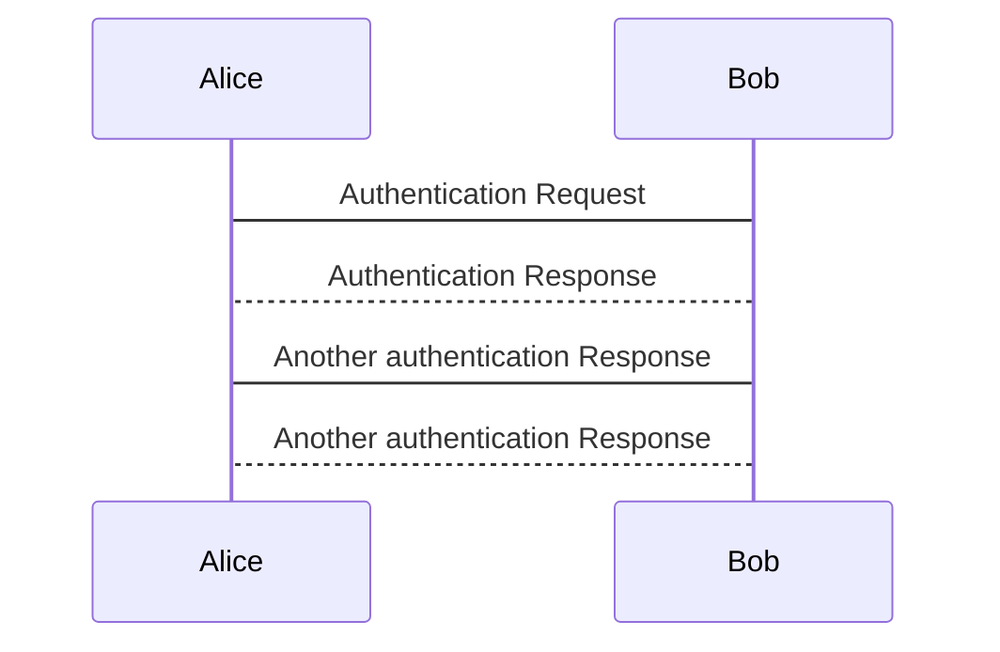

# FAQ for PlantUML<!-- omit in toc -->

- [1. Tools](#1-tools)
- [2. How to integrate UML diagrams into GitLab or GitHub](#2-how-to-integrate-uml-diagrams-into-gitlab-or-github)
  - [2.1. Option 1: Using `mermaid`](#21-option-1-using-mermaid)
  - [2.2. Option 2: Using PlantUML Proxy Server](#22-option-2-using-plantuml-proxy-server)

## 1. Tools

- [PlantUML Web Server (Live Editor)](http://www.plantuml.com/plantuml)
- [Mermaid Live Editor](https://mermaid.live/)

## 2. How to integrate UML diagrams into GitLab or GitHub

> Reference: [stackoverflow](https://stackoverflow.com/a/32771815)

### 2.1. Option 1: Using `mermaid`

> Note: This tool works in both *GitHub* and *VS Code*, but **doesn't work in *GitBook***.

**Source**:

```uml
sequenceDiagram
Alice -> Bob: Authentication Request
Bob --> Alice: Authentication Response
Alice -> Bob:Another authentication Response
Bob --> Alice: Another authentication Response
```

**Preview** by using [mermaid](https://mermaid-js.github.io/):



### 2.2. Option 2: Using PlantUML Proxy Server

> Documentation: [PlantUML Server](http://plantuml.com/server.html)

**Source**:

```markdown

```

**Preview** by using PlantUML server:


