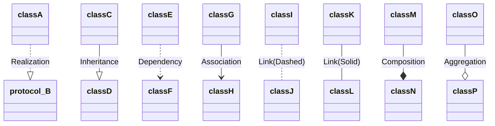
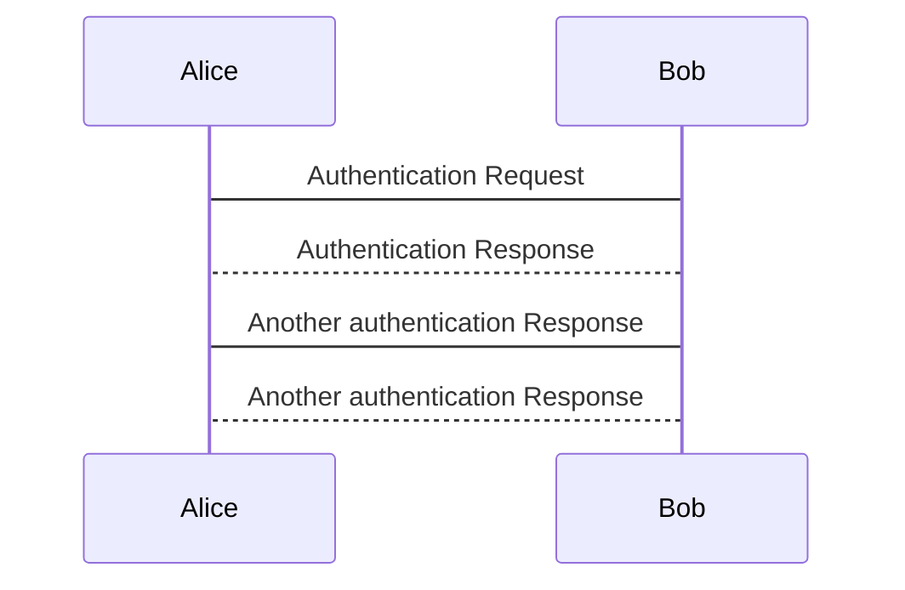

# FAQ for PlantUML<!-- omit in toc -->

- [1. Tools](#1-tools)
- [2. Relationship in UML](#2-relationship-in-uml)
- [3. How to integrate UML diagrams into GitLab or GitHub](#3-how-to-integrate-uml-diagrams-into-gitlab-or-github)
  - [3.1. Option 1: Using `mermaid`](#31-option-1-using-mermaid)
  - [3.2. Option 2: Using PlantUML Proxy Server](#32-option-2-using-plantuml-proxy-server)

## 1. Tools

- [PlantUML Web Server (Live Editor)](http://www.plantuml.com/plantuml)
- [Mermaid Live Editor](https://mermaid.live/)

## 2. Relationship in UML

**Source**:

```uml
@startuml
classA ..|> protocol_B : Realization
classC --|> classD : Inheritance
classE ..> classF : Dependency
classG --> classH : Association
classI .. classJ : Link(Dashed)
classK -- classL : Link(Solid)
classM --* classN : Composition
classO --o classP : Aggregation
@enduml
```

**Preview** by using mermaid:



## 3. How to integrate UML diagrams into GitLab or GitHub

> Reference: [stackoverflow](https://stackoverflow.com/a/32771815)

### 3.1. Option 1: Using `mermaid`

> Note: This tool works in both *GitHub* and *VS Code*, but **doesn't work in *GitBook***.

**Source**:

```uml
sequenceDiagram
Alice -> Bob: Authentication Request
Bob --> Alice: Authentication Response
Alice -> Bob:Another authentication Response
Bob --> Alice: Another authentication Response
```

**Preview** by using [mermaid](https://mermaid-js.github.io/):



### 3.2. Option 2: Using PlantUML Proxy Server

> Documentation: [PlantUML Server](http://plantuml.com/server.html)

**Source**:

```markdown

```

**Preview** by using PlantUML server:


