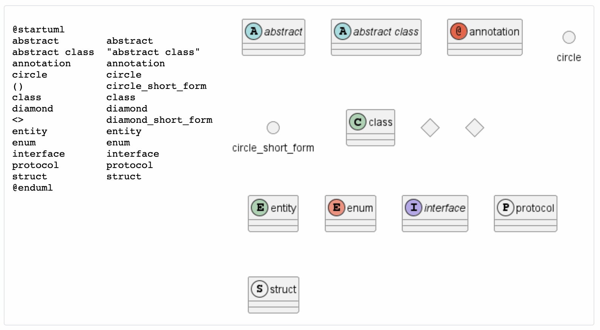
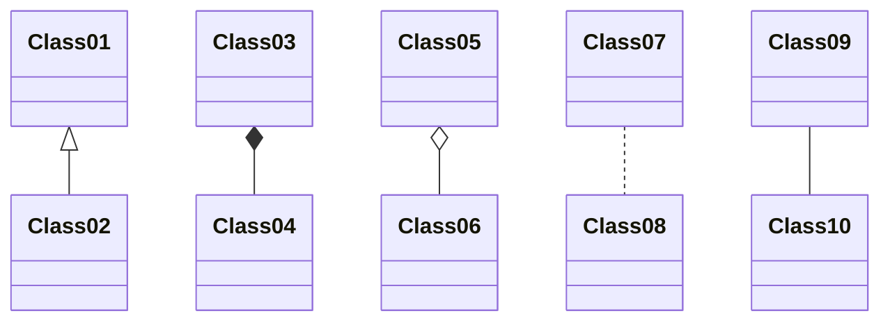
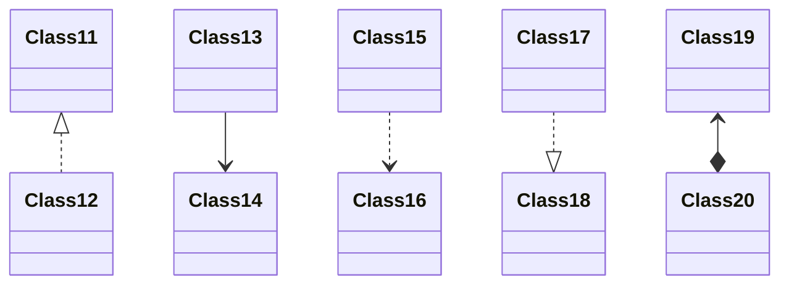
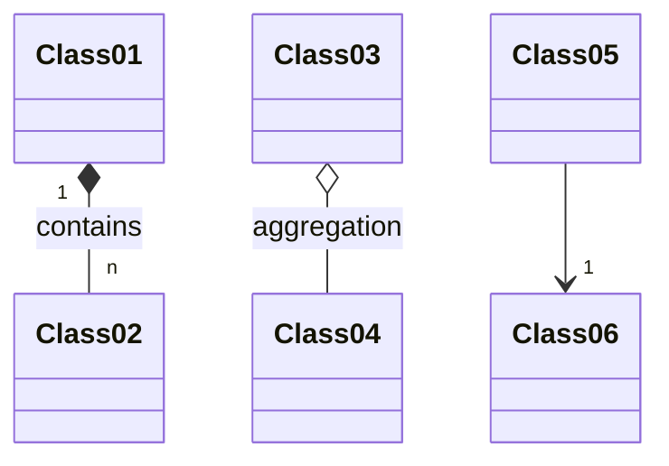
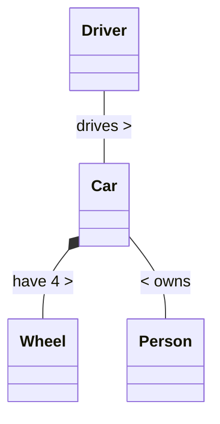

# Class Diagram<!-- omit in toc -->

> Source: [*PlantUML: Class Diagram*](https://plantuml.com/en/class-diagram)  
> Digest Date: *January 15, 2023*  

**Note**: The UML preview of this documentation is powered by **mermaid**, some PlantUML symbols are not supported by mermaid(e.g. `#--`), so I didn't record these special symbols.

- [1. Declaring Element](#1-declaring-element)
- [2. Relations between Classes](#2-relations-between-classes)
- [3. Label on Relations](#3-label-on-relations)
- [4. Using non-letters in element names and relation labels](#4-using-non-letters-in-element-names-and-relation-labels)

## 1. Declaring Element



**Note**: `protocol` and `struct` was added in [PR-1028](https://github.com/plantuml/plantuml/pull/1028).

## 2. Relations between Classes

Relations between classes are defined using the following symbols :

| Type        | Symbol | Drawing                               |
|-------------|--------|---------------------------------------|
| Extension   | `<|--` |  |
| Composition | `*--`  |  |
| Aggregation | `o--`  |  |

It is possible to replace `--` by `..` to have a dotted line.

Knowing those rules, it is possible to draw the following drawings:

**Source**:

```uml
@startuml
Class01 <|-- Class02
Class03 *-- Class04
Class05 o-- Class06
Class07 .. Class08
Class09 -- Class10
@enduml
```

**Preview by using mermaid**:



---

**Source**:

```uml
@startuml
Class11 <|.. Class12
Class13 --> Class14
Class15 ..> Class16
Class17 ..|> Class18
Class19 <--* Class20
@enduml
```

**Preview by using mermaid**:



## 3. Label on Relations

It is possible to add a label on the relation, using `:` , followed by the text of the label.

For cardinality, you can use double-quotes `""` on each side of the relation.

**Source**:

```uml
@startuml
Class01 "1" *-- "many" Class02 : contains
Class03 o-- Class04 : aggregation
Class05 --> "1" Class06
@enduml
```

**Preview by using mermaid**:



You can add an extra arrow pointing at one object showing which object acts on the other object, using `<` or `>` at the begin or at the end of the label.

**Source**:

```uml
@startuml
class Car
Driver - Car : drives >
Car *- Wheel : have 4 >
Car -- Person : < owns
@enduml
```

**Preview by using mermaid**:



> Warning: This feature is not fully supported by mermaid.

## 4. Using non-letters in element names and relation labels
