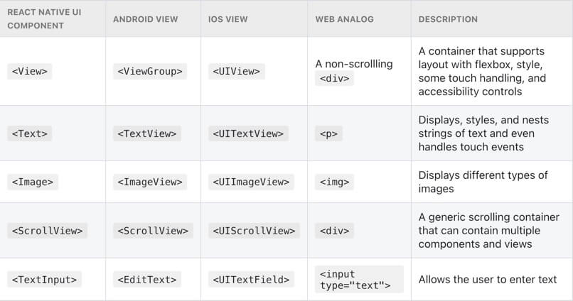

# React Native 101

文档：[React Native - getting started](https://reactnative.dev/docs/getting-started)

## 前置课程：JavaScript

想快速熟悉 `JavaScript` ，推荐阅读 [MDN Web Docs](https://developer.mozilla.org/) 的这两份文档：

- [A re-introduction to JavaScript (JS tutorial)](https://developer.mozilla.org/en-US/docs/Web/JavaScript/A_re-introduction_to_JavaScript)
- [JavaScript Docs](https://developer.mozilla.org/en-US/docs/Web/JavaScript)

## Function Components & Class Components

组件有两种写法，classes 或 functions 。

*Function Components*（推荐写法）：

```javascript
import React from 'react';
import { Text, View } from 'react-native';

const HelloWorldApp = () => {
  return (
    <View style={{
        flex: 1,
        justifyContent: 'center',
        alignItems: 'center'
      }}>
      <Text>Hello, world!</Text>
    </View>
  );
}

export default HelloWorldApp;
```

*Class Components* ：

```javascript
import React, { Component } from 'react';
import { Text, View } from 'react-native';

class HelloWorldApp extends Component {
  render() {
    return (
      <View style={{
          flex: 1,
          justifyContent: "center",
          alignItems: "center"
        }}>
        <Text>Hello, world!</Text>
      </View>
    );
  }
}

export default HelloWorldApp;
```

## Native Components & Core Components

React Native 在 **runtime** 期间为这些组件创建相应的原生的控件。

React Native 内置了一些常用的 *Native Components* ，它们被称为 React Native 的 *Core Components* 。开发者也可以根据实际需求构建自己的组件。

> 相关链接🔗 ：[所有 Core Components 的文档](https://reactnative.dev/docs/components-and-apis)。

最常用的 *Core Components*（[截图来源](https://reactnative.dev/docs/intro-react-native-components#core-components)）：



示例：

```javascript
import React from 'react';
import { View, Text, Image, ScrollView, TextInput } from 'react-native';

const App = () => {
  return (
    <ScrollView>
      <Text>Some text</Text>
      <View>
        <Text>Some more text</Text>
        <Image
          source={{
            uri: 'https://reactnative.dev/docs/assets/p_cat2.png',
          }}
          style={{ width: 200, height: 200 }}
        />
      </View>
      <TextInput
        style={{
          height: 40,
          borderColor: 'gray',
          borderWidth: 1
        }}
        defaultValue="You can type in me"
      />
    </ScrollView>
  );
}

export default App;
```

各类组件的关系图：


## React 基础

> [React 的官方文档](https://reactjs.org/docs/getting-started.html)

React 的核心概念：

- components
- JSX
- props
- state

### 你的第一个组件

示例代码：

```javascript
import React from 'react';
import { Text } from 'react-native';

const Cat = () => {
  return (
    <Text>Hello, I am your cat!</Text>
  );
}

export default Cat;
```

这个组件以 function 开头：

```javascript
const Cat = () => {};
```

*Function Components* 返回的内容会被渲染成 **React element** 。这个 Cat 组件将被渲染成 `<Text>` 元素。

最后，使用 JavaScript 的 [export default](https://developer.mozilla.org/en-US/docs/Web/JavaScript/Reference/Statements/export) 导出这个组件。

**说明**：其他导出组件方式可参考这个 [handy cheatsheet on JavaScript imports and exports](https://medium.com/dailyjs/javascript-module-cheatsheet-7bd474f1d829) 。

### JSX

> React 的官方文档中关于 JSX 的介绍：[a comprehensive guide to JSX](https://reactjs.org/docs/jsx-in-depth.html) 。

React 和 React Native 都可使用 JSX ，这种 JavaScript 语法使 React 元素的编写更便利。由于 JSX 是 JavaScript ，因此可以在 JSX 内使用变量，如下面 `<Text>` 组件使用中的 `name` 变量（在 JSX 中使用花括号 `{}` 包裹）：

```javascript
import React from 'react';
import { Text } from 'react-native';

const Cat = () => {
  const name = "Maru";
  return (
    <Text>Hello, I am {name}!</Text>
  );
}

export default Cat;
```

任何 JavaScript 表达式都可放在花括号中执行，如下面代码中的 `{getFullName("Rum", "Tum", "Tugger")}` 方法调用：

```javascript
import React from 'react';
import { Text } from 'react-native';

const getFullName = (firstName, secondName, thirdName) => {
  return firstName + " " + secondName + " " + thirdName;
}

const Cat = () => {
  return (
    <Text>
      Hello, I am {getFullName("Rum", "Tum", "Tugger")}!
    </Text>
  );
}

export default Cat;
```

**说明**：由于 JSX 是包含在 React 库中的，因此需要在文件的开头导入：`import React from 'react'` 。

### 自定义组件

可以在自定义的组件中将不同的 *Core Components* 组合起来，形成一个新的组件，React Native 会一起渲染它们：

```javascript
import React from 'react';
import { Text, TextInput, View } from 'react-native';

const Cat = () => {
  return (
    <View>
      <Text>Hello, I am...</Text>
      <TextInput
        style={{
          height: 40,
          borderColor: 'gray',
          borderWidth: 1
        }}
        defaultValue="Name me!"
      />
    </View>
  );
}

export default Cat;
```

在其他组件中可以使用封装好的组件。在下面的 `Cafe` 组件中，通过 `<Cat />` 使用封装好的 `Cat` 组件：

```javascript
import React from 'react';
import { Text, View } from 'react-native';

const Cat = () => {
  return (
    <View>
      <Text>I am also a cat!</Text>
    </View>
  );
}

const Cafe = () => {
  return (
    <View>
      <Text>Welcome!</Text>
      <Cat />
      <Cat />
      <Cat />
    </View>
  );
}

export default Cafe;
```

包含其他组件的称为 parent component 。在上述例子中，`Cafe` 是 parent component ，`Cat` 是 child component 。

在 `Cafe` 组件中可以添加任意多的 `Cat` 组件。每个 `<Cat>` 渲染为一个独立的 element ，可以使用 `props` 来分别定制它们。

## Props

`Props` 是 Properties 的简写。可以使用 `Props` 自定义 React 组件。例如，在下面的代码中，为每个 `<Cat>` 组件传入了不同的 `name` 变量：

```javascript
import React from 'react';
import { Text, View } from 'react-native';

const Cat = (props) => {
  return (
    <View>
      <Text>Hello, I am {props.name}!</Text>
    </View>
  );
}

const Cafe = () => {
  return (
    <View>
      <Cat name="Maru" />
      <Cat name="Jellylorum" />
      <Cat name="Spot" />
    </View>
  );
}

export default Cafe;
```

React Native 的大部分 *Core Components* 可以使用 `props` 来自定义，比如，在使用 [Image](https://reactnative.dev/docs/image) 组件时，可以传递一个名为 `source` 的 prop 来指定 image 的来源：

```javascript
import React from 'react';
import { Text, View, Image } from 'react-native';

const CatApp = () => {
  return (
    <View>
      <Image
        source={{uri: "https://reactnative.dev/docs/assets/p_cat1.png"}}
        style={{width: 200, height: 200}}
      />
      <Text>Hello, I am your cat!</Text>
    </View>
  );
}

export default CatApp;
```

`Image` 组件有许多不同的 `props` ，比如 `style` ，它接受*设计*和*布局*相关的`属性-值`对的 JS 对象 。详情可参考 [Image 组件的文档](https://reactnative.dev/docs/image#props)。

**说明**：

> Notice the double curly braces `{{ }}` surrounding `style`‘s width and height.  
>  
> In JSX, JavaScript values are referenced with `{}`. This is handy if you are passing something other than a string as props, like an array or number: `<Cat food={["fish", "kibble"]} age={2} />`.
>  
> However, JS objects are also denoted with curly braces: `{width: 200, height: 200}`. **Therefore, to pass a JS object in JSX, you must wrap the object in another pair of curly braces**: `{{width: 200, height: 200}}`

## State

`props` 是用来配置组件的渲染方式的参数，而 `state` 是组件的 personal data storage 。`state` 用于*数据随时间变化*或*根据用户的交互而变化*的场景。State gives your components memory!

> As a general rule, use props to configure a component when it renders. Use state to keep track of any component data that you expect to change over time.

在下面的例子中，猫咖啡馆中的两只猫等着被投喂。它们的饥饿状态以 state 的方式存储，且会在点击“投喂”按钮后发生变化（不同于它们的名字，名字是固定不变的）。

开发者可以调用 [React’s useState Hook](https://reactjs.org/docs/hooks-state.html) 来给组件添加 `state` 。

> A Hook is a kind of function that lets you “hook into” React features. For example, `useState` is a Hook that lets you add state to function components.
>  
> You can learn more about [other kinds of Hooks in the React documentation](https://reactjs.org/docs/hooks-intro.html).

示例：

```javascript
import React, { useState } from "react";
import { Button, Text, View } from "react-native";

const Cat = (props) => {
  const [isHungry, setIsHungry] = useState(true);

  return (
    <View>
      <Text>
        I am {props.name}, and I am {isHungry ? "hungry" : "full"}!
      </Text>
      <Button
        onPress={() => {
          setIsHungry(false);
        }}
        disabled={!isHungry}
        title={isHungry ? "Pour me some milk, please!" : "Thank you!"}
      />
    </View>
  );
}

const Cafe = () => {
  return (
    <>
      <Cat name="Munkustrap" />
      <Cat name="Spot" />
    </>
  );
}

export default Cafe;
```

接下来对上述代码进行解读。

首先，需要从 React 中导入 `useState` ：

```javascript
import React, { useState } from 'react';
```

然后，通过在组件的函数中调用 `useState` 来声明组件的*状态*，在这个例子中，`useState` 创建了一个 `isHungry` *状态*变量：

```javascript
const Cat = (props) => {
  const [isHungry, setIsHungry] = useState(true);
  // ...
};
```

> You can use `useState` to track any kind of data: `strings`, `numbers`, `Booleans`, `arrays`, `objects`. For example, you can track the number of times a cat has been petted with `const [timesPetted, setTimesPetted] = useState(0)`!

调用 `useState` 做了两件事情：

- 创建一个含初值的 `state` 变量；
- 创建一个函数来设置 `state` 变量的值。

命名规则建议：`[<getter>, <setter>] = useState(<initialValue>)` 。

接下来，添加了 [Button](https://reactnative.dev/docs/button) *Core Component* ，并设置了 `onPress` prop ：

```javascript
<Button
  onPress={() => {
    setIsHungry(false);
  }}
  //..
/>
```

当用户点击按钮时，会触发 `onPress` ，然后调用 `setIsHungry(false)` ，将 `isHungry` state 变量设置为 `false` 。当 `isHungry` 为 `false` 时，`Button` 组件的 `disable` prop 会被设置成 `true` ，且 `title` 也会改变：

```javascript
<Button
  //..
  disabled={!isHungry}
  title={isHungry ? 'Pour me some milk, please!' : 'Thank you!'}
/>
```

> You might’ve noticed that although `isHungry` is a `const`, it is seemingly reassignable! What is happening is when a state-setting function like `setIsHungry` is called, its component will re-render. In this case the `Cat` function will run again—and this time, `useState` will give us the next value of `isHungry`.

最后，把 `Cat` 组件添加到 `Cafe` 组件中：

```javascript
const Cafe = () => {
  return (
    <>
      <Cat name="Munkustrap" />
      <Cat name="Spot" />
    </>
  );
};
```

>See the `<>` and `</>` above? These bits of JSX are [fragments](https://reactjs.org/docs/fragments.html). Adjacent JSX elements must be wrapped in an enclosing tag. Fragments let you do that without nesting an extra, unnecessary wrapping element like `View`.
