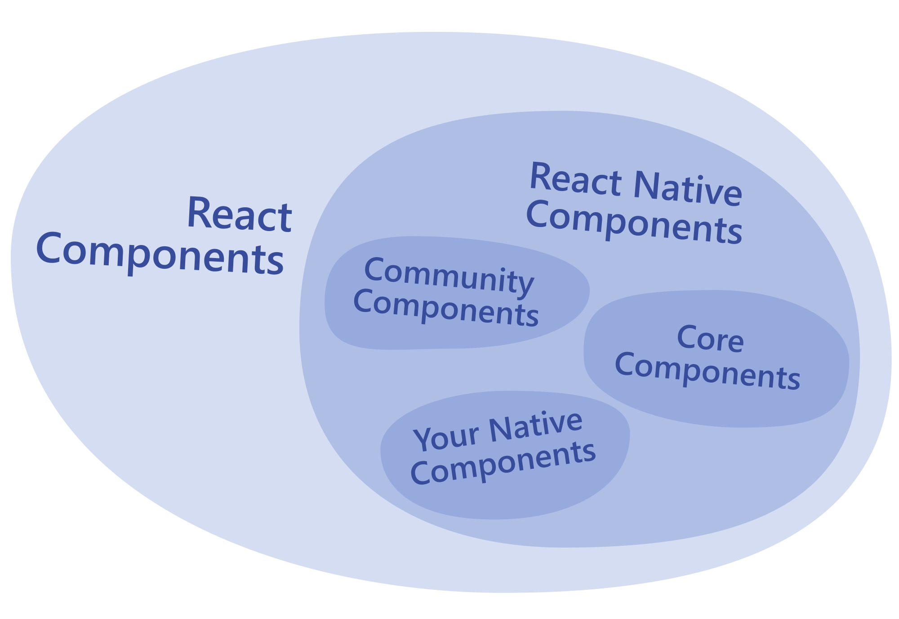

# React Native 101

文档：[React Native - getting started](https://reactnative.dev/docs/getting-started)

## 前置课程：JavaScript

想快速熟悉 `JavaScript` ，推荐阅读 [MDN Web Docs](https://developer.mozilla.org/) 的这两份文档：

- [A re-introduction to JavaScript (JS tutorial)](https://developer.mozilla.org/en-US/docs/Web/JavaScript/A_re-introduction_to_JavaScript)
- [JavaScript Docs](https://developer.mozilla.org/en-US/docs/Web/JavaScript)

## Function Components 和 Class Components

组件有两种写法，classes 或 functions 。

*Function Components*（推荐写法）：

```javascript
import React from 'react';
import { Text, View } from 'react-native';

const HelloWorldApp = () => {
  return (
    <View style={{
        flex: 1,
        justifyContent: 'center',
        alignItems: 'center'
      }}>
      <Text>Hello, world!</Text>
    </View>
  );
}

export default HelloWorldApp;
```

*Class Components* ：

```javascript
import React, { Component } from 'react';
import { Text, View } from 'react-native';

class HelloWorldApp extends Component {
  render() {
    return (
      <View style={{
          flex: 1,
          justifyContent: "center",
          alignItems: "center"
        }}>
        <Text>Hello, world!</Text>
      </View>
    );
  }
}

export default HelloWorldApp;
```

## Native Components & Core Components

React Native 在 **runtime** 期间为这些组件创建相应的原生的控件。

React Native 内置了一些常用的 *Native Components* ，它们被称为 React Native 的 *Core Components* 。开发者也可以根据实际需求构建自己的组件。

> 相关链接🔗 ：[所有 Core Components 的文档](https://reactnative.dev/docs/components-and-apis)。

最常用的 *Core Components*（[截图来源](https://reactnative.dev/docs/intro-react-native-components#core-components)）：


示例：

```javascript
import React from 'react';
import { View, Text, Image, ScrollView, TextInput } from 'react-native';

const App = () => {
  return (
    <ScrollView>
      <Text>Some text</Text>
      <View>
        <Text>Some more text</Text>
        <Image
          source={{
            uri: 'https://reactnative.dev/docs/assets/p_cat2.png',
          }}
          style={{ width: 200, height: 200 }}
        />
      </View>
      <TextInput
        style={{
          height: 40,
          borderColor: 'gray',
          borderWidth: 1
        }}
        defaultValue="You can type in me"
      />
    </ScrollView>
  );
}

export default App;
```

各类组件的关系图：



## React 基础

> [React 的官方文档](https://reactjs.org/docs/getting-started.html)

React 的核心概念：

- components
- JSX
- props
- state

### 你的第一个组件

示例代码：

```javascript
import React from 'react';
import { Text } from 'react-native';

const Cat = () => {
  return (
    <Text>Hello, I am your cat!</Text>
  );
}

export default Cat;
```

这个组件以 function 开头：

```javascript
const Cat = () => {};
```

*Function Components* 返回的内容会被渲染成 **React element** 。这个 Cat 组件将被渲染成 `<Text>` 元素。

最后，使用 JavaScript 的 [export default](https://developer.mozilla.org/en-US/docs/Web/JavaScript/Reference/Statements/export) 导出这个组件。

**说明**：其他导出组件方式可参考这个 [handy cheatsheet on JavaScript imports and exports](https://medium.com/dailyjs/javascript-module-cheatsheet-7bd474f1d829) 。
