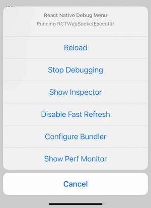

# React Native：工作流

## Debugging

### In-App Developer Menu

打开应用内的调试菜单：

- 在真机上，摇一摇手机；
- 在模拟器上，使用快捷键 `⌘D` 或 `⌃⌘Z` 。



注意：在模拟器上使用时，要确保 `I/O → Keyboard → Connect Hardware Keyboard` 已勾选 ☑️ 。

### Chrome Developer Tools

在开发者菜单选择了 `Debug JS Remotely` 后，就能在 Chrome 内调试 JavaScript 代码了。地址：<http://localhost:8081/debugger-ui> 。

在 Chrome 的 Menu 中选择 `More Tools → Developer Tools` 即可打开 [Developer Tools](https://developer.chrome.com/devtools)，也可以使用快捷键 `⌘⌥I` 或 `F12` 。另外，打开 `Pause On Caught Exceptions` 可以提高 deubg 的体验。

`React Developer Tools` Chrome 插件在 React Native 项目中无法使用，需要使用 `react-devtools` ，后面会详细介绍。

### Safari Developer Tools

在 Safari 上调试 iOS 模拟器上的应用时，不需要打开 `Debug JS Remotely` 。

详细步骤：

- [React Native Docs - Safari Developer Tools](https://reactnative.dev/docs/debugging#safari-developer-tools)
- [Debugging React Native iOS Apps with Safari](http://blog.nparashuram.com/2019/10/debugging-react-native-ios-apps-with.html)

### React Developer Tools

> - React DevTools is available as a built-in extension for Chrome and Firefox browsers.
> - **This package enables you to debug a React app elsewhere (e.g. a mobile browser, an embedded webview, Safari, inside an iframe).**
> - It works both with `React DOM` and `React Native`.
> - 文档：[react-devtools](https://github.com/facebook/react/tree/main/packages/react-devtools)

安装：

```console
npm install -g react-devtools
```

运行：

```console
react-devtools
```

如果你不想全局安装 `react-devtools` ， 可以把 `react-devtools` 设置为项目依赖。步骤：

- 执行 `npm install --save-dev react-devtools` 以添加 `react-devtools` 包到你的项目中；
- 然后添加 `"react-devtools": "react-devtools"` 到你的 `package.json` 的 `scripts` section ；
- 最后在你的项目的目录下执行 `npm run react-devtools` 来打开 `DevTools` 。

## 符号解析

> 在 *React Native template project* 中， `metro-symbolicate` 包是默认安装的。

Release build 的报错堆栈需要进行*符号解析*后才能看到原始内容。将生成的 `source map` 和`stack trace` 传给 `metro-symbolicate` 即可进行符号解析。

## Testing

<https://reactnative.dev/docs/testing-overview>


