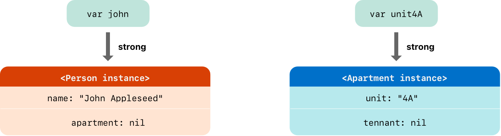
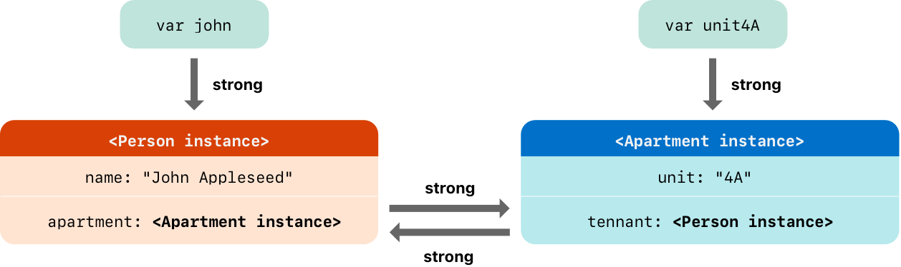
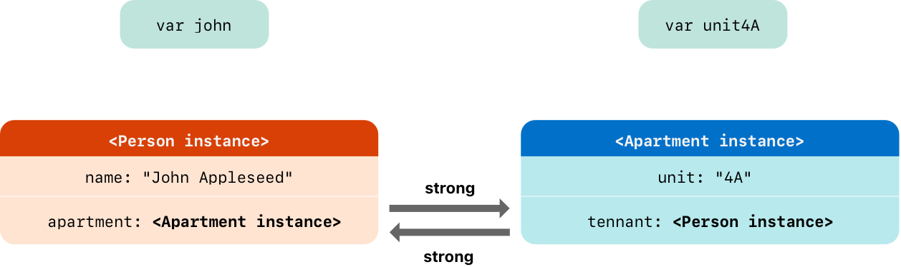

# Automatic Reference Counting

> Version: *Swift 5.6*  
> Source: [*swift-book: Automatic Reference Counting*](https://docs.swift.org/swift-book/LanguageGuide/AutomaticReferenceCounting.html)  
> Digest Date: *March 5, 2022*  

- [Automatic Reference Counting](#automatic-reference-counting)
  - [Introduction](#introduction)
  - [How ARC Works](#how-arc-works)
  - [ARC in Action](#arc-in-action)
  - [Strong Reference Cycles Between Class Instances](#strong-reference-cycles-between-class-instances)
  - [Resolving Strong Reference Cycles Between Class Instances](#resolving-strong-reference-cycles-between-class-instances)

## Introduction

Swift uses *Automatic Reference Counting* (ARC) to track and manage your app’s memory usage. In most cases, this means that memory management “just works” in Swift, and you don’t need to think about memory management yourself. ARC automatically frees up the memory used by class instances when those instances are no longer needed.

However, in a few cases ARC requires more information about the relationships between parts of your code in order to manage memory for you. This chapter describes those situations and shows how you enable ARC to manage all of your app’s memory. Using ARC in Swift is very similar to the approach described in [Transitioning to ARC Release Notes](https://developer.apple.com/library/content/releasenotes/ObjectiveC/RN-TransitioningToARC/Introduction/Introduction.html) for using ARC with Objective-C.

Reference counting applies only to instances of *classes*. *Structures* and *enumerations* are value types, not reference types, and aren’t stored and passed by reference.

## How ARC Works

Every time you create a new instance of a class, ARC allocates a chunk of memory to store information about that instance. This memory holds information about the type of the instance, together with the values of any *stored properties* associated with that instance.

Additionally, when an instance is no longer needed, ARC frees up the memory used by that instance so that the memory can be used for other purposes instead. This ensures that class instances don’t take up space in memory when they’re no longer needed.

However, if ARC were to deallocate an instance that was still in use, it would no longer be possible to access that instance’s properties, or call that instance’s methods. Indeed, if you tried to access the instance, your app would most likely crash.

To make sure that instances don’t disappear while they’re still needed, ARC tracks how many properties, constants, and variables are currently referring to each class instance. ARC will not deallocate an instance as long as at least one active reference to that instance still exists.

To make this possible, whenever you assign a class instance to a property, constant, or variable, that property, constant, or variable makes a *strong reference* to the instance. The reference is called a “strong” reference because it keeps a firm hold on that instance, and doesn’t allow it to be deallocated for as long as that strong reference remains.

## ARC in Action

Here’s an example of how Automatic Reference Counting works. This example starts with a simple class called `Person`, which defines a stored constant property called `name`:

```swift
class Person {
    let name: String
    init(name: String) {
        self.name = name
        print("\(name) is being initialized")
    }
    deinit {
        print("\(name) is being deinitialized")
    }
}
```

The next code snippet defines three variables of type `Person?`, which are used to set up multiple references to a new `Person` instance in subsequent code snippets. Because these variables are of an optional type (`Person?`, not `Person`), they’re automatically initialized with a value of `nil`, and don’t currently reference a `Person` instance.

```swift
var reference1: Person?
var reference2: Person?
var reference3: Person?
```

You can now create a new `Person` instance and assign it to one of these three variables:

```swift
reference1 = Person(name: "John Appleseed")
// Prints "John Appleseed is being initialized"
```

Because the new `Person` instance has been assigned to the `reference1` variable, there’s now a strong reference from `reference1` to the new `Person` instance. Because there’s at least one strong reference, ARC makes sure that this `Person` is kept in memory and isn’t deallocated.

If you assign the same `Person` instance to two more variables, two more strong references to that instance are established:

```swift
reference2 = reference1
reference3 = reference1
```

There are now *three* strong references to this single `Person` instance.

If you break two of these strong references (including the original reference) by assigning `nil` to two of the variables, a single strong reference remains, and the `Person` instance isn’t deallocated:

```swift
reference1 = nil
reference2 = nil
```

ARC doesn’t deallocate the `Person` instance until the third and final strong reference is broken, at which point it’s clear that you are no longer using the `Person` instance:

```swift
reference3 = nil
// Prints "John Appleseed is being deinitialized"
```

## Strong Reference Cycles Between Class Instances

In the examples above, ARC is able to track the number of references to the new `Person` instance you create and to deallocate that `Person` instance when it’s no longer needed.

However, it’s possible to write code in which an instance of a class *never* gets to a point where it has zero strong references. This can happen if two class instances hold a strong reference to each other, such that each instance keeps the other alive. This is known as a **strong reference cycle**.

You resolve strong reference cycles by defining some of the relationships between classes as `weak` or `unowned` references instead of as strong references. This process is described in [Resolving Strong Reference Cycles Between Class Instances](#resolving-strong-reference-cycles-between-class-instances). However, before you learn how to resolve a strong reference cycle, it’s useful to understand how such a cycle is caused.

Here’s an example of how a strong reference cycle can be created by accident. This example defines two classes called `Person` and `Apartment`, which model a block of apartments and its residents:

```swift
class Person {
    let name: String
    init(name: String) { self.name = name }
    var apartment: Apartment?
    deinit { print("\(name) is being deinitialized") }
}

class Apartment {
    let unit: String
    init(unit: String) { self.unit = unit }
    var tenant: Person?
    deinit { print("Apartment \(unit) is being deinitialized") }
}
```

This next code snippet defines two variables of optional type called `john` and `unit4A`, which will be set to a specific `Apartment` and `Person` instance below. Both of these variables have an initial value of `nil`, by virtue of being optional:

```swift
var john: Person?
var unit4A: Apartment?
```

You can now create a specific `Person` instance and `Apartment` instance and assign these new instances to the `john` and `unit4A` variables:

```swift
john = Person(name: "John Appleseed")
unit4A = Apartment(unit: "4A")
```

Here’s how the strong references look after creating and assigning these two instances. The `john` variable now has a strong reference to the new `Person` instance, and the `unit4A` variable has a strong reference to the new `Apartment` instance:



You can now link the two instances together so that the person has an apartment, and the apartment has a tenant. Note that an exclamation point (`!`) is used to unwrap and access the instances stored inside the `john` and `unit4A` optional variables, so that the properties of those instances can be set:

```swift
john!.apartment = unit4A
unit4A!.tenant = john
```

Here’s how the strong references look after you link the two instances together:



Unfortunately, linking these two instances creates a strong reference cycle between them. The `Person` instance now has a strong reference to the `Apartment` instance, and the `Apartment` instance has a strong reference to the `Person` instance. Therefore, when you break the strong references held by the `john` and `unit4A` variables, the reference counts don’t drop to zero, and the instances aren’t deallocated by ARC:

```swift
john = nil
unit4A = nil
```

Note that neither deinitializer was called when you set these two variables to `nil`. The strong reference cycle prevents the `Person` and `Apartment` instances from ever being deallocated, causing a memory leak in your app.

Here’s how the strong references look after you set the `john` and `unit4A` variables to `nil`:



The strong references between the `Person` instance and the `Apartment` instance remain and can’t be broken.

## Resolving Strong Reference Cycles Between Class Instances


