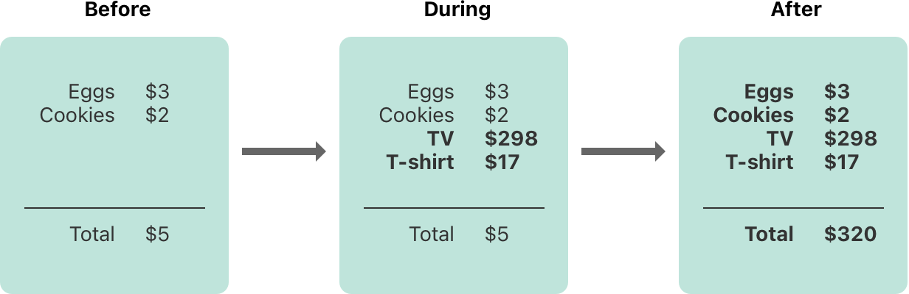

# Memory Safety

> Version: *Swift 5.6*  
> Source: [*swift-book: Memory Safety*](https://docs.swift.org/swift-book/LanguageGuide/MemorySafety.html)  
> Digest Date: *March 6, 2022*  

- [Memory Safety](#memory-safety)
  - [Introduction](#introduction)
  - [Understanding Conflicting Access to Memory](#understanding-conflicting-access-to-memory)
    - [Characteristics of Memory Access](#characteristics-of-memory-access)
  - [Conflicting Access to In-Out Parameters](#conflicting-access-to-in-out-parameters)

## Introduction

By default, Swift prevents unsafe behavior from happening in your code. For example, Swift ensures that variables are initialized before they’re used, memory isn’t accessed after it’s been deallocated, and array indices are checked for out-of-bounds errors.

Swift also makes sure that multiple accesses to the same area of memory don’t conflict, by requiring code that modifies a location in memory to have exclusive access to that memory. Because Swift manages memory automatically, most of the time you don’t have to think about accessing memory at all. However, it’s important to understand where potential conflicts can occur, so you can avoid writing code that has conflicting access to memory. If your code does contain conflicts, you’ll get a compile-time or runtime error.

## Understanding Conflicting Access to Memory

Access to memory happens in your code when you do things like set the value of a variable or pass an argument to a function. For example, the following code contains both a *read* access and a *write* access:

```swift
// A write access to the memory where one is stored.
var one = 1

// A read access from the memory where one is stored.
print("We're number \(one)!")
```

A conflicting access to memory can occur when different parts of your code are trying to access the same location in memory at the same time. Multiple accesses to a location in memory at the same time can produce unpredictable or inconsistent behavior.

In Swift, there are ways to modify a value that span several lines of code, making it possible to attempt to access a value in the middle of its own modification.

You can see a similar problem by thinking about how you update a budget that’s written on a piece of paper. Updating the budget is a two-step process:

- First you add the items’ names and prices,
- and then you change the total amount to reflect the items currently on the list.

Before and after the update, you can read any information from the budget and get a correct answer, as shown in the figure below.



While you’re adding items to the budget, it’s in a temporary, invalid state because the total amount hasn’t been updated to reflect the newly added items. Reading the total amount during the process of adding an item gives you incorrect information.

This example also demonstrates a challenge you may encounter when fixing conflicting access to memory: There are sometimes multiple ways to fix the conflict that produce different answers, and it’s not always obvious which answer is correct. In this example, depending on whether you wanted the original total amount or the updated total amount, either $5 or $320 could be the correct answer. Before you can fix the conflicting access, you have to determine what it was intended to do.

> **NOTE**:
>  
> - If you’ve written concurrent or multithreaded code, conflicting access to memory might be a familiar problem. However, the conflicting access discussed here can happen on a single thread and *doesn’t* involve concurrent or multithreaded code.
> - If you have conflicting access to memory from within a single thread, Swift guarantees that you’ll get an error at either compile time or runtime. For multithreaded code, use [Thread Sanitizer](https://developer.apple.com/documentation/xcode/diagnosing_memory_thread_and_crash_issues_early) to help detect conflicting access across threads.

### Characteristics of Memory Access

There are three characteristics of memory access to consider in the context of conflicting access: whether the access is a read or a write, the duration of the access, and the location in memory being accessed. Specifically, a conflict occurs if you have two accesses that meet all of the following conditions:

- At least one is a write access or a nonatomic access.
- They access the same location in memory.
- Their durations overlap.

The difference between a read and write access is usually obvious: a write access changes the location in memory, but a read access doesn’t. The location in memory refers to what is being accessed, for example, a variable, constant, or property. The duration of a memory access is either instantaneous or long-term.

An operation is *atomic* if it uses only C atomic operations; otherwise it’s nonatomic. For a list of those functions, see the `stdatomic(3)` man page.

An access is instantaneous if it’s not possible for other code to run after that access starts but before it ends. By their nature, two instantaneous accesses can’t happen at the same time. Most memory access is instantaneous. For example, all the read and write accesses in the code listing below are instantaneous:

```swift
func oneMore(than number: Int) -> Int {
    return number + 1
}

var myNumber = 1
myNumber = oneMore(than: myNumber)
print(myNumber)
// Prints "2"
```

However, there are several ways to access memory, called long-term accesses, that span the execution of other code. The difference between instantaneous access and long-term access is that it’s possible for other code to run after a long-term access starts but before it ends, which is called overlap. A long-term access can overlap with other long-term accesses and instantaneous accesses.

Overlapping accesses appear primarily in code that uses in-out parameters in functions and methods or mutating methods of a structure. The specific kinds of Swift code that use long-term accesses are discussed in the sections below.

## Conflicting Access to In-Out Parameters


