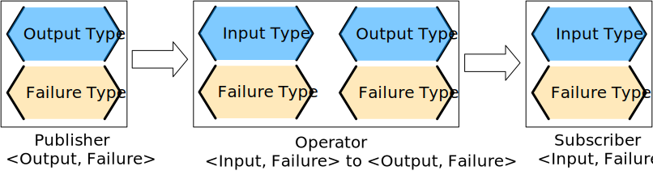

# Core Concepts

There are only a few core concepts that you need to know to use Combine effectively, but they are very important to understand. Each of these concepts is mirrored in the framework with a *generic protocol*, formalizing the concepts into expected functions.

These core concepts are: *Publisher*, *Subscriber*, *Operator*, *Subject*.

- [Core Concepts](#core-concepts)
  - [Publisher and Subscriber](#publisher-and-subscriber)
  - [Describing pipelines with marble diagrams](#describing-pipelines-with-marble-diagrams)
    - [How to read a marble diagram](#how-to-read-a-marble-diagram)
    - [Marble diagrams for Combine](#marble-diagrams-for-combine)
  - [Back pressure](#back-pressure)
  - [Lifecycle of Publishers and Subscribers](#lifecycle-of-publishers-and-subscribers)
  - [Publishers](#publishers)
  - [Operators](#operators)
  - [Subjects](#subjects)

## Publisher and Subscriber

Two key concepts, [publisher](https://developer.apple.com/documentation/combine/publisher) and [subscriber](https://developer.apple.com/documentation/combine/subscriber), are described in Swift as protocols.

Combine is all about defining the process of what you do with many possible values over time. Combine also goes farther than defining the result, it also defines how it can fail.

A **publisher** provides data when available and upon request. A publisher that hasn't had any *subscription* requests will not provide any data. When you are describing a Combine publisher, you describe it with two associated types: one for `Output` and one for `Failure`.


For example, if a publisher returned an instance of `String`, and could return a failure in the form of an instance of `URLError`, then the publisher might be described with the string `<String, URLError>`.

A **subscriber** is responsible for requesting data and accepting the data (and possible failures) provided by a publisher. A subscriber is described with two associated types, one for `Input` and one for `Failure`. The subscriber initiates the request for data, and controls the amount of data it receives. It can be thought of as "driving the action" within Combine, as without a subscriber, the other components stay idle.

*Publishers* and *subscribers* are meant to be connected, and make up the core of Combine. When you connect a subscriber to a publisher, both types must match: `Output` to `Input`, and `Failure` to `Failure`. One way to visualize this is as a series of operations on two types in parallel, where both types need to match in order to plug the components together.


The third core concept is an **operator**: an object that **acts both like a subscriber and a publisher**. Operators are classes that adopt both the [Subscriber protocol](https://developer.apple.com/documentation/combine/subscriber) and [Publisher protocol](https://developer.apple.com/documentation/combine/publisher). They support subscribing to a publisher, and sending results to any subscribers.

You can create chains of these together, for *processing*, *reacting*, and *transforming* the data provided by a publisher, and requested by the subscriber.

I’m calling these composed sequences **pipelines**.



Operators can be used to transform either values or types - both the `Output` and `Failure` type. Operators may also *split* or *duplicate* streams, or *merge* streams together. Operators must always be aligned by the combination of `Output`/`Failure` types. The compiler will enforce the matching types, so getting it wrong will result in a compiler error (and, if you are lucky, a useful *fixit* snippet suggesting a solution).

A simple Combine pipeline written in swift might look like:

```swift
let _ = Just(5) 1️⃣
    .map { value -> String in 2️⃣
        // do something with the incoming value here
        // and return a string
        return "a string"
    }
    .sink { receivedValue in 3️⃣
        // sink is the subscriber and terminates the pipeline
        print("The end result was \(receivedValue)")
    }
```

- 1️⃣ The pipeline starts with the *publisher* `Just`, which responds with the value that its defined with (in this case, the Integer `5`). The output type is `<Integer>`, and the failure type is `<Never>`.
- 2️⃣ The pipeline then has a `map` *operator*, which is transforming the value and its type. In this example it is ignoring the published input and returning a string. This is also transforming the output type to `<String>`, and leaving the failure type still set as `<Never>`.
- 3️⃣ The pipeline then ends with a `sink` *subscriber*.

When you are thinking about a pipeline you can think of it as a sequence of operations linked by both *output* and *failure* types. This pattern will come in handy when you start constructing your own pipelines.

When creating pipelines, you are often selecting *operators* to help you transform the data, types, or both to achieve your end goal. That end goal might be enabling or disabling a user interface element, or it might be retrieving some piece of data to be displayed. Many Combine *operators* are specifically created to help with these transformations.

There are a number of *operators* that have a similar *operator* prefixed with `try`, which indicates they return an `<Error>` failure type. An example of this is `map` and `tryMap`.

- `map` *operator* allows for any combination of `Output` and `Failure` type and passes them through.
- `tryMap` accepts any `Input`, `Failure` types, and allows any `Output` type, but will always output an `<Error>` failure type.

Operators like `map` allow you to define the output type being returned by inferring the output type based on what you return in a closure provided to the *operator*. In the example above, the `map` *operator* is returning a `String` output type since that is what the closure returns.

To illustrate the example of changing types more concretely, we expand upon the logic to use the values being passed. This example still starts with a publisher providing the types `<Int, Never>` and end with a subscription taking the types `<String, Never>`.

```swift
let _ = Just(5)  1️⃣
    .map { value -> String in 2️⃣
        switch value {
        case _ where value < 1:
            return "none"
        case _ where value == 1:
            return "one"
        case _ where value == 2:
            return "couple"
        case _ where value == 3:
            return "few"
        case _ where value > 8:
            return "many"
        default:
            return "some"
        }
    }
    .sink { receivedValue in 3️⃣
        print("The end result was \(receivedValue)")
    }
```

- 1️⃣ `Just` is a *publisher* that creates an `<Int, Never>` type combination, provides a single value and then completes.
- 2️⃣ the closure provided to the `.map()` function takes in an `<Int>` and transforms it into a `<String>`. Since the failure type of `<Never>` is not changed, it is passed through.
- 3️⃣ `sink`, the *subscriber*, receives the `<String, Never>` combination.

> When you are creating pipelines in Xcode and don’t match the types, the error message from Xcode may include a helpful *fixit*.  
> In some cases, such as the example above, the compiler is unable to infer the return types of closure provided to `map` without specifying the return type.  
> *Xcode (11 beta 2 and beta 3)* displays this as the error message: `Unable to infer complex closure return type; add explicit type to disambiguate.` In the example above, we explicitly specified the type being returned with the line *value -> String* in.

You can view Combine publishers, operators, and subscribers as having two parallel types that both need to be aligned: one for the functional case and one for the error case. Designing your pipeline is frequently choosing how to convert one or both of those types and the associated data with it.

## Describing pipelines with marble diagrams

A functional reactive pipeline can be tricky to understand.

- *publisher* is generating and sending data,
- *operators* are reacting to that data and potentially changing it, and
- *subscribers* requesting and accepting it.

That in itself would be complicated, but some *operators* in Combine also may change the timing when events happen - introducing delays, collapsing multiple values into one, and so forth.

Because these can be complex to understand, the *functional reactive programming* community illustrates these changes with a visual description called a **marble diagram**.

As you explore the concepts behind Combine, you may find yourself looking at other *functional reactive programming* systems, such as `RxSwift` or `ReactiveExtensions`. The documentation associated with these systems often use marble diagrams.

Marble diagrams focus on describing how a specific pipeline changes the stream of data. It shows data changing over time, as well as the timing of those changes.


### How to read a marble diagram

- The diagram centers around whatever element is being described, an operator in this case. The name of the operator is often on the central block.
- The lines above and below represent data moving through time. The left is earlier and the right is later. The symbols on the line represent discrete bits of data.
- It is often assumed that data is flowing downward. With this pattern, the top line is indicating the inputs to the operator and the bottom line represents the outputs.
- In some diagrams, the symbols on the top line may differ from the symbols on the bottom line. When they are different, the diagram is typically implying that the type of the output is different from the type of the input.
- In other places, you may also see a vertical bar or an `X` on the timeline, or ending the timeline. That is used to indicate the end of a stream. A bar at the end of a line implies the stream has terminated normally. An `X` indicates that an error or exception was thrown.

These diagrams intentionally ignore the setup (or teardown) of a pipeline, preferring to focus on one element to describe how that element works.

### Marble diagrams for Combine

This book uses an expansion of the basic marble diagram, modified slightly to highlight some of the specifics of Combine. The most notable difference are two lines for input and output. Since Combine explicitly types both the *input* and the *failure*, these are represented separately and the types described in the diagram.


If a publisher is being described, the two lines are below the element, following the pattern of "data flows down". An *operator*, which acts as both a *publisher* and *subscriber*, would have two sets - one above and one below. A *subscriber* has the lines above it.

To illustrate how these diagrams relate to code, lets look at a simple example. In this case, we will focus on the map operator and how it can be described with this diagram.

```swift
let _ = Just(5)
    .map { value -> String in 1️⃣
        switch value {
        case _ where value < 1:
            return "none"
        case _ where value == 1:
            return "one"
        case _ where value == 2:
            return "couple"
        case _ where value == 3:
            return "few"
        case _ where value > 8:
            return "many"
        default:
            return "some"
        }
    }
    .sink { receivedValue in
        print("The end result was \(receivedValue)")
    }
```

- 1️⃣ The closure provided to the `.map()` function takes in an `<Int>` and transforms it into a `<String>`. Since the failure type of `<Never> `is not changed, it is passed through.

The following diagram represents this code snippet. This diagram goes further than others in this book; it includes the closure from the sample code in the diagram to show how it relates.


Many combine *operators* are configured with code provided by you, written in a closure. Most diagrams will not attempt to include it in the diagram. It is implied that any code you provide through a closure in Combine will be used within the box rather than explicitly detailed.

The input type for this map *operator* is `<Int>`, which is described with generic syntax on the top line. The failure type that is being passed to this *operator* is `<Never>`, described in the same syntax just below the Input type.

The `map` *operator* doesn’t change or interact with the failure type, only passing it along. To represent that, the failure types - both input (above) and output (below) - have been *lightened*.

A single input value provided (`5`) is represented on the top line. The location on the line isn’t meaningful in this case, only representing that it is a single value. If multiple values were on the line, the ones on the left would be presented to the `map` *operator* before any on the right.

When it arrives, the value `5` is passed to the closure as the variable `value`. The return type of the closure (`<String>` in this case), defines the output type for the `map` *operator* when the code within the closure completes and returns its value.

In this case, the string `some` is returned for the input value `5`. **The string `some` is represented on the output line directly below its input value, implying there was no explicit delay.**

## Back pressure

Combine is designed such that the *subscriber* controls the flow of data, and because of that it also controls what and when processing happens in the pipeline. This is a feature of Combine called **back-pressure**.

This means that the *subscriber* drives the processing within a pipeline by providing information about how much information it wants or can accept. When a *subscriber* is connected to a publisher, it requests data based on a specific [Demand](https://developer.apple.com/documentation/combine/subscribers/demand).

The demand request is propagated up through the composed pipeline. Each *operator* in turn accepts the request for data and in turn requests information from the *publishers* to which it is connected.

> **Warning**:  
> In the first release of the Combine framework - in iOS 13 prior to iOS 13.3 and macOS prior to 10.15.2 - when the subscriber requested data with a Demand, that call itself was asynchronous. Because this process acted as the driver which triggered attached operators and ultimately the source publisher, it meant that there were scenarios where data might appear to be lost. Due to this, in iOS 13.3 and later Combine releases, the process of requesting demand has been updated to a synchronous/blocking call. In practice, this means that you can be a bit more certain of having any pipelines created and fully engaged prior to a publisher receiving the request to send any data.
>  
> There is an [extended thread on the Swift forums](https://forums.swift.org/t/combine-receive-on-runloop-main-loses-sent-value-how-can-i-make-it-work/28631/39) about this topic, if you are interested in reading the history.

With the *subscriber* driving this process, it allows Combine to support cancellation. Subscribers all conform to the [Cancellable](https://developer.apple.com/documentation/combine/cancellable) protocol. This means they all have a function `cancel()` that can be invoked to terminate a pipeline and stop all related processing.

> When a pipeline has been cancelled, the pipeline is not expected to be restarted. Rather than restarting a cancelled pipeline, the developer is expected to create a new pipeline.

## Lifecycle of Publishers and Subscribers

The end to end lifecycle is enabled by subscribers and publishers communicating in a well defined sequence:


1. When the *subscriber* is attached to a *publisher*, it starts with a call to `.subscribe(_: Subscriber)`.
2. The *publisher* in turn acknowledges the subscription calling `receive(subscription: Subscription)`.
3. After the subscription has been acknowledged, the *subscriber* requests *N* values with `request(_: Demand)`.
4. The *publisher* may then (as it has values) send *N* (or fewer) values using `receive(_: Input)`. A *publisher* should never send more than the demand requested.
5. Any time after the subscription has been acknowledged, the *subscriber* may send a [cancellation](https://developer.apple.com/documentation/combine/subscribers/completion) with `.cancel()`
6. A *publisher* may optionally send [completion](https://developer.apple.com/documentation/combine/subscribers/completion): `receive(completion:)`. A completion can be either a normal termination, or may be a `.failure` completion, optionally propagating an error type. A pipeline that has been cancelled will not send any completions.

Included in the above diagram is a stacked up set of the example marble diagrams. This is to highlight where Combine marble diagrams focus in the overall lifecycle of a pipeline. Generally the diagrams infer that all of the setup has been done and data requested. The heart of a combine marble diagram is the series of events between when data was requested and any completions or cancellations are triggered.

## Publishers

The publisher is the provider of data. The `Publisher` protocol has a strict contract returning values when asked from subscribers, and possibly terminating with an explicit completion enumeration.

`Just` and `Future` are common sources to start your own publisher from a value or asynchronous function.

Many publishers will immediately provide data when requested by a subscriber. In some cases, a publisher may have a separate mechanism to enable it to return data after subscription. This is codified by the protocol [ConnectablePublisher](https://developer.apple.com/documentation/combine/connectablepublisher). A publisher conforming to `ConnectablePublisher` will have an additional mechanism to start the flow of data after a subscriber has provided a request. This could be a separate `.connect()` call on the publisher itself. The other option is `.autoconnect()`, which will start the flow of data as soon as a subscriber requests it.

Combine provides a number of additional convenience publishers:

- `Just`
- `Future`
- `Deferred`
- `Empty`
- `Sequence`
- `Fail`
- `Record`
- `Share`
- `Multicast`
- `ObservableObject`
- `@Published`

A number of Apple API outside of Combine provide publishers as well.

- SwiftUI uses the `@Published` and `@ObservedObject` *property wrappers*, provided by Combine, to implicitly create a *publisher* and support its declarative view mechanisms.
- Foundation
  - `URLSession.dataTaskPublisher`
  - `.publisher` on KVO instance
  - `NotificationCenter`
  - `Timer`
  - `Result`

## Operators

*Operators* are a convenient name for a number of *pre-built functions* that are included under `Publisher` in Apple’s reference documentation. Operators are meant to be composed into pipelines. Many will accept one or more closures from the developer to define the business logic while maintaining the adherence to the *publisher/subscriber* lifecycle.

Some *operators* support bringing together outputs from different pipelines, changing the timing of data, or filtering the data provided. *Operators* may also have constraints on the types they will operate on. *Operators* can also be used to define error handling and retry logic, buffering and prefetch, and supporting debugging.

- **Mapping elements**
  - `map`
  - `tryMap`
  - `scan`
  - `tryScan`
  - `flatMap`
  - `setFailureType`
- **Filtering elements**
  - `compactMap`
  - `tryCompactMap`
  - `filter`
  - `tryFilter`
  - `removeDuplicates`
  - `tryRemoveDuplicates`
  - `replaceEmpty`
  - `replaceError`
- **Reducing elements**
  - `collect`
  - `reduce`
  - `tryReduce`
  - `ignoreOutput`
- **Mathematic operations on elements**
  - `max`
  - `tryMax`
  - `min`
  - `tryMin`
  - `count`
- **Applying matching criteria to elements**
  - `allSatisfy`
  - `tryAllSatisfy`
  - `contains`
  - `containsWhere`
  - `tryContainsWhere`
- **Applying sequence operations to elements**
  - `first`
  - `last`
  - `firstWhere`
  - `tryFirstWhere`
  - `lastWhere`
  - `tryLastWhere`
  - `dropWhile`
  - `tryDropWhile`
  - `dropUntilOutput`
  - `prepend`
  - `drop`
  - `prefixUntilOutput`
  - `prefixWhile`
  - `tryPrefixWhile`
  - `output`
- **Combining elements from multiple publishers**
  - `combineLatest`
  - `merge`
  - `zip`
- **Handling errors**
  - `catch`
  - `tryCatch`
  - `assertNoFailure`
  - `retry`
  - `mapError`
- **Adapting publisher types**
  - `switchToLatest`
  - `eraseToAnyPublisher`
- **Controlling timing**
  - `debounce`
  - `delay`
  - `measureInterval`
  - `throttle`
  - `timeout`
- **Encoding and decoding**
  - `encode`
  - `decode`
- **Working with multiple subscribers**
  - `multicast`
- **Debugging**
  - `breakpoint`
  - `handleEvents`
  - `print`

## Subjects


