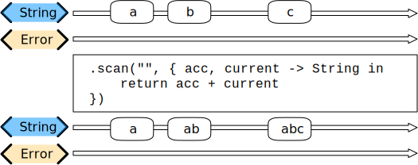
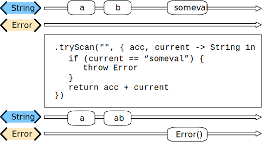
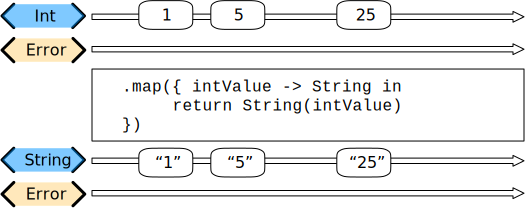
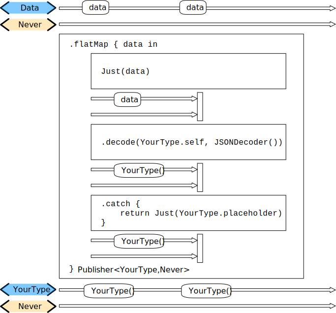
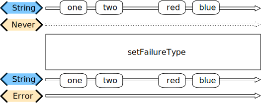

# Operators

The chapter on [Core Concepts](https://heckj.github.io/swiftui-notes/#coreconcepts) includes an overview of all available [Operators](https://heckj.github.io/swiftui-notes/#coreconcepts-operators).

- [Operators](#operators)
  - [Mapping elements](#mapping-elements)
    - [scan](#scan)
    - [tryScan](#tryscan)
    - [map](#map)
    - [tryMap](#trymap)
    - [flatMap](#flatmap)
    - [setFailureType](#setfailuretype)
  - [Filtering elements](#filtering-elements)
    - [compactMap](#compactmap)

## Mapping elements

### scan

`scan` acts like an accumulator, collecting and modifying values according to a closure you provide, and publishing intermediate results with each change from upstream.



Transforms elements from the upstream publisher by providing the current element to a closure along with the last value returned by the closure.

**Declaration**:

```swift
func scan<T>(_ initialResult: T, _ nextPartialResult: @escaping (T, Self.Output) -> T) -> Publishers.Scan<Self, T>
```

**Discussion**:

Use `scan(_:_:)` to accumulate all previously-published values into a single value, which you then combine with each newly-published value.
The following example logs a running total of all values received from the sequence publisher.

```swift
let range = (0...5)
cancellable = range.publisher
    .scan(0) { return $0 + $1 }
    .sink { print ("\($0)", terminator: " ") }
 // Prints: "0 1 3 6 10 15 ".
```

`Scan` lets you accumulate values or otherwise modify a type as changes flow through the pipeline. You can use this to collect values into an array, implement a counter, or any number of other interesting use cases.

- If you want to be able to throw an error from within the closure doing the accumulation to indicate an error condition, use the `tryScan` operator.
- If you want to accumulate and process values, but refrain from publishing any results until the upstream publisher completes, consider using the `reduce` or `tryReduce` operators.

When you create a `scan` operator, you provide an initial value (of the type determined by the upstream publisher) and a closure that takes two parameters - the result returned from the previous invocation of the closure and a new value from the upstream publisher. You do not need to maintain the type of the upstream publisher, but can convert the type in your closure, returning whatever is appropriate to your needs.

For example, the following `scan` operator implementation counts the number of characters in strings provided by an upstream publisher, publishing an updated count every time a new string is received:

```swift
.scan(0, { prevVal, newValueFromPublisher -> Int in
    return prevVal + newValueFromPublisher.count
})
```

### tryScan

`tryScan` is a variant of the `scan` operator which allows for the provided closure to throw an error and cancel the pipeline. The closure provided updates and modifies a value based on any inputs from an upstream publisher and publishing intermediate results.



**Declaration**:

```swift
func tryScan<T>(_ initialResult: T, _ nextPartialResult: @escaping (T, Self.Output) throws -> T) -> Publishers.TryScan<Self, T>
```

**Discussion**:

Use `tryScan(_:_:)` to accumulate all previously-published values into a single value, which you then combine with each newly-published value. If your accumulator closure throws an error, the publisher terminates with the error.

In the example below, `tryScan(_:_:)` calls a division function on elements of a collection publisher. The `Publishers.TryScan` publisher publishes each result until the function encounters a `DivisionByZeroError`, which terminates the publisher.

If the closure throws an error, the publisher fails with the error:

```swift
struct DivisionByZeroError: Error {}

/// A function that throws a DivisionByZeroError if `current` provided by the TryScan publisher is zero.
func myThrowingFunction(_ lastValue: Int, _ currentValue: Int) throws -> Int {
    guard currentValue != 0 else { throw DivisionByZeroError() }
    return (lastValue + currentValue) / currentValue
 }

let numbers = [1,2,3,4,5,0,6,7,8,9]
cancellable = numbers.publisher
    .tryScan(10) { try myThrowingFunction($0, $1) }
    .sink(
        receiveCompletion: { print ("\($0)") },
        receiveValue: { print ("\($0)", terminator: " ") }
     )

// Prints: "11 6 3 1 1 failure(DivisionByZeroError())".
```

### map

`map` is most commonly used to convert one data type into another along a pipeline.



**Declaration**:

```swift
func map<T>(_ transform: @escaping (Self.Output) -> T) -> Publishers.Map<Self, T>
```

**Discussion**:

The `map` operator does not allow for any additional failures to be thrown and does not transform the failure type. If you want to throw an error within your closure, use the `tryMap` operator.

`map` takes a single closure where you provide the logic for the map operation.

> `map` is the all purpose workhorse operator in Combine. It provides the ability to manipulate the data, or the type of data, and is the **most** commonly used operator in pipelines.

For example, the `URLSession.dataTaskPublisher` provides a *tuple* of `(data: Data, response: URLResponse)` as its output. You can use `map` to pass along the data, for example to use with `decode`:

```swift
.map { $0.data } 1️⃣
```

- 1️⃣ the `$0` indicates to grab the first parameter passed in, which is a tuple of `data` and `response`.

In some cases, the closure may not be able to infer what data type you are returning, so you may need to provide a definition to help the compiler. For example, if you have an object getting passed down that has a boolean property `isValid` on it, and you want the boolean for your pipeline, you might set that up like:

```swift
struct MyStruct {
    isValid: bool = true
}

Just(MyStruct())
    .map { inValue -> Bool in 1️⃣
    inValue.isValid 2️⃣
    }
```

- `inValue` is named as the parameter coming in, and the return type is being explicitly specified to Bool
- A single line is an implicit return, in this case it is pulling the `isValid` property off the struct and passing it down.

### tryMap

`tryMap` is similar to `map`, except that it also allows you to provide a closure that throws additional errors if your conversion logic is unsuccessful.

`tryMap` is useful when you have more complex business logic around your `map` and you want to indicate that the data passed in is an error, possibly handling that error later in the pipeline. If you are looking at `tryMap` to decode JSON, you may want to consider using the `decode` operator instead, which is set up for that common task.

```swift
enum MyFailure: Error {
    case notBigEnough
}

Just(5)
    .tryMap {
    if inValue < 5 { 
        throw MyFailure.notBigEnough 
    }
    return inValue 
    }
```

### flatMap

Used with error recovery or async operations that might fail (for example `Future`), `flatMap` will replace any incoming values with another publisher.

**Declaration**:

```swift
func flatMap<T, P>(maxPublishers: Subscribers.Demand = .unlimited, _ transform: @escaping (Self.Output) -> P) -> Publishers.FlatMap<P, Self> where T == P.Output, P : Publisher, Self.Failure == P.Failure
```

Typically used in error handling scenarios, `flatMap` takes a closure that allows you to read the incoming data value, and provide a publisher that returns a value to the pipeline.

In error handling, this is most frequently used to take the incoming value and create a *one-shot* pipeline that does some potentially failing operation, and then handling the error condition with a `catch` operator.

A simple example `flatMap`, arranged to show recovering from a decoding error and returning a placeholder value:

```swift
.flatMap { data in
    return Just(data)
        .decode(YourType.self, JSONDecoder())
        .catch {
            return Just(YourType.placeholder)
        }
}
```

A diagram version of this pipeline construct:



> `flatMap` expects to create a new pipeline within its closure for every input value that it receives. The expected result of this internal pipeline is a Publisher with its own output and failure type. The output type of the publisher resulting from the internal pipeline defines the output type of the `flatMap` operator. The error type of the internal publisher is often expected to be `<Never>`.

**Discussion**:

Use `flatMap(maxPublishers:_:)` when you want to create a new series of events for downstream subscribers based on the received value. The closure creates the new Publisher based on the received value. The new Publisher can emit more than one event, and successful completion of the new Publisher does not complete the overall stream. Failure of the new Publisher causes the overall stream to fail.

In the example below, a `PassthroughSubject` publishes `WeatherStation` elements. The `flatMap(maxPublishers:_:)` receives each element, creates a `URL` from it, and produces a new `URLSession.DataTaskPublisher`, which will publish the data loaded from that `URL`.

```swift
public struct WeatherStation {
    public let stationID: String
}

var weatherPublisher = PassthroughSubject<WeatherStation, URLError>()

cancellable = weatherPublisher.flatMap { station -> URLSession.DataTaskPublisher in
    let url = URL(string:"https://weatherapi.example.com/stations/\(station.stationID)/observations/latest")!
    return URLSession.shared.dataTaskPublisher(for: url)
}
.sink(
    receiveCompletion: { completion in
        // Handle publisher completion (normal or error).
    },
    receiveValue: {
        // Process the received data.
    }
 )

weatherPublisher.send(WeatherStation(stationID: "KSFO")) // San Francisco, CA
weatherPublisher.send(WeatherStation(stationID: "EGLC")) // London, UK
weatherPublisher.send(WeatherStation(stationID: "ZBBB")) // Beijing, CN
```

### setFailureType

`setFailureType` does not send a `.failure` completion, it just changes the `Failure` type associated with the pipeline. Use this publisher type when you need to match the error types for two otherwise mismatched publishers.

**Declaration**:

```swift
struct SetFailureType<Upstream, Failure> where Upstream : Publisher, Failure : Error, Upstream.Failure == Never
```



`setFailureType` is an operator for transforming the error type within a pipeline, often from `<Never>` to some error type you may want to produce. `setFailureType` does not induce an error, but changes the types of the pipeline.

This can be especially convenient if you need to match an operator or subscriber that expects a failure type other than `<Never>` when you are working with a test or single-value publisher such as `Just` or `Sequence`.

If you want to return a `.failure` completion of a specific type into a pipeline, use the `Fail` operator.

## Filtering elements

### compactMap


