# Operators

The chapter on [Core Concepts](https://heckj.github.io/swiftui-notes/#coreconcepts) includes an overview of all available [Operators](https://heckj.github.io/swiftui-notes/#coreconcepts-operators).

- [Operators](#operators)
  - [Mapping Elements](#mapping-elements)
    - [map](#map)
    - [tryMap](#trymap)
    - [mapError](#maperror)
    - [scan](#scan)
    - [tryScan](#tryscan)
    - [setFailureType](#setfailuretype)
  - [Filtering Elements](#filtering-elements)
    - [filter](#filter)
    - [tryFilter](#tryfilter)
    - [compactMap](#compactmap)
    - [tryCompactMap](#trycompactmap)
    - [removeDuplicates](#removeduplicates)
    - [tryRemoveDuplicates](#tryremoveduplicates)
    - [replaceEmpty](#replaceempty)
    - [replaceError](#replaceerror)
    - [replaceNil(with:)](#replacenilwith)
  - [Reducing Elements](#reducing-elements)
    - [collect](#collect)
    - [ignoreOutput](#ignoreoutput)
    - [reduce](#reduce)
    - [tryReduce](#tryreduce)
  - [Applying Mathematical Operations on Elements](#applying-mathematical-operations-on-elements)
    - [max](#max)
    - [tryMax](#trymax)
    - [min](#min)
    - [tryMin](#trymin)
    - [count](#count)
  - [Applying Matching Criteria to Elements](#applying-matching-criteria-to-elements)
    - [allSatisfy](#allsatisfy)
    - [tryAllSatisfy](#tryallsatisfy)
    - [contains](#contains)
    - [contains(where:)](#containswhere)
    - [tryContains(where:)](#trycontainswhere)
  - [Applying Sequence Operations to Elements](#applying-sequence-operations-to-elements)
    - [drop(untilOutputFrom:)](#dropuntiloutputfrom)
    - [dropFirst](#dropfirst)
    - [drop(while:)](#dropwhile)
    - [tryDrop(while:)](#trydropwhile)
    - [append](#append)
    - [`append<S>`](#appends)
    - [`append<P>`](#appendp)
    - [prepend](#prepend)
    - [prefix](#prefix)
    - [prefix(while:)](#prefixwhile)
    - [tryPrefix(while:)](#tryprefixwhile)
    - [prefix(untilOutputFrom:)](#prefixuntiloutputfrom)
  - [Selecting Specific Elements](#selecting-specific-elements)
    - [first](#first)
    - [first(where:)](#firstwhere)
    - [tryFirst(where:)](#tryfirstwhere)
    - [last](#last)
    - [last(where:)](#lastwhere)
    - [tryLast(where:)](#trylastwhere)
    - [output(at:)](#outputat)
    - [output(in:)](#outputin)
  - [Mixing Elements from Multiple Publishers](#mixing-elements-from-multiple-publishers)
    - [`combineLatest<P>`](#combinelatestp)
    - [`combineLatest<P, T>`](#combinelatestp-t)
    - [merge(with:)](#mergewith)
    - [`zip<P>`](#zipp)
    - [`zip<P, T>`](#zipp-t)
  - [Republishing Elements by Subscribing to New Publishers](#republishing-elements-by-subscribing-to-new-publishers)
    - [flatMap](#flatmap)
    - [switchToLatest](#switchtolatest)
  - [Handling Errors](#handling-errors)
    - [assertNoFailure](#assertnofailure)
    - [catch](#catch)
    - [tryCatch](#trycatch)
    - [retry](#retry)
  - [Controlling Timing](#controlling-timing)
    - [measureInterval](#measureinterval)
    - [debounce](#debounce)
    - [throttle](#throttle)
    - [delay](#delay)
    - [timeout](#timeout)

## Mapping Elements

### map

`map` is most commonly used to convert one data type into another along a pipeline.


**Declaration**:

```swift
func map<T>(_ transform: @escaping (Self.Output) -> T) -> Publishers.Map<Self, T>
```

**Discussion**:

The `map` operator does not allow for any additional failures to be thrown and does not transform the failure type. If you want to throw an error within your closure, use the `tryMap` operator.

`map` takes a single closure where you provide the logic for the map operation.

> `map` is the all purpose workhorse operator in Combine. It provides the ability to manipulate the data, or the type of data, and is the **most** commonly used operator in pipelines.

For example, the `URLSession.dataTaskPublisher` provides a *tuple* of `(data: Data, response: URLResponse)` as its output. You can use `map` to pass along the data, for example to use with `decode`:

```swift
.map { $0.data } 1️⃣
```

- 1️⃣ the `$0` indicates to grab the first parameter passed in, which is a tuple of `data` and `response`.

In some cases, the closure may not be able to infer what data type you are returning, so you may need to provide a definition to help the compiler. For example, if you have an object getting passed down that has a boolean property `isValid` on it, and you want the boolean for your pipeline, you might set that up like:

```swift
struct MyStruct {
    isValid: bool = true
}

Just(MyStruct())
    .map { inValue -> Bool in 1️⃣
    inValue.isValid 2️⃣
    }
```

- `inValue` is named as the parameter coming in, and the return type is being explicitly specified to Bool
- A single line is an implicit return, in this case it is pulling the `isValid` property off the struct and passing it down.

### tryMap

`tryMap` is similar to `map`, except that it also allows you to provide a closure that throws additional errors if your conversion logic is unsuccessful.

`tryMap` is useful when you have more complex business logic around your `map` and you want to indicate that the data passed in is an error, possibly handling that error later in the pipeline. If you are looking at `tryMap` to decode JSON, you may want to consider using the `decode` operator instead, which is set up for that common task.

```swift
enum MyFailure: Error {
    case notBigEnough
}

Just(5)
    .tryMap {
    if inValue < 5 { 
        throw MyFailure.notBigEnough 
    }
    return inValue 
    }
```

### mapError

Converts any failure from the upstream publisher into a new error.

**Declaration**:

```swift
func mapError<E>(_ transform: @escaping (Self.Failure) -> E) -> Publishers.MapError<Self, E> where E : Error
```

**Discussion**:

Use the `mapError(_:)` operator when you need to replace one error type with another, or where a downstream operator needs the error types of its inputs to match.

The following example uses a `tryMap(_:)` operator to divide `1` by each element produced by a sequence publisher. When the publisher produces a `0`, the `tryMap(_:)` fails with a `DivisionByZeroError`. The `mapError(_:)` operator converts this into a `MyGenericError`.

```swift
struct DivisionByZeroError: Error {}
struct MyGenericError: Error { var wrappedError: Error }

func myDivide(_ dividend: Double, _ divisor: Double) throws -> Double {
       guard divisor != 0 else { throw DivisionByZeroError() }
       return dividend / divisor
   }

let divisors: [Double] = [5, 4, 3, 2, 1, 0]
divisors.publisher
    .tryMap { try myDivide(1, $0) }
    .mapError { MyGenericError(wrappedError: $0) }
    .sink(
        receiveCompletion: { print ("completion: \($0)") ,
        receiveValue: { print ("value: \($0)", terminator: " ") }
     )

// Prints: "0.2 0.25 0.3333333333333333 0.5 1.0 completion: failure(MyGenericError(wrappedError: DivisionByZeroError()))"
```

### scan

`scan` acts like an accumulator, collecting and modifying values according to a closure you provide, and publishing intermediate results with each change from upstream.


Transforms elements from the upstream publisher by providing the current element to a closure along with the last value returned by the closure.

**Declaration**:

```swift
func scan<T>(_ initialResult: T, _ nextPartialResult: @escaping (T, Self.Output) -> T) -> Publishers.Scan<Self, T>
```

**Discussion**:

Use `scan(_:_:)` to accumulate all previously-published values into a single value, which you then combine with each newly-published value.
The following example logs a running total of all values received from the sequence publisher.

```swift
let range = (0...5)
cancellable = range.publisher
    .scan(0) { return $0 + $1 }
    .sink { print ("\($0)", terminator: " ") }
 // Prints: "0 1 3 6 10 15 ".
```

`Scan` lets you accumulate values or otherwise modify a type as changes flow through the pipeline. You can use this to collect values into an array, implement a counter, or any number of other interesting use cases.

- If you want to be able to throw an error from within the closure doing the accumulation to indicate an error condition, use the `tryScan` operator.
- If you want to accumulate and process values, but refrain from publishing any results until the upstream publisher completes, consider using the `reduce` or `tryReduce` operators.

When you create a `scan` operator, you provide an initial value (of the type determined by the upstream publisher) and a closure that takes two parameters - the result returned from the previous invocation of the closure and a new value from the upstream publisher. You do not need to maintain the type of the upstream publisher, but can convert the type in your closure, returning whatever is appropriate to your needs.

For example, the following `scan` operator implementation counts the number of characters in strings provided by an upstream publisher, publishing an updated count every time a new string is received:

```swift
.scan(0, { prevVal, newValueFromPublisher -> Int in
    return prevVal + newValueFromPublisher.count
})
```

### tryScan

`tryScan` is a variant of the `scan` operator which allows for the provided closure to throw an error and cancel the pipeline. The closure provided updates and modifies a value based on any inputs from an upstream publisher and publishing intermediate results.


**Declaration**:

```swift
func tryScan<T>(_ initialResult: T, _ nextPartialResult: @escaping (T, Self.Output) throws -> T) -> Publishers.TryScan<Self, T>
```

**Discussion**:

Use `tryScan(_:_:)` to accumulate all previously-published values into a single value, which you then combine with each newly-published value. If your accumulator closure throws an error, the publisher terminates with the error.

In the example below, `tryScan(_:_:)` calls a division function on elements of a collection publisher. The `Publishers.TryScan` publisher publishes each result until the function encounters a `DivisionByZeroError`, which terminates the publisher.

If the closure throws an error, the publisher fails with the error:

```swift
struct DivisionByZeroError: Error {}

/// A function that throws a DivisionByZeroError if `current` provided by the TryScan publisher is zero.
func myThrowingFunction(_ lastValue: Int, _ currentValue: Int) throws -> Int {
    guard currentValue != 0 else { throw DivisionByZeroError() }
    return (lastValue + currentValue) / currentValue
 }

let numbers = [1,2,3,4,5,0,6,7,8,9]
cancellable = numbers.publisher
    .tryScan(10) { try myThrowingFunction($0, $1) }
    .sink(
        receiveCompletion: { print ("\($0)") },
        receiveValue: { print ("\($0)", terminator: " ") }
     )

// Prints: "11 6 3 1 1 failure(DivisionByZeroError())".
```

### setFailureType

`setFailureType` does not send a `.failure` completion, it just changes the `Failure` type associated with the pipeline. Use this publisher type when you need to match the error types for two otherwise mismatched publishers.

**Declaration**:

```swift
struct SetFailureType<Upstream, Failure> where Upstream : Publisher, Failure : Error, Upstream.Failure == Never
```


`setFailureType` is an operator for transforming the error type within a pipeline, often from `<Never>` to some error type you may want to produce. `setFailureType` does not induce an error, but changes the types of the pipeline.

This can be especially convenient if you need to match an operator or subscriber that expects a failure type other than `<Never>` when you are working with a test or single-value publisher such as `Just` or `Sequence`.

If you want to return a `.failure` completion of a specific type into a pipeline, use the `Fail` operator.

## Filtering Elements

### filter

`Filter` passes through all instances of the output type that match a provided closure, dropping any that don’t match.

**Declaration**：

```swift
func filter(_ isIncluded: @escaping (Self.Output) -> Bool) -> Publishers.Filter<Self>
```


`Filter` takes a single closure as a parameter that is provided the value from the previous publisher and returns a `Bool` value. If the return from the closure is true, then the operator republishes the value further down the chain. If the return from the closure is false, then the operator drops the value.

If you need a variation of this that will generate an error condition in the pipeline to be handled use the `tryFilter` operator, which allows the closure to throw an error in the evaluation.

**Discussion**:

Combine’s `filter(_:)` operator performs an operation similar to that of `filter(_:)` in the Swift Standard Library: it uses a closure to test each element to determine whether to republish the element to the downstream subscriber.

The following example, uses a filter operation that receives an `Int` and only republishes a value if it’s even.

```swift
let numbers: [Int] = [1, 2, 3, 4, 5]
cancellable = numbers.publisher
    .filter { $0 % 2 == 0 }
    .sink { print("\($0)", terminator: " ") }

// Prints: "2 4"
```

### tryFilter

`tryFilter` passes through all instances of the output type that match a provided closure, dropping any that don’t match, and allows generating an error during the evaluation of that closure.

Like filter, `tryFilter` takes a single closure as a parameter that is provided the value from the previous publisher and returns a `Bool` value. If the return from the closure is `true`, then the operator republishes the value further down the chain. If the return from the closure is `false`, then the operator drops the value.

You can additionally throw an error during the evaluation of `tryFilter`, which will then be propagated as the failure type down the pipeline.

### compactMap

Calls a closure with each received element and publishes any returned optional that has a value.

**Declaration**:

```swift
func compactMap<T>(_ transform: @escaping (Self.Output) -> T?) -> Publishers.CompactMap<Self, T>
```


**Discussion**:

Combine’s `compactMap(_:)` operator performs a function similar to that of `compactMap(_:)` in the Swift standard library: the `compactMap(_:)` operator in Combine removes `nil` elements in a publisher’s stream and republishes non-`nil` elements to the downstream subscriber.

The example below uses a range of `numbers` as the source for a collection based publisher. The `compactMap(_:)` operator consumes each element from the `numbers` publisher attempting to access the dictionary using the element as the key. If the example’s dictionary returns a `nil`, due to a non-existent key, `compactMap(_:)` filters out the `nil` (missing) elements.

```swift
let numbers = (0...5)
let romanNumeralDict: [Int : String] =
    [1: "I", 2: "II", 3: "III", 5: "V"]

cancellable = numbers.publisher
    .compactMap { romanNumeralDict[$0] }
    .sink { print("\($0)", terminator: " ") }

// Prints: "I II III V"
```

> `compactMap` is very similar to the `map` operator, with the exception that it expects the closure to return an optional value, and drops any `nil` values from published responses. This is the combine equivalent of the `compactMap` function which iterates through a `Sequence` and returns a sequence of any non-`nil` values.

It can also be used to process results from an upstream publisher that produces an optional Output type, and collapse those into an unwrapped type. The simplest version of this just returns the incoming value directly, which will filter out the `nil` values.

```swift
.compactMap {
    return $0
}
```

There is also a variation of this operator, `tryCompactMap`, which allows the provided closure to throw an Error and cancel the stream on invalid conditions.

If you want to convert an optional type into a concrete type, always replacing the `nil` with an explicit value, you should likely use the `replaceNil` operator.

### tryCompactMap

`tryCompactMap` is a variant of the `compactMap` operator, allowing the values processed to throw an `Error` condition.

```swift
.tryCompactMap { someVal -> String? in 1️⃣
    if (someVal == "boom") {
        throw TestExampleError.example
    }
    return someVal
}
```

- 1️⃣ If you specify the return type within the closure, it should be an optional value. The operator that invokes the closure is responsible for filtering the non-`nil` values it publishes.

If you want to convert an optional type into a concrete type, always replacing the nil with an explicit value, you should likely use the `replaceNil` operator.

### removeDuplicates

Publishes only elements that don’t match the *previous* element.

**Declaration**:

`removeDuplicates()`:

```swift
func removeDuplicates() -> Publishers.RemoveDuplicates<Self>
```

`removeDuplicates(by:)`:

```swift
func removeDuplicates(by predicate: @escaping (Self.Output, Self.Output) -> Bool) -> Publishers.RemoveDuplicates<Self>
```


The default usage of removeDuplicates doesn’t require any parameters, and the operator will publish only elements that don’t match the previously sent element.

```swift
.removeDuplicates()
```

A second usage of `removeDuplicates` takes a single parameter by that accepts a closure that allows you to determine the logic of what will be removed. The parameter version does not have the constraint on the Output type being equatable, but requires you to provide the relevant logic. If the closure returns true, the `removeDuplicates` predicate will consider the values matched and not forward a the duplicate value.

```swift
.removeDuplicates(by: { first, second -> Bool in
    // your logic is required if the output type doesn't conform to equatable.
    first.id == second.id
})
```

A variation of removeDuplicates exists that allows the predicate closure to throw an error exists: `tryRemoveDuplicates`

**Discussion**:

Use `removeDuplicates()` to remove repeating elements from an upstream publisher. This operator has a **two-element memory**: the operator uses the current and *previously* published elements as the basis for its comparison.

In the example below, `removeDuplicates()` triggers on the doubled, tripled, and quadrupled occurrences of `1`, `3`, and `4` respectively. Because the *two-element memory* considers only the *current* element and the *previous* element, the operator prints the final `0` in the example data since its immediate predecessor is `4`.

```swift
let numbers = [0, 1, 2, 2, 3, 3, 3, 4, 4, 4, 4, 0]
cancellable = numbers.publisher
    .removeDuplicates()
    .sink { print("\($0)", terminator: " ") }

// Prints: "0 1 2 3 4 0"
```

### tryRemoveDuplicates

`tryRemoveDuplicates` is a variant of `removeDuplicates` that allows the predicate testing equality to throw an error, resulting in an `Error` completion type.

The parameter is a closure that allows you to determine the logic of what will be removed. If the closure throws an `error`, a failure completion will be propagated down the chain, and no value is sent.

```swift
.removeDuplicates(by: { first, second -> Bool throws in
    // your logic is required if the output type doesn't conform to equatable.

})
```

### replaceEmpty

Replaces an empty stream with the provided element. If the upstream publisher finishes without producing any elements, this publisher emits the provided element, then finishes normally.

`replaceEmpty` will only produce a result if it has not received any values before it receives a `.finished` completion. This operator will not trigger on an error passing through it, so if no value has been received with a `.failure` completion is triggered, it will simply not provide a value. The operator takes a single parameter, `with` where you specify the replacement value.

```swift
.replaceEmpty(with: "-replacement-")
```

This operator is useful specifically when you want a stream to always provide a value, even if an upstream publisher may not propagate one.

### replaceError

A publisher that replaces any errors with an output value that matches the upstream Output type.

Where `mapError` transforms an error, `replaceError` captures the error and returns a value that matches the Output type of the upstream publisher. If you don’t care about the specifics of the error itself, it can be a more convenient operator than using `catch` to handle an error condition.

```swift
.replaceError(with: "foo")
```

is more compact than

```swift
.catch { err in
    return Just("foo")
}
```

`catch` would be the preferable error handler if you wanted to return *another publisher* rather than a singular value.

### replaceNil(with:)

Replaces `nil` elements in the stream with the provided element.


Used when the output type is an optional type, the `replaceNil` operator replaces any nil instances provided by the upstream publisher with a value provided by the user. The operator takes a single parameter, `with` where you specify the replacement value. The type of the replacement should be a *non-optional* version of the type provided by the upstream publisher.

```swift
.replaceNil(with: "-replacement-")
```

This operator can also be viewed as a way of converting an optional type to an explicit type, where optional values have a pre-determined placeholder. Put another way, the `replaceNil` operator is a Combine specific variant of the swift coalescing operator that you might use when unwrapping an optional.

If you want to convert an optional type into a concrete type, simply ignoring or collapsing the nil values, you should likely use the `compactMap` (or `tryCompactMap`) operator.

## Reducing Elements

### collect

Collects all received elements, and emits a single array of the collection when the upstream publisher finishes.

There are two primary forms of `collect`, one you specify without any parameters, and one you provide a `count` parameter. `collect` can also take a more complex form, with a defined strategy for how to buffer and send on items.

```swift
.collect()
```

The operator will collect all elements from an upstream publisher, holding those in memory until the upstream publisher sends a completion.

- Upon receiving the `.finished` completion, the operator will publish an array of all the values collected.
- If the upstream publisher fails with an error, the collect operator forwards the error to the downstream receiver instead of sending its output.

> **Warning**: This operator uses an unbounded amount of memory to store the received values.

`collect` without any parameters will request an unlimited number of elements from its upstream publisher. It only sends the collected array to its downstream after a request whose demand is greater than `0` items.

---

The second variation of collect takes a single parameter (`count`), which influences how many values it buffers and when it sends results.

```swift
.collect(3)
```

This version of `collect` will buffer up to the specified `count` number of elements. When it has received the count specified, it emits a single array of the collection.

If the upstream publisher finishes before filling the buffer, this publisher sends an array of all the items it has received upon receiving a `finished` completion. This may be fewer than `count` elements.

If the upstream publisher fails with an error, this publisher forwards the error to the downstream receiver instead of sending its output.

---

The more complex form of `collect` operates on a provided strategy of how to collect values and when to emit.

As of iOS 13.3 there are two strategies published in `Publishers.TimeGroupingStrategy`:

- `byTime`
- `byTimeOrCount`

`byTime` allows you to specify a scheduler on which to operate, and a time interval stride over which to run. It collects all values received within that stride and publishes any values it has received from its upstream publisher during that interval. Like the parameterless version of `collect`, this will consume an unbounded amount of memory during that stride interval to collect values.

```swift
let queue = DispatchQueue(label: self.debugDescription)
let cancellable = publisher
    .collect(.byTime(queue, 1.0))
```

- `byTime` operates very similarly to `throttle` with its defined Scheduler and Stride, but where throttle collapses the values over a sequence of time, `collect(.byTime(q, 1.0))` will buffer and capture those values. When the time stride interval is exceeded, the collected set will be sent to the operator’s subscriber.
- `byTimeOrCount` also takes a scheduler and a time interval stride, and in addition allows you to specify an upper bound on the count of items received before the operator sends the collected values to its subscriber. The ability to provide a count allows you to have some confidence about the maximum amount of memory that the operator will consume while buffering values.

If either of the count or time interval provided are elapsed, the `collect` operator will forward the currently collected set to its subscribers.

- If a `.finished` completion is received, the currently collected set will be immediately sent to it’s subscribers.
- If a `.failure` completion is received, any currently buffered values are dropped and the `.failure` completion is forwarded to collect’s subscribers.

```swift
let queue = DispatchQueue(label: self.debugDescription)
let cancellable = publisher
    .collect(.byTimeOrCount(queue, 1.0, 5))
```

### ignoreOutput

A publisher that ignores all upstream elements, but passes along a completion state (finish or failed).

If you only want to know if a stream has finished (or failed), then `ignoreOutput` may be what you want.

```swift
.ignoreOutput()
.sink(receiveCompletion: { completion in
    print(".sink() received the completion", String(describing: completion))
    switch completion {
    case .finished: 2️⃣
        finishReceived = true
        break
    case .failure(let anError): 3️⃣
        print("received error: ", anError)
        failureReceived = true
        break
    }
}, receiveValue: { _ in 1️⃣
    print(".sink() data received")
})
```

- 1️⃣ No data will ever be presented to a downstream subscriber of `ignoreOutput`, so the `receiveValue` closure will never be invoked.
- 2️⃣ When the stream completes, it will invoke `receiveCompletion`. You can switch on the case from that completion to respond to the success.
- 3️⃣ Or you can do further processing based on receiving a failure.

### reduce

A publisher that applies a closure to all received elements and produces an accumulated value when the upstream publisher finishes.

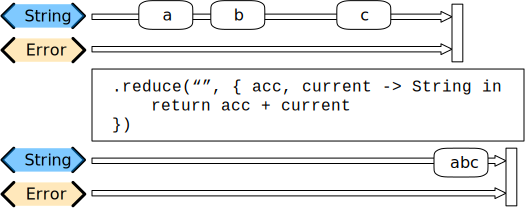

Very similar in function to the [scan](#scan) operator, reduce collects values produced within a stream. **The big difference between `scan` and `reduce` is that `reduce` does not trigger any values until the upstream publisher completes successfully.**

When you create a `reduce` operator, you provide an initial value (of the type determined by the upstream publisher) and a closure that takes two parameters - the result returned from the previous invocation of the closure and a new value from the upstream publisher.

Like `scan`, you don’t need to maintain the type of the upstream publisher, but can convert the type in your closure, returning whatever is appropriate to your needs.

An example of `reduce` that collects strings and appends them together:

```swift
.reduce("", { prevVal, newValueFromPublisher -> String in
    return prevVal+newValueFromPublisher
})
```

The `reduce` operator is excellent at converting a stream that provides many values over time into one that provides a single value upon completion.

### tryReduce

A publisher that applies a closure to all received elements and produces an accumulated value when the upstream publisher finishes, while also allowing the closure to throw an exception, terminating the pipeline.

`tryReduce` is a variation of the `reduce` operator that allows for the closure to throw an error. If the exception path is taken, the `tryReduce` operator will *not* publish any output values to downstream subscribers.

Like `reduce`, the `tryReduce` will only publish a *single* downstream result upon a `.finished` completion from the upstream publisher.

## Applying Mathematical Operations on Elements

### max

Publishes the max value of all values received upon completion of the upstream publisher.

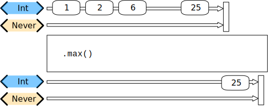

`max` can be set up with either no parameters, or taking a closure. If defined as an operator with no parameters, the Output type of the upstream publisher must conform to `Comparable`.

```swift
.max()
```

If what you are publishing doesn’t conform to `Comparable`, then you may specify a closure to provide the ordering for the operator.

```swift
.max { (struct1, struct2) -> Bool in
    return struct1.property1 < struct2.property1
    // returning boolean true to order struct2 greater than struct1
    // the underlying method parameter for this closure hints to it:
    // `areInIncreasingOrder`
}
```

The parameter name of the closure hints to how it should be provided, being named `areInIncreasingOrder`. The closure will take two values of the output type of the upstream publisher, and within it you should provide a `boolean` result indicating if they are in increasing order.

The operator will not provide any results under the upstream published has sent a `.finished` completion. If the upstream publisher sends a `.failure` completion, then no values will be published and the `.failure` completion will be forwarded.

### tryMax

Publishes the `max` value of all values received upon completion of the upstream publisher.

A variation of the `max` operator that takes a closure to define ordering, and it also allowed to throw an error.

### min

Publishes the minimum value of all values received upon completion of the upstream publisher.


`min` can be set up with either no parameters, or taking a closure. If defined as an operator with no parameters, the Output type of the upstream publisher must conform to `Comparable`.

```swift
.min()
```

If what you are publishing doesn’t conform to `Comparable`, then you may specify a closure to provide the ordering for the operator.

```swift
.min { (struct1, struct2) -> Bool in
    return struct1.property1 < struct2.property1
    // returning boolean true to order struct2 greater than struct1
    // the underlying method parameter for this closure hints to it:
    // `areInIncreasingOrder`
}
```

The parameter name of the closure hints to how it should be provided, being named `areInIncreasingOrder`. The closure will take two values of the output type of the upstream publisher, and within it you should provide a `boolean` result indicating if they are in increasing order.

The operator will not provide any results under the upstream published has sent a `.finished` completion. If the upstream publisher sends a `.failure` completion, then no values will be published and the `.failure` completion will be forwarded.

### tryMin

Publishes the minimum value of all values received upon completion of the upstream publisher.

A variation of the `min` operator that takes a closure to define ordering, and it also allowed to throw an error.

### count

`count` publishes the number of items received from the upstream publisher

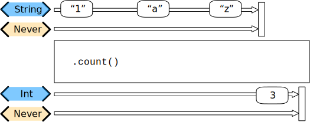

The operator will not provide any results under the upstream published has sent a `.finished` completion. If the upstream publisher sends a `.failure` completion, then no values will be published and the `.failure` completion will be forwarded.

## Applying Matching Criteria to Elements

### allSatisfy

A publisher that publishes a *single* `Boolean` value that indicates whether all received elements pass a provided predicate.


The operator will compare any incoming values, only responding when the upstream publisher sends a `.finished` completion. At that point, the `allSatisfies` operator will return a *single* `boolean` value indicating if *all* the values received matched (or not) based on processing through the provided closure.

If the operator receives a `.failure` completion from the upstream publisher, or throws an error itself, then *no* data values will be published to subscribers. In those cases, the operator will only return (or forward) the `.failure` completion.

### tryAllSatisfy

A publisher that publishes a *single* `Boolean` value that indicates whether all received elements pass a given throwing predicate.

### contains

A publisher that emits a `Boolean` value when a specified element is received from its upstream publisher.

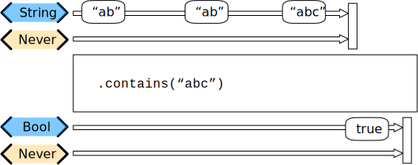

The simplest form of `contains` accepts a single parameter. The type of this parameter must match the Output type of the upstream publisher.

The operator will compare any incoming values, only responding when the incoming value is equatable to the parameter provided.

- When it does find a match, the operator returns a single boolean value (`true`) and then terminates the stream. **Any further values published from the upstream provider are then ignored.**
- If the upstream published sends a `.finished` completion before any values do match, the operator will publish a *single* boolean (`false`) and then terminate the stream.

### contains(where:)

A publisher that emits a `Boolean` value upon receiving an element that satisfies the predicate closure.

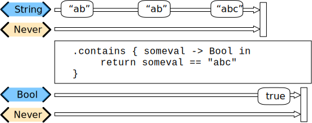

A more flexible version of the [contains](#contains) operator. Instead of taking a single parameter value to match, you provide a closure which takes in a single value (of the type provided by the upstream publisher) and returns a boolean.

Like `contains`, it will compare multiple incoming values, only responding when the incoming value is equatable to the parameter provided. When it does find a match, the operator returns a single `boolean` value and terminates the stream. **Any further values published from the upstream provider are ignored.**

If the upstream published sends a `.finished` completion before any values do match, the operator will publish a *single* boolean (`false`) and terminates the stream.

If you want a variant of this functionality that checks multiple incoming values to determine if *all* of them match, consider using the [allSatisfy](#allsatisfy) operator.

### tryContains(where:)

A publisher that emits a `Boolean` value upon receiving an element that satisfies the throwing predicate closure.

If the operator receives a `.failure` completion from the upstream publisher, or throws an error itself, *no* data values will be published to subscribers. In those cases, the operator will only return (or forward) the `.failure` completion.

## Applying Sequence Operations to Elements

### drop(untilOutputFrom:)

Ignores elements from the upstream publisher until it receives an element from a second publisher.

**Declaration**:

```swift
func drop<P>(untilOutputFrom publisher: P) -> Publishers.DropUntilOutput<Self, P> where P : Publisher, Self.Failure == P.Failure
```

**Discussion**:

Use `drop(untilOutputFrom:)` to ignore elements from the upstream publisher until another, second, publisher delivers its first element. This publisher requests a single value from the second publisher, and it ignores (drops) all elements from the upstream publisher until the second publisher produces a value.

**After the second publisher produces an element, `drop(untilOutputFrom:)` cancels its subscription to the second publisher, and allows events from the upstream publisher to pass through.**

After this publisher receives a subscription from the upstream publisher, it passes through backpressure requests from downstream to the upstream publisher. If the upstream publisher acts on those requests before the other publisher produces an item, this publisher drops the elements it receives from the upstream publisher.

In the example below, the `pub1` publisher defers publishing its elements until the `pub2` publisher delivers its first element:

```swift
let upstream = PassthroughSubject<Int,Never>()
let second = PassthroughSubject<String,Never>()
cancellable = upstream
    .drop(untilOutputFrom: second)
    .sink { print("\($0)", terminator: " ") }

upstream.send(1)
upstream.send(2)
second.send("A")
upstream.send(3)
upstream.send(4)
// Prints "3 4"
```

### dropFirst

Omits the specified number of elements before republishing subsequent elements.

**Declaration**:

```swift
func dropFirst(_ count: Int = 1) -> Publishers.Drop<Self>
```

**Discussion**:

Use `dropFirst(_:)` when you want to drop the first `n` elements from the upstream publisher, and republish the remaining elements.

The example below drops the first five elements from the stream:

```swift
let numbers = [1, 2, 3, 4, 5, 6, 7, 8, 9, 10]
cancellable = numbers.publisher
    .dropFirst(5)
    .sink { print("\($0)", terminator: " ") }

// Prints: "6 7 8 9 10 "
```

### drop(while:)

Omits elements from the upstream publisher until a given closure returns `false`, before republishing all remaining elements.

**Declaration**:

```swift
func drop(while predicate: @escaping (Self.Output) -> Bool) -> Publishers.DropWhile<Self>
```

**Discussion**:

In the example below, the operator omits all elements in the stream until the first element arrives that’s a positive integer, after which the operator publishes all remaining elements:

```swift
let numbers = [-62, -1, 0, 10, 0, 22, 41, -1, 5]
cancellable = numbers.publisher
    .drop { $0 <= 0 }
    .sink { print("\($0)") }

// Prints: "10 0, 22 41 -1 5"
```

### tryDrop(while:)

Omits elements from the upstream publisher until an error-throwing closure returns `false`, before republishing all remaining elements.

**Declaration**:

```swift
func tryDrop(while predicate: @escaping (Self.Output) throws -> Bool) -> Publishers.TryDropWhile<Self>
```

**Discussion**:

If the closure throws, no elements are emitted and the publisher fails with an error.

In the example below, elements are ignored until `-1` is encountered in the stream and the closure returns `false`. The publisher then republishes the remaining elements and finishes normally. Conversely, if the `guard` value in the closure had been encountered, the closure would throw and the publisher would fail with an error.

```swift
struct RangeError: Error {}
var numbers = [1, 2, 3, 4, 5, 6, -1, 7, 8, 9, 10]
let range: CountableClosedRange<Int> = (1...100)
cancellable = numbers.publisher
    .tryDrop {
        guard $0 != 0 else { throw RangeError() }
        return range.contains($0)
    }
    .sink(
        receiveCompletion: { print ("completion: \($0)") },
        receiveValue: { print ("value: \($0)") }
    )

// Prints: "-1 7 8 9 10 completion: finished"
// 
// If instead numbers was [1, 2, 3, 4, 5, 6, 0, -1, 7, 8, 9, 10], 
// tryDrop(while:) would fail with a RangeError.
```

### append

Appends a publisher’s output with the specified elements.

**Declaration**:

```swift
func append(_ elements: Self.Output...) -> Publishers.Concatenate<Self, Publishers.Sequence<[Self.Output], Self.Failure>>
```

**Discussion**:

In the example below, the `append(_:)` operator publishes the provided elements after republishing all elements from `dataElements`:

```swift
let dataElements = (0...10)
cancellable = dataElements.publisher
    .append(0, 1, 255)
    .sink { print("\($0)", terminator: " ") }

// Prints: "0 1 2 3 4 5 6 7 8 9 10 0 1 255"
```

### `append<S>`

Appends a publisher’s output with the specified sequence.

**Declaration**:

```swift
func append<S>(_ elements: S) -> Publishers.Concatenate<Self, Publishers.Sequence<S, Self.Failure>> where S : Sequence, Self.Output == S.Element
```

**Discussion**:

In the example below, the `append(_:)` publisher republishes all elements from `groundTransport` until it finishes, then publishes the members of `airTransport`:

```swift
let groundTransport = ["car", "bus", "truck", "subway", "bicycle"]
let airTransport = ["parasail", "jet", "helicopter", "rocket"]
cancellable = groundTransport.publisher
    .append(airTransport)
    .sink { print("\($0)", terminator: " ") }

// Prints: "car bus truck subway bicycle parasail jet helicopter rocket"
```

### `append<P>`

Appends the output of this publisher with the elements emitted by the given publisher.

**Declaration**:

```swift
func append<P>(_ publisher: P) -> Publishers.Concatenate<Self, P> where P : Publisher, Self.Failure == P.Failure, Self.Output == P.Output
```

**Discussion**:

If this publisher fails with an error, the given publishers elements aren’t published.

In the example below, the `append` publisher republishes all elements from the `numbers` publisher until it finishes, then publishes all elements from the `otherNumbers` publisher:

```swift
let numbers = (0...10)
let otherNumbers = (25...35)
cancellable = numbers.publisher
    .append(otherNumbers.publisher)
    .sink { print("\($0)", terminator: " ") }

// Prints: "0 1 2 3 4 5 6 7 8 9 10 25 26 27 28 29 30 31 32 33 34 35 "
```

### prepend

A publisher that emits all of one publisher’s elements before those from another publisher.

The `prepend` operator will act as a merging of two pipelines. Also known as `Publishers.Concatenate`, it accepts all values from one publisher, publishing them to subscribers. Once the first publisher is complete, the second publisher is used to provide values until it is complete.

The most general form of this can be invoked directly as:

```swift
Publishers.Concatenate(prefix: firstPublisher, suffix: secondPublisher)
```

This is equivalent to the form directly in a pipeline:

```swift
secondPublisher
    .prepend(firstPublisher)
```

The `prepend` operator also has convenience operators to send a sequence. For example:

```swift
secondPublisher
    .prepend(["one", "two"])
```

Another convenience operator exists to send a single value:

```swift
secondPublisher
    .prepend("one")
```

### prefix

Republishes elements up to the specified *maximum* count.

**Declaration**:

```swift
func prefix(_ maxLength: Int) -> Publishers.Output<Self>
```

**Discussion**:

In the example below, the `prefix(_:)` operator limits its output to the first two elements before finishing normally:

```swift
let numbers = (0...10)
cancellable = numbers.publisher
    .prefix(2)
    .sink { print("\($0)", terminator: " ") }

// Prints: "0 1"
```

### prefix(while:)

Republishes elements while a predicate closure indicates publishing should continue.

**Declaration**:

```swift
func prefix(while predicate: @escaping (Self.Output) -> Bool) -> Publishers.PrefixWhile<Self>
```

**Discussion**:

Use `prefix(while:)` to emit values while elements from the upstream publisher meet a condition you specify. The publisher finishes when the closure returns `false`.

In the example below, the `prefix(while:)` operator emits values while the element it receives is less than `5`:

```swift
let numbers = (0...10)
numbers.publisher
    .prefix { $0 < 5 }
    .sink { print("\($0)", terminator: " ") }

// Prints: "0 1 2 3 4"
```

### tryPrefix(while:)

Republishes elements while an error-throwing predicate closure indicates publishing should continue.

**Declaration**:

```swift
func tryPrefix(while predicate: @escaping (Self.Output) throws -> Bool) -> Publishers.TryPrefixWhile<Self>
```

**Discussion**:

Use `tryPrefix(while:)` to emit values from the upstream publisher that meet a condition you specify in an error-throwing closure. The publisher finishes when the closure returns `false`.

If the closure throws an error, the publisher fails with that error.

```swift
struct OutOfRangeError: Error {}

let numbers = (0...10).reversed()
cancellable = numbers.publisher
    .tryPrefix {
        guard $0 != 0 else {throw OutOfRangeError()}
        return $0 <= numbers.max()!
    }
    .sink(
        receiveCompletion: { print ("completion: \($0)", terminator: " ") },
        receiveValue: { print ("\($0)", terminator: " ") }
    )

// Prints: "10 9 8 7 6 5 4 3 2 1 completion: failure(OutOfRangeError()) "
```

### prefix(untilOutputFrom:)

Republishes elements until another publisher emits an element.

**Declaration**:

```swift
func prefix<P>(untilOutputFrom publisher: P) -> Publishers.PrefixUntilOutput<Self, P> where P : Publisher
```

**Discussion**:

After the second publisher publishes an element, the publisher returned by this method finishes.

## Selecting Specific Elements

### first

Publishes the first element of a stream, then finishes.

**Declaration**:

```swift
func first() -> Publishers.First<Self>
```

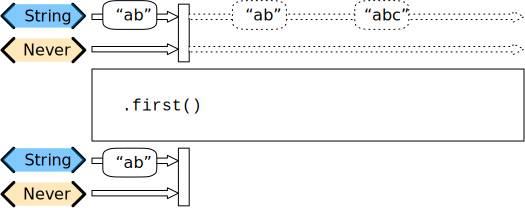

The `first` operator, when used without any parameters, will pass through the first value it receives, after which it sends a `.finish` completion message to any subscribers. If no values are received before the `first` operator receives a `.finish` completion from upstream publishers, the stream is terminated and no values are published.

```swift
let numbers = (-10...10)
cancellable = numbers.publisher
    .first()
    .sink { print("\($0)") }

// Print: "-10"
```

If you want a set number of values from the front of the stream you can also use `prefixUntilOutput` or the variants: `prefixWhile` and `tryPrefixWhile`.

If you want a set number of values from the middle the stream by count, you may want to use `output`, which allows you to select either a single value, or a range value from the sequence of values received by this operator.

### first(where:)

Publishes the first element of a stream to satisfy a predicate closure, then finishes normally.

**Declaration**:

```swift
func first(where predicate: @escaping (Self.Output) -> Bool) -> Publishers.FirstWhere<Self>
```

**Discussion**:

Use `first(where:)` to republish only the first element of a stream that satisfies a closure you specify. The publisher ignores all elements after the first element that satisfies the closure and finishes normally. If this publisher doesn’t receive any elements, it finishes without publishing.

In the example below, the provided closure causes the `Publishers.FirstWhere` publisher to republish the first received element that’s greater than 0, then finishes normally.

```swift
let numbers = (-10...10)
cancellable = numbers.publisher
    .first { $0 > 0 }
    .sink { print("\($0)") }

// Prints: "1"
```

### tryFirst(where:)

The `tryFirstWhere` operator is a variant of `firstWhere` that accepts a closure that can throw an error.

**Declaration**:

```swift
func tryFirst(where predicate: @escaping (Self.Output) throws -> Bool) -> Publishers.TryFirstWhere<Self>
```

**Discussion**:

Use `tryFirst(where:)` when you need to republish only the first element of a stream that satisfies an error-throwing closure you specify. The publisher ignores all elements after the first. If this publisher doesn’t receive any elements, it finishes without publishing. If the predicate closure throws an error, the publisher fails.

In the example below, a range publisher emits the first element in the range then finishes normally:

```swift
let numberRange: ClosedRange<Int> = (-1...50)
numberRange.publisher
    .tryFirst {
        guard $0 < 99 else {throw RangeError()}
        return true
    }
    .sink(
        receiveCompletion: { print ("completion: \($0)", terminator: " ") },
        receiveValue: { print ("\($0)", terminator: " ") }
     )

// Prints: "-1 completion: finished"
// If instead the number range were ClosedRange<Int> = (100...200), the tryFirst operator would terminate publishing with a RangeError.
```

### last

Publishes the last element of a stream, after the stream finishes.

**Declaration**:

```swift
func last() -> Publishers.Last<Self>
```

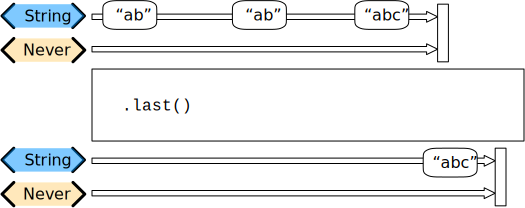

The `last` operator waits until the upstream publisher sends a `.finished` completion, then publishes the last value it received. If no values were received prior to receiving the `.finished` completion, no values are published to subscribers.

```swift
let numbers = (-10...10)
cancellable = numbers.publisher
    .last()
    .sink { print("\($0)") }

// Prints: "10"
```

### last(where:)

The `lastWhere` operator takes a single closure, accepting a value matching the output type of the upstream publisher, and returning a `boolean`. The operator publishes a value when the upstream published completes with a `.finished` completion.

**Declaration**:

```swift
func last(where predicate: @escaping (Self.Output) -> Bool) -> Publishers.LastWhere<Self>
```

- The value published will be the last one to satisfy the provide closure.
- If no values satisfied the closure, then no values are published and the pipeline is terminated normally with a `.finished` completion.

```swift
let numbers = (-10...10)
cancellable = numbers.publisher
    .last { $0 < 6 }
    .sink { print("\($0)") }

// Prints: "5"
```

### tryLast(where:)

Publishes the last element of a stream that satisfies an error-throwing predicate closure, after the stream finishes.

**Declaration**:

```swift
func tryLast(where predicate: @escaping (Self.Output) throws -> Bool) -> Publishers.TryLastWhere<Self>
```

**Discussion**:

In the example below, a publisher emits the last element that satisfies the error-throwing closure, then finishes normally:

```swift
struct RangeError: Error {}

let numbers = [-62, 1, 6, 10, 9, 22, 41, -1, 5]
cancellable = numbers.publisher
    .tryLast {
        guard $0 != 0  else {throw RangeError()}
        return true
    }
    .sink(
        receiveCompletion: { print ("completion: \($0)", terminator: " ") },
        receiveValue: { print ("\($0)", terminator: " ") }
    )
// Prints: "5 completion: finished"
// If instead the numbers array had contained a `0`, the `tryLast` operator would terminate publishing with a RangeError."
```

### output(at:)

Publishes a specific element, indicated by its index in the sequence of published elements.

**Declaration**:

```swift
func output(at index: Int) -> Publishers.Output<Self>
```

**Discussion**:

Use `output(at:)` when you need to republish a specific element specified by its position in the stream. If the publisher completes normally or with an error before publishing the specified element, then the publisher doesn’t produce any elements.

In the example below, the array publisher emits the *fifth* element in the sequence of published elements:

```swift
let numbers = [1, 2, 3, 4, 5, 6, 7, 8, 9, 10]
numbers.publisher
    .output(at: 5)
    .sink { print("\($0)") }

// Prints: "6"
```

### output(in:)

Publishes elements specified by their range in the sequence of published elements.

**Declaration**:

```swift
func output<R>(in range: R) -> Publishers.Output<Self> where R : RangeExpression, R.Bound == Int
```

**Discussion**:

Use `output(in:)` to republish a range indices you specify in the published stream. After publishing all elements, the publisher finishes normally. If the publisher completes normally or with an error before producing all the elements in the range, it doesn’t publish the remaining elements.

In the example below, an array publisher emits the subset of elements at the indices in the specified range:

```swift
let numbers = [1, 1, 2, 2, 2, 3, 4, 5, 6]
numbers.publisher
    .output(in: (3...5))
    .sink { print("\($0)", terminator: " ") }

// Prints: "2 2 3"
```

## Mixing Elements from Multiple Publishers

### `combineLatest<P>`

`CombineLatest` merges two pipelines into a single output, converting the output type to a `tuple` of values from the upstream pipelines, and providing an update when *any* of the upstream publishers provide a new value.

**Declaration**:

```swift
func combineLatest<P>(_ other: P) -> Publishers.CombineLatest<Self, P> where P : Publisher, Self.Failure == P.Failure
```

**Discussion**:

- Use `combineLatest(_:)` when you want the downstream subscriber to receive a tuple of the most-recent element from multiple publishers when *any* of them emit a value.
- To *pair* elements from multiple publishers, use `zip(_:)` instead.
- To receive just the most-recent element from multiple publishers rather than tuples, use `merge(with:)`.

> **Tip**: The combined publisher doesn’t produce elements until each of its upstream publishers publishes at least one element.

The combined publisher passes through any requests to all upstream publishers. However, it still obeys the demand-fulfilling rule of only sending the request amount downstream. If the demand isn’t `unlimited`, it drops values from upstream publishers. It implements this by using a buffer size of `1` for each upstream, and holds the most-recent value in each buffer.

In this example, `PassthroughSubject` `pub1` and also `pub2` emit values; as `combineLatest(_:)` receives input from either upstream publisher, it combines the latest value from each publisher into a tuple and publishes it.

```swift
let pub1 = PassthroughSubject<Int, Never>()
let pub2 = PassthroughSubject<Int, Never>()

cancellable = pub1
    .combineLatest(pub2)
    .sink { print("Result: \($0).") }

pub1.send(1)
pub1.send(2)
pub2.send(2)
pub1.send(3)
pub1.send(45)
pub2.send(22)

// Prints:
//    Result: (2, 2).    // pub1 latest = 2, pub2 latest = 2
//    Result: (3, 2).    // pub1 latest = 3, pub2 latest = 2
//    Result: (45, 2).   // pub1 latest = 45, pub2 latest = 2
//    Result: (45, 22).  // pub1 latest = 45, pub2 latest = 22
```

### `combineLatest<P, T>`

Similar to `combineLatest`, but take a closure that receives the most-recent value from each publisher and returns a new value to publish.

**Declaration**:

```swift
func combineLatest<P, T>(_ other: P, _ transform: @escaping (Self.Output, P.Output) -> T) -> Publishers.Map<Publishers.CombineLatest<Self, P>, T> where P : Publisher, Self.Failure == P.Failure
```

**Discussion**:

All upstream publishers need to finish for this publisher to finish. If an upstream publisher never publishes a value, this publisher never finishes. If any of the combined publishers terminates with a failure, this publisher also fails.

```swift
cancellable = pub1
    .combineLatest(pub2) { (first, second) in
        return first * second
    }
    .sink { print("Result: \($0)") }

pub1.send(1)
pub1.send(2)
pub2.send(2)
pub1.send(9)
pub1.send(3)
pub2.send(12)
pub1.send(13)

// Prints:
//Result: 4. (pub1 latest = 2, pub2 latest = 2)
//Result: 18. (pub1 latest = 9, pub2 latest = 2)
//Result: 6. (pub1 latest = 3, pub2 latest = 2)
//Result: 36. (pub1 latest = 3, pub2 latest = 12)
//Result: 156. (pub1 latest = 13, pub2 latest = 12)
```

### merge(with:)

Combines elements from this publisher with those from another publisher, delivering an interleaved sequence of elements.

**Declaration**:

```swift
func merge<P>(with other: P) -> Publishers.Merge<Self, P> where P : Publisher, Self.Failure == P.Failure, Self.Output == P.Output
```

**Discussion**:

The merged publisher continues to emit elements until all upstream publishers finish. If an upstream publisher produces an error, the merged publisher fails with that error.

In this example, as `merge(with:)` receives input from either upstream publisher, it republishes it to the downstream:

```swift
let publisher = PassthroughSubject<Int, Never>()
let pub2 = PassthroughSubject<Int, Never>()

cancellable = publisher
    .merge(with: pub2)
    .sink { print("\($0)", terminator: " " )}

publisher.send(2)
pub2.send(2)
publisher.send(3)
pub2.send(22)
publisher.send(45)
pub2.send(22)
publisher.send(17)

// Prints: "2 2 3 22 45 22 17"
```

### `zip<P>`

Combines elements from another publisher and deliver pairs of elements as tuples.

**Declaration**:

```swift
func zip<P>(_ other: P) -> Publishers.Zip<Self, P> where P : Publisher, Self.Failure == P.Failure
```

**Discussion**:

Use `zip(_:)` to combine the latest elements from two publishers and emit a tuple to the downstream. The returned publisher waits until both publishers have emitted an event, then delivers the oldest unconsumed event from each publisher together as a tuple to the subscriber.

Much like a zipper or zip fastener on a piece of clothing pulls together rows of teeth to link the two sides, `zip(_:)` combines streams from two different publishers by linking pairs of elements from each side.

In this example, numbers and letters are PassthroughSubjects that emit values; once `zip(_:)` receives one value from each, it publishes the pair as a tuple to the downstream subscriber. It then waits for the next pair of values.

```swift
let numbersPub = PassthroughSubject<Int, Never>()
 let lettersPub = PassthroughSubject<String, Never>()

 cancellable = numbersPub
     .zip(lettersPub)
     .sink { print("\($0)") }
 numbersPub.send(1)    // numbersPub: 1      lettersPub:        zip output: <none>
 numbersPub.send(2)    // numbersPub: 1,2    lettersPub:        zip output: <none>
 letters.send("A")     // numbers: 1,2       letters:"A"        zip output: <none>
 numbers.send(3)       // numbers: 1,2,3     letters:           zip output: (1,"A")
 letters.send("B")     // numbers: 1,2,3     letters: "B"       zip output: (2,"B")

 // Prints:
 //  (1, "A")
 //  (2, "B")
```

### `zip<P, T>`

Combines elements from another publisher and delivers a transformed output.

**Declaration**:

```swift
func zip<P, T>(_ other: P, _ transform: @escaping (Self.Output, P.Output) -> T) -> Publishers.Map<Publishers.Zip<Self, P>, T> where P : Publisher, Self.Failure == P.Failure
```

**Discussion**:

Use `zip(_:_:)` to return a new publisher that combines the elements from two publishers using a transformation you specify to publish a new value to the downstream. The returned publisher waits until both publishers have emitted an event, then delivers the oldest unconsumed event from each publisher together that the operator uses in the transformation.

In this example, `PassthroughSubject` instances numbersPub and `lettersPub` emit values; `zip(_:_:)` receives the oldest value from each publisher, uses the `Int` from `numbersPub` and publishes a string that repeats the `String` from `lettersPub` that many times.

> If either upstream publisher finishes successfully or fails with an error, the zipped publisher does the same.

```swift
let numbersPub = PassthroughSubject<Int, Never>()
let lettersPub = PassthroughSubject<String, Never>()
cancellable = numbersPub
    .zip(lettersPub) { anInt, aLetter in
        String(repeating: aLetter, count: anInt)
    }
    .sink { print("\($0)") }
numbersPub.send(1)     // numbersPub: 1      lettersPub:       zip output: <none>
numbersPub.send(2)     // numbersPub: 1,2    lettersPub:       zip output: <none>
numbersPub.send(3)     // numbersPub: 1,2,3  lettersPub:       zip output: <none>
lettersPub.send("A")   // numbersPub: 1,2,3  lettersPub: "A"   zip output: "A"
lettersPub.send("B")   // numbersPub: 2,3    lettersPub: "B"   zip output: "BB"
// Prints:
//  A
//  BB
```

## Republishing Elements by Subscribing to New Publishers

### flatMap

Transforms all elements from an upstream publisher into a new publisher up to a maximum number of publishers you specify.

**Declaration**:

```swift
func flatMap<T, P>(maxPublishers: Subscribers.Demand = .unlimited, _ transform: @escaping (Self.Output) -> P) -> Publishers.FlatMap<P, Self> where T == P.Output, P : Publisher, Self.Failure == P.Failure
```

Typically used in error handling scenarios, `flatMap` takes a closure that allows you to read the incoming data value, and provide a publisher that returns a value to the pipeline.

In error handling, this is most frequently used to take the incoming value and create a *one-shot* pipeline that does some potentially failing operation, and then handling the error condition with a `catch` operator.

A simple example `flatMap`, arranged to show recovering from a decoding error and returning a placeholder value:

```swift
.flatMap { data in
    return Just(data)
        .decode(YourType.self, JSONDecoder())
        .catch {
            return Just(YourType.placeholder)
        }
}
```

A diagram version of this pipeline construct:


> `flatMap` expects to create a new pipeline within its closure for every input value that it receives. The expected result of this internal pipeline is a Publisher with its own output and failure type. The output type of the publisher resulting from the internal pipeline defines the output type of the `flatMap` operator. The error type of the internal publisher is often expected to be `<Never>`.

**Discussion**:

Use `flatMap(maxPublishers:_:)` when you want to create a new series of events for downstream subscribers based on the received value. The closure creates the new Publisher based on the received value. The new Publisher can emit more than one event, and successful completion of the new Publisher does not complete the overall stream. Failure of the new Publisher causes the overall stream to fail.

In the example below, a `PassthroughSubject` publishes `WeatherStation` elements. The `flatMap(maxPublishers:_:)` receives each element, creates a `URL` from it, and produces a new `URLSession.DataTaskPublisher`, which will publish the data loaded from that `URL`.

```swift
public struct WeatherStation {
    public let stationID: String
}

var weatherPublisher = PassthroughSubject<WeatherStation, URLError>()

cancellable = weatherPublisher.flatMap { station -> URLSession.DataTaskPublisher in
    let url = URL(string:"https://weatherapi.example.com/stations/\(station.stationID)/observations/latest")!
    return URLSession.shared.dataTaskPublisher(for: url)
}
.sink(
    receiveCompletion: { completion in
        // Handle publisher completion (normal or error).
    },
    receiveValue: {
        // Process the received data.
    }
 )

weatherPublisher.send(WeatherStation(stationID: "KSFO")) // San Francisco, CA
weatherPublisher.send(WeatherStation(stationID: "EGLC")) // London, UK
weatherPublisher.send(WeatherStation(stationID: "ZBBB")) // Beijing, CN
```

### switchToLatest

Republishes elements sent by the most recently received publisher.

**Declaration**:

```swift
func switchToLatest() -> Publishers.SwitchToLatest<Self.Output, Self>
```

> Available when `Failure` is `Self.Output.Failure`.

**Discussion**:

This operator works with an upstream publisher of publishers, flattening the stream of elements to appear as if they were coming from a single stream of elements. It switches the inner publisher as new ones arrive but keeps the outer publisher constant for downstream subscribers.

For example, given the type `AnyPublisher<URLSession.DataTaskPublisher, NSError>`, calling `switchToLatest()` results in the type `SwitchToLatest<(Data, URLResponse), URLError>`. The downstream subscriber sees a continuous stream of `(Data, URLResponse)` elements from what looks like a single `URLSession.DataTaskPublisher` even though the elements are coming from different upstream publishers.

When this operator receives a new publisher from the upstream publisher, it cancels its previous subscription. Use this feature to prevent earlier publishers from performing unnecessary work, such as creating network request publishers from frequently updating user interface publishers.

The following example updates a `PassthroughSubject` with a new value every `0.1` seconds. A `map(_:)` operator receives the new value and uses it to create a new `URLSession.DataTaskPublisher`. By using the `switchToLatest()` operator, the downstream `sink` subscriber receives the `(Data, URLResponse)` output type from the data task publishers, rather than the `URLSession.DataTaskPublisher` type produced by the `map(_:)` operator. Furthermore, creating each new data task publisher cancels the previous data task publisher.

> The exact behavior of this example depends on the value of `asyncAfter` and the speed of the network connection. If the delay value is longer, or the network connection is fast, the earlier data tasks may complete before `switchToLatest()` can cancel them. If this happens, the output includes multiple URLs whose tasks complete before cancellation.

```swift
let subject = PassthroughSubject<Int, Never>()

cancellable = subject
    .setFailureType(to: URLError.self)
    .map() { index -> URLSession.DataTaskPublisher in
        let url = URL(string: "https://example.org/get?index=\(index)")!
        return URLSession.shared.dataTaskPublisher(for: url)
    }
    .switchToLatest()
    .sink(receiveCompletion: { print("Complete: \($0)") },
          receiveValue: { (data, response) in
            guard let url = response.url else { print("Bad response."); return }
            print("URL: \(url)")
    })

for index in 1...5 {
    DispatchQueue.main.asyncAfter(deadline: .now() + TimeInterval(index/10)) {
        subject.send(index)
    }
}

// Prints "URL: https://example.org/get?index=5"
```

## Handling Errors

### assertNoFailure

Raises a fatal error when its upstream publisher fails, and otherwise republishes all received input.

**Declaration**:

```swift
func assertNoFailure(_ prefix: String = "", file: StaticString = #file, line: UInt = #line) -> Publishers.AssertNoFailure<Self>
```

**Discussion**:

Use `assertNoFailure()` for internal integrity checks that are active during testing. However, it is important to note that, like its Swift counterpart `fatalError(_:)`, the `assertNoFailure()` operator asserts a fatal exception when triggered during development and testing, *and* in shipping versions of code.

In the example below, a `CurrentValueSubject` publishes the initial and second values successfully. The third value, containing a `genericSubjectError`, causes the `assertNoFailure()` operator to assert a fatal exception stopping the process:

```swift
public enum SubjectError: Error {
    case genericSubjectError
}

let subject = CurrentValueSubject<String, Error>("initial value")
subject
    .assertNoFailure()
    .sink(receiveCompletion: { print ("completion: \($0)") },
          receiveValue: { print ("value: \($0).") }
    )

subject.send("second value")
subject.send(completion: Subscribers.Completion<Error>.failure(SubjectError.genericSubjectError))

// Prints:
//  value: initial value.
//  value: second value.
//  The process then terminates in the debugger as the assertNoFailure operator catches the genericSubjectError.
```

### catch

Handles errors from an upstream publisher by replacing it with another publisher.

**Declaration**:

```swift
func `catch`<P>(_ handler: @escaping (Self.Failure) -> P) -> Publishers.Catch<Self, P> where P : Publisher, Self.Output == P.Output
```

**Discussion**:

Use `catch()` to replace an error from an upstream publisher with a new publisher.

In the example below, the `catch()` operator handles the `SimpleError` thrown by the upstream publisher by replacing the error with a `Just` publisher. This continues the stream by publishing a single value and completing normally.

> Backpressure note: This publisher passes through `request` and `cancel` to the upstream. After receiving an error, the publisher sends sends any unfulfilled demand to the new `Publisher`. SeeAlso: `replaceError`

```swift
struct SimpleError: Error {}
let numbers = [5, 4, 3, 2, 1, 0, 9, 8, 7, 6]
cancellable = numbers.publisher
    .tryLast(where: {
        guard $0 != 0 else {throw SimpleError()}
        return true
    })
    .catch({ (error) in
        Just(-1)
    })
    .sink { print("\($0)") }
    // Prints: -1
```

### tryCatch

Handles errors from an upstream publisher by either replacing it with another publisher or throwing a new error.

**Declaration**:

```swift
func tryCatch<P>(_ handler: @escaping (Self.Failure) throws -> P) -> Publishers.TryCatch<Self, P> where P : Publisher, Self.Output == P.Output
```

**Discussion**:

Use `tryCatch(_:)` to decide how to handle from an upstream publisher by either replacing the publisher with a new publisher, or throwing a new error.

In the example below, an array publisher emits values that a `tryMap(_:)` operator evaluates to ensure the values are greater than `0`. If the values aren’t greater than `0`, the operator throws an error to the downstream subscriber to let it know there was a problem. The subscriber, `tryCatch(_:)`, replaces the error with a new publisher using `Just` to publish a final value before the stream ends normally.

```swift
enum SimpleError: Error { case error }
var numbers = [5, 4, 3, 2, 1, -1, 7, 8, 9, 10]

cancellable = numbers.publisher
   .tryMap { v in
        if v > 0 {
            return v
        } else {
            throw SimpleError.error
        }
}
  .tryCatch { error in
      Just(0) // Send a final value before completing normally.
              // Alternatively, throw a new error to terminate the stream.
}
  .sink(receiveCompletion: { print ("Completion: \($0).") },
        receiveValue: { print ("Received \($0).") }
  )
//    Received 5.
//    Received 4.
//    Received 3.
//    Received 2.
//    Received 1.
//    Received 0.
//    Completion: finished.
```

### retry

Attempts to recreate a failed subscription with the upstream publisher up to the number of times you specify.

**Declaration**:

```swift

```

**Discussion**:

Use `retry(_:)` to try a connecting to an upstream publisher after a failed connection attempt.

In the example below, a `URLSession.DataTaskPublisher` attempts to connect to a remote URL.

- If the connection attempt succeeds, it publishes the remote service’s HTML to the downstream publisher and completes normally.
- Otherwise, the retry operator attempts to reestablish the connection.
- If after three attempts the publisher still can’t connect to the remote URL, the `catch(_:)` operator replaces the error with a new publisher that publishes a “connection timed out” HTML page. After the downstream subscriber receives the timed out message, the stream completes normally.

> After exceeding the specified number of retries, the publisher passes the failure to the downstream receiver.

```swift
struct WebSiteData: Codable {
    var rawHTML: String
}

let myURL = URL(string: "https://www.example.com")

cancellable = URLSession.shared.dataTaskPublisher(for: myURL!)
    .retry(3)
    .map({ (page) -> WebSiteData in
        return WebSiteData(rawHTML: String(decoding: page.data, as: UTF8.self))
    })
    .catch { error in
        return Just(WebSiteData(rawHTML: "<HTML>Unable to load page - timed out.</HTML>"))
}
.sink(receiveCompletion: { print ("completion: \($0)") },
      receiveValue: { print ("value: \($0)") }
 )

// Prints: The HTML content from the remote URL upon a successful connection,
//         or returns "<HTML>Unable to load page - timed out.</HTML>" if the number of retries exceeds the specified value.
```

## Controlling Timing

### measureInterval

Measures and emits the time interval between events received from an upstream publisher.

**Declaration**:

```swift
func measureInterval<S>(using scheduler: S, options: S.SchedulerOptions? = nil) -> Publishers.MeasureInterval<Self, S> where S : Scheduler
```

**Discussion**:

Use `measureInterval(using:options:)` to measure the time between events delivered from an upstream publisher.
In the example below, a 1-second `Timer` is used as the data source for an event publisher; the `measureInterval(using:options:)` operator reports the elapsed time between the reception of events on the main run loop:

```swift
cancellable = Timer.publish(every: 1, on: .main, in: .default)
    .autoconnect()
    .measureInterval(using: RunLoop.main)
    .sink { print("\($0)", terminator: "\n") }

// Prints:
//      Stride(magnitude: 1.0013610124588013)
//      Stride(magnitude: 0.9992760419845581)
//      ...
```

### debounce

Publishes elements only after a specified time interval elapses between events.

**Declaration**:

```swift
func debounce<S>(for dueTime: S.SchedulerTimeType.Stride, scheduler: S, options: S.SchedulerOptions? = nil) -> Publishers.Debounce<Self, S> where S : Scheduler
```

- **Sample 1**:

    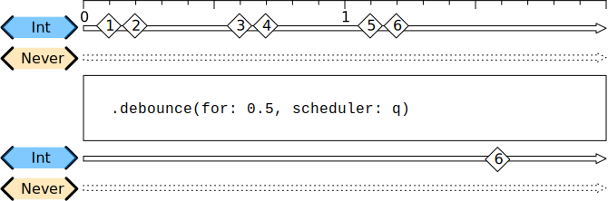

- **Sample 2**:

    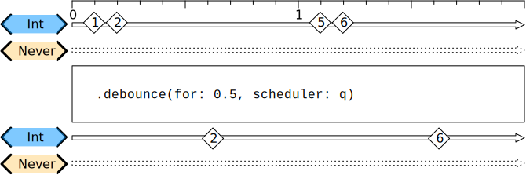

**Discussion**:

Use the `debounce(for:scheduler:options:)` operator to control the number of values and time between delivery of values from the upstream publisher. This operator is useful to process bursty or high-volume event streams where you need to reduce the number of values delivered to the downstream to a rate you specify.

In this example, a `PassthroughSubject` publishes elements on a schedule defined by the `bounces` array. The array is composed of *tuples* representing a value sent by the `PassthroughSubject`, and a `TimeInterval` ranging from one-quarter second up to 2 seconds that drives a delivery timer. As the queue builds, elements arriving faster than one-half second `debounceInterval` are discarded, while elements arriving at a rate slower than `debounceInterval` are passed through to the `sink(receiveValue:)` operator.

```swift
let bounces:[(Int,TimeInterval)] = [
    (0, 0),
    (1, 0.25),  // 0.25s interval since last index
    (2, 1),     // 0.75s interval since last index
    (3, 1.25),  // 0.25s interval since last index
    (4, 1.5),   // 0.25s interval since last index
    (5, 2)      // 0.5s interval since last index
]

let subject = PassthroughSubject<Int, Never>()

cancellable = subject
    .debounce(for: .seconds(0.5), scheduler: RunLoop.main)
    .sink { index in
        print ("Received index \(index)")
    }

for bounce in bounces {
    DispatchQueue.main.asyncAfter(deadline: .now() + bounce.1) {
        subject.send(bounce.0)
    }
}

// Prints:
//  Received index 1
//  Received index 4
//  Received index 5

//  Here is the event flow shown from the perspective of time, showing value delivery through the `debounce()` operator:

//  Time 0: Send index 0.
//  Time 0.25: Send index 1. Index 0 was waiting and is discarded.
//  Time 0.75: Debounce period ends, publish index 1.
//  Time 1: Send index 2.
//  Time 1.25: Send index 3. Index 2 was waiting and is discarded.
//  Time 1.5: Send index 4. Index 3 was waiting and is discarded.
//  Time 2: Debounce period ends, publish index 4. Also, send index 5.
//  Time 2.5: Debounce period ends, publish index 5.
```

The operator will collapse any values received within the timeframe provided to a single, last value received from the upstream publisher within the time window. If any value is received within the specified time window, it will collapse it. It will not return a result until the entire time window has elapsed with no additional values appearing.

This operator is frequently used with `removeDuplicates` when the publishing source is bound to UI interactions, primarily to **prevent an "edit and revert" style of interaction from triggering unnecessary work**.

If you wish to control the value returned within the time window, or if you want to simply control the volume of events by time, you may prefer to use `throttle`, which allows you to choose the first or last value provided.

### throttle

Publishes either the most-recent or first element published by the upstream publisher in the specified time interval.

- `latest == true`:

    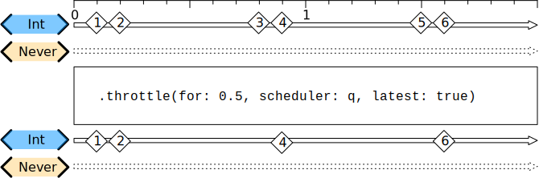

- `latest == false`:

    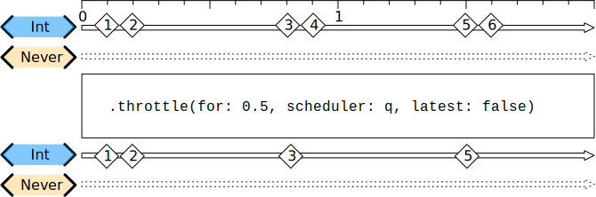

**Declaration**:

```swift
func throttle<S>(for interval: S.SchedulerTimeType.Stride, scheduler: S, latest: Bool) -> Publishers.Throttle<Self, S> where S : Scheduler
```

**Discussion**:

Use `throttle(for:scheduler:latest:)` to selectively republish elements from an upstream publisher during an interval you specify. Other elements received from the upstream in the throttling interval aren’t republished.

In the example below, a `Timer.TimerPublisher` produces elements on one-second intervals; the `throttle(for:scheduler:latest:)` operator delivers the first event, then republishes only the latest event in the following ten second intervals:

```swift
cancellable = Timer.publish(every: 3.0, on: .main, in: .default)
    .autoconnect()
    .print("\(Date().description)")
    .throttle(for: 10.0, scheduler: RunLoop.main, latest: true)
    .sink(
        receiveCompletion: { print ("Completion: \($0).") },
        receiveValue: { print("Received Timestamp \($0).") }
     )

// Prints:
 //    Publish at: 2020-03-19 18:26:54 +0000: receive value: (2020-03-19 18:26:57 +0000)
 //    Received Timestamp 2020-03-19 18:26:57 +0000.
 //    Publish at: 2020-03-19 18:26:54 +0000: receive value: (2020-03-19 18:27:00 +0000)
 //    Publish at: 2020-03-19 18:26:54 +0000: receive value: (2020-03-19 18:27:03 +0000)
 //    Publish at: 2020-03-19 18:26:54 +0000: receive value: (2020-03-19 18:27:06 +0000)
 //    Publish at: 2020-03-19 18:26:54 +0000: receive value: (2020-03-19 18:27:09 +0000)
 //    Received Timestamp 2020-03-19 18:27:09 +0000.
```

### delay

Delays delivery of all output to the downstream receiver by a specified amount of time on a particular scheduler.

**Declaration**:

```swift
func delay<S>(for interval: S.SchedulerTimeType.Stride, tolerance: S.SchedulerTimeType.Stride? = nil, scheduler: S, options: S.SchedulerOptions? = nil) -> Publishers.Delay<Self, S> where S : Scheduler
```

**Discussion**:

Use `delay(for:tolerance:scheduler:options:)` when you need to delay the delivery of elements to a downstream by a specified amount of time.

In this example, a `Timer` publishes an event every second. The `delay(for:tolerance:scheduler:options:)` operator holds the delivery of the initial element for `3` seconds (`±0.5` seconds), after which each element is delivered to the downstream on the main run loop after the specified delay:

```swift
let df = DateFormatter()
df.dateStyle = .none
df.timeStyle = .long
cancellable = Timer.publish(every: 1.0, on: .main, in: .default)
    .autoconnect()
    .handleEvents(receiveOutput: { date in
        print ("Sending Timestamp \'\(df.string(from: date))\' to delay()")
    })
    .delay(for: .seconds(3), scheduler: RunLoop.main, options: .none)
    .sink(
        receiveCompletion: { print ("completion: \($0)", terminator: "\n") },
        receiveValue: { value in
            let now = Date()
            print ("At \(df.string(from: now)) received  Timestamp \'\(df.string(from: value))\' sent: \(String(format: "%.2f", now.timeIntervalSince(value))) secs ago", terminator: "\n")
        }
    )

// Prints:
//    Sending Timestamp '5:02:33 PM PDT' to delay()
//    Sending Timestamp '5:02:34 PM PDT' to delay()
//    Sending Timestamp '5:02:35 PM PDT' to delay()
//    Sending Timestamp '5:02:36 PM PDT' to delay()
//    At 5:02:36 PM PDT received  Timestamp '5:02:33 PM PDT' sent: 3.00 secs ago
//    Sending Timestamp '5:02:37 PM PDT' to delay()
//    At 5:02:37 PM PDT received  Timestamp '5:02:34 PM PDT' sent: 3.00 secs ago
//    Sending Timestamp '5:02:38 PM PDT' to delay()
//    At 5:02:38 PM PDT received  Timestamp '5:02:35 PM PDT' sent: 3.00 secs ago
```

### timeout

Terminates publishing if the upstream publisher exceeds the specified time interval without producing an element.

**Declaration**:

```swift
func timeout<S>(_ interval: S.SchedulerTimeType.Stride, scheduler: S, options: S.SchedulerOptions? = nil, customError: (() -> Self.Failure)? = nil) -> Publishers.Timeout<Self, S> where S : Scheduler
```

**Discussion**:

Use `timeout(_:scheduler:options:customError:)` to terminate a publisher if an element isn’t delivered within a timeout interval you specify.

In the example below, a `PassthroughSubject` publishes `String` elements and is configured to time out if no new elements are received within its TIME_OUT window of 5 seconds. A single value is published after the specified 2-second WAIT_TIME, after which no more elements are available; the publisher then times out and completes normally.

```swift
let WAIT_TIME : Int = 2
let TIMEOUT_TIME : Int = 5

let subject = PassthroughSubject<String, Never>()

cancellable = subject
    .timeout(.seconds(TIMEOUT_TIME), scheduler: DispatchQueue.main, options: nil, customError:nil)
    .sink(
          receiveCompletion: { print ("completion: \($0) at \(Date())") },
          receiveValue: { print ("value: \($0) at \(Date())") }
     )

DispatchQueue.main.asyncAfter(deadline: .now() + .seconds(WAIT_TIME),
                              execute: { subject.send("Some data - sent after a delay of \(WAIT_TIME) seconds") } )

// Prints: 
// value: Some data - sent after a delay of 2 seconds at 2020-03-10 23:47:59 +0000
// completion: finished at 2020-03-10 23:48:04 +0000
```

- If `customError` is `nil`, the publisher completes normally;
- if you provide a closure for the `customError` argument, the upstream publisher is instead terminated upon timeout, and the error is delivered to the downstream.


