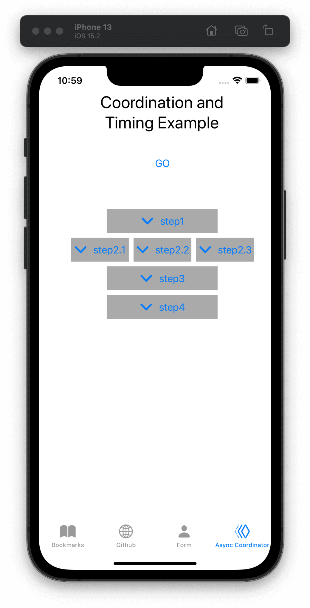

# Patterns and Recipes

- [Patterns and Recipes](#patterns-and-recipes)
  - [Creating a subscriber with sink](#creating-a-subscriber-with-sink)
  - [Creating a subscriber with assign](#creating-a-subscriber-with-assign)
  - [Making a network request with dataTaskPublisher](#making-a-network-request-with-datataskpublisher)
  - [Stricter request processing with dataTaskPublisher](#stricter-request-processing-with-datataskpublisher)
    - [Normalizing errors from a dataTaskPublisher](#normalizing-errors-from-a-datataskpublisher)
  - [Wrapping an asynchronous call with a Future to create a one-shot publisher](#wrapping-an-asynchronous-call-with-a-future-to-create-a-one-shot-publisher)
  - [Sequencing asynchronous operations](#sequencing-asynchronous-operations)

## Creating a subscriber with sink

**Goal**:

- To receive the output, and the errors or completion messages, generated from a publisher or through a pipeline, you can create a subscriber with `sink`.

**simple sink**:

```swift
let cancellablePipeline = publishingSource.sink { someValue in 1️⃣
    // do what you want with the resulting value passed down
    // be aware that depending on the publisher, this closure
    // may be invoked multiple times.
    print(".sink() received \(someValue)")
})
```

- 1️⃣ The simple version of a sink is very compact, with a single trailing closure receiving data when presented through the pipeline.

**sink with completions and data**:

```swift
let cancellablePipeline = publishingSource.sink(receiveCompletion: { completion in 1️⃣
    switch completion {
    case .finished:
        // no associated data, but you can react to knowing the
        // request has been completed
        break
    case .failure(let anError):
        // do what you want with the error details, presenting,
        // logging, or hiding as appropriate
        print("received the error: ", anError)
        break
    }
}, receiveValue: { someValue in
    // do what you want with the resulting value passed down
    // be aware that depending on the publisher, this closure
    // may be invoked multiple times.
    print(".sink() received \(someValue)")
})

cancellablePipeline.cancel() 2️⃣
```

- 1️⃣ Sinks are created by chaining the code from a publisher or pipeline, and provide an *end point* for the pipeline. When the sink is created or invoked on a publisher, it implicitly starts the lifecycle with the `subscribe` method, requesting unlimited data.
- 2️⃣ Sinks are *cancellable* subscribers. At any time you can take the reference that terminated with sink and invoke `.cancel()` on it to invalidate and shut down the pipeline.

## Creating a subscriber with assign

**Goal**:

- To use the results of a pipeline to set a value, often a property on a user interface view or control, but any KVO compliant object can be the provider.

`assign` is a subscriber that’s specifically designed to apply data from a publisher or pipeline into a property, updating that property whenever it receives data. Like `sink`, it activates when created and requests an unlimited data.

`assign` requires the failure type to be specified as `<Never>`, so if your pipeline could fail (such as using an *operator* like `tryMap`) you will need to [convert or handle the failure cases](https://heckj.github.io/swiftui-notes/#patterns-general-error-handling) before using `.assign`.

```swift
let cancellablePipeline = publishingSource 
    .receive(on: RunLoop.main) 
    .assign(to: \.isEnabled, on: yourButton) 

cancellablePipeline.cancel() 
```

- 1️⃣ `.assign` is typically chained onto a publisher when you create it, and the return value is *cancellable*.
- 2️⃣ If `.assign` is being used to update a *user interface* element, you need to make sure that it is being updated on the *main thread*. This call makes sure the subscriber is received on the main thread.
- 3️⃣ `assign` references the property being updated using a [key path](https://developer.apple.com/documentation/swift/referencewritablekeypath), and a reference to the object being updated.
- 4️⃣ At any time you can cancel to terminate and invalidate pipelines with `cancel()`. Frequently, you cancel the pipelines when you deactivate the objects (such as a viewController) that are getting updated from the pipeline.

## Making a network request with dataTaskPublisher

**Goal**:

- One common use case is requesting JSON data from a URL and decoding it.

This can be readily accomplished with Combine using `URLSession.dataTaskPublisher` followed by a series of operators that process the data. Minimally, `dataTaskPublisher` on `URLSession` uses `map` and `decode` before going to the subscriber.

The simplest case of using this might be:

```swift
let myURL = URL(string: "https://postman-echo.com/time/valid?timestamp=2016-10-10")
// checks the validity of a timestamp - this one returns {"valid":true}
// matching the data structure returned from https://postman-echo.com/time/valid
fileprivate struct PostmanEchoTimeStampCheckResponse: Decodable, Hashable { 1️⃣
    let valid: Bool
}

let remoteDataPublisher = URLSession.shared.dataTaskPublisher(for: myURL!) 2️⃣
    // the dataTaskPublisher output combination is (data: Data, response: URLResponse)
    .map { $0.data } 3️⃣
    .decode(type: PostmanEchoTimeStampCheckResponse.self, decoder: JSONDecoder()) 4️⃣

let cancellableSink = remoteDataPublisher
    .sink(receiveCompletion: { completion in
            print(".sink() received the completion", String(describing: completion))
            switch completion {
                case .finished: 5️⃣
                    break
                case .failure(let anError): 
                    print("received error: ", anError) 6️⃣
            }
    }, receiveValue: { someValue in 7️⃣
        print(".sink() received \(someValue)")
    })
```

- 1️⃣ Commonly you will have a struct defined that supports at least `Decodable` (if not the full `Codable` protocol). This struct can be defined to only pull the pieces you are interested in from the JSON provided over the network. The complete JSON payload does not need to be defined.
- 2️⃣ `dataTaskPublisher` is instantiated from `URLSession`. You can configure your own options on `URLSession`, or use a shared session.
- 3️⃣ The data that is returned is a tuple: `(data: Data, response: URLResponse)`. The `map` operator is used to get the data and drops the `URLResponse`, returning just Data down the pipeline.
- 4️⃣ `decode` is used to load the data and attempt to parse it. Decode can throw an error itself if the decode fails. If it succeeds, the object passed down the pipeline will be the struct from the JSON data.
- 5️⃣ If the decoding completed without errors, the finished completion will be triggered and the value will be passed to the `receiveValue` closure.
- 6️⃣ If the a failure happens (either with the original network request or the decoding), the error will be passed into with the `failure` closure.
- 7️⃣ Only if the data succeeded with request and decoding will this closure get invoked, and the data format received will be an instance of the struct `PostmanEchoTimeStampCheckResponse`.

## Stricter request processing with dataTaskPublisher

**Goal**:

- When `URLSession` makes a connection, it only reports an error if the remote server does not respond. You may want to consider a number of responses, based on status code, to be errors. To accomplish this, you can use `tryMap` to inspect the http response and *throw* an error in the pipeline.

To have more control over what is considered a failure in the URL response, use a `tryMap` operator on the tuple response from dataTaskPublisher. Since `dataTaskPublisher` returns both the response data and the `URLResponse` into the pipeline, you can immediately inspect the response and throw an error of your own if desired.

An example of that might look like:

```swift
let myURL = URL(string: "https://postman-echo.com/time/valid?timestamp=2016-10-10")
// checks the validity of a timestamp - this one returns {"valid":true}
// matching the data structure returned from https://postman-echo.com/time/valid
fileprivate struct PostmanEchoTimeStampCheckResponse: Decodable, Hashable {
    let valid: Bool
}
enum TestFailureCondition: Error {
    case invalidServerResponse
}

let remoteDataPublisher = URLSession.shared.dataTaskPublisher(for: myURL!)
    .tryMap { data, response -> Data in 1️⃣
                guard let httpResponse = response as? HTTPURLResponse, 2️⃣
                    httpResponse.statusCode == 200 else { 3️⃣
                        throw TestFailureCondition.invalidServerResponse 4️⃣
                }
                return data 5️⃣
    }
    .decode(type: PostmanEchoTimeStampCheckResponse.self, decoder: JSONDecoder())

let cancellableSink = remoteDataPublisher
    .sink(receiveCompletion: { completion in
            print(".sink() received the completion", String(describing: completion))
            switch completion {
                case .finished:
                    break
                case .failure(let anError):
                    print("received error: ", anError)
            }
    }, receiveValue: { someValue in
        print(".sink() received \(someValue)")
    })
```

- 1️⃣ `tryMap` still gets the tuple of `(data: Data, response: URLResponse)`, and is defined here as returning just the type of Data down the pipeline.
- 2️⃣ Within the closure for `tryMap`, we can cast the response to `HTTPURLResponse` and dig deeper into it, including looking at the specific status code.
- 3️⃣ In this case, we want to consider anything other than a `200` response code as a failure. `HTTPURLResponse.statusCode` is an `Int` type, so you could also have logic such as `httpResponse.statusCode > 300`.
- 4️⃣ If the predicates are not met it throws an instance of an error of our choosing; `invalidServerResponse` in this case.
- 5️⃣ If no error has occurred, then we simply pass down `Data` for further processing.

### Normalizing errors from a dataTaskPublisher

When an error is triggered on the pipeline, a `.failure` completion is sent with the error encapsulated within it, regardless of where it happened in the pipeline.

This pattern can be expanded to return a publisher that accommodates any number of specific error conditions using this general pattern. In many of the examples, we replace the error conditions with a default value. If we want to have a function that returns a publisher that *doesn’t* choose what happens on failure, then the same `tryMap` operator can be used in conjunction with `mapError` to translate review the response object as well as convert `URLError` error types.

```swift
enum APIError: Error, LocalizedError { 
    case unknown, apiError(reason: String), parserError(reason: String), networkError(from: URLError)

    var errorDescription: String? {
        switch self {
        case .unknown:
            return "Unknown error"
        case .apiError(let reason), .parserError(let reason):
            return reason
        case .networkError(let from): 
            return from.localizedDescription
        }
    }
}

func fetch(url: URL) -> AnyPublisher<Data, APIError> {
    let request = URLRequest(url: url)

    return URLSession.DataTaskPublisher(request: request, session: .shared) 
        .tryMap { data, response in 
            guard let httpResponse = response as? HTTPURLResponse else {
                throw APIError.unknown
            }
            if (httpResponse.statusCode == 401) {
                throw APIError.apiError(reason: "Unauthorized");
            }
            if (httpResponse.statusCode == 403) {
                throw APIError.apiError(reason: "Resource forbidden");
            }
            if (httpResponse.statusCode == 404) {
                throw APIError.apiError(reason: "Resource not found");
            }
            if (405..<500 ~= httpResponse.statusCode) {
                throw APIError.apiError(reason: "client error");
            }
            if (500..<600 ~= httpResponse.statusCode) {
                throw APIError.apiError(reason: "server error");
            }
            return data
        }
        .mapError { error in 
            // if it's our kind of error already, we can return it directly
            if let error = error as? APIError {
                return error
            }
            // if it is a TestExampleError, convert it into our new error type
            if error is TestExampleError {
                return APIError.parserError(reason: "Our example error")
            }
            // if it is a URLError, we can convert it into our more general error kind
            if let urlerror = error as? URLError {
                return APIError.networkError(from: urlerror)
            }
            // if all else fails, return the unknown error condition
            return APIError.unknown
        }
        .eraseToAnyPublisher() 
}
```

- 1️⃣ `APIError` is a Error enumeration that we are using in this example to collect all the variant errors that can occur.
- 2️⃣ `.networkError` is one of the specific cases of `APIError` that we will translate into when `URLSession.dataTaskPublisher` returns an error.
- 3️⃣ We start the generation of this publisher with a standard `dataTaskPublisher`.
- 4️⃣ We then route into the `tryMap` operator to inspect the response, creating specific error conditions based on the server response.
- 5️⃣ And finally we use `mapError` to convert any lingering error types down into a common Failure type of `APIError`.

## Wrapping an asynchronous call with a Future to create a one-shot publisher

**Goal**:

- Using `Future` to turn an asynchronous call into publisher to use the result in a Combine pipeline.

```swift
import Contacts
let futureAsyncPublisher = Future<Bool, Error> { promise in 1️⃣
    CNContactStore().requestAccess(for: .contacts) { grantedAccess, err in 2️⃣
        // err is an optional
        if let err = err { 3️⃣
            return promise(.failure(err))
        }
        return promise(.success(grantedAccess)) 4️⃣
    }
}.eraseToAnyPublisher()
```

- 1️⃣ `Future` itself has you define the return types and takes a closure. It hands in a `Result` object matching the type description, which you interact.
- 2️⃣ You can invoke the async API however is relevant, including passing in its required closure.
- 3️⃣ Within the completion handler, you determine what would cause a failure or a success. A call to `promise(.failure(<FailureType>))` returns the failure.
- 4️⃣ Or a call to `promise(.success(<OutputType>))` returns a value.

> **Warning**: A `Future` immediately calls the enclosed asynchronous API call when it is created, **not** when it receives a subscription demand. This may not be the behavior you want or need. If you want the call to be bound to subscribers requesting data, you probably want to wrap the `Future` with Deferred.

If you want to return a resolved promise as a `Future` publisher, you can do so by immediately returning the result you desire its closure.

The following example returns a single value as a success, with a boolean `true` value. You could just as easily return `false`, and the publisher would still act as a successful promise.

An example of returning a Future publisher that immediately resolves as an error:

```swift
enum ExampleFailure: Error {
    case oneCase
}

let resolvedFailureAsPublisher = Future<Bool, Error> { promise in
    promise(.failure(ExampleFailure.oneCase))
}.eraseToAnyPublisher()
```

## Sequencing asynchronous operations

**Goal**:

- To explicitly order asynchronous operations with a Combine pipeline

> This is similar to a concept called "promise chaining". While you can arrange combine such that it acts similarly, it is likely not a good replacement for using a promise library. The primary difference is that promise libraries always deal with a single result per promise, and a Combine brings along the complexity of needing to handle the possibility of many values.

By wrapping any asynchronous API calls with the `Future` publisher and then chaining them together with the `flatMap` operator, you invoke the wrapped asynchronous API calls in a specific order. Multiple parallel asynchronous efforts can be created by creating multiple pipelines, with `Future` or another publisher, and waiting for the pipelines to complete in parallel by merging them together with the `zip` operator.

If you want force an `Future` publisher to not be invoked until another has completed, then creating the future publisher in the `flatMap` closure causes it to wait to be created until a value has been passed to the `flatMap` operator.

These techniques can be composed to create any structure of parallel or serial tasks.

This technique of coordinating asynchronous calls can be especially effective if later tasks need data from earlier tasks. In those cases, the data results needed can be passed directly the pipeline.

An example of this sequencing follows below. In this example, buttons (arranged visually to show the ordering of actions) are highlighted when they complete. The whole sequence is triggered by a separate button action, which also resets the state of all the buttons and cancels any existing running sequence if it’s not yet finished. In this example, the asynchronous API call is a call that simply takes a random amount of time to complete to provide an example of how the timing works.



The workflow that is created is represented in steps:

- step 1 runs first.
- step 2 has three parallel efforts, running after step 1 completes.
- step 3 waits to start until all three elements of step 2 complete.
- step 4 runs after step 3 has completed.

Additionally, there is an activity indicator that is triggered to start animating when the sequence begins, stopping when step 4 has completed.

[AsyncCoordinatorViewController.swift](https://github.com/heckj/swiftui-notes/blob/master/UIKit-Combine/AsyncCoordinatorViewController.swift)

```swift
import UIKit
import Combine

class AsyncCoordinatorViewController: UIViewController {
    @IBOutlet weak var startButton: UIButton!
    @IBOutlet weak var step1_button: UIButton!
    @IBOutlet weak var step2_1_button: UIButton!
    @IBOutlet weak var step2_2_button: UIButton!
    @IBOutlet weak var step2_3_button: UIButton!
    @IBOutlet weak var step3_button: UIButton!
    @IBOutlet weak var step4_button: UIButton!
    @IBOutlet weak var activityIndicator: UIActivityIndicatorView!

    var cancellable: AnyCancellable?
    var coordinatedPipeline: AnyPublisher<Bool, Error>?

    @IBAction func doit(_ sender: Any) {
        runItAll()
    }

    func runItAll() { 1️⃣
        if let cancellable = cancellable {
            print("Cancelling existing run")
            cancellable.cancel()
            activityIndicator.stopAnimating()
        }
        print("resetting all the steps")
        resetAllSteps() 2️⃣
        // driving it by attaching it to .sink
        activityIndicator.startAnimating() 3️⃣
        print("attaching a new sink to start things going")
        cancellable = coordinatedPipeline? 4️⃣
            .print()
            .sink(receiveCompletion: { completion in
                print(".sink() received the completion: ", String(describing: completion))
                self.activityIndicator.stopAnimating()
            }, receiveValue: { value in
                print(".sink() received value: ", value)
            })
    }
    
    // MARK: - helper pieces that would normally be in other files

    // this emulates an async API call with a completion callback
    // it does nothing other than wait and ultimately return with a boolean value
    func randomAsyncAPI(completion completionBlock: @escaping ((Bool, Error?) -> Void)) {
        DispatchQueue.global(qos: .background).async {
            sleep(.random(in: 1...4))
            completionBlock(true, nil)
        }
    }

    /// Creates and returns pipeline that uses a Future to wrap randomAsyncAPI, then updates a UIButton to represent
    /// the completion of the async work before returning a boolean True
    /// - Parameter button: button to be updated
    func createFuturePublisher(button: UIButton) -> AnyPublisher<Bool, Error> { 5️⃣
        return Future<Bool, Error> { promise in
            self.randomAsyncAPI() { (result, err) in
                if let err = err {
                    promise(.failure(err))
                } else {
                    promise(.success(result))
                }
            }
        }
        .receive(on: RunLoop.main)
            // so that we can update UI elements to show the "completion"
            // of this step
        .map { inValue -> Bool in 6️⃣
            // intentially side effecting here to show progress of pipeline
            self.markStepDone(button: button)
            return true
        }
        .eraseToAnyPublisher()
    }

    /// highlights a button and changes the background color to green
    /// - Parameter button: reference to button being updated
    func markStepDone(button: UIButton) {
        button.backgroundColor = .systemGreen
        button.isHighlighted = true
    }

    func resetAllSteps() {
        for button in [step1_button, step2_1_button, step2_2_button, step2_3_button, step3_button, step4_button] {
            button?.backgroundColor = .lightGray
            button?.isHighlighted = false
        }
        activityIndicator.stopAnimating()
    }

    // MARK: - view setup

    override func viewDidLoad() {
        super.viewDidLoad()
        activityIndicator.stopAnimating()

        coordinatedPipeline = createFuturePublisher(button: step1_button) 7️⃣
            .flatMap { flatMapInValue -> AnyPublisher<Bool, Error> in
                let step2_1 = self.createFuturePublisher(button: self.step2_1_button)
                let step2_2 = self.createFuturePublisher(button: self.step2_2_button)
                let step2_3 = self.createFuturePublisher(button: self.step2_3_button)
                return Publishers.Zip3(step2_1, step2_2, step2_3)
                        .map{ _ -> Bool in
                            return true
                        }
                        .eraseToAnyPublisher()
            }
            .flatMap { _ in
                return self.createFuturePublisher(button: self.step3_button)
            }
            .flatMap { _ in
                return self.createFuturePublisher(button: self.step4_button)
            }
            .eraseToAnyPublisher()
    }
}
```

- 1️⃣ `runItAll` coordinates the operation of this workflow, starting with checking to see if one is currently running. If defined, it invokes `cancel()` on the existing subscriber.
- 2️⃣ `resetAllSteps` iterates through all the existing buttons used represent the progress of this workflow, and resets them to gray and unhighlighted to reflect an initial state. It also verifies that the activity indicator is not currently animated.
- 3️⃣ Then we get things started, first with activating the animation on the activity indicator.
- 4️⃣ Creating the *subscriber* with `sink` and storing the reference initiates the workflow. The publisher to which it is subscribing is setup outside this function, allowing it to be re-used multiple times. The `print` operator in the pipeline is for debugging, showing console output when the pipeline is triggered.
- 5️⃣ Each step is represented by the invocation of a `Future` publisher, followed immediately by pipeline elements to switch to the *main thread* and then update a `UIButton`’s background to show the step has completed. This is encapsulated in a `createFuturePublisher` call, using `eraseToAnyPublisher` to simplify the type being returned.
- 6️⃣ The `map` operator is used to create this specific side effect of updating the a `UIButton` to show the step has been completed.
- 7️⃣ The creation of the overall pipeline and its structure of serial and parallel tasks is created from the combination of calls to `createFuturePublisher` using the operators `flatMap` and `zip`.
