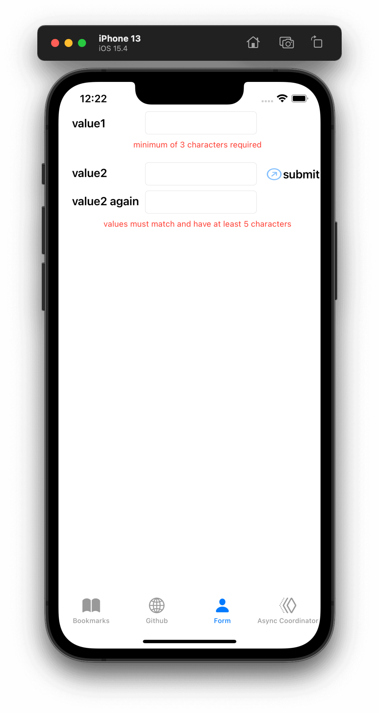

# Patterns and Recipes

- [Patterns and Recipes](#patterns-and-recipes)
  - [Creating a subscriber with sink](#creating-a-subscriber-with-sink)
  - [Creating a subscriber with assign](#creating-a-subscriber-with-assign)
  - [Making a network request with dataTaskPublisher](#making-a-network-request-with-datataskpublisher)
  - [Stricter request processing with dataTaskPublisher](#stricter-request-processing-with-datataskpublisher)
    - [Normalizing errors from a dataTaskPublisher](#normalizing-errors-from-a-datataskpublisher)
  - [Wrapping an asynchronous call with a Future to create a one-shot publisher](#wrapping-an-asynchronous-call-with-a-future-to-create-a-one-shot-publisher)
  - [Sequencing asynchronous operations](#sequencing-asynchronous-operations)
  - [Error Handling](#error-handling)
    - [Verifying a failure hasn’t happened using assertNoFailure](#verifying-a-failure-hasnt-happened-using-assertnofailure)
    - [Using catch to handle errors in a one-shot pipeline](#using-catch-to-handle-errors-in-a-one-shot-pipeline)
    - [Retrying in the event of a temporary failure](#retrying-in-the-event-of-a-temporary-failure)
    - [Using flatMap and catch to handle errors without cancelling the pipeline](#using-flatmap-and-catch-to-handle-errors-without-cancelling-the-pipeline)
    - [Requesting data from an alternate URL when the network is constrained](#requesting-data-from-an-alternate-url-when-the-network-is-constrained)
  - [UIKit or AppKit Integration](#uikit-or-appkit-integration)
    - [Declarative UI updates from user input](#declarative-ui-updates-from-user-input)
    - [Cascading multiple UI updates, including a network request](#cascading-multiple-ui-updates-including-a-network-request)
    - [Merging multiple pipelines to update UI elements](#merging-multiple-pipelines-to-update-ui-elements)
    - [Creating a repeating publisher by wrapping a delegate based API](#creating-a-repeating-publisher-by-wrapping-a-delegate-based-api)
    - [Responding to updates from NotificationCenter](#responding-to-updates-from-notificationcenter)
  - [SwiftUI Integration](#swiftui-integration)
    - [Using ObservableObject with SwiftUI models as a publisher source](#using-observableobject-with-swiftui-models-as-a-publisher-source)

## Creating a subscriber with sink

**Goal**:

- To receive the output, and the errors or completion messages, generated from a publisher or through a pipeline, you can create a subscriber with `sink`.

**simple sink**:

```swift
let cancellablePipeline = publishingSource.sink { someValue in 1️⃣
    // do what you want with the resulting value passed down
    // be aware that depending on the publisher, this closure
    // may be invoked multiple times.
    print(".sink() received \(someValue)")
})
```

- 1️⃣ The simple version of a sink is very compact, with a single trailing closure receiving data when presented through the pipeline.

**sink with completions and data**:

```swift
let cancellablePipeline = publishingSource.sink(receiveCompletion: { completion in 1️⃣
    switch completion {
    case .finished:
        // no associated data, but you can react to knowing the
        // request has been completed
        break
    case .failure(let anError):
        // do what you want with the error details, presenting,
        // logging, or hiding as appropriate
        print("received the error: ", anError)
        break
    }
}, receiveValue: { someValue in
    // do what you want with the resulting value passed down
    // be aware that depending on the publisher, this closure
    // may be invoked multiple times.
    print(".sink() received \(someValue)")
})

cancellablePipeline.cancel() 2️⃣
```

- 1️⃣ Sinks are created by chaining the code from a publisher or pipeline, and provide an *end point* for the pipeline. When the sink is created or invoked on a publisher, it implicitly starts the lifecycle with the `subscribe` method, requesting unlimited data.
- 2️⃣ Sinks are *cancellable* subscribers. At any time you can take the reference that terminated with sink and invoke `.cancel()` on it to invalidate and shut down the pipeline.

## Creating a subscriber with assign

**Goal**:

- To use the results of a pipeline to set a value, often a property on a user interface view or control, but any KVO compliant object can be the provider.

`assign` is a subscriber that’s specifically designed to apply data from a publisher or pipeline into a property, updating that property whenever it receives data. Like `sink`, it activates when created and requests an unlimited data.

`assign` requires the failure type to be specified as `<Never>`, so if your pipeline could fail (such as using an *operator* like `tryMap`) you will need to [convert or handle the failure cases](https://heckj.github.io/swiftui-notes/#patterns-general-error-handling) before using `.assign`.

```swift
let cancellablePipeline = publishingSource 
    .receive(on: RunLoop.main) 
    .assign(to: \.isEnabled, on: yourButton) 

cancellablePipeline.cancel() 
```

- 1️⃣ `.assign` is typically chained onto a publisher when you create it, and the return value is *cancellable*.
- 2️⃣ If `.assign` is being used to update a *user interface* element, you need to make sure that it is being updated on the *main thread*. This call makes sure the subscriber is received on the main thread.
- 3️⃣ `assign` references the property being updated using a [key path](https://developer.apple.com/documentation/swift/referencewritablekeypath), and a reference to the object being updated.
- 4️⃣ At any time you can cancel to terminate and invalidate pipelines with `cancel()`. Frequently, you cancel the pipelines when you deactivate the objects (such as a viewController) that are getting updated from the pipeline.

## Making a network request with dataTaskPublisher

**Goal**:

- One common use case is requesting JSON data from a URL and decoding it.

This can be readily accomplished with Combine using `URLSession.dataTaskPublisher` followed by a series of operators that process the data. Minimally, `dataTaskPublisher` on `URLSession` uses `map` and `decode` before going to the subscriber.

The simplest case of using this might be:

```swift
let myURL = URL(string: "https://postman-echo.com/time/valid?timestamp=2016-10-10")
// checks the validity of a timestamp - this one returns {"valid":true}
// matching the data structure returned from https://postman-echo.com/time/valid
fileprivate struct PostmanEchoTimeStampCheckResponse: Decodable, Hashable { 1️⃣
    let valid: Bool
}

let remoteDataPublisher = URLSession.shared.dataTaskPublisher(for: myURL!) 2️⃣
    // the dataTaskPublisher output combination is (data: Data, response: URLResponse)
    .map { $0.data } 3️⃣
    .decode(type: PostmanEchoTimeStampCheckResponse.self, decoder: JSONDecoder()) 4️⃣

let cancellableSink = remoteDataPublisher
    .sink(receiveCompletion: { completion in
            print(".sink() received the completion", String(describing: completion))
            switch completion {
                case .finished: 5️⃣
                    break
                case .failure(let anError): 
                    print("received error: ", anError) 6️⃣
            }
    }, receiveValue: { someValue in 7️⃣
        print(".sink() received \(someValue)")
    })
```

- 1️⃣ Commonly you will have a struct defined that supports at least `Decodable` (if not the full `Codable` protocol). This struct can be defined to only pull the pieces you are interested in from the JSON provided over the network. The complete JSON payload does not need to be defined.
- 2️⃣ `dataTaskPublisher` is instantiated from `URLSession`. You can configure your own options on `URLSession`, or use a shared session.
- 3️⃣ The data that is returned is a tuple: `(data: Data, response: URLResponse)`. The `map` operator is used to get the data and drops the `URLResponse`, returning just Data down the pipeline.
- 4️⃣ `decode` is used to load the data and attempt to parse it. Decode can throw an error itself if the decode fails. If it succeeds, the object passed down the pipeline will be the struct from the JSON data.
- 5️⃣ If the decoding completed without errors, the finished completion will be triggered and the value will be passed to the `receiveValue` closure.
- 6️⃣ If the a failure happens (either with the original network request or the decoding), the error will be passed into with the `failure` closure.
- 7️⃣ Only if the data succeeded with request and decoding will this closure get invoked, and the data format received will be an instance of the struct `PostmanEchoTimeStampCheckResponse`.

## Stricter request processing with dataTaskPublisher

**Goal**:

- When `URLSession` makes a connection, it only reports an error if the remote server does not respond. You may want to consider a number of responses, based on status code, to be errors. To accomplish this, you can use `tryMap` to inspect the http response and *throw* an error in the pipeline.

To have more control over what is considered a failure in the URL response, use a `tryMap` operator on the tuple response from dataTaskPublisher. Since `dataTaskPublisher` returns both the response data and the `URLResponse` into the pipeline, you can immediately inspect the response and throw an error of your own if desired.

An example of that might look like:

```swift
let myURL = URL(string: "https://postman-echo.com/time/valid?timestamp=2016-10-10")
// checks the validity of a timestamp - this one returns {"valid":true}
// matching the data structure returned from https://postman-echo.com/time/valid
fileprivate struct PostmanEchoTimeStampCheckResponse: Decodable, Hashable {
    let valid: Bool
}
enum TestFailureCondition: Error {
    case invalidServerResponse
}

let remoteDataPublisher = URLSession.shared.dataTaskPublisher(for: myURL!)
    .tryMap { data, response -> Data in 1️⃣
                guard let httpResponse = response as? HTTPURLResponse, 2️⃣
                    httpResponse.statusCode == 200 else { 3️⃣
                        throw TestFailureCondition.invalidServerResponse 4️⃣
                }
                return data 5️⃣
    }
    .decode(type: PostmanEchoTimeStampCheckResponse.self, decoder: JSONDecoder())

let cancellableSink = remoteDataPublisher
    .sink(receiveCompletion: { completion in
            print(".sink() received the completion", String(describing: completion))
            switch completion {
                case .finished:
                    break
                case .failure(let anError):
                    print("received error: ", anError)
            }
    }, receiveValue: { someValue in
        print(".sink() received \(someValue)")
    })
```

- 1️⃣ `tryMap` still gets the tuple of `(data: Data, response: URLResponse)`, and is defined here as returning just the type of Data down the pipeline.
- 2️⃣ Within the closure for `tryMap`, we can cast the response to `HTTPURLResponse` and dig deeper into it, including looking at the specific status code.
- 3️⃣ In this case, we want to consider anything other than a `200` response code as a failure. `HTTPURLResponse.statusCode` is an `Int` type, so you could also have logic such as `httpResponse.statusCode > 300`.
- 4️⃣ If the predicates are not met it throws an instance of an error of our choosing; `invalidServerResponse` in this case.
- 5️⃣ If no error has occurred, then we simply pass down `Data` for further processing.

### Normalizing errors from a dataTaskPublisher

When an error is triggered on the pipeline, a `.failure` completion is sent with the error encapsulated within it, regardless of where it happened in the pipeline.

This pattern can be expanded to return a publisher that accommodates any number of specific error conditions using this general pattern. In many of the examples, we replace the error conditions with a default value. If we want to have a function that returns a publisher that *doesn’t* choose what happens on failure, then the same `tryMap` operator can be used in conjunction with `mapError` to translate review the response object as well as convert `URLError` error types.

```swift
enum APIError: Error, LocalizedError { 
    case unknown, apiError(reason: String), parserError(reason: String), networkError(from: URLError)

    var errorDescription: String? {
        switch self {
        case .unknown:
            return "Unknown error"
        case .apiError(let reason), .parserError(let reason):
            return reason
        case .networkError(let from): 
            return from.localizedDescription
        }
    }
}

func fetch(url: URL) -> AnyPublisher<Data, APIError> {
    let request = URLRequest(url: url)

    return URLSession.DataTaskPublisher(request: request, session: .shared) 
        .tryMap { data, response in 
            guard let httpResponse = response as? HTTPURLResponse else {
                throw APIError.unknown
            }
            if (httpResponse.statusCode == 401) {
                throw APIError.apiError(reason: "Unauthorized");
            }
            if (httpResponse.statusCode == 403) {
                throw APIError.apiError(reason: "Resource forbidden");
            }
            if (httpResponse.statusCode == 404) {
                throw APIError.apiError(reason: "Resource not found");
            }
            if (405..<500 ~= httpResponse.statusCode) {
                throw APIError.apiError(reason: "client error");
            }
            if (500..<600 ~= httpResponse.statusCode) {
                throw APIError.apiError(reason: "server error");
            }
            return data
        }
        .mapError { error in 
            // if it's our kind of error already, we can return it directly
            if let error = error as? APIError {
                return error
            }
            // if it is a TestExampleError, convert it into our new error type
            if error is TestExampleError {
                return APIError.parserError(reason: "Our example error")
            }
            // if it is a URLError, we can convert it into our more general error kind
            if let urlerror = error as? URLError {
                return APIError.networkError(from: urlerror)
            }
            // if all else fails, return the unknown error condition
            return APIError.unknown
        }
        .eraseToAnyPublisher() 
}
```

- 1️⃣ `APIError` is a Error enumeration that we are using in this example to collect all the variant errors that can occur.
- 2️⃣ `.networkError` is one of the specific cases of `APIError` that we will translate into when `URLSession.dataTaskPublisher` returns an error.
- 3️⃣ We start the generation of this publisher with a standard `dataTaskPublisher`.
- 4️⃣ We then route into the `tryMap` operator to inspect the response, creating specific error conditions based on the server response.
- 5️⃣ And finally we use `mapError` to convert any lingering error types down into a common Failure type of `APIError`.

## Wrapping an asynchronous call with a Future to create a one-shot publisher

**Goal**:

- Using `Future` to turn an asynchronous call into publisher to use the result in a Combine pipeline.

```swift
import Contacts
let futureAsyncPublisher = Future<Bool, Error> { promise in 1️⃣
    CNContactStore().requestAccess(for: .contacts) { grantedAccess, err in 2️⃣
        // err is an optional
        if let err = err { 3️⃣
            return promise(.failure(err))
        }
        return promise(.success(grantedAccess)) 4️⃣
    }
}.eraseToAnyPublisher()
```

- 1️⃣ `Future` itself has you define the return types and takes a closure. It hands in a `Result` object matching the type description, which you interact.
- 2️⃣ You can invoke the async API however is relevant, including passing in its required closure.
- 3️⃣ Within the completion handler, you determine what would cause a failure or a success. A call to `promise(.failure(<FailureType>))` returns the failure.
- 4️⃣ Or a call to `promise(.success(<OutputType>))` returns a value.

> **Warning**: A `Future` immediately calls the enclosed asynchronous API call when it is created, **not** when it receives a subscription demand. This may not be the behavior you want or need. If you want the call to be bound to subscribers requesting data, you probably want to wrap the `Future` with Deferred.

If you want to return a resolved promise as a `Future` publisher, you can do so by immediately returning the result you desire its closure.

The following example returns a single value as a success, with a boolean `true` value. You could just as easily return `false`, and the publisher would still act as a successful promise.

An example of returning a Future publisher that immediately resolves as an error:

```swift
enum ExampleFailure: Error {
    case oneCase
}

let resolvedFailureAsPublisher = Future<Bool, Error> { promise in
    promise(.failure(ExampleFailure.oneCase))
}.eraseToAnyPublisher()
```

## Sequencing asynchronous operations

**Goal**:

- To explicitly order asynchronous operations with a Combine pipeline

> This is similar to a concept called "promise chaining". While you can arrange combine such that it acts similarly, it is likely not a good replacement for using a promise library. The primary difference is that promise libraries always deal with a single result per promise, and a Combine brings along the complexity of needing to handle the possibility of many values.

By wrapping any asynchronous API calls with the `Future` publisher and then chaining them together with the `flatMap` operator, you invoke the wrapped asynchronous API calls in a specific order. Multiple parallel asynchronous efforts can be created by creating multiple pipelines, with `Future` or another publisher, and waiting for the pipelines to complete in parallel by merging them together with the `zip` operator.

If you want force an `Future` publisher to not be invoked until another has completed, then creating the future publisher in the `flatMap` closure causes it to wait to be created until a value has been passed to the `flatMap` operator.

These techniques can be composed to create any structure of parallel or serial tasks.

This technique of coordinating asynchronous calls can be especially effective if later tasks need data from earlier tasks. In those cases, the data results needed can be passed directly the pipeline.

An example of this sequencing follows below. In this example, buttons (arranged visually to show the ordering of actions) are highlighted when they complete. The whole sequence is triggered by a separate button action, which also resets the state of all the buttons and cancels any existing running sequence if it’s not yet finished. In this example, the asynchronous API call is a call that simply takes a random amount of time to complete to provide an example of how the timing works.


The workflow that is created is represented in steps:

- step 1 runs first.
- step 2 has three parallel efforts, running after step 1 completes.
- step 3 waits to start until all three elements of step 2 complete.
- step 4 runs after step 3 has completed.

Additionally, there is an activity indicator that is triggered to start animating when the sequence begins, stopping when step 4 has completed.

[AsyncCoordinatorViewController.swift](https://github.com/heckj/swiftui-notes/blob/master/UIKit-Combine/AsyncCoordinatorViewController.swift)

```swift
import UIKit
import Combine

class AsyncCoordinatorViewController: UIViewController {
    @IBOutlet weak var startButton: UIButton!
    @IBOutlet weak var step1_button: UIButton!
    @IBOutlet weak var step2_1_button: UIButton!
    @IBOutlet weak var step2_2_button: UIButton!
    @IBOutlet weak var step2_3_button: UIButton!
    @IBOutlet weak var step3_button: UIButton!
    @IBOutlet weak var step4_button: UIButton!
    @IBOutlet weak var activityIndicator: UIActivityIndicatorView!

    var cancellable: AnyCancellable?
    var coordinatedPipeline: AnyPublisher<Bool, Error>?

    @IBAction func doit(_ sender: Any) {
        runItAll()
    }

    func runItAll() { 1️⃣
        if let cancellable = cancellable {
            print("Cancelling existing run")
            cancellable.cancel()
            activityIndicator.stopAnimating()
        }
        print("resetting all the steps")
        resetAllSteps() 2️⃣
        // driving it by attaching it to .sink
        activityIndicator.startAnimating() 3️⃣
        print("attaching a new sink to start things going")
        cancellable = coordinatedPipeline? 4️⃣
            .print()
            .sink(receiveCompletion: { completion in
                print(".sink() received the completion: ", String(describing: completion))
                self.activityIndicator.stopAnimating()
            }, receiveValue: { value in
                print(".sink() received value: ", value)
            })
    }
    
    // MARK: - helper pieces that would normally be in other files

    // this emulates an async API call with a completion callback
    // it does nothing other than wait and ultimately return with a boolean value
    func randomAsyncAPI(completion completionBlock: @escaping ((Bool, Error?) -> Void)) {
        DispatchQueue.global(qos: .background).async {
            sleep(.random(in: 1...4))
            completionBlock(true, nil)
        }
    }

    /// Creates and returns pipeline that uses a Future to wrap randomAsyncAPI, then updates a UIButton to represent
    /// the completion of the async work before returning a boolean True
    /// - Parameter button: button to be updated
    func createFuturePublisher(button: UIButton) -> AnyPublisher<Bool, Error> { 5️⃣
        return Future<Bool, Error> { promise in
            self.randomAsyncAPI() { (result, err) in
                if let err = err {
                    promise(.failure(err))
                } else {
                    promise(.success(result))
                }
            }
        }
        .receive(on: RunLoop.main)
            // so that we can update UI elements to show the "completion"
            // of this step
        .map { inValue -> Bool in 6️⃣
            // intentially side effecting here to show progress of pipeline
            self.markStepDone(button: button)
            return true
        }
        .eraseToAnyPublisher()
    }

    /// highlights a button and changes the background color to green
    /// - Parameter button: reference to button being updated
    func markStepDone(button: UIButton) {
        button.backgroundColor = .systemGreen
        button.isHighlighted = true
    }

    func resetAllSteps() {
        for button in [step1_button, step2_1_button, step2_2_button, step2_3_button, step3_button, step4_button] {
            button?.backgroundColor = .lightGray
            button?.isHighlighted = false
        }
        activityIndicator.stopAnimating()
    }

    // MARK: - view setup

    override func viewDidLoad() {
        super.viewDidLoad()
        activityIndicator.stopAnimating()

        coordinatedPipeline = createFuturePublisher(button: step1_button) 7️⃣
            .flatMap { flatMapInValue -> AnyPublisher<Bool, Error> in
                let step2_1 = self.createFuturePublisher(button: self.step2_1_button)
                let step2_2 = self.createFuturePublisher(button: self.step2_2_button)
                let step2_3 = self.createFuturePublisher(button: self.step2_3_button)
                return Publishers.Zip3(step2_1, step2_2, step2_3)
                        .map{ _ -> Bool in
                            return true
                        }
                        .eraseToAnyPublisher()
            }
            .flatMap { _ in
                return self.createFuturePublisher(button: self.step3_button)
            }
            .flatMap { _ in
                return self.createFuturePublisher(button: self.step4_button)
            }
            .eraseToAnyPublisher()
    }
}
```

- 1️⃣ `runItAll` coordinates the operation of this workflow, starting with checking to see if one is currently running. If defined, it invokes `cancel()` on the existing subscriber.
- 2️⃣ `resetAllSteps` iterates through all the existing buttons used represent the progress of this workflow, and resets them to gray and unhighlighted to reflect an initial state. It also verifies that the activity indicator is not currently animated.
- 3️⃣ Then we get things started, first with activating the animation on the activity indicator.
- 4️⃣ Creating the *subscriber* with `sink` and storing the reference initiates the workflow. The publisher to which it is subscribing is setup outside this function, allowing it to be re-used multiple times. The `print` operator in the pipeline is for debugging, showing console output when the pipeline is triggered.
- 5️⃣ Each step is represented by the invocation of a `Future` publisher, followed immediately by pipeline elements to switch to the *main thread* and then update a `UIButton`’s background to show the step has completed. This is encapsulated in a `createFuturePublisher` call, using `eraseToAnyPublisher` to simplify the type being returned.
- 6️⃣ The `map` operator is used to create this specific side effect of updating the a `UIButton` to show the step has been completed.
- 7️⃣ The creation of the overall pipeline and its structure of serial and parallel tasks is created from the combination of calls to `createFuturePublisher` using the operators `flatMap` and `zip`.

## Error Handling

Previous examples above expect that the *subscriber* would handle the error conditions, if they occurred. However, you are not always able to control what the *subscriber* requires - as might be the case if you are using SwiftUI. In these cases, you need to build your pipeline so that the output types match the subscriber types. This implies that you are handling any errors within the pipeline.

For example, if you are working with SwiftUI and the you want to use `assign` to set the `isEnabled` property on a button, the *subscriber* will have a few requirements:

- the subscriber should match the type output of `<Bool, Never>`
- the subscriber should be called on the *main thread*

With a publisher that can throw an error (such as `URLSession.dataTaskPublisher`), you need to construct a pipeline to convert the output type, but also handle the error within the pipeline to match a failure type of `<Never>`.

How you handle the errors within a pipeline is dependent on how the pipeline is defined.

- If the pipeline is set up to return a *single* result and terminate, a good example is [Using catch to handle errors in a one-shot pipeline](#using-catch-to-handle-errors-in-a-one-shot-pipeline).
- If the pipeline is set up to *continually* update, the error handling needs to be a little more complex. In this case, look at the example [Using flatMap with catch to handle errors](#using-flatmap-and-catch-to-handle-errors-without-cancelling-the-pipeline).

### Verifying a failure hasn’t happened using assertNoFailure

**Goal**:

- Verify no error has occurred within a pipeline

`assertNoFailure` *operator* also converts the failure type to `<Never>`. The operator will cause the application to terminate (or tests to crash to a debugger) if the assertion is triggered.

This is useful for verifying the invariant of having dealt with an error. If you are sure you handled the errors and need to map a pipeline which technically can generate a failure type of `<Error>` to a subscriber that requires a failure type of `<Never>`.

### Using catch to handle errors in a one-shot pipeline

**Goal**:

- If you need to handle a failure within a pipeline, for example before using the `assign` operator or another operator that requires the failure type to be `<Never>`, you can use catch to provide the appropriate logic.

`catch` handles errors by replacing the upstream publisher with another publisher that you provide as a return in a closure.

> **Warning**: Be aware that this effectively terminates the pipeline. If you’re using a one-shot publisher (one that doesn’t create more than a single event), then this is fine.

For example, `URLSession.dataTaskPublisher` is a one-shot publisher and you might use catch with it to ensure that you get a response, returning a placeholder in the event of an error. Extending our previous example to provide a default response:

```swift
struct IPInfo: Codable {
    // matching the data structure returned from ip.jsontest.com
    var ip: String
}
let myURL = URL(string: "http://ip.jsontest.com")
// NOTE(heckj): you'll need to enable insecure downloads in your Info.plist for this example, since the URL scheme is 'http'

let remoteDataPublisher = URLSession.shared.dataTaskPublisher(for: myURL!)
    // the dataTaskPublisher output combination is (data: Data, response: URLResponse)
    .map({ (inputTuple) -> Data in
        return inputTuple.data
    })
    .decode(type: IPInfo.self, decoder: JSONDecoder()) 1️⃣
    .catch { err in 2️⃣
        return Publishers.Just(IPInfo(ip: "8.8.8.8")) 3️⃣
    }
    .eraseToAnyPublisher()
```

- 1️⃣ Often, a `catch` operator will be placed after several operators that could fail, in order to provide a fallback or placeholder in the event that any of the possible previous operations failed.
- 2️⃣ When using `catch`, you get the error type in and can inspect it to choose how you provide a response.
- 3️⃣ The `Just` publisher is frequently used to either start another *one-shot* pipeline or to directly provide a placeholder response in the event of failure.

A possible problem with this technique is that the if the original *publisher* generates more values to which you wish to react, the original pipeline has been ended. If you are creating a pipeline that reacts to a `@Published` property, then after any failed value that activates the `catch` operator, the pipeline will cease to react further. See [catch](https://heckj.github.io/swiftui-notes/#reference-catch) for more details of how this works.

If you want to continue to respond to errors and handle them, see the pattern Using flatMap with catch to handle errors.

### Retrying in the event of a temporary failure

**Goal**:

- The `retry` operator can be included in a pipeline to retry a *subscription* when a `.failure` completion occurs.

> When requesting data from a `dataTaskPublisher`, the request may fail. In that case you will receive a `.failure` completion with an error. When it fails, the `retry` operator will let you retry that same request for a set number of attempts. The retry operator passes through the resulting values when the publisher does not send a `.failure` completion. `retry` only reacts within a combine pipeline when a `.failure` completion is sent.

When `retry` receives a `.failure` completion, the way it retries is by recreating the subscription to the operator or publisher to which it was chained.

The `retry` operator is commonly desired when attempting to request network resources with an unstable connection, or other situations where the request might succeed if the request happens again. If the number of retries specified all fail, then the `.failure` completion is passed down to the subscriber.

In our example below, we are using `retry` in combination with a `delay` operator. Our use of the delay operator puts a small random delay before the next request. This spaces out the retry attempts, so that the retries do not happen in quick succession.

This example also includes the use of the `tryMap` operator to more fully inspect any `URLResponse` returned from the `dataTaskPublisher`. Any response from the server is encapsulated by `URLSession`, and passed forward as a valid response. `URLSession` does not treat a *404 Not Found* http response as an error response, nor any of the *50x* error codes. Using `tryMap` lets us inspect the response code that was sent, and verify that it was a `200` response code. In this example, if the response code is anything but a `200` response, it throws an exception - which in turn causes the `tryMap` operator to pass down a `.failure` completion rather than data. This example sets the `tryMap` **after** the retry operator so that `retry` will only re-attempt the request when the site didn’t respond.

```swift
let remoteDataPublisher = urlSession.dataTaskPublisher(for: self.URL!)
    .delay(for: DispatchQueue.SchedulerTimeType.Stride(integerLiteral: Int.random(in: 1..<5)), scheduler: backgroundQueue) 1️⃣
    .retry(3) 2️⃣
    .tryMap { data, response -> Data in 3️⃣
        guard let httpResponse = response as? HTTPURLResponse,
            httpResponse.statusCode == 200 else {
                throw TestFailureCondition.invalidServerResponse
        }
        return data
    }
    .decode(type: PostmanEchoTimeStampCheckResponse.self, decoder: JSONDecoder())
    .subscribe(on: backgroundQueue)
    .eraseToAnyPublisher()
```

- 1️⃣ The `delay` operator will hold the results flowing through the pipeline for a short duration, in this case for a random selection of `1` to `5` seconds. By adding delay here in the pipeline, it will always occur, even if the original request is successful.
- 2️⃣ Retry is specified as trying `3` times. This will result in a total of `4` attempts if each fails - the original request and `3` additional attempts.
- 3️⃣ `tryMap` is being used to inspect the data result from `dataTaskPublisher` and return a `.failure` completion if the response from the server is valid, but not a `200` HTTP response code.

> When using the `retry` operator with `URLSession.dataTaskPublisher`, verify that the URL you are requesting isn’t going to have negative side effects if requested repeatedly or with a retry. Ideally such requests are be expected to be idempotent. If they are not, the `retry` operator may make multiple requests, with very unexpected side effects.

### Using flatMap and catch to handle errors without cancelling the pipeline

**Goal**:

- The `flatMap` operator can be used with `catch` to continue to handle errors on new published values.

> The `flatMap` operator is the operator to use in handling errors on a continual flow of events.

You provide a closure to `flatMap` that can read in the value that was provided, and creates a one-shot publisher that does the possibly failing work. An example of this is requesting data from a network and then decoding the returned data. You can include a `catch` operator to capture any errors and provide an appropriate value.

This is a perfect mechanism for when you want to maintain updates up an upstream publisher, as it creates one-shot publisher or short pipelines that send a single value and then complete for every incoming value. The completion from the created one-shot publishers terminates in the `flatMap` and is not passed to downstream subscribers.

An example of this with a dataTaskPublisher:

```swift
let remoteDataPublisher = Just(self.testURL!) 1️⃣
    .flatMap { url in 2️⃣
        URLSession.shared.dataTaskPublisher(for: url) 3️⃣
        .tryMap { data, response -> Data in 4️⃣
            guard let httpResponse = response as? HTTPURLResponse,
                httpResponse.statusCode == 200 else {
                    throw TestFailureCondition.invalidServerResponse
            }
            return data
        }
        .decode(type: PostmanEchoTimeStampCheckResponse.self, decoder: JSONDecoder()) 5️⃣
        .catch {_ in 6️⃣
            return Just(PostmanEchoTimeStampCheckResponse(valid: false))
        }
    }
    .eraseToAnyPublisher()
```

- 1️⃣ Just starts this publisher as an example by passing in a URL.
- 2️⃣ `flatMap` takes the URL as input and the closure goes on to create a *one-shot* publisher pipeline.
- 3️⃣ `dataTaskPublisher` uses the input url to make the request.
- 4️⃣ The result output ( a tuple of `(Data, URLResponse)` ) flows into `tryMap` to be parsed for additional errors.
- 5️⃣ `decode` attempts to refine the returned data into a locally defined type.
- 6️⃣ If any of this has failed, catch will convert the error into a placeholder sample. In this case an object with a preset `valid = false` property.

### Requesting data from an alternate URL when the network is constrained

**Goal**:

- From Apple’s WWDC 2019 presentation [Advances in Networking, Part 1](https://developer.apple.com/videos/play/wwdc2019/712/), a sample pattern was provided using `tryCatch` and `tryMap` operators to react to the specific error of the network being constrained.

```swift
// Generalized Publisher for Adaptive URL Loading
func adaptiveLoader(regularURL: URL, lowDataURL: URL) -> AnyPublisher<Data, Error> {
    var request = URLRequest(url: regularURL) 
    request.allowsConstrainedNetworkAccess = false 
    return URLSession.shared.dataTaskPublisher(for: request) 
        .tryCatch { error -> URLSession.DataTaskPublisher in 
            guard error.networkUnavailableReason == .constrained else {
               throw error
            }
            return URLSession.shared.dataTaskPublisher(for: lowDataURL) 
        .tryMap { data, response -> Data in
            guard let httpResponse = response as? HTTPUrlResponse, 
                   httpResponse.statusCode == 200 else {
                       throw MyNetworkingError.invalidServerResponse
            }
            return data
}
.eraseToAnyPublisher()
```

This example, from Apple’s WWDC, provides a function that takes two URLs - a primary and a fallback. It returns a publisher that will request data and fall back requesting a secondary URL when the network is constrained.

- 1️⃣ The request starts with an attempt requesting data.
- 2️⃣ Setting `request.allowsConstrainedNetworkAccess` will cause the `dataTaskPublisher` to error if the network is constrained.
- 3️⃣ Invoke the `dataTaskPublisher` to make the request.
- 4️⃣ `tryCatch` is used to capture the immediate error condition and check for a specific error (the *constrained network*).
- 5️⃣ If it finds an error, it creates a new *one-shot* publisher with the fall-back URL.
- 6️⃣ The resulting publisher can still fail, and `tryMap` can map this a failure by throwing an error on HTTP response codes that map to error conditions
- 7️⃣ `eraseToAnyPublisher` enables type erasure on the chain of operators so the resulting signature of the adaptiveLoader function is `AnyPublisher<Data, Error>`

In the sample, if the error returned from the original request wasn’t an issue of the network being constrained, it passes on the `.failure` completion down the pipeline. If the error is that the network is constrained, then the `tryCatch` operator creates a new request to an alternate URL.

## UIKit or AppKit Integration

### Declarative UI updates from user input

**Goal**:

- Querying a API and returning the data to be displayed in your UI

A pattern for integrating Combine with UIKit is setting up a variable which will hold a reference to the updated state, and linking the controls using `IBAction`.

The sample is a portion of the code at in a larger view controller implementation.

This example overlaps with the next pattern [Cascading UI updates including a network request](#cascading-multiple-ui-updates-including-a-network-request), which builds upon the initial publisher.

[UIKit-Combine/GithubAPI.swift](https://github.com/heckj/swiftui-notes/blob/master/UIKit-Combine/GithubAPI.swift)

```swift
import UIKit
import Combine

class ViewController: UIViewController {

    @IBOutlet weak var github_id_entry: UITextField! 1️⃣

    var usernameSubscriber: AnyCancellable?

    // username from the github_id_entry field, updated via IBAction
    // @Published is creating a publisher $username of type <String, Never>
    @Published var username: String = "" 2️⃣

    // github user retrieved from the API publisher. As it's updated, it
    // is "wired" to update UI elements
    @Published private var githubUserData: [GithubAPIUser] = []

    // MARK - Actions

    @IBAction func githubIdChanged(_ sender: UITextField) {
        username = sender.text ?? "" 3️⃣
        print("Set username to ", username)
    }

    override func viewDidLoad() {
        super.viewDidLoad()
        // Do any additional setup after loading the view.

        usernameSubscriber = $username 4️⃣
            .throttle(for: 0.5, scheduler: myBackgroundQueue, latest: true) 5️⃣
            // ^^ scheduler myBackGroundQueue publishes resulting elements
            // into that queue, resulting on this processing moving off the
            // main runloop.
            .removeDuplicates() 6️⃣
            .print("username pipeline: ") // debugging output for pipeline
            .map { username -> AnyPublisher<[GithubAPIUser], Never> in 7️⃣
                return GithubAPI.retrieveGithubUser(username: username)
            }
            // ^^ type returned by retrieveGithubUser is a Publisher, so we use
            // switchToLatest to resolve the publisher to its value
            // to return down the chain, rather than returning a
            // publisher down the pipeline.
            .switchToLatest() 8️⃣
            // using a sink to get the results from the API search lets us
            // get not only the user, but also any errors attempting to get it.
            .receive(on: RunLoop.main)
            .assign(to: \.githubUserData, on: self) 9️⃣
```

- 1️⃣ The `UITextField` is the interface element which is driving the updates from user interaction.
- 2️⃣ We defined a `@Published` property to both hold the data and reflect updates when they happen. Because its a `@Published` property, it provides a publisher that we can use with Combine pipelines to update other variables or elements of the interface.
- 3️⃣ We set the variable `*username*` from within an `IBAction`, which in turn triggers a data flow if the publisher `$username` has any subscribers.
- 4️⃣ We in turn set up a subscriber on the publisher `$username` that does further actions. In this case it uses updated values of username to retrieves an instance of a `GithubAPIUser` from *Github’s REST API*. It will make a new HTTP request to the every time the *username* value is updated.
- 5️⃣ The `throttle` is there to keep from triggering a network request on every possible edit of the text field. The throttle keeps it to a maximum of 1 request every half-second.
- 6️⃣ `removeDuplicates` collapses events from the changing *username* so that API requests are not made on the same value twice in a row. The `removeDuplicates` prevents redundant requests from being made, should the user edit and the return the previous value.
- 7️⃣ `map` is used similarly to `flatMap` in error handling here, returning an instance of a publisher. The API object returns a publisher, which this map is invoking. This doesn’t return the value from the call, but the publisher itself.
- 8️⃣ `switchToLatest` operator takes the instance of the publisher and resolves out the data. `switchToLatest` resolves a publisher into a value and passes that value down the pipeline, in this case an instance of `[GithubAPIUser]`.
- 9️⃣ And `assign` at the end up the pipeline is the subscriber, which assigns the value into another variable: `githubUserData`.

The pattern [Cascading UI updates including a network request](#cascading-multiple-ui-updates-including-a-network-request) expands upon this code to multiple cascading updates of various UI elements.

### Cascading multiple UI updates, including a network request

**Goal**:

- Have multiple UI elements update triggered by an upstream subscriber

**References**:

- The ViewController with this code is in the github project at [UIKit-Combine/GithubViewController.swift](https://github.com/heckj/swiftui-notes/blob/master/UIKit-Combine/GithubViewController.swift). You can see this code in operation by running the UIKit target within the github project.
- The GithubAPI is in the github project at [UIKit-Combine/GithubAPI.swift](https://github.com/heckj/swiftui-notes/blob/master/UIKit-Combine/GithubAPI.swift)

> The example provided expands on a publisher updating from [Declarative UI updates from user input](#declarative-ui-updates-from-user-input), adding additional Combine pipelines to update multiple UI elements as someone interacts with the provided interface.

The general pattern of this view starts with a textfield that accepts user input, from which the following actions flow:

1. Using an `IBAction` the `@Published` `username` variable is updated.
2. We have a subscriber (`usernameSubscriber`) attached `$username` publisher, which publishes the value on change and attempts to retrieve the GitHub user. The resulting variable `githubUserData` (also `@Published`) is a list of GitHub user objects. Even though we only expect a single value here, we use a list because we can conveniently return an empty list on failure scenarios: unable to access the API or the username isn’t registered at GitHub.
3. We have the `passthroughSubject` `apiNetworkActivitySubscriber` to reflect when the `GithubAPI` object starts or finishes making network requests.
4. We have a another subscriber `repositoryCountSubscriber` attached to `$githubUserData` publisher that pulls the repository count off the github user data object and assigns it to a text field to be displayed.
5. We have a final subscriber `avatarViewSubscriber` attached to `$githubUserData` that attempts to retrieve the image associated with the user’s avatar for display.

> Tips: The empty list is useful to return because when a `username` is provided that doesn’t resolve, we want to explicitly remove any avatar image that was previously displayed. To do this, we need the pipelines to fully resolve to some value, so that further pipelines are triggered and the relevant UI interfaces updated. If we used an optional `String?` instead of an array of `String[]`, the optional does not trigger some of the pipeline when it is `nil`, and we always want a result value - even an empty value - to come from the pipeline.

The subscribers (created with `assign` and `sink`) are stored as `AnyCancellable` variables on the view controller instance. Because they are defined on the class instance, the Swift compiler creates deinitializers which will cancel and clean up the publishers when the class is torn down.

> Info: A number of developers comfortable with *RxSwift* are using a "*CancelBag*" object to collect cancellable references, and cancel the pipelines on tear down. An example of this can be seen at [here](https://github.com/tailec/CombineExamples/blob/master/CombineExamples/Shared/CancellableBag.swift). This is accommodated within Combine with the `store` function on `AnyCancellable` that easily allows you to put a reference to the subscriber into a collection, such as `Set<AnyCancellable>`.

The pipelines have been explicitly configured to work on a background queue using the `subscribe` operator. Without that additional detail configured, the pipelines would be invoked and run on the main runloop since they were invoked from the UI, which may cause a noticeable slow-down in responsiveness in the user interface. Likewise when the resulting pipelines assign or update UI elements, the `receive` operator is used to transfer that work back onto the main runloop.

> **Warning**: To have the UI continuously updated from changes propagating through `@Published` properties, we want to make sure that any configured pipelines have a `<Never>` failure type. This is required for the `assign` operator. It is also a potential source of bugs when using a `sink` operator. If the pipeline from a `@Published` variable terminates to a `sink` that accepts an Error failure type, the `sink` will send a termination signal if an error occurs. This will then stop the pipeline from any further processing, even when the variable is updated.

[UIKit-Combine/GithubAPI.swift](https://github.com/heckj/swiftui-notes/blob/master/UIKit-Combine/GithubAPI.swift)

```swift
import Foundation
import Combine

enum APIFailureCondition: Error {
    case invalidServerResponse
}

struct GithubAPIUser: Decodable { 1️⃣
    // A very *small* subset of the content available about
    //  a github API user for example:
    // https://api.github.com/users/heckj
    let login: String
    let public_repos: Int
    let avatar_url: String
}

struct GithubAPI { 2️⃣
    // NOTE(heckj): I've also seen this kind of API access
    // object set up with with a class and static methods on the class.
    // I don't know that there's a specific benefit to make this a value
    // type/struct with a function on it.

    /// externally accessible publsher that indicates that network activity is happening in the API proxy
    static let networkActivityPublisher = PassthroughSubject<Bool, Never>() 3️⃣

    /// creates a one-shot publisher that provides a GithubAPI User
    /// object as the end result. This method was specifically designed to
    /// return a list of 1 object, as opposed to the object itself to make
    /// it easier to distinguish a "no user" result (empty list)
    /// representation that could be dealt with more easily in a Combine
    /// pipeline than an optional value. The expected return types is a
    /// Publisher that returns either an empty list, or a list of one
    /// GithubAPUser, and with a failure return type of Never, so it's
    /// suitable for recurring pipeline updates working with a @Published
    /// data source.
    /// - Parameter username: username to be retrieved from the Github API
    static func retrieveGithubUser(username: String) -> AnyPublisher<[GithubAPIUser], Never> { 4️⃣

        if username.count < 3 { 5️⃣
            return Just([]).eraseToAnyPublisher()
            // return Publishers.Empty<GithubAPIUser, Never>()
            //    .eraseToAnyPublisher()
        }
        let assembledURL = String("https://api.github.com/users/\(username)")
        let publisher = URLSession.shared.dataTaskPublisher(for: URL(string: assembledURL)!)
            .handleEvents(receiveSubscription: { _ in 6️⃣
                networkActivityPublisher.send(true)
            }, receiveCompletion: { _ in
                networkActivityPublisher.send(false)
            }, receiveCancel: {
                networkActivityPublisher.send(false)
            })
            .tryMap { data, response -> Data in 7️⃣
                guard let httpResponse = response as? HTTPURLResponse,
                    httpResponse.statusCode == 200 else {
                        throw APIFailureCondition.invalidServerResponse
                }
                return data
        }
        .decode(type: GithubAPIUser.self, decoder: JSONDecoder()) 8️⃣
        .map {
                [$0] 9️⃣
        }
        .replaceError(with: []) 🔟
            // ^^ when I originally wrote this method, I was returning
            // a GithubAPIUser? optional, and then a GithubAPIUser without
            // optional. I ended up converting this to return an empty
            // list as the "error output replacement" so that I could
            // represent that the current value requested didn't *have* a
            // correct github API response.
        .eraseToAnyPublisher() 1️⃣1️⃣
        return publisher
    }

}
```

- 1️⃣ The decodable struct created here is a subset of what’s returned from the GitHub API. Any pieces not defined in the struct are simply ignored when processed by the `decode` operator.
- 2️⃣ The code to interact with the GitHub API was broken out into its own object, which I would normally have in a separate file. The functions on the API struct return *publishers*, and are then mixed and merged with other pipelines in the `ViewController`.
- 3️⃣ This struct also exposes a publisher using `passthroughSubject` to reflect *Boolean* values when it is actively making network requests.
- 4️⃣ I first created the pipelines to return an optional `GithubAPIUser` instance, but found that there wasn’t a convenient way to propagate "`nil`" or empty objects on failure conditions. The code was then recreated to return a list, even though only a single instance was ever expected, to conveniently represent an "empty" object. This was important for the use case of wanting to erase existing values in following pipelines reacting to the `GithubAPIUser` object "disappearing" - removing the repository count and avatar images in this case.
- 5️⃣ The logic here is simply to prevent extraneous network requests, returning an empty result if the username being requested has less than 3 characters.
- 6️⃣ the `handleEvents` operator is how we are triggering updates for the network activity publisher. We define closures that trigger on subscription and finalization (both completion and cancel) that invoke `send()` on the `passthroughSubject`. This is an example of how we can provide metadata about a pipeline’s operation as a separate publisher.
- 7️⃣ `tryMap` adds additional checking on the API response from github to convert correct responses from the API that aren’t valid User instances into a pipeline failure condition.
- 8️⃣ `decode` takes the Data from the response and decodes it into a single instance of `GithubAPIUser`
- 9️⃣ `map` is used to take the single instance and convert it into a list of `1` item, changing the type to a list of `GithubAPIUser`: `[GithubAPIUser]`.
- 🔟 `catch` operator captures the error conditions within this pipeline, and returns an empty list on failure while also converting the failure type to `Never`.
- 1️⃣1️⃣ `eraseToAnyPublisher` collapses the complex types of the chained operators and exposes the whole pipeline as an instance of AnyPublisher.

[UIKit-Combine/GithubViewController.swift](https://github.com/heckj/swiftui-notes/blob/master/UIKit-Combine/GithubViewController.swift)

```swift
import UIKit
import Combine

class GithubViewController: UIViewController {
    @IBOutlet weak var github_id_entry: UITextField!
    @IBOutlet weak var activityIndicator: UIActivityIndicatorView!
    @IBOutlet weak var repositoryCountLabel: UILabel!
    @IBOutlet weak var githubAvatarImageView: UIImageView!

    var repositoryCountSubscriber: AnyCancellable?
    var avatarViewSubscriber: AnyCancellable?
    var usernameSubscriber: AnyCancellable?
    var apiNetworkActivitySubscriber: AnyCancellable?

    // username from the github_id_entry field, updated via IBAction
    @Published var username: String = ""

    // github user retrieved from the API publisher. As it's updated, it
    // is "wired" to update UI elements
    @Published private var githubUserData: [GithubAPIUser] = []

    var myBackgroundQueue: DispatchQueue = DispatchQueue(label: "myBackgroundQueue")
    let coreLocationProxy = LocationHeadingProxy()

    // MARK - Actions

    @IBAction func githubIdChanged(_ sender: UITextField) {
        username = sender.text ?? ""
        print("Set username to ", username)
    }

    @IBAction func poke(_ sender: Any) {
    }
    // MARK - lifecycle methods

    override func viewDidLoad() {
        super.viewDidLoad()
        // Do any additional setup after loading the view.

        apiNetworkActivitySubscriber = GithubAPI.networkActivityPublisher 1️⃣
            .receive(on: RunLoop.main)
            .sink { doingSomethingNow in
                if (doingSomethingNow) {
                    self.activityIndicator.startAnimating()
                } else {
                    self.activityIndicator.stopAnimating()
                }
            }

        usernameSubscriber = $username 2️⃣
            .throttle(for: 0.5, scheduler: myBackgroundQueue, latest: true)
            // ^^ scheduler myBackGroundQueue publishes resulting elements
            // into that queue, resulting on this processing moving off the
            // main runloop.
            .removeDuplicates()
            .print("username pipeline: ") // debugging output for pipeline
            .map { username -> AnyPublisher<[GithubAPIUser], Never> in
                return GithubAPI.retrieveGithubUser(username: username)
            }
            // ^^ type returned in the pipeline is a Publisher, so we use
            // switchToLatest to flatten the values out of that
            // pipeline to return down the chain, rather than returning a
            // publisher down the pipeline.
            .switchToLatest()
            // using a sink to get the results from the API search lets us
            // get not only the user, but also any errors attempting to get it.
            .receive(on: RunLoop.main)
            .assign(to: \.githubUserData, on: self)

        // using .assign() on the other hand (which returns an
        // AnyCancellable) *DOES* require a Failure type of <Never>
        repositoryCountSubscriber = $githubUserData 3️⃣
            .print("github user data: ")
            .map { userData -> String in
                if let firstUser = userData.first {
                    return String(firstUser.public_repos)
                }
                return "unknown"
            }
            .receive(on: RunLoop.main)
            .assign(to: \.text, on: repositoryCountLabel)

        let avatarViewSub = $githubUserData 4️⃣
            // When I first wrote this publisher pipeline, the type I was
            // aiming for was <GithubAPIUser?, Never>, where the value was an
            // optional. The commented out .filter below was to prevent a `nil` // GithubAPIUser object from propagating further and attempting to
            // invoke the dataTaskPublisher which retrieves the avatar image.
            //
            // When I updated the type to be non-optional (<GithubAPIUser?,
            // Never>) the filter expression was no longer needed, but possibly
            // interesting.
            // .filter({ possibleUser -> Bool in
            //     possibleUser != nil
            // })
            // .print("avatar image for user") // debugging output
            .map { userData -> AnyPublisher<UIImage, Never> in
                guard let firstUser = userData.first else {
                    // my placeholder data being returned below is an empty
                    // UIImage() instance, which simply clears the display.
                    // Your use case may be better served with an explicit
                    // placeholder image in the event of this error condition.
                    return Just(UIImage()).eraseToAnyPublisher()
                }
                return URLSession.shared.dataTaskPublisher(for: URL(string: firstUser.avatar_url)!)
                    // ^^ this hands back (Data, response) objects
                    .handleEvents(receiveSubscription: { _ in
                        DispatchQueue.main.async {
                            self.activityIndicator.startAnimating()
                        }
                    }, receiveCompletion: { _ in
                        DispatchQueue.main.async {
                            self.activityIndicator.stopAnimating()
                        }
                    }, receiveCancel: {
                        DispatchQueue.main.async {
                            self.activityIndicator.stopAnimating()
                        }
                    })
                    .map { $0.data }
                    // ^^ pare down to just the Data object
                    .map { UIImage(data: $0)!}
                    // ^^ convert Data into a UIImage with its initializer
                    .subscribe(on: self.myBackgroundQueue)
                    // ^^ do this work on a background Queue so we don't screw
                    // with the UI responsiveness
                    .catch { err in
                        return Just(UIImage())
                    }
                    // ^^ deal the failure scenario and return my "replacement"
                    // image for when an avatar image either isn't available or
                    // fails somewhere in the pipeline here.
                    .eraseToAnyPublisher()
                    // ^^ match the return type here to the return type defined
                    // in the .map() wrapping this because otherwise the return
                    // type would be terribly complex nested set of generics.
            }
            .switchToLatest()
            // ^^ Take the returned publisher that's been passed down the chain
            // and "subscribe it out" to the value within in, and then pass
            // that further down.
            .subscribe(on: myBackgroundQueue)
            // ^^ do the above processing as well on a background Queue rather
            // than potentially impacting the UI responsiveness
            .receive(on: RunLoop.main)
            // ^^ and then switch to receive and process the data on the main
            // queue since we're messing with the UI
            .map { image -> UIImage? in
                image
            }
            // ^^ this converts from the type UIImage to the type UIImage?
            // which is key to making it work correctly with the .assign()
            // operator, which must map the type *exactly*
            .assign(to: \.image, on: self.githubAvatarImageView)

        // convert the .sink to an `AnyCancellable` object that we have
        // referenced from the implied initializers
        avatarViewSubscriber = AnyCancellable(avatarViewSub)

        // KVO publisher of UIKit interface element
        let _ = repositoryCountLabel.publisher(for: \.text) 5️⃣
            .sink { someValue in
                print("repositoryCountLabel Updated to \(String(describing: someValue))")
            }
    }
}
```

- 1️⃣ We add a subscriber to our previous controller from that connects notifications of activity from the GithubAPI object to our activity indicator.
- 2️⃣ Where the `username` is updated from the `IBAction` (from our earlier example [Declarative UI updates from user input](#declarative-ui-updates-from-user-input)) we have the subscriber make the network request and put the results in a new variable (also `@Published`) on our `ViewController`.
- 3️⃣ The first subscriber is on the publisher `$githubUserData`. This pipeline extracts the count of repositories and updates the UI label instance. There is a bit of logic in the middle of the pipeline to return the string "unknown" when the list is empty.
- 4️⃣ The second subscriber is connected to the publisher `$githubUserData`. This triggers a network request to request the image data for the github avatar. This is a more complex pipeline, extracting the data from `githubUser`, assembling a URL, and then requesting it. We also use `handleEvents` operator to trigger updates to the `activityIndicator` in our view. We use `receive` to make the requests on a background queue and later to push the results back onto the *main thread* in order to update UI elements. The `catch` and failure handling returns an empty `UIImage` instance in the event of failure.
- 5️⃣ A final subscriber is attached to the `UILabel` itself. Any *Key-Value Observable object* from `Foundation` can produce a publisher. In this example, we attach a publisher that triggers a print statement that the UI element was updated.

> Info: While we could simply attach pipelines to UI elements as we’re updating them, it more closely couples interactions to the actual UI elements themselves. While easy and direct, it is often a good idea to make explicit state and updates to separate out actions and data for debugging and understandability. In the example above, we use two `@Published` properties to hold the state associated with the current view. One of which is updated by an `IBAction`, and the second updated declaratively using a Combine publisher pipeline. All other UI elements are updated publishers hanging from those properties getting updated.

### Merging multiple pipelines to update UI elements

**Goal**:

- Watch and react to multiple UI elements publishing values, and updating the interface based on the combination of values updated.

**References**:

- The `ViewController` with this code is in the github project at [UIKit-Combine/FormViewController.swift](https://github.com/heckj/swiftui-notes/blob/master/UIKit-Combine/FormViewController.swift)

> This example intentionally mimics a lot of web form style validation scenarios, but within `UIKit` and using `Combine`.



A `viewController` is set up with multiple elements to declaratively update. The `viewController` hosts `3` primary text input fields:

- `value1`
- `value2`
- `value2_repeat`

It also hosts a button to submit the combined values, and two labels to provide feedback.

The rules of these update that are implemented:

- The entry in `value1` has to be at least `5` characters.
- The entry in `value2` has to be at least `5` characters.
- The entry in `value2_repeat` has to be the same as `value2`.

If any of these rules aren’t met, then we want the submit button to be disabled and relevant messages displayed explaining what needs to be done.

This can be achieved by setting up a cascade of pipelines that link and merge together.

- There is a `@Published` property matching each of the user input fields. `combineLatest` is used to take the continually published updates from the properties and merge them into a single pipeline. A `map` operator enforces the rules about characters required and the values needing to be the same. If the values don’t match the required output, we pass a `nil` value down the pipeline.
- Another validation pipeline is set up for `value1`, just using a `map` operator to validate the value, or return `nil`.
- The logic within the `map` operators doing the validation is also used to update the label messages in the user interface.
- A final pipeline uses `combineLatest` to merge the two validation pipelines into a single pipeline. A subscriber is attached to this combined pipeline to determine if the *submission button* should be enabled.

The example below shows these all connected.

[UIKit-Combine/FormViewController.swift](https://github.com/heckj/swiftui-notes/blob/master/UIKit-Combine/FormViewController.swift)

```swift
import UIKit
import Combine

class FormViewController: UIViewController { 
    @IBOutlet weak var value1_input: UITextField!
    @IBOutlet weak var value2_input: UITextField!
    @IBOutlet weak var value2_repeat_input: UITextField!
    @IBOutlet weak var submission_button: UIButton!
    @IBOutlet weak var value1_message_label: UILabel!
    @IBOutlet weak var value2_message_label: UILabel!

    @IBAction func value1_updated(_ sender: UITextField) { 1️⃣
        value1 = sender.text ?? ""
    }
    @IBAction func value2_updated(_ sender: UITextField) {
        value2 = sender.text ?? ""
    }
    @IBAction func value2_repeat_updated(_ sender: UITextField) {
        value2_repeat = sender.text ?? ""
    }

    @Published var value1: String = ""
    @Published var value2: String = ""
    @Published var value2_repeat: String = ""

    var validatedValue1: AnyPublisher<String?, Never> { 2️⃣
        return $value1.map { value1 in
            guard value1.count > 2 else {
                DispatchQueue.main.async { 3️⃣
                    self.value1_message_label.text = "minimum of 3 characters required"
                }
                return nil
            }
            DispatchQueue.main.async {
                self.value1_message_label.text = ""
            }
            return value1
        }.eraseToAnyPublisher()
    }

    var validatedValue2: AnyPublisher<String?, Never> { 4️⃣
        return Publishers.CombineLatest($value2, $value2_repeat)
            .receive(on: RunLoop.main) 5️⃣
            .map { value2, value2_repeat in
                guard value2_repeat == value2, value2.count > 4 else {
                    self.value2_message_label.text = "values must match and have at least 5 characters"
                    return nil
                }
                self.value2_message_label.text = ""
                return value2
            }.eraseToAnyPublisher()
    }

    var readyToSubmit: AnyPublisher<(String, String)?, Never> { 6️⃣
        return Publishers.CombineLatest(validatedValue2, validatedValue1)
            .map { value2, value1 in
                guard let realValue2 = value2, let realValue1 = value1 else {
                    return nil
                }
                return (realValue2, realValue1)
            }
            .eraseToAnyPublisher()
    }

    private var cancellableSet: Set<AnyCancellable> = [] 7️⃣

    override func viewDidLoad() {
        super.viewDidLoad()

        self.readyToSubmit
            .map { $0 != nil } 8️⃣
            .receive(on: RunLoop.main)
            .assign(to: \.isEnabled, on: submission_button)
            .store(in: &cancellableSet) 9️⃣
    }
}
```

- 1️⃣ The start of this code follows the same patterns laid out in [Declarative UI updates from user input](#declarative-ui-updates-from-user-input). `IBAction` messages are used to update the `@Published` properties, triggering updates to any subscribers attached.
- 2️⃣ The first validation pipeline uses a `map` operator to take the string value input and convert it to `nil` if it doesn’t match the validation rules. This is also converting the output type from the published property of `<String>` to the optional `<String?>`. The same logic is also used to trigger updates to the messages label to provide information about what is required.
- 3️⃣ Since we are updating user interface elements, we explicitly make those updates wrapped in `DispatchQueue.main.async` to invoke on the main thread.
- 4️⃣ `combineLatest` takes two publishers and merges them into a single pipeline with an output type that is the combined values of each of the upstream publishers. In this case, the output type is a tuple of (`<String>, <String>`).
- 5️⃣ Rather than use `DispatchQueue.main.async`, we can use the `receive` operator to explicitly run the next operator on the main thread, since it will be doing UI updates.
- 6️⃣ The two validation pipelines are combined with `combineLatest`, and the output of those checked and merged into a single tuple output.
- 7️⃣ We could store the assignment pipeline as an `AnyCancellable?` reference (to map it to the life of the `viewController`) but another option is to create something to collect all the cancellable references. This starts as an empty set, and any *sinks* or *assignment* subscribers can be added to it to keep a reference to them so that they operate over the full lifetime of the view controller. If you are creating a number of pipelines, this can be a convenient way to maintain references to all of them.
- 8️⃣ If any of the values are `nil`, the `map` operator returns `nil` down the pipeline. Checking against a `nil` value provides the boolean used to enable (or disable) the submission button.
- 9️⃣ the `store` method is available on the `Cancellable` protocol, which is explicitly set up to support saving off references that can be used to cancel a pipeline.

### Creating a repeating publisher by wrapping a delegate based API

**Goal**:

- To use one of the Apple delegate APIs to provide values for a Combine pipeline.

> Where a `Future` publisher is great for wrapping existing code to make a single request, it doesn’t serve as well to make a publisher that produces lengthy, or potentially unbounded, amount of output.

Apple’s Cocoa APIs have tended to use a object/delegate pattern, where you can opt in to receiving any number of different callbacks (often with data). One such example of that is included within the `CoreLocation` library, which offers a number of different data sources.

If you want to consume data provided by one of these kinds of APIs within a pipeline, you can wrap the object and use `passthroughSubject` to expose a publisher. The sample code below shows an example of wrapping `CoreLocation`’s `CLManager` object and consuming the data from it through a `UIKit` viewController.

[UIKit-Combine/LocationHeadingProxy.swift](https://github.com/heckj/swiftui-notes/blob/master/UIKit-Combine/LocationHeadingProxy.swift)

```swift
import Foundation
import Combine
import CoreLocation

final class LocationHeadingProxy: NSObject, CLLocationManagerDelegate {
    let mgr: CLLocationManager 1️⃣
    private let headingPublisher: PassthroughSubject<CLHeading, Error> 2️⃣
    var publisher: AnyPublisher<CLHeading, Error> 3️⃣

    override init() {
        mgr = CLLocationManager()
        headingPublisher = PassthroughSubject<CLHeading, Error>()
        publisher = headingPublisher.eraseToAnyPublisher()

        super.init()
        mgr.delegate = self 4️⃣
    }

    func enable() {
        mgr.startUpdatingHeading() 5️⃣
    }

    func disable() {
        mgr.stopUpdatingHeading()
    }
    // MARK - delegate methods

    /*
     *  locationManager:didUpdateHeading:
     *
     *  Discussion:
     *    Invoked when a new heading is available.
     */
    func locationManager(_ manager: CLLocationManager, didUpdateHeading newHeading: CLHeading) {
        headingPublisher.send(newHeading) 6️⃣
    }

    /*
     *  locationManager:didFailWithError:
     *  Discussion:
     *    Invoked when an error has occurred. Error types are defined in "CLError.h".
     */
    func locationManager(_ manager: CLLocationManager, didFailWithError error: Error) {
        headingPublisher.send(completion: Subscribers.Completion.failure(error)) 7️⃣
    }
}
```

- 1️⃣ `CLLocationManager` is the heart of what is being wrapped, part of `CoreLocation`. Because it has additional methods that need to be called for using the framework, I exposed it as a public read-only property. This is useful for requesting user permission to use the location API, which the framework exposes as a method on `CLLocationManager`.
- 2️⃣ A `private` instance of `PassthroughSubject` with the data type we want to publish provides our inside-the-class access to forward data.
- 3️⃣ A `public` property `publisher` exposes the publisher from that subject for external subscriptions.
- 4️⃣ The heart of this works by assigning this class as the delegate to the `CLLocationManager` instance, which is set up at the tail end of initialization.
- 5️⃣ The `CoreLocation` API doesn’t immediately start sending information. There are methods that need to be called to start (and stop) the data flow, and these are wrapped and exposed on this proxy object. Most publishers are set up to subscribe and drive consumption based on subscription, so this is a bit out of the norm for how a publisher starts generating data.
- 6️⃣ With the `delegate` defined and the `CLLocationManager` activated, the data will be provided via callbacks defined on the `CLLocationManagerDelegate`. We implement the callbacks we want for this wrapped object, and within them we use `passthroughSubject` `.send()` to forward the information to any existing subscribers.
- 7️⃣ While not strictly required, the `delegate` provided an `Error` reporting callback, so we included that as an example of forwarding an error through `passthroughSubject`.

[UIKit-Combine/HeadingViewController.swift](https://github.com/heckj/swiftui-notes/blob/master/UIKit-Combine/HeadingViewController.swift)

```swift
import UIKit
import Combine
import CoreLocation

class HeadingViewController: UIViewController {
    var headingSubscriber: AnyCancellable?
    let coreLocationProxy = LocationHeadingProxy()
    var headingBackgroundQueue: DispatchQueue = DispatchQueue(label: "headingBackgroundQueue")

    // MARK - lifecycle methods

    @IBOutlet weak var permissionButton: UIButton!
    @IBOutlet weak var activateTrackingSwitch: UISwitch!
    @IBOutlet weak var headingLabel: UILabel!
    @IBOutlet weak var locationPermissionLabel: UILabel!

    @IBAction func requestPermission(_ sender: UIButton) {
        print("requesting corelocation permission")
        let _ = Future<Int, Never> { promise in 1️⃣
            self.coreLocationProxy.mgr.requestWhenInUseAuthorization()
            return promise(.success(1))
        }
        .delay(for: 2.0, scheduler: headingBackgroundQueue) 2️⃣
        .receive(on: RunLoop.main)
        .sink { _ in
            print("updating corelocation permission label")
            self.updatePermissionStatus() 3️⃣
        }
    }

    @IBAction func trackingToggled(_ sender: UISwitch) {
        switch sender.isOn {
        case true:
            self.coreLocationProxy.enable() 4️⃣
            print("Enabling heading tracking")
        case false:
            self.coreLocationProxy.disable()
            print("Disabling heading tracking")
        }
    }

    func updatePermissionStatus() {
        // When originally written (for iOS 13), this method was available
        // for requesting current status at any time. With iOS 14, that's no
        // longer the case and it shows as deprecated, with the expected path
        // to get this information being from a CoreLocationManager Delegate
        // callback.
        let x = CLLocationManager.authorizationStatus()
        switch x {
        case .authorizedWhenInUse:
            locationPermissionLabel.text = "Allowed when in use"
        case .notDetermined:
            locationPermissionLabel.text = "notDetermined"
        case .restricted:
            locationPermissionLabel.text = "restricted"
        case .denied:
            locationPermissionLabel.text = "denied"
        case .authorizedAlways:
            locationPermissionLabel.text = "authorizedAlways"
        @unknown default:
            locationPermissionLabel.text = "unknown default"
        }
    }

    override func viewDidLoad() {
        super.viewDidLoad()
        // Do any additional setup after loading the view.

        // request authorization for the corelocation data
        self.updatePermissionStatus()

        let corelocationsub = coreLocationProxy
            .publisher
            .print("headingSubscriber")
            .receive(on: RunLoop.main)
            .sink(receiveCompletion: { completion in },
                  receiveValue: { someValue in 5️⃣
                    self.headingLabel.text = String(someValue.trueHeading)
            })

        headingSubscriber = AnyCancellable(corelocationsub)
    }
}
```

- 1️⃣ One of the quirks of `CoreLocation` is the requirement to ask for permission from the user to access the data. The API provided to initiate this request returns immediately, but provides no detail if the user allowed or denied the request. The `CLLocationManager` class includes the information, and exposes it as a class method when you want to retrieve it, but there is no information provided to know when, or if, the user has responded to the request. Since the operation doesn’t provide any return, we provide an integer as the pipeline data, primarily to represent that the request has been made.
- 2️⃣ Since there isn’t a clear way to judge when the user will grant permission, but the permission is persistent, we simply use a `delay` operator before attempting to retrieve the data. This use simply delays the propagation of the value for two seconds.
- 3️⃣ After that delay, we invoke the class method and attempt to update information in the interface with the results of the current provided status.
- 4️⃣ Since `CoreLocation` requires methods to be explicitly enabled or disabled to provide the data, this connects a `UISwitch` toggle `IBAction` to the methods exposed on our publisher proxy.
- 5️⃣ The heading data is received in this `sink` subscriber, where in this example we write it to a text label.

### Responding to updates from NotificationCenter

**Goal**:

- Receiving notifications from `NotificationCenter` as a publisher to declaratively react to the information provided.

> A large number of frameworks and user interface components provide information about their state and interactions via Notifications from `NotificationCenter`. Apple’s documentation includes an article on [receiving and handling events with Combine](https://developer.apple.com/documentation/combine/receiving_and_handling_events_with_combine) specifically referencing `NotificationCenter`.

`Notification`s flowing through `NotificationCenter` provide a common, central location for events within your application.

You can also add your own notifications to your application, and upon sending them may include an additional dictionary in their `userInfo` property. An example of defining your own notification `.myExampleNotification`:

```swift
extension Notification.Name {
    static let myExampleNotification = Notification.Name("an-example-notification")
}
```

Notification names are structured, and based on Strings. Object references can be passed when a notification is posted to the `NotificationCenter`, indicating which object sent the notification. Additionally, Notifications may include a `userInfo`, which has a type of `[AnyHashable : Any]?`. This allows for arbitrary dictionaries, either reference or value typed, to be included with a notification.

```swift
let myUserInfo = ["foo": "bar"]
let note = Notification(name: .myExampleNotification, userInfo: myUserInfo)
NotificationCenter.default.post(note)
```

When creating the `NotificationCenter` publisher, you provide the name of the notification for which you want to receive, and optionally an object reference to filter to specific types of objects. A number of AppKit components that are subclasses of NSControl share a set of notifications, and filtering can be critical to getting the right notification.

An example of subscribing to AppKit generated notifications:

```swift
let sub = NotificationCenter.default.publisher(for: NSControl.textDidChangeNotification, 1️⃣ object: filterField) 2️⃣
    .map { ($0.object as! NSTextField).stringValue } 3️⃣
    .assign(to: \MyViewModel.filterString, on: myViewModel) 4️⃣
```

- 1️⃣ TextFields within AppKit generate a `textDidChangeNotification` when the values are updated.
- 2️⃣ An AppKit application can frequently have a large number of text fields that may be changed. Including a reference to the sending control can be used to filter to text changed notifications to which you are specifically interested in responding.
- 3️⃣ the `map` operator can be used to get into the object references included with the notification, in this case the `.stringValue` property of the text field that sent the notification, providing its updated value
- 4️⃣ The resulting string can be assigned using a writable `KeyValue` path.

An example of subscribing to your own notifications:

```swift
let cancellable = NotificationCenter.default.publisher(for: .myExampleNotification, object: nil)
    // can't use the object parameter to filter on a value reference, only class references, but
    // filtering on 'nil' only constrains to notification name, so value objects *can* be passed
    // in the notification itself.
    .sink { receivedNotification in
        print("passed through: ", receivedNotification)
        // receivedNotification.name
        // receivedNotification.object - object sending the notification (sometimes nil)
        // receivedNotification.userInfo - often nil
    }
```

## SwiftUI Integration

### Using ObservableObject with SwiftUI models as a publisher source

**Goal**:

- SwiftUI includes `@ObservedObject` and the `ObservableObject` protocol, which provides a means of externalizing state for a SwiftUI view while alerting SwiftUI to the model changing.

The SwiftUI example code:

- [SwiftUI-Notes/ReactiveForm.swift](https://github.com/heckj/swiftui-notes/blob/master/SwiftUI-Notes/ReactiveForm.swift)
- [SwiftUI-Notes/ReactiveFormModel.swift](https://github.com/heckj/swiftui-notes/blob/master/SwiftUI-Notes/ReactiveFormModel.swift)

> SwiftUI views are declarative structures that are rendered based on some known state, being invalidated and updated when that state changes. We can use Combine to provide reactive updates to manipulate this state and expose it back to SwiftUI. The example provided here is a simple form entry input, with the goal of providing reactive and dynamic feedback based on the inputs to two fields.

The following rules are encoded into Combine pipelines:

1. the two fields need to be identical - as in entering a password or email address and then validating it by a second entry.
2. the value entered is required to be a minimum of `5` characters in length.
3. A button to submit is *enabled* or *disabled* based on the results of these rules.

This is accomplished with SwiftUI by externalizing the state into properties on a class and referencing that class into the model using the `ObservableObject` protocol.

- Two properties are directly represented: `firstEntry` and `secondEntry` as `Strings` using the `@Published` property wrapper to allow SwiftUI to bind to their updates, as well as update them.
- A third property `submitAllowed` is exposed as a Combine publisher to be used within the view, which maintains the `@State` internally to the view.
- A fourth property - an array of `String`s called `validationMessages` - is computed within the Combine pipelines from the first two properties, and also exposed to SwiftUI using the `@Published` property wrapper.

[SwiftUI-Notes/ReactiveFormModel.swift](https://github.com/heckj/swiftui-notes/blob/master/SwiftUI-Notes/ReactiveFormModel.swift)

```swift
import Foundation
import Combine

class ReactiveFormModel : ObservableObject {
    @Published var firstEntry: String = "" 1️⃣
    @Published var secondEntry: String = ""
    @Published var validationMessages = [String]() 2️⃣

    private var cancellableSet: Set<AnyCancellable> = []

    var submitAllowed: AnyPublisher<Bool, Never>!
    
    init() {
        let validationPipeline = Publishers.CombineLatest($firstEntry, $secondEntry) 3️⃣
            .map { (arg) -> [String] in 4️⃣
                var diagMsgs = [String]()
                let (value, value_repeat) = arg
                if !(value_repeat == value) {
                    diagMsgs.append("Values for fields must match.")
                }
                if (value.count < 5 || value_repeat.count < 5) {
                    diagMsgs.append("Please enter values of at least 5 characters.")
                }
                return diagMsgs
            }
            .share()

        submitAllowed = validationPipeline 5️⃣
            .map { stringArray in
                return stringArray.count < 1
            }
            .eraseToAnyPublisher()

        let _ = validationPipeline 6️⃣
            .assign(to: \.validationMessages, on: self)
            .store(in: &cancellableSet)
    }
}
```

- 1️⃣ & 2️⃣ : omit...
- 3️⃣ `combineLatest` is used to merge updates from either of `firstEntry` or `secondEntry` so that updates will be triggered from either source.
- 4️⃣ `map` takes the input values and uses them to determine and publish a list of validating messages. This overall flow is the source for two follow on pipelines.
- 5️⃣ The first of the follow on pipelines uses the list of validation messages to determine a `true` or `false` Boolean publisher that is used to *enable*, or *disable*, the submit button.
- 6️⃣ The second of the follow on pipelines takes the validation messages and updates them locally on this `ObservedObject` reference for SwiftUI to watch and use as it sees fit.

The two different methods of exposing state changes - as a publisher, or as external state, are presented as examples for how you can utilize either pattern. The submit button enable/disable choice could be exposed as a @Published property, and the validation messages could be exposed as a publisher of <String[], Never>. If the need involves tracking as explicit state, it is likely cleaner and less directly coupled by exposing @Published properties - but either mechanism can be used.

The model above is coupled to a SwiftUI View declaration that uses the externalized state.

[SwiftUI-Notes/ReactiveForm.swift](https://github.com/heckj/swiftui-notes/blob/master/SwiftUI-Notes/ReactiveForm.swift)

```swift
import SwiftUI

struct ReactiveForm: View {
    @ObservedObject var model: ReactiveFormModel 1️⃣
    // $model is a ObservedObject<ExampleModel>.Wrapper
    // and $model.objectWillChange is a Binding<ObservableObjectPublisher>
    @State private var buttonIsDisabled = true 2️⃣
    // $buttonIsDisabled is a Binding<Bool>

    var body: some View {
        VStack {
            Text("Reactive Form")
                .font(.headline)

            Form {
                TextField("first entry", text: $model.firstEntry) 3️⃣
                    .textFieldStyle(RoundedBorderTextFieldStyle())
                    .lineLimit(1)
                    .multilineTextAlignment(.center)
                    .padding()

                TextField("second entry", text: $model.secondEntry)
                    .textFieldStyle(RoundedBorderTextFieldStyle())
                    .multilineTextAlignment(.center)
                    .padding()

                VStack {
                    ForEach(model.validationMessages, id: \.self) { msg in 4️⃣
                        Text(msg)
                            .foregroundColor(.red)
                            .font(.callout)
                    }
                }
            }

            Button(action: {}) {
                Text("Submit")
            }
            .disabled(buttonIsDisabled)
            .onReceive(model.submitAllowed) { submitAllowed in 5️⃣
                self.buttonIsDisabled = !submitAllowed
            }
            .padding()
            .background(RoundedRectangle(cornerRadius: 10)      .stroke(Color.blue, lineWidth: 1)
            )

            Spacer()
        }
    }
}

// MARK: - SwiftUI VIEW DEBUG

#if DEBUG
var localModel = ReactiveFormModel()

struct ReactiveForm_Previews: PreviewProvider {
    static var previews: some View {
        ReactiveForm(model: localModel)
    }
}
#endif
```

- 1️⃣ The `model` is exposed to SwiftUI using `@ObservedObject`.
- 2️⃣ `@State` `buttonIsDisabled` is declared locally to this view, with a default value of `true`.
- 3️⃣ The *projected value* from the *property wrapper* (`$model.firstEntry` and `$model.secondEntry`) are used to pass a `Binding` to the `TextField` view element. The `Binding` will trigger updates back on the reference model when the user changes a value, and will let SwiftUI’s components know that changes are about to happen if the exposed model is changing.
- 4️⃣ The validation messages, which are generated and assigned within the `model` is invisible to SwiftUI here as a combine publisher pipeline. Instead this only reacts to the model changes being exposed by those values changing, irregardless of what mechanism changed them.
- 5️⃣ As an example of how to use a published with `onReceive`, an `onReceive` *subscriber* is used to listen to a *publisher* which is exposed from the model reference. In this case, we take the value and store is locally as `@State` within the SwiftUI view, but it could also be used after some transformation if that logic were more relevant to just the view display of the resulting values. In this case, we use it with `disabled` on `Button` to enabled SwiftUI to enable or disable that UI element based on the value stored in the `@State`.
