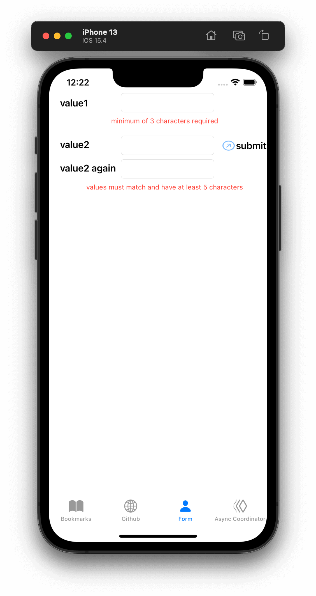

# UIKit and SwiftUI Integration

- [UIKit and SwiftUI Integration](#uikit-and-swiftui-integration)
  - [Declarative UI updates from user input](#declarative-ui-updates-from-user-input)
  - [Cascading multiple UI updates, including a network request](#cascading-multiple-ui-updates-including-a-network-request)
  - [Merging multiple pipelines to update UI elements](#merging-multiple-pipelines-to-update-ui-elements)
  - [Creating a repeating publisher by wrapping a delegate based API](#creating-a-repeating-publisher-by-wrapping-a-delegate-based-api)
  - [Responding to updates from NotificationCenter](#responding-to-updates-from-notificationcenter)
  - [SwiftUI Integration: Using ObservableObject with SwiftUI models as a publisher source](#swiftui-integration-using-observableobject-with-swiftui-models-as-a-publisher-source)

## Declarative UI updates from user input

**Goal**:

- Querying a API and returning the data to be displayed in your UI

A pattern for integrating Combine with UIKit is setting up a variable which will hold a reference to the updated state, and linking the controls using `IBAction`.

The sample is a portion of the code at in a larger view controller implementation.

This example overlaps with the next pattern [Cascading UI updates including a network request](#cascading-multiple-ui-updates-including-a-network-request), which builds upon the initial publisher.

[UIKit-Combine/GithubAPI.swift](https://github.com/heckj/swiftui-notes/blob/master/UIKit-Combine/GithubAPI.swift)

```swift
import UIKit
import Combine

class ViewController: UIViewController {

    @IBOutlet weak var github_id_entry: UITextField! 1️⃣

    var usernameSubscriber: AnyCancellable?

    // username from the github_id_entry field, updated via IBAction
    // @Published is creating a publisher $username of type <String, Never>
    @Published var username: String = "" 2️⃣

    // github user retrieved from the API publisher. As it's updated, it
    // is "wired" to update UI elements
    @Published private var githubUserData: [GithubAPIUser] = []

    // MARK - Actions

    @IBAction func githubIdChanged(_ sender: UITextField) {
        username = sender.text ?? "" 3️⃣
        print("Set username to ", username)
    }

    override func viewDidLoad() {
        super.viewDidLoad()
        // Do any additional setup after loading the view.

        usernameSubscriber = $username 4️⃣
            .throttle(for: 0.5, scheduler: myBackgroundQueue, latest: true) 5️⃣
            // ^^ scheduler myBackGroundQueue publishes resulting elements
            // into that queue, resulting on this processing moving off the
            // main runloop.
            .removeDuplicates() 6️⃣
            .print("username pipeline: ") // debugging output for pipeline
            .map { username -> AnyPublisher<[GithubAPIUser], Never> in 7️⃣
                return GithubAPI.retrieveGithubUser(username: username)
            }
            // ^^ type returned by retrieveGithubUser is a Publisher, so we use
            // switchToLatest to resolve the publisher to its value
            // to return down the chain, rather than returning a
            // publisher down the pipeline.
            .switchToLatest() 8️⃣
            // using a sink to get the results from the API search lets us
            // get not only the user, but also any errors attempting to get it.
            .receive(on: RunLoop.main)
            .assign(to: \.githubUserData, on: self) 9️⃣
```

- 1️⃣ The `UITextField` is the interface element which is driving the updates from user interaction.
- 2️⃣ We defined a `@Published` property to both hold the data and reflect updates when they happen. Because its a `@Published` property, it provides a publisher that we can use with Combine pipelines to update other variables or elements of the interface.
- 3️⃣ We set the variable `*username*` from within an `IBAction`, which in turn triggers a data flow if the publisher `$username` has any subscribers.
- 4️⃣ We in turn set up a subscriber on the publisher `$username` that does further actions. In this case it uses updated values of username to retrieves an instance of a `GithubAPIUser` from *Github’s REST API*. It will make a new HTTP request to the every time the *username* value is updated.
- 5️⃣ The `throttle` is there to keep from triggering a network request on every possible edit of the text field. The throttle keeps it to a maximum of 1 request every half-second.
- 6️⃣ `removeDuplicates` collapses events from the changing *username* so that API requests are not made on the same value twice in a row. The `removeDuplicates` prevents redundant requests from being made, should the user edit and the return the previous value.
- 7️⃣ `map` is used similarly to `flatMap` in error handling here, returning an instance of a publisher. The API object returns a publisher, which this map is invoking. This doesn’t return the value from the call, but the publisher itself.
- 8️⃣ `switchToLatest` operator takes the instance of the publisher and resolves out the data. `switchToLatest` resolves a publisher into a value and passes that value down the pipeline, in this case an instance of `[GithubAPIUser]`.
- 9️⃣ And `assign` at the end up the pipeline is the subscriber, which assigns the value into another variable: `githubUserData`.

The pattern [Cascading UI updates including a network request](#cascading-multiple-ui-updates-including-a-network-request) expands upon this code to multiple cascading updates of various UI elements.

## Cascading multiple UI updates, including a network request

**Goal**:

- Have multiple UI elements update triggered by an upstream subscriber

**References**:

- The ViewController with this code is in the github project at [UIKit-Combine/GithubViewController.swift](https://github.com/heckj/swiftui-notes/blob/master/UIKit-Combine/GithubViewController.swift). You can see this code in operation by running the UIKit target within the github project.
- The GithubAPI is in the github project at [UIKit-Combine/GithubAPI.swift](https://github.com/heckj/swiftui-notes/blob/master/UIKit-Combine/GithubAPI.swift)

> The example provided expands on a publisher updating from [Declarative UI updates from user input](#declarative-ui-updates-from-user-input), adding additional Combine pipelines to update multiple UI elements as someone interacts with the provided interface.

The general pattern of this view starts with a textfield that accepts user input, from which the following actions flow:

1. Using an `IBAction` the `@Published` `username` variable is updated.
2. We have a subscriber (`usernameSubscriber`) attached `$username` publisher, which publishes the value on change and attempts to retrieve the GitHub user. The resulting variable `githubUserData` (also `@Published`) is a list of GitHub user objects. Even though we only expect a single value here, we use a list because we can conveniently return an empty list on failure scenarios: unable to access the API or the username isn’t registered at GitHub.
3. We have the `passthroughSubject` `apiNetworkActivitySubscriber` to reflect when the `GithubAPI` object starts or finishes making network requests.
4. We have a another subscriber `repositoryCountSubscriber` attached to `$githubUserData` publisher that pulls the repository count off the github user data object and assigns it to a text field to be displayed.
5. We have a final subscriber `avatarViewSubscriber` attached to `$githubUserData` that attempts to retrieve the image associated with the user’s avatar for display.

> Tips: The empty list is useful to return because when a `username` is provided that doesn’t resolve, we want to explicitly remove any avatar image that was previously displayed. To do this, we need the pipelines to fully resolve to some value, so that further pipelines are triggered and the relevant UI interfaces updated. If we used an optional `String?` instead of an array of `String[]`, the optional does not trigger some of the pipeline when it is `nil`, and we always want a result value - even an empty value - to come from the pipeline.

The subscribers (created with `assign` and `sink`) are stored as `AnyCancellable` variables on the view controller instance. Because they are defined on the class instance, the Swift compiler creates deinitializers which will cancel and clean up the publishers when the class is torn down.

> Info: A number of developers comfortable with *RxSwift* are using a "*CancelBag*" object to collect cancellable references, and cancel the pipelines on tear down. An example of this can be seen at [here](https://github.com/tailec/CombineExamples/blob/master/CombineExamples/Shared/CancellableBag.swift). This is accommodated within Combine with the `store` function on `AnyCancellable` that easily allows you to put a reference to the subscriber into a collection, such as `Set<AnyCancellable>`.

The pipelines have been explicitly configured to work on a background queue using the `subscribe` operator. Without that additional detail configured, the pipelines would be invoked and run on the main runloop since they were invoked from the UI, which may cause a noticeable slow-down in responsiveness in the user interface. Likewise when the resulting pipelines assign or update UI elements, the `receive` operator is used to transfer that work back onto the main runloop.

> **Warning**: To have the UI continuously updated from changes propagating through `@Published` properties, we want to make sure that any configured pipelines have a `<Never>` failure type. This is required for the `assign` operator. It is also a potential source of bugs when using a `sink` operator. If the pipeline from a `@Published` variable terminates to a `sink` that accepts an Error failure type, the `sink` will send a termination signal if an error occurs. This will then stop the pipeline from any further processing, even when the variable is updated.

[UIKit-Combine/GithubAPI.swift](https://github.com/heckj/swiftui-notes/blob/master/UIKit-Combine/GithubAPI.swift)

```swift
import Foundation
import Combine

enum APIFailureCondition: Error {
    case invalidServerResponse
}

struct GithubAPIUser: Decodable { 1️⃣
    // A very *small* subset of the content available about
    //  a github API user for example:
    // https://api.github.com/users/heckj
    let login: String
    let public_repos: Int
    let avatar_url: String
}

struct GithubAPI { 2️⃣
    // NOTE(heckj): I've also seen this kind of API access
    // object set up with with a class and static methods on the class.
    // I don't know that there's a specific benefit to make this a value
    // type/struct with a function on it.

    /// externally accessible publsher that indicates that network activity is happening in the API proxy
    static let networkActivityPublisher = PassthroughSubject<Bool, Never>() 3️⃣

    /// creates a one-shot publisher that provides a GithubAPI User
    /// object as the end result. This method was specifically designed to
    /// return a list of 1 object, as opposed to the object itself to make
    /// it easier to distinguish a "no user" result (empty list)
    /// representation that could be dealt with more easily in a Combine
    /// pipeline than an optional value. The expected return types is a
    /// Publisher that returns either an empty list, or a list of one
    /// GithubAPUser, and with a failure return type of Never, so it's
    /// suitable for recurring pipeline updates working with a @Published
    /// data source.
    /// - Parameter username: username to be retrieved from the Github API
    static func retrieveGithubUser(username: String) -> AnyPublisher<[GithubAPIUser], Never> { 4️⃣

        if username.count < 3 { 5️⃣
            return Just([]).eraseToAnyPublisher()
            // return Publishers.Empty<GithubAPIUser, Never>()
            //    .eraseToAnyPublisher()
        }
        let assembledURL = String("https://api.github.com/users/\(username)")
        let publisher = URLSession.shared.dataTaskPublisher(for: URL(string: assembledURL)!)
            .handleEvents(receiveSubscription: { _ in 6️⃣
                networkActivityPublisher.send(true)
            }, receiveCompletion: { _ in
                networkActivityPublisher.send(false)
            }, receiveCancel: {
                networkActivityPublisher.send(false)
            })
            .tryMap { data, response -> Data in 7️⃣
                guard let httpResponse = response as? HTTPURLResponse,
                    httpResponse.statusCode == 200 else {
                        throw APIFailureCondition.invalidServerResponse
                }
                return data
        }
        .decode(type: GithubAPIUser.self, decoder: JSONDecoder()) 8️⃣
        .map {
                [$0] 9️⃣
        }
        .replaceError(with: []) 🔟
            // ^^ when I originally wrote this method, I was returning
            // a GithubAPIUser? optional, and then a GithubAPIUser without
            // optional. I ended up converting this to return an empty
            // list as the "error output replacement" so that I could
            // represent that the current value requested didn't *have* a
            // correct github API response.
        .eraseToAnyPublisher() 1️⃣1️⃣
        return publisher
    }

}
```

- 1️⃣ The decodable struct created here is a subset of what’s returned from the GitHub API. Any pieces not defined in the struct are simply ignored when processed by the `decode` operator.
- 2️⃣ The code to interact with the GitHub API was broken out into its own object, which I would normally have in a separate file. The functions on the API struct return *publishers*, and are then mixed and merged with other pipelines in the `ViewController`.
- 3️⃣ This struct also exposes a publisher using `passthroughSubject` to reflect *Boolean* values when it is actively making network requests.
- 4️⃣ I first created the pipelines to return an optional `GithubAPIUser` instance, but found that there wasn’t a convenient way to propagate "`nil`" or empty objects on failure conditions. The code was then recreated to return a list, even though only a single instance was ever expected, to conveniently represent an "empty" object. This was important for the use case of wanting to erase existing values in following pipelines reacting to the `GithubAPIUser` object "disappearing" - removing the repository count and avatar images in this case.
- 5️⃣ The logic here is simply to prevent extraneous network requests, returning an empty result if the username being requested has less than 3 characters.
- 6️⃣ the `handleEvents` operator is how we are triggering updates for the network activity publisher. We define closures that trigger on subscription and finalization (both completion and cancel) that invoke `send()` on the `passthroughSubject`. This is an example of how we can provide metadata about a pipeline’s operation as a separate publisher.
- 7️⃣ `tryMap` adds additional checking on the API response from github to convert correct responses from the API that aren’t valid User instances into a pipeline failure condition.
- 8️⃣ `decode` takes the Data from the response and decodes it into a single instance of `GithubAPIUser`
- 9️⃣ `map` is used to take the single instance and convert it into a list of `1` item, changing the type to a list of `GithubAPIUser`: `[GithubAPIUser]`.
- 🔟 `catch` operator captures the error conditions within this pipeline, and returns an empty list on failure while also converting the failure type to `Never`.
- 1️⃣1️⃣ `eraseToAnyPublisher` collapses the complex types of the chained operators and exposes the whole pipeline as an instance of AnyPublisher.

[UIKit-Combine/GithubViewController.swift](https://github.com/heckj/swiftui-notes/blob/master/UIKit-Combine/GithubViewController.swift)

```swift
import UIKit
import Combine

class GithubViewController: UIViewController {
    @IBOutlet weak var github_id_entry: UITextField!
    @IBOutlet weak var activityIndicator: UIActivityIndicatorView!
    @IBOutlet weak var repositoryCountLabel: UILabel!
    @IBOutlet weak var githubAvatarImageView: UIImageView!

    var repositoryCountSubscriber: AnyCancellable?
    var avatarViewSubscriber: AnyCancellable?
    var usernameSubscriber: AnyCancellable?
    var apiNetworkActivitySubscriber: AnyCancellable?

    // username from the github_id_entry field, updated via IBAction
    @Published var username: String = ""

    // github user retrieved from the API publisher. As it's updated, it
    // is "wired" to update UI elements
    @Published private var githubUserData: [GithubAPIUser] = []

    var myBackgroundQueue: DispatchQueue = DispatchQueue(label: "myBackgroundQueue")
    let coreLocationProxy = LocationHeadingProxy()

    // MARK - Actions

    @IBAction func githubIdChanged(_ sender: UITextField) {
        username = sender.text ?? ""
        print("Set username to ", username)
    }

    @IBAction func poke(_ sender: Any) {
    }
    // MARK - lifecycle methods

    override func viewDidLoad() {
        super.viewDidLoad()
        // Do any additional setup after loading the view.

        apiNetworkActivitySubscriber = GithubAPI.networkActivityPublisher 1️⃣
            .receive(on: RunLoop.main)
            .sink { doingSomethingNow in
                if (doingSomethingNow) {
                    self.activityIndicator.startAnimating()
                } else {
                    self.activityIndicator.stopAnimating()
                }
            }

        usernameSubscriber = $username 2️⃣
            .throttle(for: 0.5, scheduler: myBackgroundQueue, latest: true)
            // ^^ scheduler myBackGroundQueue publishes resulting elements
            // into that queue, resulting on this processing moving off the
            // main runloop.
            .removeDuplicates()
            .print("username pipeline: ") // debugging output for pipeline
            .map { username -> AnyPublisher<[GithubAPIUser], Never> in
                return GithubAPI.retrieveGithubUser(username: username)
            }
            // ^^ type returned in the pipeline is a Publisher, so we use
            // switchToLatest to flatten the values out of that
            // pipeline to return down the chain, rather than returning a
            // publisher down the pipeline.
            .switchToLatest()
            // using a sink to get the results from the API search lets us
            // get not only the user, but also any errors attempting to get it.
            .receive(on: RunLoop.main)
            .assign(to: \.githubUserData, on: self)

        // using .assign() on the other hand (which returns an
        // AnyCancellable) *DOES* require a Failure type of <Never>
        repositoryCountSubscriber = $githubUserData 3️⃣
            .print("github user data: ")
            .map { userData -> String in
                if let firstUser = userData.first {
                    return String(firstUser.public_repos)
                }
                return "unknown"
            }
            .receive(on: RunLoop.main)
            .assign(to: \.text, on: repositoryCountLabel)

        let avatarViewSub = $githubUserData 4️⃣
            // When I first wrote this publisher pipeline, the type I was
            // aiming for was <GithubAPIUser?, Never>, where the value was an
            // optional. The commented out .filter below was to prevent a `nil` // GithubAPIUser object from propagating further and attempting to
            // invoke the dataTaskPublisher which retrieves the avatar image.
            //
            // When I updated the type to be non-optional (<GithubAPIUser?,
            // Never>) the filter expression was no longer needed, but possibly
            // interesting.
            // .filter({ possibleUser -> Bool in
            //     possibleUser != nil
            // })
            // .print("avatar image for user") // debugging output
            .map { userData -> AnyPublisher<UIImage, Never> in
                guard let firstUser = userData.first else {
                    // my placeholder data being returned below is an empty
                    // UIImage() instance, which simply clears the display.
                    // Your use case may be better served with an explicit
                    // placeholder image in the event of this error condition.
                    return Just(UIImage()).eraseToAnyPublisher()
                }
                return URLSession.shared.dataTaskPublisher(for: URL(string: firstUser.avatar_url)!)
                    // ^^ this hands back (Data, response) objects
                    .handleEvents(receiveSubscription: { _ in
                        DispatchQueue.main.async {
                            self.activityIndicator.startAnimating()
                        }
                    }, receiveCompletion: { _ in
                        DispatchQueue.main.async {
                            self.activityIndicator.stopAnimating()
                        }
                    }, receiveCancel: {
                        DispatchQueue.main.async {
                            self.activityIndicator.stopAnimating()
                        }
                    })
                    .map { $0.data }
                    // ^^ pare down to just the Data object
                    .map { UIImage(data: $0)!}
                    // ^^ convert Data into a UIImage with its initializer
                    .subscribe(on: self.myBackgroundQueue)
                    // ^^ do this work on a background Queue so we don't screw
                    // with the UI responsiveness
                    .catch { err in
                        return Just(UIImage())
                    }
                    // ^^ deal the failure scenario and return my "replacement"
                    // image for when an avatar image either isn't available or
                    // fails somewhere in the pipeline here.
                    .eraseToAnyPublisher()
                    // ^^ match the return type here to the return type defined
                    // in the .map() wrapping this because otherwise the return
                    // type would be terribly complex nested set of generics.
            }
            .switchToLatest()
            // ^^ Take the returned publisher that's been passed down the chain
            // and "subscribe it out" to the value within in, and then pass
            // that further down.
            .subscribe(on: myBackgroundQueue)
            // ^^ do the above processing as well on a background Queue rather
            // than potentially impacting the UI responsiveness
            .receive(on: RunLoop.main)
            // ^^ and then switch to receive and process the data on the main
            // queue since we're messing with the UI
            .map { image -> UIImage? in
                image
            }
            // ^^ this converts from the type UIImage to the type UIImage?
            // which is key to making it work correctly with the .assign()
            // operator, which must map the type *exactly*
            .assign(to: \.image, on: self.githubAvatarImageView)

        // convert the .sink to an `AnyCancellable` object that we have
        // referenced from the implied initializers
        avatarViewSubscriber = AnyCancellable(avatarViewSub)

        // KVO publisher of UIKit interface element
        let _ = repositoryCountLabel.publisher(for: \.text) 5️⃣
            .sink { someValue in
                print("repositoryCountLabel Updated to \(String(describing: someValue))")
            }
    }
}
```

- 1️⃣ We add a subscriber to our previous controller from that connects notifications of activity from the GithubAPI object to our activity indicator.
- 2️⃣ Where the `username` is updated from the `IBAction` (from our earlier example [Declarative UI updates from user input](#declarative-ui-updates-from-user-input)) we have the subscriber make the network request and put the results in a new variable (also `@Published`) on our `ViewController`.
- 3️⃣ The first subscriber is on the publisher `$githubUserData`. This pipeline extracts the count of repositories and updates the UI label instance. There is a bit of logic in the middle of the pipeline to return the string "unknown" when the list is empty.
- 4️⃣ The second subscriber is connected to the publisher `$githubUserData`. This triggers a network request to request the image data for the github avatar. This is a more complex pipeline, extracting the data from `githubUser`, assembling a URL, and then requesting it. We also use `handleEvents` operator to trigger updates to the `activityIndicator` in our view. We use `receive` to make the requests on a background queue and later to push the results back onto the *main thread* in order to update UI elements. The `catch` and failure handling returns an empty `UIImage` instance in the event of failure.
- 5️⃣ A final subscriber is attached to the `UILabel` itself. Any *Key-Value Observable object* from `Foundation` can produce a publisher. In this example, we attach a publisher that triggers a print statement that the UI element was updated.

> Info: While we could simply attach pipelines to UI elements as we’re updating them, it more closely couples interactions to the actual UI elements themselves. While easy and direct, it is often a good idea to make explicit state and updates to separate out actions and data for debugging and understandability. In the example above, we use two `@Published` properties to hold the state associated with the current view. One of which is updated by an `IBAction`, and the second updated declaratively using a Combine publisher pipeline. All other UI elements are updated publishers hanging from those properties getting updated.

## Merging multiple pipelines to update UI elements

**Goal**:

- Watch and react to multiple UI elements publishing values, and updating the interface based on the combination of values updated.

**References**:

- The `ViewController` with this code is in the github project at [UIKit-Combine/FormViewController.swift](https://github.com/heckj/swiftui-notes/blob/master/UIKit-Combine/FormViewController.swift)

> This example intentionally mimics a lot of web form style validation scenarios, but within `UIKit` and using `Combine`.



A `viewController` is set up with multiple elements to declaratively update. The `viewController` hosts `3` primary text input fields:

- `value1`
- `value2`
- `value2_repeat`

It also hosts a button to submit the combined values, and two labels to provide feedback.

The rules of these update that are implemented:

- The entry in `value1` has to be at least `5` characters.
- The entry in `value2` has to be at least `5` characters.
- The entry in `value2_repeat` has to be the same as `value2`.

If any of these rules aren’t met, then we want the submit button to be disabled and relevant messages displayed explaining what needs to be done.

This can be achieved by setting up a cascade of pipelines that link and merge together.

- There is a `@Published` property matching each of the user input fields. `combineLatest` is used to take the continually published updates from the properties and merge them into a single pipeline. A `map` operator enforces the rules about characters required and the values needing to be the same. If the values don’t match the required output, we pass a `nil` value down the pipeline.
- Another validation pipeline is set up for `value1`, just using a `map` operator to validate the value, or return `nil`.
- The logic within the `map` operators doing the validation is also used to update the label messages in the user interface.
- A final pipeline uses `combineLatest` to merge the two validation pipelines into a single pipeline. A subscriber is attached to this combined pipeline to determine if the *submission button* should be enabled.

The example below shows these all connected.

[UIKit-Combine/FormViewController.swift](https://github.com/heckj/swiftui-notes/blob/master/UIKit-Combine/FormViewController.swift)

```swift
import UIKit
import Combine

class FormViewController: UIViewController { 
    @IBOutlet weak var value1_input: UITextField!
    @IBOutlet weak var value2_input: UITextField!
    @IBOutlet weak var value2_repeat_input: UITextField!
    @IBOutlet weak var submission_button: UIButton!
    @IBOutlet weak var value1_message_label: UILabel!
    @IBOutlet weak var value2_message_label: UILabel!

    @IBAction func value1_updated(_ sender: UITextField) { 1️⃣
        value1 = sender.text ?? ""
    }
    @IBAction func value2_updated(_ sender: UITextField) {
        value2 = sender.text ?? ""
    }
    @IBAction func value2_repeat_updated(_ sender: UITextField) {
        value2_repeat = sender.text ?? ""
    }

    @Published var value1: String = ""
    @Published var value2: String = ""
    @Published var value2_repeat: String = ""

    var validatedValue1: AnyPublisher<String?, Never> { 2️⃣
        return $value1.map { value1 in
            guard value1.count > 2 else {
                DispatchQueue.main.async { 3️⃣
                    self.value1_message_label.text = "minimum of 3 characters required"
                }
                return nil
            }
            DispatchQueue.main.async {
                self.value1_message_label.text = ""
            }
            return value1
        }.eraseToAnyPublisher()
    }

    var validatedValue2: AnyPublisher<String?, Never> { 4️⃣
        return Publishers.CombineLatest($value2, $value2_repeat)
            .receive(on: RunLoop.main) 5️⃣
            .map { value2, value2_repeat in
                guard value2_repeat == value2, value2.count > 4 else {
                    self.value2_message_label.text = "values must match and have at least 5 characters"
                    return nil
                }
                self.value2_message_label.text = ""
                return value2
            }.eraseToAnyPublisher()
    }

    var readyToSubmit: AnyPublisher<(String, String)?, Never> { 6️⃣
        return Publishers.CombineLatest(validatedValue2, validatedValue1)
            .map { value2, value1 in
                guard let realValue2 = value2, let realValue1 = value1 else {
                    return nil
                }
                return (realValue2, realValue1)
            }
            .eraseToAnyPublisher()
    }

    private var cancellableSet: Set<AnyCancellable> = [] 7️⃣

    override func viewDidLoad() {
        super.viewDidLoad()

        self.readyToSubmit
            .map { $0 != nil } 8️⃣
            .receive(on: RunLoop.main)
            .assign(to: \.isEnabled, on: submission_button)
            .store(in: &cancellableSet) 9️⃣
    }
}
```

- 1️⃣ The start of this code follows the same patterns laid out in [Declarative UI updates from user input](#declarative-ui-updates-from-user-input). `IBAction` messages are used to update the `@Published` properties, triggering updates to any subscribers attached.
- 2️⃣ The first validation pipeline uses a `map` operator to take the string value input and convert it to `nil` if it doesn’t match the validation rules. This is also converting the output type from the published property of `<String>` to the optional `<String?>`. The same logic is also used to trigger updates to the messages label to provide information about what is required.
- 3️⃣ Since we are updating user interface elements, we explicitly make those updates wrapped in `DispatchQueue.main.async` to invoke on the main thread.
- 4️⃣ `combineLatest` takes two publishers and merges them into a single pipeline with an output type that is the combined values of each of the upstream publishers. In this case, the output type is a tuple of (`<String>, <String>`).
- 5️⃣ Rather than use `DispatchQueue.main.async`, we can use the `receive` operator to explicitly run the next operator on the main thread, since it will be doing UI updates.
- 6️⃣ The two validation pipelines are combined with `combineLatest`, and the output of those checked and merged into a single tuple output.
- 7️⃣ We could store the assignment pipeline as an `AnyCancellable?` reference (to map it to the life of the `viewController`) but another option is to create something to collect all the cancellable references. This starts as an empty set, and any *sinks* or *assignment* subscribers can be added to it to keep a reference to them so that they operate over the full lifetime of the view controller. If you are creating a number of pipelines, this can be a convenient way to maintain references to all of them.
- 8️⃣ If any of the values are `nil`, the `map` operator returns `nil` down the pipeline. Checking against a `nil` value provides the boolean used to enable (or disable) the submission button.
- 9️⃣ the `store` method is available on the `Cancellable` protocol, which is explicitly set up to support saving off references that can be used to cancel a pipeline.

## Creating a repeating publisher by wrapping a delegate based API

**Goal**:

- To use one of the Apple delegate APIs to provide values for a Combine pipeline.

> Where a `Future` publisher is great for wrapping existing code to make a single request, it doesn’t serve as well to make a publisher that produces lengthy, or potentially unbounded, amount of output.

Apple’s Cocoa APIs have tended to use a object/delegate pattern, where you can opt in to receiving any number of different callbacks (often with data). One such example of that is included within the `CoreLocation` library, which offers a number of different data sources.

If you want to consume data provided by one of these kinds of APIs within a pipeline, you can wrap the object and use `passthroughSubject` to expose a publisher. The sample code below shows an example of wrapping `CoreLocation`’s `CLManager` object and consuming the data from it through a `UIKit` viewController.

[UIKit-Combine/LocationHeadingProxy.swift](https://github.com/heckj/swiftui-notes/blob/master/UIKit-Combine/LocationHeadingProxy.swift)

```swift
import Foundation
import Combine
import CoreLocation

final class LocationHeadingProxy: NSObject, CLLocationManagerDelegate {
    let mgr: CLLocationManager 1️⃣
    private let headingPublisher: PassthroughSubject<CLHeading, Error> 2️⃣
    var publisher: AnyPublisher<CLHeading, Error> 3️⃣

    override init() {
        mgr = CLLocationManager()
        headingPublisher = PassthroughSubject<CLHeading, Error>()
        publisher = headingPublisher.eraseToAnyPublisher()

        super.init()
        mgr.delegate = self 4️⃣
    }

    func enable() {
        mgr.startUpdatingHeading() 5️⃣
    }

    func disable() {
        mgr.stopUpdatingHeading()
    }
    // MARK - delegate methods

    /*
     *  locationManager:didUpdateHeading:
     *
     *  Discussion:
     *    Invoked when a new heading is available.
     */
    func locationManager(_ manager: CLLocationManager, didUpdateHeading newHeading: CLHeading) {
        headingPublisher.send(newHeading) 6️⃣
    }

    /*
     *  locationManager:didFailWithError:
     *  Discussion:
     *    Invoked when an error has occurred. Error types are defined in "CLError.h".
     */
    func locationManager(_ manager: CLLocationManager, didFailWithError error: Error) {
        headingPublisher.send(completion: Subscribers.Completion.failure(error)) 7️⃣
    }
}
```

- 1️⃣ `CLLocationManager` is the heart of what is being wrapped, part of `CoreLocation`. Because it has additional methods that need to be called for using the framework, I exposed it as a public read-only property. This is useful for requesting user permission to use the location API, which the framework exposes as a method on `CLLocationManager`.
- 2️⃣ A `private` instance of `PassthroughSubject` with the data type we want to publish provides our inside-the-class access to forward data.
- 3️⃣ A `public` property `publisher` exposes the publisher from that subject for external subscriptions.
- 4️⃣ The heart of this works by assigning this class as the delegate to the `CLLocationManager` instance, which is set up at the tail end of initialization.
- 5️⃣ The `CoreLocation` API doesn’t immediately start sending information. There are methods that need to be called to start (and stop) the data flow, and these are wrapped and exposed on this proxy object. Most publishers are set up to subscribe and drive consumption based on subscription, so this is a bit out of the norm for how a publisher starts generating data.
- 6️⃣ With the `delegate` defined and the `CLLocationManager` activated, the data will be provided via callbacks defined on the `CLLocationManagerDelegate`. We implement the callbacks we want for this wrapped object, and within them we use `passthroughSubject` `.send()` to forward the information to any existing subscribers.
- 7️⃣ While not strictly required, the `delegate` provided an `Error` reporting callback, so we included that as an example of forwarding an error through `passthroughSubject`.

[UIKit-Combine/HeadingViewController.swift](https://github.com/heckj/swiftui-notes/blob/master/UIKit-Combine/HeadingViewController.swift)

```swift
import UIKit
import Combine
import CoreLocation

class HeadingViewController: UIViewController {
    var headingSubscriber: AnyCancellable?
    let coreLocationProxy = LocationHeadingProxy()
    var headingBackgroundQueue: DispatchQueue = DispatchQueue(label: "headingBackgroundQueue")

    // MARK - lifecycle methods

    @IBOutlet weak var permissionButton: UIButton!
    @IBOutlet weak var activateTrackingSwitch: UISwitch!
    @IBOutlet weak var headingLabel: UILabel!
    @IBOutlet weak var locationPermissionLabel: UILabel!

    @IBAction func requestPermission(_ sender: UIButton) {
        print("requesting corelocation permission")
        let _ = Future<Int, Never> { promise in 1️⃣
            self.coreLocationProxy.mgr.requestWhenInUseAuthorization()
            return promise(.success(1))
        }
        .delay(for: 2.0, scheduler: headingBackgroundQueue) 2️⃣
        .receive(on: RunLoop.main)
        .sink { _ in
            print("updating corelocation permission label")
            self.updatePermissionStatus() 3️⃣
        }
    }

    @IBAction func trackingToggled(_ sender: UISwitch) {
        switch sender.isOn {
        case true:
            self.coreLocationProxy.enable() 4️⃣
            print("Enabling heading tracking")
        case false:
            self.coreLocationProxy.disable()
            print("Disabling heading tracking")
        }
    }

    func updatePermissionStatus() {
        // When originally written (for iOS 13), this method was available
        // for requesting current status at any time. With iOS 14, that's no
        // longer the case and it shows as deprecated, with the expected path
        // to get this information being from a CoreLocationManager Delegate
        // callback.
        let x = CLLocationManager.authorizationStatus()
        switch x {
        case .authorizedWhenInUse:
            locationPermissionLabel.text = "Allowed when in use"
        case .notDetermined:
            locationPermissionLabel.text = "notDetermined"
        case .restricted:
            locationPermissionLabel.text = "restricted"
        case .denied:
            locationPermissionLabel.text = "denied"
        case .authorizedAlways:
            locationPermissionLabel.text = "authorizedAlways"
        @unknown default:
            locationPermissionLabel.text = "unknown default"
        }
    }

    override func viewDidLoad() {
        super.viewDidLoad()
        // Do any additional setup after loading the view.

        // request authorization for the corelocation data
        self.updatePermissionStatus()

        let corelocationsub = coreLocationProxy
            .publisher
            .print("headingSubscriber")
            .receive(on: RunLoop.main)
            .sink(receiveCompletion: { completion in },
                  receiveValue: { someValue in 5️⃣
                    self.headingLabel.text = String(someValue.trueHeading)
            })

        headingSubscriber = AnyCancellable(corelocationsub)
    }
}
```

- 1️⃣ One of the quirks of `CoreLocation` is the requirement to ask for permission from the user to access the data. The API provided to initiate this request returns immediately, but provides no detail if the user allowed or denied the request. The `CLLocationManager` class includes the information, and exposes it as a class method when you want to retrieve it, but there is no information provided to know when, or if, the user has responded to the request. Since the operation doesn’t provide any return, we provide an integer as the pipeline data, primarily to represent that the request has been made.
- 2️⃣ Since there isn’t a clear way to judge when the user will grant permission, but the permission is persistent, we simply use a `delay` operator before attempting to retrieve the data. This use simply delays the propagation of the value for two seconds.
- 3️⃣ After that delay, we invoke the class method and attempt to update information in the interface with the results of the current provided status.
- 4️⃣ Since `CoreLocation` requires methods to be explicitly enabled or disabled to provide the data, this connects a `UISwitch` toggle `IBAction` to the methods exposed on our publisher proxy.
- 5️⃣ The heading data is received in this `sink` subscriber, where in this example we write it to a text label.

## Responding to updates from NotificationCenter

**Goal**:

- Receiving notifications from `NotificationCenter` as a publisher to declaratively react to the information provided.

> A large number of frameworks and user interface components provide information about their state and interactions via Notifications from `NotificationCenter`. Apple’s documentation includes an article on [receiving and handling events with Combine](https://developer.apple.com/documentation/combine/receiving_and_handling_events_with_combine) specifically referencing `NotificationCenter`.

`Notification`s flowing through `NotificationCenter` provide a common, central location for events within your application.

You can also add your own notifications to your application, and upon sending them may include an additional dictionary in their `userInfo` property. An example of defining your own notification `.myExampleNotification`:

```swift
extension Notification.Name {
    static let myExampleNotification = Notification.Name("an-example-notification")
}
```

Notification names are structured, and based on Strings. Object references can be passed when a notification is posted to the `NotificationCenter`, indicating which object sent the notification. Additionally, Notifications may include a `userInfo`, which has a type of `[AnyHashable : Any]?`. This allows for arbitrary dictionaries, either reference or value typed, to be included with a notification.

```swift
let myUserInfo = ["foo": "bar"]
let note = Notification(name: .myExampleNotification, userInfo: myUserInfo)
NotificationCenter.default.post(note)
```

When creating the `NotificationCenter` publisher, you provide the name of the notification for which you want to receive, and optionally an object reference to filter to specific types of objects. A number of AppKit components that are subclasses of NSControl share a set of notifications, and filtering can be critical to getting the right notification.

An example of subscribing to AppKit generated notifications:

```swift
let sub = NotificationCenter.default.publisher(for: NSControl.textDidChangeNotification, 1️⃣ object: filterField) 2️⃣
    .map { ($0.object as! NSTextField).stringValue } 3️⃣
    .assign(to: \MyViewModel.filterString, on: myViewModel) 4️⃣
```

- 1️⃣ TextFields within AppKit generate a `textDidChangeNotification` when the values are updated.
- 2️⃣ An AppKit application can frequently have a large number of text fields that may be changed. Including a reference to the sending control can be used to filter to text changed notifications to which you are specifically interested in responding.
- 3️⃣ the `map` operator can be used to get into the object references included with the notification, in this case the `.stringValue` property of the text field that sent the notification, providing its updated value
- 4️⃣ The resulting string can be assigned using a writable `KeyValue` path.

An example of subscribing to your own notifications:

```swift
let cancellable = NotificationCenter.default.publisher(for: .myExampleNotification, object: nil)
    // can't use the object parameter to filter on a value reference, only class references, but
    // filtering on 'nil' only constrains to notification name, so value objects *can* be passed
    // in the notification itself.
    .sink { receivedNotification in
        print("passed through: ", receivedNotification)
        // receivedNotification.name
        // receivedNotification.object - object sending the notification (sometimes nil)
        // receivedNotification.userInfo - often nil
    }
```

## SwiftUI Integration: Using ObservableObject with SwiftUI models as a publisher source

**Goal**:

- SwiftUI includes `@ObservedObject` and the `ObservableObject` protocol, which provides a means of externalizing state for a SwiftUI view while alerting SwiftUI to the model changing.

The SwiftUI example code:

- [SwiftUI-Notes/ReactiveForm.swift](https://github.com/heckj/swiftui-notes/blob/master/SwiftUI-Notes/ReactiveForm.swift)
- [SwiftUI-Notes/ReactiveFormModel.swift](https://github.com/heckj/swiftui-notes/blob/master/SwiftUI-Notes/ReactiveFormModel.swift)

> SwiftUI views are declarative structures that are rendered based on some known state, being invalidated and updated when that state changes. We can use Combine to provide reactive updates to manipulate this state and expose it back to SwiftUI. The example provided here is a simple form entry input, with the goal of providing reactive and dynamic feedback based on the inputs to two fields.

The following rules are encoded into Combine pipelines:

1. the two fields need to be identical - as in entering a password or email address and then validating it by a second entry.
2. the value entered is required to be a minimum of `5` characters in length.
3. A button to submit is *enabled* or *disabled* based on the results of these rules.

This is accomplished with SwiftUI by externalizing the state into properties on a class and referencing that class into the model using the `ObservableObject` protocol.

- Two properties are directly represented: `firstEntry` and `secondEntry` as `Strings` using the `@Published` property wrapper to allow SwiftUI to bind to their updates, as well as update them.
- A third property `submitAllowed` is exposed as a Combine publisher to be used within the view, which maintains the `@State` internally to the view.
- A fourth property - an array of `String`s called `validationMessages` - is computed within the Combine pipelines from the first two properties, and also exposed to SwiftUI using the `@Published` property wrapper.

[SwiftUI-Notes/ReactiveFormModel.swift](https://github.com/heckj/swiftui-notes/blob/master/SwiftUI-Notes/ReactiveFormModel.swift)

```swift
import Foundation
import Combine

class ReactiveFormModel : ObservableObject {
    @Published var firstEntry: String = "" 1️⃣
    @Published var secondEntry: String = ""
    @Published var validationMessages = [String]() 2️⃣

    private var cancellableSet: Set<AnyCancellable> = []

    var submitAllowed: AnyPublisher<Bool, Never>!
    
    init() {
        let validationPipeline = Publishers.CombineLatest($firstEntry, $secondEntry) 3️⃣
            .map { (arg) -> [String] in 4️⃣
                var diagMsgs = [String]()
                let (value, value_repeat) = arg
                if !(value_repeat == value) {
                    diagMsgs.append("Values for fields must match.")
                }
                if (value.count < 5 || value_repeat.count < 5) {
                    diagMsgs.append("Please enter values of at least 5 characters.")
                }
                return diagMsgs
            }
            .share()

        submitAllowed = validationPipeline 5️⃣
            .map { stringArray in
                return stringArray.count < 1
            }
            .eraseToAnyPublisher()

        let _ = validationPipeline 6️⃣
            .assign(to: \.validationMessages, on: self)
            .store(in: &cancellableSet)
    }
}
```

- 1️⃣ & 2️⃣ : omit...
- 3️⃣ `combineLatest` is used to merge updates from either of `firstEntry` or `secondEntry` so that updates will be triggered from either source.
- 4️⃣ `map` takes the input values and uses them to determine and publish a list of validating messages. This overall flow is the source for two follow on pipelines.
- 5️⃣ The first of the follow on pipelines uses the list of validation messages to determine a `true` or `false` Boolean publisher that is used to *enable*, or *disable*, the submit button.
- 6️⃣ The second of the follow on pipelines takes the validation messages and updates them locally on this `ObservedObject` reference for SwiftUI to watch and use as it sees fit.

The two different methods of exposing state changes - as a publisher, or as external state, are presented as examples for how you can utilize either pattern. The submit button enable/disable choice could be exposed as a @Published property, and the validation messages could be exposed as a publisher of <String[], Never>. If the need involves tracking as explicit state, it is likely cleaner and less directly coupled by exposing @Published properties - but either mechanism can be used.

The model above is coupled to a SwiftUI View declaration that uses the externalized state.

[SwiftUI-Notes/ReactiveForm.swift](https://github.com/heckj/swiftui-notes/blob/master/SwiftUI-Notes/ReactiveForm.swift)

```swift
import SwiftUI

struct ReactiveForm: View {
    @ObservedObject var model: ReactiveFormModel 1️⃣
    // $model is a ObservedObject<ExampleModel>.Wrapper
    // and $model.objectWillChange is a Binding<ObservableObjectPublisher>
    @State private var buttonIsDisabled = true 2️⃣
    // $buttonIsDisabled is a Binding<Bool>

    var body: some View {
        VStack {
            Text("Reactive Form")
                .font(.headline)

            Form {
                TextField("first entry", text: $model.firstEntry) 3️⃣
                    .textFieldStyle(RoundedBorderTextFieldStyle())
                    .lineLimit(1)
                    .multilineTextAlignment(.center)
                    .padding()

                TextField("second entry", text: $model.secondEntry)
                    .textFieldStyle(RoundedBorderTextFieldStyle())
                    .multilineTextAlignment(.center)
                    .padding()

                VStack {
                    ForEach(model.validationMessages, id: \.self) { msg in 4️⃣
                        Text(msg)
                            .foregroundColor(.red)
                            .font(.callout)
                    }
                }
            }

            Button(action: {}) {
                Text("Submit")
            }
            .disabled(buttonIsDisabled)
            .onReceive(model.submitAllowed) { submitAllowed in 5️⃣
                self.buttonIsDisabled = !submitAllowed
            }
            .padding()
            .background(RoundedRectangle(cornerRadius: 10)      .stroke(Color.blue, lineWidth: 1)
            )

            Spacer()
        }
    }
}

// MARK: - SwiftUI VIEW DEBUG

#if DEBUG
var localModel = ReactiveFormModel()

struct ReactiveForm_Previews: PreviewProvider {
    static var previews: some View {
        ReactiveForm(model: localModel)
    }
}
#endif
```

- 1️⃣ The `model` is exposed to SwiftUI using `@ObservedObject`.
- 2️⃣ `@State` `buttonIsDisabled` is declared locally to this view, with a default value of `true`.
- 3️⃣ The *projected value* from the *property wrapper* (`$model.firstEntry` and `$model.secondEntry`) are used to pass a `Binding` to the `TextField` view element. The `Binding` will trigger updates back on the reference model when the user changes a value, and will let SwiftUI’s components know that changes are about to happen if the exposed model is changing.
- 4️⃣ The validation messages, which are generated and assigned within the `model` is invisible to SwiftUI here as a combine publisher pipeline. Instead this only reacts to the model changes being exposed by those values changing, irregardless of what mechanism changed them.
- 5️⃣ As an example of how to use a published with `onReceive`, an `onReceive` *subscriber* is used to listen to a *publisher* which is exposed from the model reference. In this case, we take the value and store is locally as `@State` within the SwiftUI view, but it could also be used after some transformation if that logic were more relevant to just the view display of the resulting values. In this case, we use it with `disabled` on `Button` to enabled SwiftUI to enable or disable that UI element based on the value stored in the `@State`.
