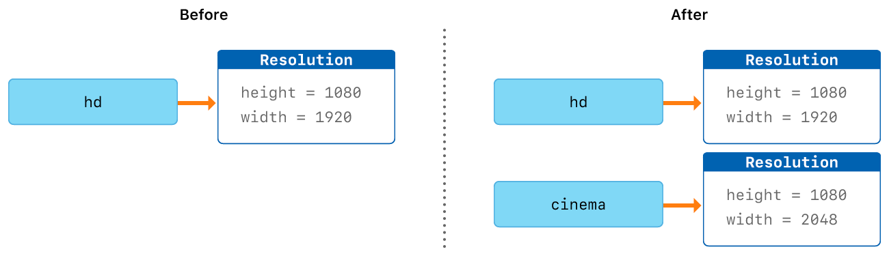

# Structures and Classes

> Version: *Swift 5.5*  
> Source: [*swift-book: Structures and Classes*](https://docs.swift.org/swift-book/LanguageGuide/ClassesAndStructures.html)  
> Digest Date: *January 16, 2022*  

*Structures* and *classes* are general-purpose, flexible constructs that become the building blocks of your program’s code.

Unlike other programming languages, Swift doesn’t require you to create separate *interface* (`.h`) and *implementation* (`.m`) files for custom structures and classes. In Swift, you define a structure or class in a single file, and the external interface to that class or structure is *automatically* made available for other code to use.

> **NOTE**: An instance of a class is traditionally known as an object. However, Swift structures and classes are much closer in functionality than in other languages, and much of this chapter describes functionality that applies to instances of either a class or a structure type. Because of this, the more general term *instance* is used.

- [Structures and Classes](#structures-and-classes)
  - [Comparing Structures and Classes](#comparing-structures-and-classes)
    - [Definition Syntax](#definition-syntax)
    - [Structure and Class Instances](#structure-and-class-instances)
    - [Accessing Properties](#accessing-properties)
    - [Memberwise Initializers for Structure Types](#memberwise-initializers-for-structure-types)
  - [Structures and Enumerations Are Value Types](#structures-and-enumerations-are-value-types)
  - [Classes Are Reference Types](#classes-are-reference-types)
    - [Identity Operators](#identity-operators)
    - [Pointers](#pointers)

## Comparing Structures and Classes

Structures and classes in Swift have many things in common. Both can:

- Define properties to store values
- Define methods to provide functionality
- Define subscripts to provide access to their values using subscript syntax
- Define initializers to set up their initial state
- Be extended to expand their functionality beyond a default implementation
- Conform to protocols to provide standard functionality of a certain kind

Classes have additional capabilities that structures don’t have:

- Inheritance enables one class to inherit the characteristics of another.
- Type casting enables you to check and interpret the type of a class instance at runtime.
- Deinitializers enable an instance of a class to free up any resources it has assigned.
- Reference counting allows more than one reference to a class instance.

The additional capabilities that classes support come at the cost of increased complexity. As a general guideline, prefer structures because they’re easier to reason about, and use classes when they’re appropriate or necessary. In practice, this means most of the custom data types you define will be structures and enumerations. For a more detailed comparison, see [Choosing Between Structures and Classes](https://developer.apple.com/documentation/swift/choosing_between_structures_and_classes).

> **NOTE**: Classes and actors share many of the same characteristics and behaviors. For information about actors, see [Concurrency](https://docs.swift.org/swift-book/LanguageGuide/Concurrency.html).

### Definition Syntax

*Structures* and *classes* have a similar definition syntax.

```swift
struct SomeStructure {
    // structure definition goes here
}
class SomeClass {
    // class definition goes here
}
```

Here’s an example of a structure definition and a class definition:

```swift
struct Resolution {
    var width = 0
    var height = 0
}
class VideoMode {
    var resolution = Resolution()
    var interlaced = false
    var frameRate = 0.0
    var name: String?
}
```

### Structure and Class Instances

The syntax for creating instances is very similar for both structures and classes:

```swift
let someResolution = Resolution()
let someVideoMode = VideoMode()

```

### Accessing Properties

You can access the properties of an instance using *dot syntax*.

```swift
print("The width of someResolution is \(someResolution.width)")
// Prints "The width of someResolution is 0"
```

You can *drill down* into subproperties, such as the `width` property in the `resolution` property of a `VideoMode`:

```swift
print("The width of someVideoMode is \(someVideoMode.resolution.width)")
// Prints "The width of someVideoMode is 0"
```

You can also use dot syntax to assign a new value to a variable property:

```swift
someVideoMode.resolution.width = 1280
print("The width of someVideoMode is now \(someVideoMode.resolution.width)")
// Prints "The width of someVideoMode is now 1280"

```

### Memberwise Initializers for Structure Types

All structures have an automatically generated *memberwise initializer*, which you can use to initialize the member properties of new structure instances.

```swift
let vga = Resolution(width: 640, height: 480)
```

Unlike structures, class instances don’t receive a default memberwise initializer.

## Structures and Enumerations Are Value Types

A *value type* is a type whose value is *copied* when it’s assigned to a variable or constant, or when it’s passed to a function.

In fact, all of the basic types in Swift—integers, floating-point numbers, Booleans, strings, arrays and dictionaries—are value types, and are implemented as *structures* behind the scenes.

> **NOTE** (copy on write):
>  
> Collections defined by the standard library like arrays, dictionaries, and strings use an optimization to reduce the performance cost of copying. Instead of making a copy immediately, these collections share the memory where the elements are stored between the original instance and any copies. If one of the copies of the collection is modified, the elements are copied just before the modification. The behavior you see in your code is always as if a copy took place immediately.

Consider this example, which uses the `Resolution` structure from the previous example:

```swift
let hd = Resolution(width: 1920, height: 1080)
var cinema = hd
```

Next, the width property of cinema is amended to be the width of the slightly wider 2K standard used for digital cinema projection (2048 pixels wide and 1080 pixels high):

```swift
cinema.width = 2048
```

Checking the `width` property of `cinema` shows that it has indeed changed to be `2048`:

```swift
print("cinema is now \(cinema.width) pixels wide")
// Prints "cinema is now 2048 pixels wide"
```

However, the `width` property of the original `hd` instance still has the old value of `1920`:

```swift
print("hd is still \(hd.width) pixels wide")
// Prints "hd is still 1920 pixels wide"
```

because they’re separate instances, setting the width of `cinema` to `2048` doesn’t affect the width stored in `hd`, as shown in the figure below:



The same behavior applies to enumerations:

```swift
enum CompassPoint {
    case north, south, east, west
    mutating func turnNorth() {
        self = .north
    }
}
var currentDirection = CompassPoint.west
let rememberedDirection = currentDirection
currentDirection.turnNorth()

print("The current direction is \(currentDirection)")
print("The remembered direction is \(rememberedDirection)")
// Prints "The current direction is north"
// Prints "The remembered direction is west"
```

## Classes Are Reference Types

Unlike value types, *reference types* are not copied when they’re assigned to a variable or constant, or when they’re passed to a function. Rather than a copy, a reference to the same existing instance is used.

Here’s an example, using the `VideoMode` class defined above:

```swift
let tenEighty = VideoMode()
tenEighty.resolution = hd
tenEighty.interlaced = true
tenEighty.name = "1080i"
tenEighty.frameRate = 25.0
```

Next, `tenEighty` is assigned to a new constant, called `alsoTenEighty`, and the frame rate of `alsoTenEighty` is modified:

```swift
let alsoTenEighty = tenEighty
alsoTenEighty.frameRate = 30.0
```

Because classes are reference types, `tenEighty` and `alsoTenEighty` actually both refer to the same `VideoMode` instance. Effectively, they’re just two different names for the same single instance, as shown in the figure below:


Checking the `frameRate` property of `tenEighty` shows that it correctly reports the new frame rate of `30.0` from the underlying `VideoMode` instance:

```swift
print("The frameRate property of tenEighty is now \(tenEighty.frameRate)")
// Prints "The frameRate property of tenEighty is now 30.0"
```

### Identity Operators

It can sometimes be useful to find out whether two constants or variables refer to exactly the same instance of a class. To enable this, Swift provides two identity operators:

- Identical to (`===`)
- Not identical to (`!==`)

Use these operators to check whether two constants or variables refer to the same single instance:

```swift
if tenEighty === alsoTenEighty {
    print("tenEighty and alsoTenEighty refer to the same VideoMode instance.")
}
// Prints "tenEighty and alsoTenEighty refer to the same VideoMode instance."
```

Note that *identical to* (represented by three equals signs, or `===`) doesn’t mean the same thing as `equal to` (represented by two equals signs, or `==`).

- *Identical to* means that two constants or variables of class type refer to exactly the same class instance.
- *Equal to* means that two instances are considered equal or equivalent in value, for some appropriate meaning of equal, as defined by the type’s designer.

When you define your own custom structures and classes, it’s your responsibility to decide what qualifies as two instances being equal. The process of defining your own implementations of the `==` and `!=` operators is described in [Equivalence Operators](https://docs.swift.org/swift-book/LanguageGuide/AdvancedOperators.html#ID45).

### Pointers

If you have experience with C, C++, or Objective-C, you may know that these languages use pointers to refer to addresses in memory. A Swift constant or variable that refers to an instance of some reference type is similar to a pointer in C, but **isn’t a direct pointer to an address in memory**, and doesn’t require you to write an asterisk (`*`) to indicate that you are creating a reference. Instead, these references are defined like any other constant or variable in Swift.

The standard library provides *pointer* and *buffer* types that you can use if you need to interact with pointers directly—see [Manual Memory Management](https://developer.apple.com/documentation/swift/swift_standard_library/manual_memory_management).
