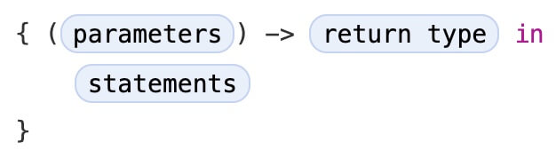

# Closures

> Version: *Swift 5.5*  
> Source: [*swift-book: Closures*](https://docs.swift.org/swift-book/LanguageGuide/Closures.html)  
> Digest Date: *January 16, 2022*  

*Closures* in Swift are similar to *blocks* in C and Objective-C and to *lambdas* in other programming languages.

- [Closures](#closures)
  - [Introduction](#introduction)
  - [Closure Expressions](#closure-expressions)
    - [The Sorted Method](#the-sorted-method)
    - [Closure Expression Syntax](#closure-expression-syntax)
    - [Inferring Type From Context](#inferring-type-from-context)
    - [Implicit Returns from Single-Expression Closures](#implicit-returns-from-single-expression-closures)
    - [Shorthand Argument Names](#shorthand-argument-names)
    - [Operator Methods](#operator-methods)
  - [Trailing Closures](#trailing-closures)
  - [Capturing Values](#capturing-values)

## Introduction

Closures can *capture* and *store* references to any constants and variables from the *context* in which they’re defined. This is known as *closing over* those constants and variables. Swift handles all of the memory management of capturing for you.

**Global and nested functions, actually special cases of closures**. Closures take one of three forms:

- *Global functions* are closures that have a name and don’t capture any values.
- *Nested functions* are closures that have a name and can capture values from their enclosing function.
- *Closure expressions* are *unnamed* closures written in a lightweight syntax that can capture values from their surrounding context.

Swift’s closure expressions have a clean, clear style, with optimizations that encourage brief, clutter-free syntax in common scenarios. These optimizations include:

- Inferring parameter and return value types from context
- Implicit returns from single-expression closures
- Shorthand argument names
- Trailing closure syntax

## Closure Expressions

*Closure expressions* are a way to write inline closures in a brief, focused syntax.

### The Sorted Method

Swift’s standard library provides a method called *sorted(by:)*, which sorts an array of values of a known type, based on the output of a sorting closure that you provide. Once it completes the sorting process, the *sorted(by:)* method returns a *new* array of the same type and size as the old one, with its elements in the correct sorted order. The original array *isn’t* modified by the *sorted(by:)* method.

The closure expression examples below use the `sorted(by:)` method to sort an array of String values in reverse alphabetical order. Here’s the initial array to be sorted:

```swift
let names = ["Chris", "Alex", "Ewa", "Barry", "Daniella"]
```

The `sorted(by:)` method accepts a closure that takes two arguments of the same type as the array’s contents, and returns a `Bool` value to say whether the first value should appear before or after the second value once the values are sorted. **The sorting closure needs to return true if the first value should appear before the second value**, and false otherwise.

This example is sorting an array of `String` values, and so the sorting closure needs to be a function of type `(String, String) -> Bool`.

One way to provide the sorting closure is to write a normal function of the correct type, and to pass it in as an argument to the `sorted(by:)` method:

```swift
func backward(_ s1: String, _ s2: String) -> Bool {
    return s1 > s2
}
var reversedNames = names.sorted(by: backward)
// reversedNames is equal to ["Ewa", "Daniella", "Chris", "Barry", "Alex"]
```

If the first string (`s1`) is greater than the second string (`s2`), the `backward(_:_:)` function will return `true`, indicating that `s1` should appear before `s2` in the sorted array.

### Closure Expression Syntax

Closure expression syntax has the following general form:



- The *parameters* in closure expression syntax can be `in-out` parameters, but they can’t have a default value.
- *Variadic parameters*（可变参数）can be used if you name the variadic parameter.
- *Tuples* can also be used as parameter types and return types.

The example below shows a closure expression version of the `backward(_:_:)` function from above:

```swift
reversedNames = names.sorted(by: { (s1: String, s2: String) -> Bool in
    return s1 > s2
})
```

The start of the closure’s body is introduced by the `in` keyword. This keyword indicates that the definition of the closure’s *parameters* and *return type* has finished, and the *body* of the closure is about to begin.

Because the body of the closure is so short, it can even be written on a single line:

```swift
reversedNames = names.sorted(by: { (s1: String, s2: String) -> Bool in return s1 > s2 } )
```

### Inferring Type From Context

Because all of the types can be inferred, the return arrow (`->`) and the parentheses around the names of the parameters can also be omitted:

```swift
reversedNames = names.sorted(by: { s1, s2 in return s1 > s2 } )
```

It’s always possible to infer the parameter types and return type when passing a closure to a function or method as an inline closure expression. As a result, you *never* need to write an inline closure in its fullest form when the closure is used as a function or method argument.

### Implicit Returns from Single-Expression Closures

Single-expression closures can implicitly return the result of their single expression by omitting the `return` keyword from their declaration, as in this version of the previous example:

```swift
reversedNames = names.sorted(by: { s1, s2 in s1 > s2 } )
```

### Shorthand Argument Names

Swift automatically provides shorthand argument names to inline closures, which can be used to refer to the values of the closure’s arguments by the names `$0`, `$1`, `$2`, and so on.

If you use these shorthand argument names within your closure expression, you can omit the closure’s *argument list* from its definition. The type of the shorthand argument names is inferred from the expected function type, and the highest numbered shorthand argument you use determines the number of arguments that the closure takes. The `in` keyword can also be omitted, because the closure expression is made up entirely of its body:

```swift
reversedNames = names.sorted(by: { $0 > $1 } )
```

- Here, `$0` and `$1` refer to the closure’s first and second `String` arguments. Because `$1` is the shorthand argument with highest number, the closure is understood to take two arguments.
- Because the `sorted(by:)` function here expects a closure whose arguments are both strings, the shorthand arguments `$0` and `$1` are both of type `String`.

### Operator Methods

There’s actually an even shorter way to write the closure expression above. Swift’s `String` type defines its string-specific implementation of the greater-than operator (`>`) as a method that has two parameters of type `String`, and returns a value of type `Bool`. This exactly matches the method type needed by the `sorted(by:)` method. Therefore, you can simply pass in the greater-than operator, and Swift will infer that you want to use its string-specific implementation:

```swift
reversedNames = names.sorted(by: >)
```

## Trailing Closures

If you need to pass a closure expression to a function as the function’s final argument and the closure expression is long, it can be useful to write it as a `trailing closure` instead.

When you use the trailing closure syntax, you *don’t* write the *argument label* for the first closure as part of the function call. A function call can include multiple trailing closures; however, the first few examples below use a single trailing closure.

```swift
func someFunctionThatTakesAClosure(closure: () -> Void) {
    // function body goes here
}

// Here's how you call this function without using a trailing closure:

someFunctionThatTakesAClosure(closure: {
    // closure's body goes here
})

// Here's how you call this function with a trailing closure instead:

someFunctionThatTakesAClosure() {
    // trailing closure's body goes here
}
```

The string-sorting closure from the [Closure Expression Syntax](#closure-expression-syntax) section above can be written outside of the `sorted(by:)` method’s parentheses as a trailing closure:

```swift
reversedNames = names.sorted() { $0 > $1 }
```

If a closure expression is provided as the function’s or method’s only argument and you provide that expression as a trailing closure, you don’t need to write a pair of parentheses `()` after the function or method’s name when you call the function:

```swift
reversedNames = names.sorted { $0 > $1 }
```

Trailing closures are most useful when the closure is sufficiently long that it isn’t possible to write it inline on a single line.

As an example, Swift’s `Array` type has a `map(_:)` method, which takes a closure expression as its single argument. The closure is called once for each item in the array, and returns an alternative mapped value (possibly of some other type) for that item. You specify the nature of the mapping and the type of the returned value by writing code in the closure that you pass to `map(_:)`.

After applying the provided closure to each array element, the `map(_:)` method returns a new array containing all of the new mapped values, in the same order as their corresponding values in the original array.

Here’s how you can use the `map(_:)` method with a trailing closure to convert an array of `I`nt values into an array of `String` values. The array `[16, 58, 510]` is used to create the new array `["OneSix", "FiveEight", "FiveOneZero"]`:

```swift
let digitNames = [
    0: "Zero", 1: "One", 2: "Two",   3: "Three", 4: "Four",
    5: "Five", 6: "Six", 7: "Seven", 8: "Eight", 9: "Nine"
]
let numbers = [16, 58, 510]
```

The code above creates a dictionary of mappings between the integer digits and English-language versions of their names. It also defines an array of integers, ready to be converted into strings.

You can now use the `numbers` array to create an array of `String` values, by passing a closure expression to the array’s `map(_:)` method as a trailing closure:

```swift
let strings = numbers.map { (number) -> String in
    var number = number
    var output = ""
    repeat {
        output = digitNames[number % 10]! + output
        number /= 10
    } while number > 0
    return output
}
// strings is inferred to be of type [String]
// its value is ["OneSix", "FiveEight", "FiveOneZero"]
```

In this example, the variable `number` is initialized with the value of the closure’s `number` parameter, so that the value can be modified within the closure body. (**The parameters to functions and closures are always constants.**)

If a function takes multiple closures, you *omit* the *argument label* for the first trailing closure and you label the remaining trailing closures.

For example, the function below loads a picture for a photo gallery:

```swift
func loadPicture(from server: Server, completion: (Picture) -> Void, onFailure: () -> Void) {
    if let picture = download("photo.jpg", from: server) {
        completion(picture)
    } else {
        onFailure()
    }
}
```

When you call this function to load a picture, you provide two closures. The first closure is a completion handler that displays a picture after a successful download. The second closure is an error handler that displays an error to the user.

```swift
loadPicture(from: someServer) { picture in
    someView.currentPicture = picture
} onFailure: {
    print("Couldn't download the next picture.")
}
```

In this example, the `loadPicture(from:completion:onFailure:)` function dispatches its network task into the background, and calls one of the two completion handlers when the network task finishes.

Writing the function this way lets you cleanly separate the code that’s responsible for handling a network failure from the code that updates the user interface after a successful download, instead of using just one closure that handles both circumstances.

## Capturing Values


