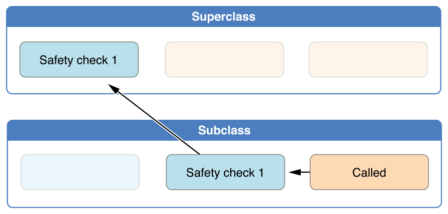

# Initialization

> Version: *Swift 5.5*  
> Source: [*swift-book: Initialization*](https://docs.swift.org/swift-book/LanguageGuide/Initialization.html)  
> Digest Date: *January 13, 2022*  

*Initialization* is the process of preparing an instance of a *class*, *structure*, or *enumeration* for use. Unlike Objective-C initializers, Swift initializers don’t return a value.

- [Initialization](#initialization)
  - [Setting Initial Values for Stored Properties](#setting-initial-values-for-stored-properties)
    - [Initializers](#initializers)
    - [Default Property Values](#default-property-values)
  - [Customizing Initialization](#customizing-initialization)
    - [Initialization Parameters](#initialization-parameters)
    - [Parameter Names and Argument Labels](#parameter-names-and-argument-labels)
    - [Initializer Parameters Without Argument Labels](#initializer-parameters-without-argument-labels)
    - [Optional Property Types](#optional-property-types)
    - [Assigning Constant Properties During Initialization](#assigning-constant-properties-during-initialization)
  - [Default Initializers](#default-initializers)
    - [Memberwise Initializers for Structure Types](#memberwise-initializers-for-structure-types)
  - [Initializer Delegation for Value Types](#initializer-delegation-for-value-types)
  - [Class Inheritance and Initialization](#class-inheritance-and-initialization)
    - [Designated Initializers and Convenience Initializers](#designated-initializers-and-convenience-initializers)
    - [Syntax for Designated and Convenience Initializers](#syntax-for-designated-and-convenience-initializers)
    - [Initializer Delegation for Class Types](#initializer-delegation-for-class-types)
    - [Two-Phase Initialization](#two-phase-initialization)
    - [Initializer Inheritance and Overriding](#initializer-inheritance-and-overriding)
    - [Automatic Initializer Inheritance](#automatic-initializer-inheritance)
    - [Designated and Convenience Initializers in Action](#designated-and-convenience-initializers-in-action)

## Setting Initial Values for Stored Properties

*Classes* and *structures* **must** set all of their *stored properties* to an appropriate initial value by the time an instance of that class or structure is created. Stored properties can’t be left in an indeterminate state.

- You can set an initial value for a stored property within an initializer
- Or by assigning a default property value as part of the property’s definition.

> **NOTE**: When you assign a default value to a stored property, or set its initial value within an initializer, the value of that property is set directly, without calling any *property observers*.

### Initializers

*Initializers* are called to create a new instance of a particular type.

```swift
init() {
    // perform some initialization here
}
```

The example below defines a new structure called `Fahrenheit` to store temperatures expressed in the Fahrenheit scale.

```swift
struct Fahrenheit {
    var temperature: Double
    init() {
        // the freezing point of water in degrees Fahrenheit
        temperature = 32.0
    }
}
var f = Fahrenheit()
print("The default temperature is \(f.temperature)° Fahrenheit")
// Prints "The default temperature is 32.0° Fahrenheit"
```

### Default Property Values

Alternatively, specify a *default property value* as part of the property’s declaration.

> If a property always takes the same initial value, provide a default value rather than setting a value within an initializer. The default value also makes it easier for you to take advantage of default initializers and initializer inheritance.

You can write the `Fahrenheit` structure from above in a simpler form by providing a default value for its temperature property at the point that the property is declared:

```swift
struct Fahrenheit {
    var temperature = 32.0
}
```

## Customizing Initialization

You can customize the initialization process with input parameters and optional property types, or by assigning constant properties during initialization。

### Initialization Parameters

You can provide *initialization parameters* as part of an initializer’s definition, to define the types and names of values that customize the initialization process.

The following example defines a structure called `Celsius`, which stores temperatures expressed in degrees Celsius.

The `Celsius` structure implements two custom initializers called `init(fromFahrenheit:)` and `init(fromKelvin:)`, which initialize a new instance of the structure with a value from a different temperature scale:

```swift
struct Celsius {
    var temperatureInCelsius: Double
    init(fromFahrenheit fahrenheit: Double) {
        temperatureInCelsius = (fahrenheit - 32.0) / 1.8
    }
    init(fromKelvin kelvin: Double) {
        temperatureInCelsius = kelvin - 273.15
    }
}
let boilingPointOfWater = Celsius(fromFahrenheit: 212.0)
// boilingPointOfWater.temperatureInCelsius is 100.0
let freezingPointOfWater = Celsius(fromKelvin: 273.15)
// freezingPointOfWater.temperatureInCelsius is 0.0
```

### Parameter Names and Argument Labels

As with function and method parameters, initialization parameters can have both a *parameter name* for use within the initializer’s body and an *argument label* for use when calling the initializer.

Swift provides an automatic *argument label* for every parameter in an initializer if you don’t provide one.

The following example defines a structure called `Color`, with three constant properties called `red`, `green`, and `blue`. These properties store a value between `0.0` and `1.0` to indicate the amount of red, green, and blue in the color.

```swift
struct Color {
    let red, green, blue: Double
    init(red: Double, green: Double, blue: Double) {
        self.red   = red
        self.green = green
        self.blue  = blue
    }
    init(white: Double) {
        red   = white
        green = white
        blue  = white
    }
}
```

Note that it isn’t possible to call these initializers without using *argument labels*. Argument labels must **always** be used in an initializer if they’re defined, and omitting them is a compile-time error:

```swift
let magenta = Color(red: 1.0, green: 0.0, blue: 1.0)
let halfGray = Color(white: 0.5)

// this reports a compile-time error - argument labels are required
let veryGreen = Color(0.0, 1.0, 0.0)
```

### Initializer Parameters Without Argument Labels

If you don’t want to use an *argument label* for an initializer parameter, write an *underscore* (`_`) instead of an explicit argument label for that parameter to override the default behavior.

Here’s an expanded version of the `Celsius` example from [Initialization Parameters](#initialization-parameters) above, with an additional initializer to create a new Celsius instance from a Double value that’s already in the Celsius scale:

```swift
struct Celsius {
    var temperatureInCelsius: Double
    init(fromFahrenheit fahrenheit: Double) {
        temperatureInCelsius = (fahrenheit - 32.0) / 1.8
    }
    init(fromKelvin kelvin: Double) {
        temperatureInCelsius = kelvin - 273.15
    }
    init(_ celsius: Double) {
        temperatureInCelsius = celsius
    }
}
// bodyTemperature.temperatureInCelsius is 37.0
let bodyTemperature = Celsius(37.0)
```

### Optional Property Types

Properties of optional type are automatically initialized with a value of `nil`, indicating that the property is deliberately intended to have “no value yet” during initialization.

The following example defines a class called `SurveyQuestion`, with an optional String property called response:

```swift
class SurveyQuestion {
    var text: String
    var response: String?
    init(text: String) {
        self.text = text
    }
    func ask() {
        print(text)
    }
}
let cheeseQuestion = SurveyQuestion(text: "Do you like cheese?")
// Prints "Do you like cheese?"
cheeseQuestion.ask()
cheeseQuestion.response = "Yes, I do like cheese."
```

### Assigning Constant Properties During Initialization

You can assign a value to a *constant property* at any point during initialization, Once a constant property is assigned a value, it can’t be further modified.

> **NOTE**: For `class` instances, a constant property can be modified during initialization only by the class that introduces it. **It can’t be modified by a subclass.**

Even though the `text` property is now a constant, it can still be set within the class’s initializer:

```swift
class SurveyQuestion {
    let text: String
    var response: String?
    init(text: String) {
        self.text = text
    }
    func ask() {
        print(text)
    }
}
let beetsQuestion = SurveyQuestion(text: "How about beets?")
// Prints "How about beets?"
beetsQuestion.ask()
beetsQuestion.response = "I also like beets. (But not with cheese.)"
```

## Default Initializers

Swift provides a *default initializer* for any *structure* or *class* that provides default values for all of its properties and doesn’t provide at least one initializer itself. The default initializer simply creates a new instance with all of its properties set to their default values.

This example defines a class called *ShoppingListItem*, which encapsulates the *name*, *quantity*, and *purchase* state of an item in a shopping list:

```swift
class ShoppingListItem {
    var name: String?
    var quantity = 1
    var purchased = false
}
var item = ShoppingListItem()
```

Because all properties of the `ShoppingListItem` class have default values, and because it’s a *base class* with *no* superclass, `ShoppingListItem` automatically gains a default initializer implementation that creates a new instance with all of its properties set to their default values.

### Memberwise Initializers for Structure Types

Structure types automatically receive a *memberwise initializer* if they don’t define any of their own custom initializers. Unlike a *default initializer*, the structure receives a memberwise initializer even if it has stored properties that don’t have default values.

The `Size` structure automatically receives an `init(width:height:)` memberwise initializer, which you can use to initialize a new `Size` instance:

```swift
struct Size {
    var width = 0.0, height = 0.0
}
let twoByTwo = Size(width: 2.0, height: 2.0)
```

When you call a *memberwise initializer*, you can omit values for any properties that have default values. In the example above, the Size structure has a default value for both its `height` and `width` properties. You can omit either property or both properties, and the initializer uses the default value for anything you omit. For example:

```swift
let zeroByTwo = Size(height: 2.0)
print(zeroByTwo.width, zeroByTwo.height)
// Prints "0.0 2.0"

let zeroByZero = Size()
print(zeroByZero.width, zeroByZero.height)
// Prints "0.0 0.0"
```

## Initializer Delegation for Value Types

Initializers can call other initializers to perform part of an instance’s initialization. This process, known as *initializer delegation*, avoids duplicating code across multiple initializers.

The rules for how *initializer delegation* works, and for what forms of delegation are allowed, are different for *value types* and *class types*.

- *Value types* (structures and enumerations) don’t support inheritance, and so their initializer delegation process is relatively simple, because they can only delegate to another initializer that they provide themselves.
- Classes, however, can inherit from other classes. This means that classes have additional responsibilities for ensuring that all stored properties they inherit are assigned a suitable value during initialization.

Note that if you define a *custom initializer* for a value type, you will no longer have access to the *default initializer* (or the *memberwise initializer*, if it’s a *structure*) for that type. This constraint prevents a situation in which additional essential setup provided in a more complex initializer is accidentally circumvented by someone using one of the automatic initializers.

> **NOTE**: If you want your custom value type to be initializable with the *default initializer* and *memberwise initializer*, and also with your own *custom initializers*, write your custom initializers in an `extension` rather than as part of the value type’s original implementation.

The following example defines a custom `Rect` structure to represent a geometric rectangle. The example requires two supporting structures called `Size` and `Point`, both of which provide default values of `0.0` for all of their properties:

```swift
struct Size {
    var width = 0.0, height = 0.0
}
struct Point {
    var x = 0.0, y = 0.0
}
```

You can initialize the Rect structure below in one of three ways:

- by using its default zero-initialized *origin* and *size* property values
- by providing a specific *origin point* and *size*
- by providing a specific *center point* and *size*.

These initialization options are represented by three custom initializers that are part of the Rect structure’s definition:

```swift
struct Rect {
    var origin = Point()
    var size = Size()
    init() {}
    init(origin: Point, size: Size) {
        self.origin = origin
        self.size = size
    }
    init(center: Point, size: Size) {
        let originX = center.x - (size.width / 2)
        let originY = center.y - (size.height / 2)
        self.init(origin: Point(x: originX, y: originY), size: size)
    }
}
```

The first `Rect` initializer, `init()`, is functionally the same as the default initializer that the structure would have received if it didn’t have its own custom initializers.

```swift
// basicRect's origin is (0.0, 0.0) and its size is (0.0, 0.0)
let basicRect = Rect()
```

The second `Rect` initializer, `init(origin:size:)`, is functionally the same as the *memberwise initializer* that the structure would have received if it didn’t have its own custom initializers.

```swift
// originRect's origin is (2.0, 2.0) and its size is (5.0, 5.0)
let originRect = Rect(origin: Point(x: 2.0, y: 2.0),
                      size: Size(width: 5.0, height: 5.0))
```

The third `Rect` initializer, `init(center:size:)` starts by calculating an appropriate *origin point* based on a *center point* and a *size* value. It then calls (or delegates) to the *init(origin:size:)* initializer, which stores the new *origin* and *size* values in the appropriate properties:

```swift
// centerRect's origin is (2.5, 2.5) and its size is (3.0, 3.0)
let centerRect = Rect(center: Point(x: 4.0, y: 4.0),
                      size: Size(width: 3.0, height: 3.0))
```

> **NOTE**: For an alternative way to write this example without defining the `init()` and `init(origin:size:)` initializers yourself, see [Extensions](https://docs.swift.org/swift-book/LanguageGuide/Extensions.html).

## Class Inheritance and Initialization

All of a class’s *stored properties*, including any properties the class inherits from its superclass, *must* be assigned an initial value during initialization.

Swift defines two kinds of initializers for class types to help ensure all stored properties receive an initial value. These are known as *designated initializers* and *convenience initializers*.

### Designated Initializers and Convenience Initializers

*Designated initializers* are the primary initializers for a class. A designated initializer fully initializes all properties introduced by that class and calls an appropriate superclass initializer to continue the initialization process up the superclass chain.

Every class must have at least one designated initializer. In some cases, this requirement is satisfied by inheriting one or more designated initializers from a superclass.

*Convenience initializers* are secondary, supporting initializers for a class. You can define a convenience initializer to call a *designated initializer* from the same class as the convenience initializer with some of the designated initializer’s parameters set to default values.

### Syntax for Designated and Convenience Initializers

*Designated initializers* for classes are written in the same way as simple initializers for value types:

```swift
init() {
    
}
```

Convenience initializers are written in the same style, but with the convenience modifier placed before the init keyword, separated by a space:

```swift
convenience init() {
    
}
```

### Initializer Delegation for Class Types

To simplify the relationships between designated and convenience initializers, Swift applies the following three rules for delegation calls between initializers:

- **Rule 1**: A designated initializer must call a designated initializer from its immediate superclass.
- **Rule 2**: A convenience initializer must call another initializer from the same class.
- **Rule 3**: A convenience initializer must ultimately call a designated initializer.

A simple way to remember this is:

- Designated initializers must always delegate *up*.
- Convenience initializers must always delegate *across*.

These rules are illustrated in the figure below:


The figure below shows a more complex class hierarchy for four classes. It illustrates how the designated initializers in this hierarchy act as “*funnel*” points for class initialization, simplifying the interrelationships among classes in the chain:


### Two-Phase Initialization

Class initialization in Swift is a two-phase process.

1. In the first phase, each stored property is assigned an initial value by the class that introduced it.
2. Once the initial state for every stored property has been determined, the second phase begins, and each class is given the opportunity to customize its stored properties further before the new instance is considered ready for use.

> **NOTE**: Swift’s two-phase initialization process is similar to initialization in Objective-C. The main difference is that during phase 1, Objective-C assigns zero or null values (such as 0 or nil) to every property. Swift’s initialization flow is more flexible in that it lets you set custom initial values, and can cope with types for which 0 or nil isn’t a valid default value.

The class instance isn’t fully valid *until* the first phase ends. Properties can only be accessed, and methods can only be called, once the class instance is known to be valid at the end of the first phase.

Swift’s compiler performs four helpful safety-checks to make sure that two-phase initialization is completed without error:

- **Safety check 1**: A *designated initializer* must ensure that all of the properties introduced by its class are initialized before it delegates *up* to a superclass initializer.
- **Safety check 2**: A *designated initializer* must delegate up to a superclass initializer *before* assigning a value to an inherited property.
  - If it doesn’t, the new value the designated initializer assigns will be overwritten by the superclass as part of its own initialization.
- **Safety check 3**: A *convenience initializer* must delegate to another initializer *before* assigning a value to any property (including properties defined by the same class).
  - If it doesn’t, the new value the convenience initializer assigns will be overwritten by its own class’s designated initializer.
- **Safety check 4**: An initializer can’t call any instance methods, read the values of any instance properties, or refer to `self` as a value *until* after the first phase of initialization is complete.

Here’s how two-phase initialization plays out, based on the four safety checks above:

**Phase 1**

- A designated or convenience initializer is called on a class.
Memory for a new instance of that class is allocated. The memory isn’t yet initialized.
- A designated initializer for that class confirms that all stored properties introduced by that class have a value. The memory for these stored properties is now initialized.
- The designated initializer hands off to a superclass initializer to perform the same task for its own stored properties.
- This continues up the class inheritance chain until the top of the chain is reached.
- Once the top of the chain is reached, and the final class in the chain has ensured that all of its stored properties have a value, the instance’s memory is considered to be fully initialized, and phase 1 is complete.

**Phase 2**

- Working back down from the top of the chain, each designated initializer in the chain has the option to customize the instance further. Initializers are now able to access `self` and can modify its properties, call its instance methods, and so on.
- Finally, any convenience initializers in the chain have the option to customize the instance and to work with `self`.

Here’s how *phase 1* looks for an initialization call for a hypothetical subclass and superclass:



As soon as all properties of the superclass have an initial value, its memory is considered fully initialized, and phase 1 is complete.

Here’s how *phase 2* looks for the same initialization call:


### Initializer Inheritance and Overriding

Unlike subclasses in Objective-C, Swift subclasses don’t inherit their superclass initializers by default. Swift’s approach prevents a situation in which a simple initializer from a superclass is inherited by a more specialized subclass and is used to create a new instance of the subclass that isn’t fully or correctly initialized.

> **NOTE**: Superclass initializers are inherited in certain circumstances, but only when it’s safe and appropriate to do so. For more information, see [Automatic Initializer Inheritance](#automatic-initializer-inheritance) below.

When you write a subclass initializer that matches a superclass *designated initializer*, you are effectively providing an override of that designated initializer. Therefore, you must write the `override` modifier before the subclass’s initializer definition. This is true even if you are overriding an automatically provided default initializer。

> **NOTE**: You always write the `override` modifier when overriding a superclass designated initializer, even if your subclass’s implementation of the initializer is a convenience initializer.

Conversely, if you write a subclass initializer that matches a superclass *convenience initializer*, that superclass convenience initializer can never be called directly by your subclass, as per the rules described above in [Initializer Delegation for Class Types](#initializer-delegation-for-class-types). Therefore, your subclass is not (strictly speaking) providing an override of the superclass initializer. **As a result, you don’t write the `override` modifier when providing a matching implementation of a superclass convenience initializer.**

The example below defines a base class called `Vehicle`. The `numberOfWheels` property is used by a *computed property* called `description` to create a `String` description of the vehicle’s characteristics:

```swift
class Vehicle {
    var numberOfWheels = 0
    var description: String {
        return "\(numberOfWheels) wheel(s)"
    }
}
```

The default initializer (when available) is always a designated initializer for a class, and can be used to create a new `Vehicle` instance with a `numberOfWheels` of `0`:

```swift
let vehicle = Vehicle()
print("Vehicle: \(vehicle.description)")
// Vehicle: 0 wheel(s)
```

The next example defines a subclass of `Vehicle` called `Bicycle`:

```swift
class Bicycle: Vehicle {
    override init() {
        super.init()
        numberOfWheels = 2
    }
}
```

If you create an instance of `Bicycle`, you can call its inherited `description` computed property to see how its `numberOfWheels` property has been updated:

```swift
let bicycle = Bicycle()
print("Bicycle: \(bicycle.description)")
// Bicycle: 2 wheel(s)
```

If a subclass initializer performs *no* customization in *phase 2* of the initialization process, and the superclass has a *zero-argument* designated initializer, you can omit a call to `super.init()` after assigning values to all of the subclass’s stored properties.

This example defines another subclass of `Vehicle`, called `Hoverboard`. In its initializer, the Hoverboard class sets only its `color` property. Instead of making an explicit call to `super.init()`, this initializer relies on an implicit call to its superclass’s initializer to complete the process.

```swift
class Hoverboard: Vehicle {
    var color: String
    init(color: String) {
        self.color = color
        // super.init() implicitly called here
    }
    override var description: String {
        return "\(super.description) in a beautiful \(color)"
    }
}
```

An instance of `Hoverboard` uses the default number of wheels supplied by the Vehicle initializer.

```swift
let hoverboard = Hoverboard(color: "silver")
print("Hoverboard: \(hoverboard.description)")
// Hoverboard: 0 wheel(s) in a beautiful silver
```

### Automatic Initializer Inheritance

As mentioned above, subclasses don’t inherit their superclass initializers by default. However, superclass initializers are automatically inherited if certain conditions are met.

Assuming that you provide *default values* for any new properties you introduce in a subclass, the following two rules apply:

- **Rule 1**: If your subclass doesn’t define any *designated initializers*, it automatically inherits all of its superclass *designated initializers*.
- **Rule 2**: If your subclass provides an implementation of all of its superclass *designated initializers*, either by inheriting them as per *rule 1*, or by providing a custom implementation as part of its definition, then it automatically inherits all of the superclass *convenience initializers*.

These rules apply even if your subclass adds further *convenience initializers*.

### Designated and Convenience Initializers in Action

This example defines a hierarchy of three classes called `Food`, `RecipeIngredient`, and `ShoppingListItem`, and demonstrates how their initializers interact.

The base class in the hierarchy is called `Food`, this class introduces a single `String` property called `name` and provides two initializers for creating `Food` instances:

```swift
class Food {
    var name: String
    init(name: String) {
        self.name = name
    }
    convenience init() {
        self.init(name: "[Unnamed]")
    }
}
```

The `Food` class doesn’t have a superclass, and so the `init(name: String)` initializer doesn’t need to call `super.init()` to complete its initialization.

The figure below shows the initializer chain for the Food class:


```swift
let namedMeat = Food(name: "Bacon")
// namedMeat's name is "Bacon"
let mysteryMeat = Food()
// mysteryMeat's name is "[Unnamed]"
```

The second class in the hierarchy is a subclass of `Food` called `RecipeIngredient`. The `RecipeIngredient` class models an ingredient in a cooking recipe. It introduces an Int property called `quantity` (in addition to the `name` property it inherits from `Food`) and defines two initializers for creating `RecipeIngredient` instances:

```swift
class RecipeIngredient: Food {
    var quantity: Int
    init(name: String, quantity: Int) {
        self.quantity = quantity
        super.init(name: name)
    }
    override convenience init(name: String) {
        self.init(name: name, quantity: 1)
    }
}
```

The figure below shows the initializer chain for the `RecipeIngredient` class:


This process satisfies *safety check 1* from [Two-Phase Initialization](#two-phase-initialization) above.

The `init(name: String)` *convenience initializer* provided by `RecipeIngredient` takes the same parameters as the `init(name: String)` *designated initializer* from `Food`. Because this *convenience initializer* overrides a *designated initializer* from its superclass, it must be marked with the `override` modifier (as described in [Initializer Inheritance and Overriding](#initializer-inheritance-and-overriding).


