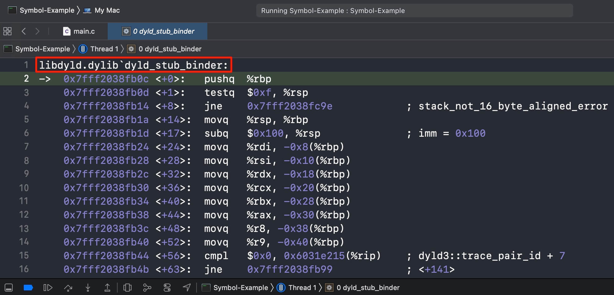

# fishhook

## 资料说明

### 原仓库

地址： <https://github.com/facebook/fishhook>

目前 `main` 分支的代码（最后更新时间是 2020.04.21）在 iOS 14.7 真机上运行会 crash（在模拟器上能正常运行）

### 我 fork 的仓库

地址：<https://github.com/Huang-Libo/fishhook>

改动点：

- 合入了 [pull/87](https://github.com/facebook/fishhook/pull/87)，解决了在 iOS 14.7 真机上 crash 的问题；
- 添加了 [Example](https://github.com/Huang-Libo/fishhook/tree/main/Example) 工程，包含 hook `open()` ，`close()` ，`printf()` ， `NSLog()` 的示例；
- 整理了 [README.md](https://github.com/Huang-Libo/fishhook/blob/main/README.md) 的格式，方便阅读。

## 简介

fishhook 是一个非常简单的库，支持对 iOS 模拟器和真机上（实际上 macOS 平台也支持）运行的 Mach-O 二进制文件进行*动态地重绑定符号 (dynamically rebinding symbols)* 。这个功能和 macOS 中的 [`DYLD_INTERPOSE`][interpose] 类似。

在 Facebook ，开发者使用 fishhook 来 hook `libSystem` 中的调用以进行调试、追踪（比如对文件描述符被关闭两次的问题进行审计）。

[interpose]: https://opensource.apple.com/source/dyld/dyld-852.2/include/mach-o/dyld-interposing.h.auto.html "<mach-o/dyld-interposing.h>"

## DYLD_INTERPOSE 使用示例

> 源码：<https://opensource.apple.com/source/dyld/dyld-852.2/include/mach-o/dyld-interposing.h.auto.html>

上文提到的 `DYLD_INTERPOSE` 实际上是 `dyld` 中的一个宏（宏的结尾包含了分号，调用的时候不用再加分号了）：

```c
#define DYLD_INTERPOSE(_replacement,_replacee) \
   __attribute__((used)) static struct{ const void* replacement; const void* replacee; } _interpose_##_replacee \
            __attribute__ ((section ("__DATA,__interpose"))) = { (const void*)(unsigned long)&_replacement, (const void*)(unsigned long)&_replacee };
```

 源码中给出的示例是使用自定义的 `my_open()` 替换 `open()` 函数 ：

```c
static
int
my_open(const char* path, int flags, mode_t mode)
{
  int value;
  // do stuff before open (including changing the arguments)
  value = open(path, flags, mode);
  // do stuff after open (including changing the return value(s))
  return value;
}
DYLD_INTERPOSE(my_open, open)
```

## fishhook 使用示例

### 示例一：重绑定 `open()` 和 `close()`

```objectivec
#import <dlfcn.h>
#import <UIKit/UIKit.h>
#import <fishhook/fishhook.h>
#import "AppDelegate.h"
 
static int (*orig_close)(int);
static int (*orig_open)(const char *, int, ...);
 
int my_close(int fd) {
  printf("Calling real close(%d)\n", fd);
  return orig_close(fd);
}
 
int my_open(const char *path, int oflag, ...) {
  va_list ap = {0};
  mode_t mode = 0;
 
  if ((oflag & O_CREAT) != 0) {
    // mode only applies to O_CREAT
    va_start(ap, oflag);
    mode = va_arg(ap, int);
    va_end(ap);
    printf("Calling real open('%s', %d, %d)\n", path, oflag, mode);
    return orig_open(path, oflag, mode);
  } else {
    printf("Calling real open('%s', %d)\n", path, oflag);
    return orig_open(path, oflag, mode);
  }
}

int main(int argc, char * argv[]) {
    NSString * appDelegateClassName;
    @autoreleasepool {
        struct rebinding rebindings[2] = {
            {"close", my_close, (void *)&orig_close},
            {"open", my_open, (void *)&orig_open}
        };
        // Use fishhook to rebind symbols
        rebind_symbols(rebindings, 2);
     
        // Open our own binary and print out first 4 bytes
        // (which is the same for all Mach-O binaries on a given architecture)
        int fd = open(argv[0], O_RDONLY);
        uint32_t magic_number = 0;
        read(fd, &magic_number, 4);
        printf("Mach-O Magic Number: %x \n", magic_number);
        close(fd);

        // Setup code that might create autoreleased objects goes here.
        appDelegateClassName = NSStringFromClass([AppDelegate class]);
    }
    return UIApplicationMain(argc, argv, nil, appDelegateClassName);
}
```

**输出示例**：

使用 *iPhone 12 (iOS 14.5)* **模拟器**的输出：

```plaintext
Calling real open('$HOME/Library/Developer/CoreSimulator/Devices/BEC0C655-BA6E-433C-A6A6-2D55CC2DEC61/data/Containers/Bundle/Application/F309C60B-EF06-4F9F-8287-3C738F0FE4F6/fishhook-demo.app/fishhook-demo', 0)
Mach-O Magic Number: feedfacf 
Calling real close(3)
...
```

使用 *iPhone 12 (iOS 14.7.1)* **真机**的输出：：

```plaintext
Calling real open('/var/containers/Bundle/Application/8250D7D8-4893-486C-B5FC-FB55AA110116/Example.app/Example', 0)
Mach-O Magic Number: feedfacf 
Calling real close(3)
...
```

### 示例二：重绑定 `printf()`

```objectivec
#import <fishhook/fishhook.h>

static int (*orig_printf)(const char * __restrict, ...);

int my_printf(const char *format, ...)
{
    // 打印额外的前缀
    orig_printf("🤯 ");
    int retVal = 0;
    // 取出变长参数
    va_list args;
    va_start(args, format);
    retVal = vprintf(format, args);
    va_end(args);

    return retVal;
}

int main(int argc, char * argv[]) {
    NSString * appDelegateClassName;
    @autoreleasepool {
        printf("Before hook printf\n");
        // Use fishhook to rebind symbols
        struct rebinding rebindings[1] = {
            {"printf", my_printf, (void *)&orig_printf}
        };
        rebind_symbols(rebindings, 1);
        int a = 666;
        printf("After hook printf, %d\n", a);
        
        // Setup code that might create autoreleased objects goes here.
        appDelegateClassName = NSStringFromClass([AppDelegate class]);
    }
    return UIApplicationMain(argc, argv, nil, appDelegateClassName);
}
```

示例输出：

```plaintext
Before hook printf
🤯 After hook printf, 666
```

**注意**：在实现 `my_printf` 时，需要使用 `va_start` 和 `va_end` 取出 `printf()` 的第二个参数、这是个“*变长参数*”，然后存入到 `va_list` 类型的变量中，最后传递给 `vprintf` 函数的第二个参数。可参考：

- GNU `glibc` 的 `printf.c` <https://code.woboq.org/userspace/glibc/stdio-common/printf.c.html>
- Apple `libc` 的 `printf.c` ：<https://opensource.apple.com/source/Libc/Libc-1439.100.3/stdio/FreeBSD/printf.c.auto.html>

### 示例三：重绑定 `NSLog()`

```objectivec
#import <fishhook/fishhook.h>

// 用于记录原 NSLog 的函数指针
static void (*orig_NSLog)(NSString *format, ...);

@implementation ViewController

// 自定义的 NSLog
void my_NSLog(NSString *format, ...) {
    if(!format) {
        return;
    }
    // 在原始输出中添加额外的信息
    NSString *extra = @"🤯 ";
    format = [extra stringByAppendingString:format];
    va_list args;
    va_start(args, format);
    NSString *message = [[NSString alloc] initWithFormat:format arguments:args];
    // 调用原 NSLog
    orig_NSLog(@"%@", message);
    va_end(args);
}

- (void)viewDidLoad {
    [super viewDidLoad];
    
    NSLog(@"Before hook NSLog\n");
    // 调用 fishhook 来重新绑定 NSLog 对应的符号
    struct rebinding rebindings[1] = {
        {"NSLog", my_NSLog, (void *)&orig_NSLog}
    };
    rebind_symbols(rebindings, 1);
    NSLog(@"After hook NSLog\n");
}

@end
```

示例输出：

```plaintext
2021-09-14 21:58:24.319771+0800 Example[8722:6392547] Before hook NSLog
2021-09-14 21:58:24.329150+0800 Example[8722:6392547] 🤯 After hook NSLog
```

## 调用动态库中的 C 函数的不同之处

**提问**：调用动态库中的 C 函数与调用自己源码中的 C 函数有何不同？

### 示例一：调用动态库中的 C 函数

> 源码：<https://github.com/Huang-Libo/fishhook/blob/main/Symbol-Example-1/HelloWorld.c>

这里以 C 标准库中的 `printf()` 函数的调用为例，演示源码中引用的动态库中的函数的调用方式。

先看一段简单的 C 代码，在 `main()` 函数中只调用了 `printf()` 函数：

```c
#include <stdio.h>

int main(int argc, const char * argv[]) {
    printf("Hello, World!\n");
    return 0;
}

```

使用 clang 编译，生成可执行文件 `a.out` ：

```console
clang HelloWorld.c
```

`nm -n a.out` 输出：

```plaintext
                 U _printf
                 U dyld_stub_binder
0000000100000000 T __mh_execute_header
0000000100003f50 T _main
0000000100008008 d __dyld_private
```

可以看出 `_printf` 符号类型是 `undefined` ；此外，还有一个名为 `dyld_stub_binder` 的符号也是 `undefined` 类型，这个符号稍后介绍。

**符号表查看工具 - `nm` 命令**：

`nm` 命令可*列出 mach-o 文件中的符号 (list symbols from object files)* 。可以在终端中使用 `man nm` 查看其文档。

`nm` 的输出包含 3 列：

- 第 1 列是 **The symbol value** ，即符号的地址，默认使用 16 进制；
- 第 2 列是 **The symbol type** ，即符号的类型；
  - `U` ：表示 `undefined` ，即未定义，因此没有对应的地址；
  - `T` ：表示符号位于 `__TEXT` 段，即代码所在区域；
  - `d` ：表示符号在已初始化的数据区；
- 第 3 列是 **The symbol name** ，即符号的名称。

### 示例二：调用自己源码中的 C 函数

> 源码：<https://github.com/Huang-Libo/fishhook/blob/main/Symbol-Example-2/Symbol-Example/main.c>

接下来在上述源码中添加一个 `my_hello` 函数：

```c
#include <stdio.h>

void my_hello() {
    printf("My Hello!\n");
}

int main(int argc, const char * argv[]) {
    printf("Hello, World!\n");
    return 0;
}
```

调用 `clang HelloWorld.c` 重新编译后，再输入 `nm -n a.out` 查看 `a.out` 中的符号列表：

```plaintext
                 U _printf
                 U dyld_stub_binder
0000000100000000 T __mh_execute_header
0000000100003f20 T _my_hello
0000000100003f40 T _main
0000000100008008 d __dyld_private
```

> C 函数对应的符号名，是在函数名前加一个下划线。

可以看到我们自定义的 `my_hello` 函数对应的符号 `_my_hello` 是有地址的，且在 `__TEXT` 段中。

### 小结

自己源码中的 C 函数在编译时就确定了函数地址，而动态库中的 C 函数在编译时没有确定函数地址。

## 1. 使用 Hopper 探索 printf 的调用流程

> 源码：<https://github.com/Huang-Libo/fishhook/blob/main/Symbol-Example-2/Symbol-Example/main.c>

接下来对上述源码生成的 Mach-O 进行详细分析。

### _main

使用 Hopper 打开 [Symbol-Example](https://github.com/Huang-Libo/fishhook/tree/main/Symbol-Example-2) 项目生成的可执行文件。入口是位于 `(__TEXT,__text)` 的 `_main` ：


在 `_main` 中可以看到在 `0x100003f5f` 地址上执行了 `call` ，对应的符号是 `imp___stubs__printf` ，注释是 `printf()` ，说明这一行汇编对应的就是 `main()` 函数内的 `printf()` 函数调用 ：

```c
0000000100003f5f call imp___stubs__printf
```

### `imp___stubs__printf`

双击 `imp___stubs__printf` 跳入其定义中：


可看到它位于 `(__TEXT,__stubs)` ，入口地址是 `0x100003f72` ，在其内出现了新的符号 `_printf_ptr` ：

```c
              imp___stubs__printf:
0000000100003f72 jmp qword [_printf_ptr]
```

### _printf_ptr

双击 `_printf_ptr` ，跳入其定义中：


可看到它位于 `(__DATA,__la_symbol_ptr)` 中，它的内部存储的是 *Lazy Symbol Pointer* ，也就是说这里面存储的符号在第一次被调用时才执行绑定。

可看到其内有一个 `extern` 的 `_printf` 符号：

```c
              _printf_ptr:
0000000100008000 extern _printf
```

**编者注**：感觉 **Hopper** 生成的汇编中的 `(__DATA,__la_symbol_ptr)` 内少了一些数据，导致 `_printf` 的调用链路断在后面将讲到的外部符号所在区域了。实际上，用 **MachOView** 查看 `(__DATA,__la_symbol_ptr)` ，可以看到 `_printf` 符号还有个属性是 **Data** ，其值是 **0x100003F88** ，这个地址位于 `(__TEXT,__stub_helper)` 内，这个地址值很重要，通过这个地址值，就能把 `_printf` 和 `dyld_stub_binder` 关联起来了，稍后将详细介绍。


### _printf

双击 `_printf` ，会跳入到其定义：


这里显示的是*外部符号 (External Symbols)* ， 在 **Hopper** 生成的汇编中，`printf()` 函数的调用链路就断在这里了，如之前所述，应该是因为 `(__DATA,__la_symbol_ptr)` 内有些信息没有显示。

从地址值上看，外部符号位于所有符号的最后面（在 **MachOView** 中没有这个专门展示外部符号的地方，这两个地址值 `0x100014000` 和 `0x100014008` 也较大，在 **MachOView** 中没有显示相应的区域）：


这两个外部符号对应的汇编是：

```c
             _printf:
0000000100014000 extern function code 
             dyld_stub_binder:
0000000100014008 extern function code 
```

`_printf` 和 `dyld_stub_binder` 的注释分别是：

```c
; in /usr/lib/libSystem.B.dylib, CODE XREF=imp___stubs__printf, DATA XREF=_printf_ptr
; in /usr/lib/libSystem.B.dylib, CODE XREF=0x100003f81, DATA XREF=dyld_stub_binder_100004000
```

从注释中可看出：

1）这两个符号都来自 `/usr/lib/libSystem.B.dylib` 。

2）`printf()` 的调用流程是：

```c
imp___stubs__printf   // (__TEXT,__stubs)
  -> _printf_ptr      // (__DATA,__la_symbol_ptr)
    -> _printf        // 外部符号
```

3）`dyld_stub_binder` 的调用流程是：

```c
0x100003f81                      // (__TEXT,__stub_helper)
  -> dyld_stub_binder_100004000  // (__DATA,__got)
    -> dyld_stub_binder          // 外部符号
```

`_printf` 和 `dyld_stub_binder` 是强相关的，但根据目前的线索还看不出来它俩的联系。

接下来先详细查看 `dyld_stub_binder` 这个外部符号的调用流程。

### `(__TEXT,__stub_helper)`

顺着上面的外部符号 `dyld_stub_binder` 的注释给出的地址 `0x100003f81` ，可在 `(__TEXT,__stub_helper)` 中可以看到这一行出现了新符号 `dyld_stub_binder_100004000` ：


在 `0x100003f81` 左侧有一个蓝色箭头指向下方，实际上就是指向的 `dyld_stub_binder_100004000` 。

另外，在左侧可以看到一个红色箭头。在上图的地址中，我们再次看到了上文提到的 **0x100003f88** ，这个地址也就是 `_printf` 符号中的 **Data** 字段存储的值。在 **0x100003f88** 执行了 `push` 指令后，接着执行了 `jmp` 指令跳转到开头处 `0x100003f78`。

在 `0x100003f78` 出现了新符号 `__dyld_private` ，暂不讨论。**最后**会执行 `0x100003f81` 中的指令，跳转到 `dyld_stub_binder_100004000` 符号所在地址。

上图中的汇编：

```c
0000000100003f78 lea r11, qword [__dyld_private]
0000000100003f7f push r11
0000000100003f81 jmp qword [dyld_stub_binder_100004000]
0000000100003f87 nop
0000000100003f88 push 0x0
0000000100003f8d jmp 0x100003f78
```

### dyld_stub_binder_100004000

> `dyld_stub_binder_100004000` 后面的 `100004000` 实际上是 `dyld_stub_binder` 在当前 Mach-O 中的地址值，在别的 Mach-O 中会是其它值。

双击 `dyld_stub_binder_100004000` 跳入到其定义中，可看到它位于 `(__DATA,__got)` 中，它的内部存的是 *Non-Lazy symbol pointer* ，也就是应用在启动的 **pre-main** 阶段就会被绑定的符号：


### dyld_stub_binder

双击 `dyld_stub_binder` 跳入其定义中，就来到了老地方，External Symbols ：


### 小结

综上所述，我们可以得出**一个重要结论：在 Mach-O 中，`_printf` 符号指向的是 `__stub_helper` 区域，在执行完一系列指令后，最终指向了 `dyld_stub_binder` 符号。**

`printf()` 函数**第 1 次**调用时的流程：

```c
imp___stubs__printf   // (__TEXT,__stubs)
  -> _printf_ptr      // (__DATA,__la_symbol_ptr)
    -> _printf        // 外部符号
      -> 0x100003f88 -> 0x100003f81    // (__TEXT,__stub_helper)
        -> dyld_stub_binder_100004000  // (__DATA,__got)
          -> dyld_stub_binder          // 外部符号
```

`dyld_stub_binder` 是 `dyld` 中的一个辅助函数，职责是绑定外部符号。比如，外部符号 `_printf` 在 `(__DATA,__la_symbol_ptr)` 中的 **Data** 初始值是 `0x100003f88` ，也就是说 `_printf` 最初指向的是 `(__TEXT,__stub_helper)` 内的 `0x100003f88`，在调用一系列指令后，最终调用了 `dyld_stub_binder` 。

`dyld_stub_binder` 会去内存中查找 `_printf` 符号的实际地址，找到后将 `(__DATA,__la_symbol_ptr)` 中 `_printf` 的 **Data** 值由 `0x100003f88` 替换为 `_printf` 的实际地址，下次调用 `_printf` 时，就能直接调用其函数的实现，而无需再调用 `dyld_stub_binder` 。

`printf()` 函数**第 n 次 (n >= 2)** 调用时的流程：

```c
imp___stubs__printf   // (__TEXT,__stubs)
  -> _printf_ptr      // (__DATA,__la_symbol_ptr)
    -> _printf        // 外部符号
      -> 0x????????   // _printf 符号的实际地址
```

## 2. 使用 MachOView 探索 printf 的调用流程

> 源码：<https://github.com/Huang-Libo/fishhook/blob/main/Symbol-Example-2/Symbol-Example/main.c>

上一节使用 Hopper 对编译生成的 Mach-O 文件进行详细分析，接下来再用 MachOView 分析一遍，大多数时候可以将这两个工具结合起来使用。

**说明**：在 Debug 环境中加载 Mach-O 时，Mach-O 的偏移量是固定值 `0x100000000`（可在 `lldb` 中使用 `image list` 查看首个 image 的起始值）。

（**疑问**：为何 Mach-O **内部**的有些地址值也加上了 `0x100000000` ？Mach-O 中的地址应该是不需要加偏移量的吧？）

### `(__TEXT,__text)`

先查看 `(__TEXT,__text)` 中的汇编代码，在 `0x3F5F` 地址中调用了 `callq` ，对应的地址是 `0x3F72` 。


### `(__TEXT,__stubs)`

`0x3F72` 位于 `(__TEXT,__stub_helper)` ，这个 section 存储的是所有的符号桩。（**疑问**：调用链断在这里了，根据之前在 Hopper 中的分析，接下来应该要跳转到 `(__DATA,__la_symbol_ptr)` 区域中。另外，这里的 `Data` 中存在的 `0xFF2588400000` 是什么值？）


### `(__DATA,__la_symbol_ptr)`

在 `(__DATA,__la_symbol_ptr)` 中，可以看到 `_printf` 相关条目的 `Data` 值是 `0x100003F88` 。


### `(__TEXT,__stub_helper)`

`0x100003F88` 位于 `(__TEXT,__stub_helper)` ，在执行 `pushq` 指令之后，接着执行 `jmp` 指令跳转到 `0x3F78` ，最终将执行 `0x3F81` 中的 `jmp` 指令。

在之前的 Hopper 分析中，我们可以看到 `0x3F81` 实际上是跳转到了 `(__DATA_CONST,__got)` 的 `dyld_stub_binder` 。但在 MachOView 中不那么直观。需要看得懂这里的汇编才行 😅 。

`0x3F81` 的汇编指令：

```c
FF2579000000 jmp *0x00000079(%rip)
```


### `(__DATA_CONST,__got)`

最后来到了 `(__DATA_CONST,__got)` ，这个 section 存储的是 Non-Lazy Symbol Pointers ，也就是启动时就会绑定的符号。 `dyld_stub_binder` 就位于这个区域。


### 小结

这一节使用 MachOView 追溯了 `printf()` 函数的调用流程，中间有些调用链不太明确，需要结合之前在 Hopper 中的找到的信息来追溯。

**Hopper 和 MachOView 的对比**：

- 使用 Hopper 查看函数的调用流程很方便，双击就能执行跳转，且生成的汇编代码更易读。
- MachOView 的包含一些 Hopper 没有的信息，但生成的汇编代码可读性略差。可以把它们结合起来使用。

## 3. 使用 Xcode 探索 printf 的调用流程

### Xcode 调试汇编代码的方法

要在 Xcode 中打断点时查看对应的汇编代码，需要勾选 *Always Show Disassembly* ：


在汇编中调试的技巧：**按住 <kbd>Control</kbd> 键**再点击调试按钮，就能以汇编指令为单位进行调试了。

1）单步，跳到下一个汇编指令 (Step over Instruction) ：

说明：在 `lldb` 中输入 `si` 也可以。


2）进入汇编指令的方法调用 (Step into Instruction) ：


### 调试汇编代码

还是之前使用的代码：

```c
#include <stdio.h>

void my_hello(void) {
    printf("My Hello!\n");
}

int main(int argc, const char * argv[]) {
    printf("Hello, World!\n");
    return 0;
}
```

在 `main()` 函数调用 `printf()` 的地方打断点，运行项目后就能断在对应的汇编代码中。然后**单步**执行到 `0x100003f5f` ，可以看到这一行汇编调用了 `callq`，对应的地址是 `0x1003f72` ，注释是 `symbol stub for: printf` 。由之前 Hopper 和 MachOView 中的分析也可得知，这个地址位于 `(__TEXT,__stubs)` ，存储的是符号桩：


执行 step into instruction ，可看到 `printf()` 的内容，汇编指令是 `jmpq *0x4088(%rip)` ，看不太懂 😅 ，但后面的注释出现了一个熟悉的地址 `0x100003f88` ，由之前 Hopper 和 MachOView 中的分析也可得知，这个地址位于 `(__TEXT,__stub_helper)` ，且最终会调用到 `dyld_stub_binder` ：


我们再加一行 `printf()`  函数的调用：


由上面分析已知第一次调用 `printf()` 时，最终调用的是 `dyld_stub_binder` 。这次我们单步执行到第二个 `printf()` 调用（由于修改了代码，`printf()` 函数的地址变成了 `0x100003f62` ，不过没关系，不影响后续探索）：


然后再执行 step into instruction ，可以看到 `printf()` 的注释中给的调用地址是 `0x7fff204620b8` ，这个值明显不属于当前 Mach-O ，这是 `printf()` 函数的实现在内存中的真实地址。



因此可以得知，`printf()` 在第一次调用时调用的是 `dyld_stub_binder` ，之后的调用就是直接调用内存中 `printf()` 的函数指针。

### 在 lldb 中调试汇编

1）获取*基地址 (base address)* ：

在 `lldb` 中输入 `image list` ，在输出的结果中，第一个就是我们的 **Symbol-Example** ，可看到它的基地址是 `0x100000000` 。

```console
(lldb) image list
[  0] 8BC24CE7-BA67-3598-8712-C3F410A8B5B2 0x0000000100000000 $HOME/Library/Developer/Xcode/DerivedData/Symbol-Example-cqadvucdgstwdugejwjckmxooiec/Build/Products/Debug/Symbol-Example 
[  1] 1AC76561-4F9A-34B1-BA7C-4516CACEAED7 0x0000000100014000 /usr/lib/dyld 
[  2] A8309074-31CC-31F0-A143-81DF019F7A86 0x00007fff2a762000 /usr/lib/libSystem.B.dylib 
...
```

在之前的分析中，我们可知 `_printf` 在 `(__DATA,__la_symbol_ptr)` 中，且最初指向 `(__TEXT,__stub_helper)` 。可以看到 `_printf` 符号的偏移量是 `0x8000` ：


2）查看 `_printf` 符号中存储的内容

根据这些信息，我们可以在 `lldb` 中可以查看 `_printf` 符号中存储的内容。输入 `x 0x100000000+0x8000`（`x` 是 `memory read` 的简写）。

`(__DATA,__la_symbol_ptr)` 中存储的实际上是指针数组，因此 `_printf` 符号的值占用 **8 字节**。

**说明**：1 字节是 8 位，而 1 个 16 进制数字可以表示 4 位，所以**两个 16 进制数可以表示 1 字节**。

由于是**小端**，因此实际地址是 `0x100003f88` ，输入 `dis -s 100003f88` 查看该地址上的汇编，可以看到第二行执行 `jmp` 指令跳转到 `0x100003f78` ，由之前在 Hopper 和 MachOView 中的分析可得知，`0x100003f78` 位于 `(__TEXT,__stub_helper)` ，最终调用了 `dyld_stub_binder` 。

`_printf` 符号的值的内容如红框中所示：


当第一次调用 `printf()` 完成后，再查看这个位置上的汇编代码，发现 `_printf` 符号对应的指针值变成了 `0x7fff204620b8` ，且后面紧随了一行 ``libsystem_c.dylib`printf`` ，说明 `(__DATA,__la_symbol_ptr)` 的 `_printf` 符号中已存储了对应的函数实现的地址：


## 位置无关代码

前面讨论了许多 `stub` 相关的内容，那么 `stub` 到底是什么呢？

> The static linker is responsible for generating all stub functions, stub helper functions, lazy and non-lazy pointers, as well as the indirect symbol table needed by the dynamic loader (dyld).  
> ---摘自 [Apple 文档](https://developer.apple.com/library/archive/documentation/DeveloperTools/Conceptual/MachOTopics/1-Articles/indirect_addressing.html) 。

由文档可知，*静态连接器 (static linker)* 负责生成了所有的 `stub functions`, `stub helper functions`, `lazy pointers`, `non-lazy pointers`, 以及 `dyld` 会用到的 `indirect symbol table`（比如查询符号来自于哪个 dylib ）。

由于系统的动态库会被加载到任意位置，如果代码调用了系统动态库中的 C 函数，编译器在生成 Mach-O 可执行文件时无法知道该函数的实际地址，因此会插入一个 **stub** ，这样的代码也被称为**位置无关代码 (Position independent code, PIC)**。

在**启动应用时或者第一次使用该符号时**再由 `dyld` 去查找符号对应的实现，将实际的函数指针值填入到 `(__DATA_CONST,__got)` 或 `(__DATA,__la_symbol_ptr)` 对应的条目中。

## 适用范围

根据上述分析，我们可以得知 fishhook 的适用范围（简而言之就是**外部符号可以被 hook ， 内部符号无法被 hook** ）：

- 自己源码中实现的 C 函数、静态库中的 C 函数**不能**被 hook 。
  - 因为它们的函数的地址在编译时就确定了，存储在 Mach-O 文件的 `__TEXT` 段。由于 `__TEXT` 段是只读的，且会进行代码签名验证，因此是不能修改的。
  - （启动阶段 dyld 执行 rebase 的时候，dyld 给指针地址加上偏移量就是指针的真实地址。这个过程是在 pre-main 阶段由 dyld 执行的，我们无法干预。）
- 系统动态库的 C 函数可以被 hook 。
  - 如果代码调用了系统动态库中的 C 函数，由于编译器在生成 Mach-O 可执行文件时无法知道该函数的实际地址，因此会插入一个 **stub** 。**stub** 存储在 Mach-O 文件中的 `(__DATA,__la_symbol_ptr)` 中，即 *Lazy Symbol Pointers* 。在第一次调用函数时，通过 `dyld_stub_binder` 去查找函数的真实地址并完成**符号绑定 (symbol bind)**。
  - 比如 `_printf` 符号，在第一次调用时，`dyld_stub_binder` 函数通过调用 dyld 内部的函数找到 `_printf` 的真实地址，并写入到 `(__DATA,__la_symbol_ptr)` 中，之后再次访问 `_printf` 时，就能直接跳转到 `_printf` 的真实地址了。


## 参考资料

- [巧用符号表 - 探求 fishhook 原理（一）](https://www.desgard.com/c/iosre/2017/12/16/fishhook-1.html)
- [验证试验 - 探求 fishhook 原理（二）](https://www.desgard.com/c/iosre/2018/02/03/fishhook-2.html)ault.com/a/1190000038540683)

