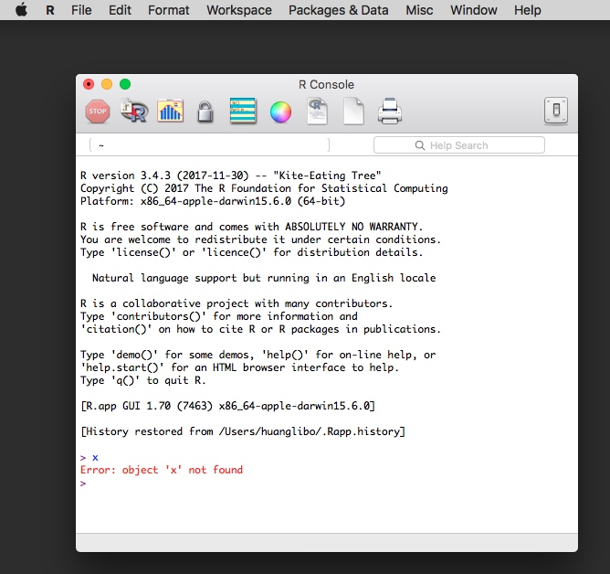
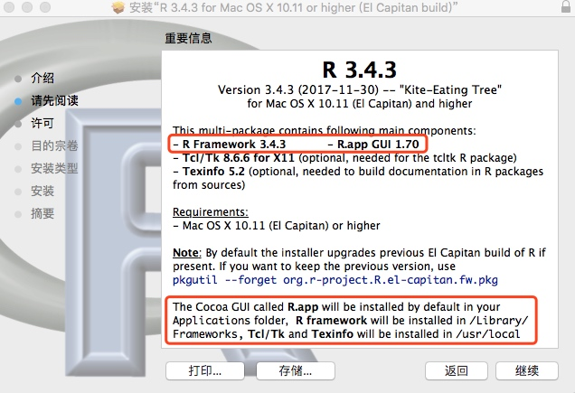
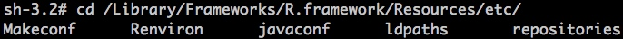
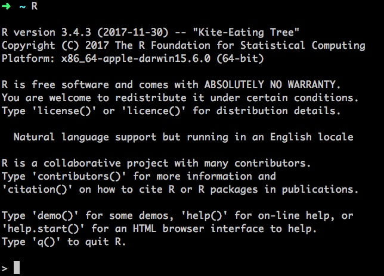
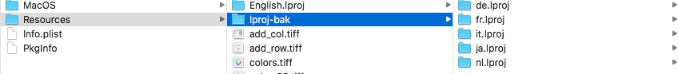
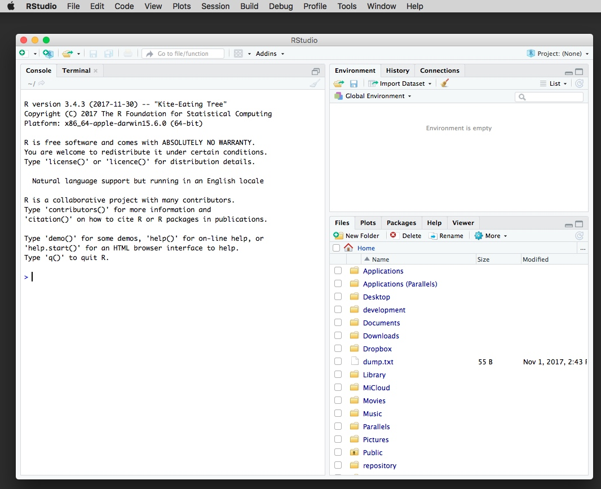

# 在 macOS 上修改 R.app (R GUI) 的默认 Language

最近需要用 R 语言，所以在 `macOS 10.13.2` 上安装了 `R.app` 。 安装好之后发现 *R GUI* 居然是日语的，这让我蒙圈了，我用的又不是日文系统，为什么会显示日文，难道这个二进制包是一个日本人打出来的?



~~紧接着我发现，R  GUI 的默认 Language 有点不好改。~~

**Edit(20180509) 最终结论：**  

最近我发现公司电脑上有一些其他的应用也开始显示日语了，这还真是奇怪了，终端中的*语言设置*和*地区设置*都没问题呀，怎么还会显示日语呢！然后我突然想到去看看**系统偏好设置-语言与地区**，发现除了有简体中文，还有一个日语。。。删掉日语然后重启相关应用后，语言又恢复正常了。

这应该就是之前 R 软件显示日语的最直接的原因，之前一直看命令行的设置，没有去看图形界面的设置，如此简单的问题真是让我折腾了好久。。。

**Edit(20180225)：**  

我换了一台电脑（系统是 `macOS 10.13.3` ）后发现情况有变化：在另一台电脑上，新安装的 *R GUI* ，显示的是中文，然后在终端输入：  

```console
defaults write org.R-project.R force.LANG en_US.UTF-8
```

重启 R GUI，就已经是英文了。

所以后面的内容可以不用看了，不过后面对内部的细节探索的内容还是有参考价值。

至于为什么之前的那台电脑使用上面的这行配置无效，我也不得而知，可能是太久没重启电脑? 也可能是系统版本的问题?（之前的系统版本是 `10.13.2`，之后用的那台电脑的系统高一个小版本，是 `10.13.3`）总之这个问题还有待验证。

R GUI 切换回中文（建议还是使用英文，中文翻译不一定靠谱）：

```console
defaults write org.R-project.R force.LANG zh_CN.UTF-8
```

---

**分割线**：如果仅需修改 Language，参考上面 👆 的内容即可。 如果上面的方法不起作用，或者是想了解其他细节，可以往下看。

## 修改默认 Language 的痛点

在 Windows 操作系统上还是很好修改默认 Language 的，直接在安装目录的 etc 目录下的 RConsole 文件中添加 `language = en` 即可。 参考[这里](https://www.zhihu.com/question/21127155/answer/58369102
)。

然而，在 macOS 上修改其默认 Language 就没有这么简单了，主要是我没有找到和 RConsole 对标的配置文件。

## 安装的过程

> 从安装过程可以找到我们关心的相关信息。

安装时，从[清华大学的镜像站](https://mirrors.tuna.tsinghua.edu.cn/CRAN/) 直接下二进制的 `.pkg` 安装包：



从安装说明里面可以看出:

1. 这个安装包包含 `R Framework` 和 `R.app GUI` ;
2. *R Framework* 的安装路径是 `/Library/Framework`，经过一番探索可发现其配置文件在 `/Library/Frameworks/R.framework/Resources/etc/` 目录下（需要 root 权限），但没发现可配置 Language 的地方。 另外，这里是终端中的 R 的配置文件，应该也不能改 R.app 的默认 Language。



### R Framework

R Framework 是可在命令行中使用的 R 环境，直接在终端输入 `R` 即可：



在终端里面默认的 Language 是英文的，如果不是，则在 R 环境中输入(参考[这里](https://cran.r-project.org/bin/macosx/RMacOSX-FAQ.html#Internationalization-of-the-R_002eapp))：  

```console
system("defaults write org.R-project.R force.LANG en_US.UTF-8")
```

或在*系统终端*中输入：  

```console
defaults write org.R-project.R force.LANG en_US.UTF-8
```

最后重启一下 shell 就可以了。

#### R.app GUI

R.app 是 R 的一个可视化环境。 目前最关键的问题是 R.app 是日文的，并且不知道有没有对应的配置文件可以修改默认 Language，反正我找了好久都没有找到。  

## 修改 R.app GUI 的默认 Language

> 虽然没有找到相关配置文件，但是我摸索到一个替代方案。

右键 `R.app`，点击`显示包内容`，进入 `Resources` 目录，把除了 `English.lproj` 以外的其他以 `.lproj` 结尾的目录移动到新建的 `lproj-bak` 目录中，最后重启 `R.app`。



最后我们会发现默认 Language 恢复成英语了，菜单栏和提示信息都是英文：


## 后记

1. `Resources` 目录下的 `ReadMe.txt` 包含 `Localization` 相关的信息，但目前痛点已解决，等以后有新需求的时候再看它吧。
2. 如果直接从源码安装，应该也能自行指定 Language，不过我没试，有兴趣的同学可以试试。

## 资源

在折腾的过程中，也有人推荐了开源的 [RStudio](https://www.rstudio.com/products/rstudio/download/#download)，看起来智能一点，喜欢折腾的同学也可以试试：  


